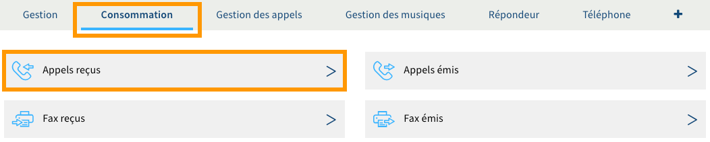
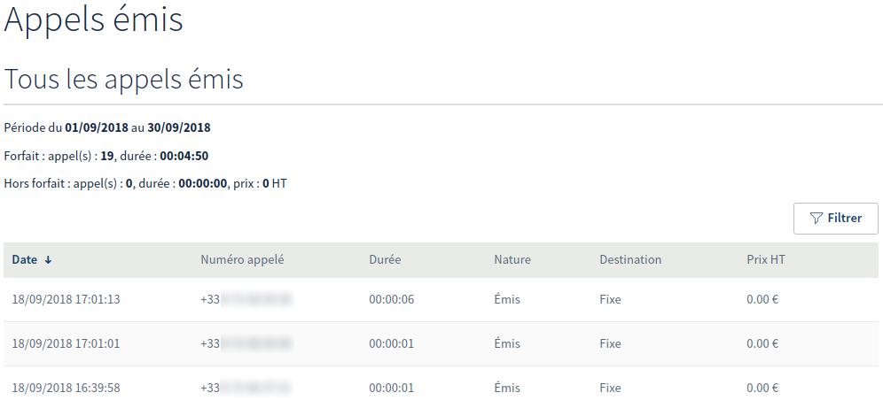

## Objectif

Votre ligne SIP OVHcloud vous permet de recevoir et d’émettre des appels. Pour éviter toute utilisation non souhaitée, sécurisez-la via les manipulations suivantes.

**Apprenez à sécuriser votre ligne SIP OVHcloud.**

## Prérequis

- Disposer d'une [ligne SIP OVHcloud](/links/telecom/telephonie-voip).

<!-- CP-NAV-START:telecom-voip-fax -->
---

### Accès à l'espace client OVHcloud

- **Lien direct :** [VoIP & Fax](/links/control-panel/telecom-voip-fax)
- **Pour accéder à vos services :** `Télécom`{.action} > `VoIP & Fax`{.action} > Sélectionnez votre groupe de téléphonie

---
<!-- CP-NAV-END:telecom-voip-fax -->

{.thumbnail}

## En pratique

### Étape 1 : Comprendre pourquoi sécuriser sa ligne SIP

Le principe même d'une ligne SIP est de pouvoir être utilisée facilement sur n'importe quel accès Internet. Son utilisation est alors rendue possible grâce à un identifiant et un mot de passe renseignés dans la configuration d'un équipement. Ces éléments sont indispensables afin de pouvoir utiliser votre ligne SIP OVHcloud. 

Assurez-vous que votre ligne est suffisamment sécurisée pour éviter toute utilisation non souhaitée qui pourrait entraîner des consommations hors forfait. 

### Étape 2 : Sécuriser sa ligne SIP

Vous pouvez sécuriser votre ligne SIP de plusieurs manières, selon vos besoins. Pour cela, sachez qu'il existe **des sécurités OVHcloud déjà actives sur votre ligne** et que vous avez la possibilité de **gérer des fonctionnalités depuis votre espace client**. Celles-ci vous **permettent de sécuriser un peu plus votre ligne**. 

#### Les sécurités OVHcloud actives sur votre ligne

- **La configuration automatique du mot de passe SIP pour les lignes avec équipement OVHcloud**

Si vous disposez d'un équipement OVHcloud avec votre ligne SIP, le mot de passe de la ligne est automatiquement configuré sur celui-ci et remplace le mot de passe par défaut défini par le constructeur de l'équipement. 

Ce mot de passe configuré par OVHcloud est différent pour chaque téléphone et peut être modifié lorsque l'équipement est réinitialisé.

Si cela est nécessaire, reportez-vous aux instructions décrites dans notre documentation « [Dépanner son téléphone Plug & Phone](/pages/web_cloud/phone_and_fax/voip/troubleshoot-02-fix-control-panel) » si vous souhaitez le réinitialiser.

- **La limitation du montant hors forfait** 

Cette limite s'active dès qu'un groupe de facturation (qui regroupe plusieurs lignes) atteint ou dépasse 150 euros HT de hors forfait. Si tel est le cas, les services sont alors suspendus pour éviter que le montant augmente. 

Si vous atteignez la limite fixée lors d'un appel en cours, celle-ci s'activera uniquement lorsque la communication arrivera à son terme. Ceci peut donc entraîner une tarification plus élevée que la limite fixée par OVHcloud, du fait que la législation nous empêche d'interrompre volontairement tout appel, même si celui-ci est non souhaité.

- **La détection des appels sortants vers des destinations suspectes**

Lorsque nous détectons une activité suspecte concernant les appels sortants de votre ligne, nous pouvons mettre en liste noire tout appel sortant vers une destination que nous avons automatiquement identifiée comme suspecte.

Notre système détecte automatiquement une activité suspecte, comme des appels émis de manière répétitive et d'une durée variable vers des numéros étrangers et/ou surtaxés. Si ces communications, même suspectes, génèrent du hors forfait, les mêmes règles décrites ci-dessus dans le paragraphe intitulé « La limitation du montant hors forfait » s'appliquent.

#### Les fonctionnalités pour sécuriser votre ligne

- **La gestion du mot de passe SIP pour les lignes sans équipement OVHcloud**

Si vous disposez d'une ligne SIP que vous utilisez avec votre propre équipement, le mot de passe de la ligne peut être modifié à votre convenance. 

Pour cela, modifiez-le depuis votre espace client OVHcloud. Reportez-vous aux instructions décrites dans notre documentation « [Modifier le mot de passe d’une ligne SIP](/pages/web_cloud/phone_and_fax/voip/modifier-mot-de-passe-ligne-sip) » si nécessaire.

- **La restriction par IP de l'accès à votre ligne**

Vous pouvez sécuriser l'accès à votre ligne SIP par restriction IP et vérifier les tentatives d'authentification à celle-ci qui ont échoué. 

Pour cela, activez la restriction et consultez les logs d'authentification depuis votre espace client. Reportez-vous aux instructions décrites dans notre documentation « [Restreindre sa ligne SIP OVHcloud par IP](/pages/web_cloud/phone_and_fax/voip/secure-sip-line-ovh) » si nécessaire.

- **Le filtrage des appels reçus et/ou émis**

Vous pouvez définir des listes blanches ou noires, afin d'autoriser uniquement certains correspondants à vous joindre ou, au contraire, de rejeter automatiquement les appels en provenance de certains numéros.

Pour cela, gérez le filtrage d'appels depuis votre espace client OVHcloud. Reportez-vous aux instructions décrites dans notre documentation « [Filtrer et renvoyer ses appels](/pages/web_cloud/phone_and_fax/voip/comment_configurer_les_renvois_d_appels) » si nécessaire.

### Étape 3 : suivre vos consommations

<!-- CP-STEPS-START:suivre-consommations -->
Maintenant que vous avez appris à sécuriser votre ligne SIP OVHcloud ou que vous venez de le faire, il est intéressant de savoir où suivre en temps réel la consommation inhérente à votre ligne.

Dans l'onglet `Consommation`{.action}, cliquez sur `Appels émis`{.action}.

{.thumbnail}

La page qui s'affiche alors vous permet de visionner l'historique des consommations du mois en cours, ainsi que le nombre d'appels hors forfait et le montant généré par ces derniers. Nous vous conseillons de consulter cette page régulièrement.

{.thumbnail}
<!-- CP-STEPS-END:suivre-consommations -->

## Aller plus loin

Échangez avec notre [communauté d'utilisateurs](/links/community).
