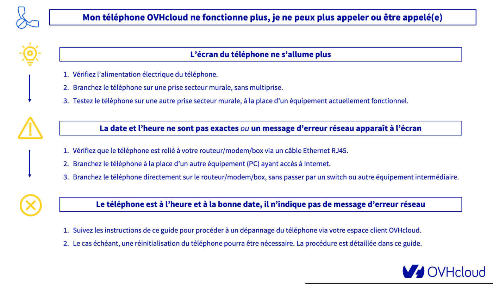

## Objectif

À la différence des modèles de téléphones historiques fonctionnant sur la technologie cuivre analogique, les téléphones VoIP fournis par OVHcloud utilisent le réseau Internet.

Pour fonctionner correctement, comme votre ordinateur, un téléphone OVHcloud a donc besoin d'être alimenté électriquement, d'être raccordé à votre réseau local et de communiquer sur Internet.

Les causes d'un dysfonctionnement d'un téléphone VoIP sont donc variées :

- un défaut d'alimentation électrique;
- une problématique réseau;
- un défaut temporaire de configuration du téléphone.

**Découvrez comment diagnostiquer et dépanner votre téléphone OVHcloud.**

## Prérequis

- Être connecté à l'[espace client OVHcloud](/links/manager){.external}, partie `Télécom`{.action}.
- Disposer d'une [ligne téléphonique OVHcloud](/links/telecom/telephonie-voip){.external}.
- Disposer d'un [téléphone fourni par OVHcloud](/links/telecom/telephonie-comparatif-telephones){.external} et l'avoir installé.

## En pratique

Voici la table des matières de ce guide, vous pouvez cliquer sur une des entrées pour y arriver directement :

[Etape 1 - Etablir un premier diagnostic](#step1) 
[Etape 2 - Réinitialiser le téléphone](#step2) 
[Etape 3 - Dépanner le téléphone depuis l'espace client OVHcloud](#step3) 
[Etape 4 - Effectuer des tests complémentaires (facultatif)](#step4) 
&emsp;&emsp;[4.1 - Réinitialiser votre routeur / modem / Box Internet](#step4-1) 
&emsp;&emsp;[4.2 - Effectuer un test croisé](#step4-2) 
[Etape 5 - Contacter l'assistance OVHcloud](#step5) 

Ce guide vous détaille les causes principales d'un défaut d'enregistrement de la ligne SIP associée à votre téléphone, suivant un ordre logique. 
Nous vous conseillons donc de **suivre l'ordre des étapes de diagnostic** afin de dépanner votre téléphone. 
Si votre téléphone retrouve son fonctionnement normal après avoir suivi l'une des premières étapes de ce guide, il n'est pas indispensable de suivre les étapes ultérieures.

Cliquez sur l'image ci-dessous pour afficher un résumé des actions à mener en fonction du défaut rencontré.

{.thumbnail}

### Étape 1 - Etablir un premier diagnostic 

**Question n°1 : Le défaut concerne-t-il un seul téléphone ?**

- **OUI** : Il s'agit donc vraisemblablement d'un incident isolé à votre poste, poursuivez la lecture de ce guide.
- **NON** : Si plusieurs téléphones sont affectés, cela indique probablement un défaut sur un équipement annexe et commun à ces téléphones (switch, routeur / modem / Box Internet). Vérifiez donc la connectivité réseau des téléphones en vous aidant de notre [tutoriel dédié au diagnostic du réseau local](/pages/web_cloud/phone_and_fax/voip/troubleshoot-01-local-network).

**Question n°2 : L'écran de votre téléphone s'allume-t-il ?**

- **OUI** : Poursuivez la lecture de ce guide.
- **NON** : Le défaut peut provenir du raccordement électrique de votre téléphone. Consultez tout d'abord notre [tutoriel dédié au diagnostic du réseau local](/pages/web_cloud/phone_and_fax/voip/troubleshoot-01-local-network).

**Question n°3 : Avez-vous déjà redémarré électriquement le téléphone ?**

- **OUI** : Poursuivez la lecture de ce guide.
- **NON** : Débranchez et rebranchez l'alimentation électrique du téléphone. Cela peut avoir pour effet de rétablir son fonctionnement. Si le téléphone est toujours en défaut, poursuivez la lecture de ce guide.

### Étape 2 - Réinitialiser le téléphone 

> [!warning]
> **En cas de carnet de contacts ajouté manuellement sur le téléphone :**
>
> Si vous avez ajouté un carnet de contacts directement sur votre téléphone (sans passer par un ajout de contacts via l'espace client OVHcloud), la réinitialisation du téléphone entraînera la suppression du carnet de contacts. Par conséquent, assurez-vous de disposer d'une sauvegarde de ce carnet **avant** de réinitialiser le téléphone.
>

Une réinitialisation permet au téléphone de récupérer une configuration saine depuis les serveurs OVHcloud et de redevenir pleinement fonctionnel.

La réinitialisation d'un téléphone s'effectue généralement via son menu lorsqu'il en dispose d'un. Certains modèles de téléphones nécessitent parfois d'effectuer une combinaison de touches ou d'appuyer sur un bouton dédié.

Les manipulations pour réinitialiser nos téléphones sont décrites ci-dessous. 
**Cliquez sur l'onglet correspondant au modèle de votre téléphone.**

> [!tabs]
> **Cisco** standard
>>
>> 1\. Appuyez sur le bouton `Engrenage` pour accéder au menu principal. 2\. Allez dans le sous-menu `Admin. Appareil`. 3\. Sélectionnez l'option `Réinit. Usine`. 4\.Validez la réinitialisation.
>>
> **Cisco** sans écran (modèle ATA191)
>>
>> 1\. Appuyez pendant 10 secondes, avec un objet pointu, dans le trou `Reset` situé à l'arrière du boîtier Cisco. 2\. Le voyant **Power** va clignoter durant la procédure de réinitialisation. 3\. Les voyants **Power** puis **Internet** vont ensuite rester allumés, puis le voyant **Line 1** (ou **Line 2**) s'allumera.
>>
> **Gigaset** DECT (sans-fil)
>>
>> Les manipulations sont à effectuer sur **la base émettrice/réceptrice** et non sur le socle de rechargement du combiné. Cliquez sur [ce lien](https://raw.githubusercontent.com/ovh/docs/develop/pages/web_cloud/phone_and_fax/voip/troubleshoot-02-fix-control-panel/images/gigaset-dect.png) pour voir des modèles de bases émettrices/réceptrices Gigaset.  1\. Débranchez l'alimentation électrique de la base émettrice/réceptrice. 2\. Rebranchez l'alimentation électrique en **maintenant enfoncé le bouton unique de la base** (en façade de celle-ci). 3\. Relâchez le bouton au bout de 30 secondes après avoir rebranché l'alimentation.
>>
> **Gigaset** standard
>>
>> 1\. Dans le menu principal, sélectionnez le sous-menu `Réglages`. 2\. Sélectionnez `Réinitialisation`. 3\. Appuyez sur `OK` et confirmez la réinitialisation.
>>
> **Yealink** standard
>>
>> 1\. Appuyez pendant 10 secondes sur le bouton `OK` du téléphone. 2\. Confirmez la réinitialisation.
>>
> **Yealink** T58 W Pro
>>
>> 1\. Maintenez enfoncée la touche `Redial` 🔄 .  {.thumbnail}. 2\. Validez la demande de réinitialisation affichée à l'écran du téléphone.
>>
> **Yealink** DECT (sans fil)
>>
>> 1\. Débranchez l'alimentation électrique de **la base émettrice/réceptrice** du téléphone. 2\. Rebranchez l'alimentation électrique en **maintenant enfoncé le bouton au centre de la base**. 3\. Relâchez le bouton quand les 3 voyants sont allumés et fixes. 4\. Débranchez l'alimentation électrique de la **la base** du téléphone et rebranchez-la juste après. 5\. Patientez environ 5 minutes le temps que la base se mette à jour. 6\. Pour associer le **combiné** à la **base**, appuyez sur le bouton `REGISTER` en bas à gauche de l'écran du **combiné**. Dans la foulée, maintenez enfoncé le bouton au centre de la **base** pendant 3 à 4 secondes.

**Une fois le téléphone réinitialisé, la date et l'heure affichées sur son écran sont-elles exactes ?**

- **OUI** : Cela indique que le téléphone contacte bien les serveurs OVHcloud pour récupérer sa configuration. Poursuivez la lecture de ce guide afin d'effectuer un dépannage du téléphone. Cela lui permettra de récupérer les informations nécessaires à l'enregistrement de sa ligne SIP.
- **NON** : Le téléphone ne parvient pas à contacter efficacement les serveurs OVHcloud. Cela peut venir d'un défaut de configuration du réseau local. Consultez tout d'abord la partie « **Vérifier la connectivité réseau du téléphone** » de notre [tutoriel dédié au diagnostic du réseau local](/pages/web_cloud/phone_and_fax/voip/troubleshoot-01-local-network#connectivity).

### Étape 3 - Dépanner le téléphone depuis l'espace client OVHcloud 

> **Prérequis nécessaire: connaître l'adresse IP publique de votre réseau**
>
> Pour procéder au dépannage, il est indispensable de connaître l'adresse IP publique du réseau sur lequel est raccordé votre téléphone.
>
> Rendez-vous sur <http://monip.ovh> et prenez note de l'adresse IP publique qui vous est indiquée.
>

Connectez-vous à votre [espace client OVHcloud](/links/manager){.external} puis cliquez sur l'onglet `Telecom`{.action}.

Cliquez sur `Téléphonie`{.action} et choisissez la ligne concernée. 

Rendez-vous dans l'onglet `Assistance`{.action} et cliquez sur le bouton `Dépannage Plug & Phone`{.action}.

{.thumbnail}

Une fois dans l'assistant, celui-ci va vous guider en vous posant plusieurs questions et en vous proposant des manipulations. 
Suivez avec précision les informations qui s'affichent à chaque étape de l'assistant. Ces informations peuvent vous permettre de résoudre la panne que vous rencontrez.

Assurez-vous également que votre téléphone est correctement branché électriquement et bien connecté à votre réseau local.

> [!primary]
> L'image ci-dessous est donnée à titre d'exemple. Le modèle présenté et le nombre de questions peuvent varier selon le téléphone à dépanner. 

{.thumbnail}

En fonction des informations sélectionnées, vous pourrez être amené à reconfigurer automatiquement votre téléphone. Si tel est le cas, veillez à bien suivre les trois manipulations qui s'affichent :

|Manipulations|Description|
|---|---|
|Vérifier l'adresse MAC du téléphone|L'adresse affichée dans votre espace client OVHcloud doit être la même que l'adresse MAC, unique, sur votre téléphone. Vous pouvez la retrouver sur l'étiquette du constructeur, généralement à l'arrière ou sous le téléphone.|
|Entrer l'adresse IP publique du téléphone|Il s'agit de la dernière adresse IP publique connue de votre téléphone. Assurez-vous de renseigner la bonne adresse afin que la reconfiguration puisse arriver à son terme.|
|Redémarrer électriquement le téléphone|Après avoir redémarré, le téléphone récupérera un nouveau fichier de configuration, permettant ainsi de le reconfigurer.|

> [!warning]
>
> Si la reconfiguration de votre téléphone n'arrive pas à son terme, assurez-vous d'avoir bien respecté les manipulations précédentes.
>
 
### Étape 4 - Effectuer des tests complémentaires (facultatif) 

Si le dépannage de votre téléphone n'a pas permis de résoudre votre problématique, poursuivez en réalisant deux tests complémentaires. 

#### 4.1 Réinitialiser votre routeur / modem / Box Internet 

> [!alert]
>
> La réinitialisation de votre routeur / modem / Box Internet peut entraîner la perte de potentielles configurations personnalisées sur celui-ci.
>
> **Ne réalisez cette étape que si vous êtes sûr de vous.**
>

Il se peut que votre routeur / modem / Box Internet ne permette plus à votre téléphone de fonctionner correctement. Afin d'écarter cette éventualité, vous pouvez effectuer une réinitialisation de celui-ci. Pour cela, deux possibilités :

- **vous disposez d'une box OVHcloud** : reportez-vous aux instructions décrites dans notre documentation « [Réinitialiser votre box OVHcloud](/pages/web_cloud/internet/internet_access/restart_reboot_modem#reinitialiser-votre-box-ovhcloud) » ;

- **vous disposez d'un routeur / modem / Box Internet d'un autre opérateur** : reportez-vous à la documentation fournie par votre opérateur. 

#### 4.2 Effectuer un test croisé 

Réaliser un test croisé permet de vérifier si l'incident provient par exemple d'un défaut de votre téléphone ou de votre routeur / modem / Box Internet. Pour cela, branchez votre téléphone sur un autre accès à Internet fonctionnel. 

Dès lors, deux possibilités :

- **votre téléphone fonctionne sur cet autre accès** : cela signifie que la problématique que vous rencontrez actuellement provient de votre routeur / modem / Box Internet (que ce soit sa configuration ou une panne matérielle);

- **votre téléphone ne fonctionne pas sur cet autre accès** : cela indique que la problématique que vous rencontrez actuellement provient de votre téléphone (que ce soit sa configuration ou une panne matérielle). Dans ce cas de figure, nous vous invitons à contacter notre service support via la création d'un ticket d'assistance depuis votre espace client OVHcloud. Afin de faciliter le diagnostic du téléphone par nos équipes, veillez à bien détailler dans ce ticket les tests que vous avez déjà effectués.

### Étape 5 - Contacter l'assistance OVHcloud 

Si votre téléphone OVHcloud reste inopérant malgré les manipulations décrites ci-dessus effectuées, nous vous invitons à contacter notre service support via la création d'un ticket d'assistance depuis votre espace client OVHcloud. 
Afin de faciliter le diagnostic du téléphone par nos équipes, veillez à bien détailler dans ce ticket l'ensemble des tests que vous avez déjà effectués.
 
## Aller plus loin 

En cas de difficultés, nous vous recommandons de faire appel à l'un de [nos partenaires](/links/partner).
 
Échangez avec notre communauté d'utilisateurs sur <https://community.ovh.com/>.
