

## Objectif

L'exploitation de **numéros de Services à Valeur Ajoutée (SVA)** OVHcloud nécessite d'être en conformité avec le cadre réglementaire applicable, notamment les obligations définies par l'ARCEP ainsi que celles prévues par la [Directive européenne 2015/849](https://eur-lex.europa.eu/legal-content/EN/TXT/HTML/?uri=CELEX:32015L0849&from=FR) du Parlement européen et du Conseil du 20 mai 2015, relative à la prévention de l'utilisation du système financier à des fins de blanchiment d'argent et de financement du terrorisme.

Lors de la commande ou de la portabilité d'un numéro SVA, vous devez renseigner des informations précises sur votre identité ou celle de votre entreprise et fournir des documents justificatifs à OVHcloud.

OVHcloud, en partenariat avec Lemonway®, vous accompagne dans la mise en œuvre du KYC (*Know Your Customer* ou « Connaître vos clients ») via la fourniture d'éléments justificatifs depuis votre espace client OVHcloud.

**Découvrez comment valider votre identité afin d'exploiter un numéro spécial SVA.**

## À propos de Lemonway

Lemonway est un **établissement de paiement européen réglementé**, spécialisé dans la gestion et la sécurisation des transactions financières.
OVHcloud s'appuie sur Lemonway pour assurer la conformité et la sécurité de vos opérations.

### Pourquoi ai-je reçu un e-mail de Lemonway ?

Dans le cadre de la réglementation européenne (notamment la lutte contre le blanchiment d’argent et le financement du terrorisme), Lemonway est **tenu de vérifier régulièrement l’identité des utilisateurs**.

Il s’agit d’une obligation légale qui s’applique à l’ensemble des prestataires de services financiers et qui permet de garantir la conformité et la sécurité de votre compte.

### Que faire si je reçois un e-mail de Lemonway ?

Si vous recevez un e-mail contenant un lien de la part de Lemonway, vous devez simplement **renseigner les informations demandées** et fournir les justificatifs nécessaires.

Ces informations sont indispensables pour maintenir votre compte en conformité et **éviter toute suspension**.

## Prérequis

<!-- CP-NAV-START:telecom-voip-fax -->
---

### Accès à l'espace client OVHcloud

- **Lien direct :** [VoIP & Fax](/links/control-panel/telecom-voip-fax)
- **Pour accéder à vos services :** `Télécom`{.action} > `VoIP & Fax`{.action} > Sélectionnez votre groupe de téléphonie

---
<!-- CP-NAV-END:telecom-voip-fax -->

## En pratique

> [!warning]
> Afin d'exploiter un numéro spécial SVA, il est obligatoire de fournir l'ensemble des justificatifs requis. Faute de validation de ces documents, vous ne pourrez pas exploiter votre numéro.
>

<!-- CP-STEPS-START:main-flow-intro -->
Que vous commandiez un nouveau numéro ou souhaitiez valider votre identité pour un numéro déjà en exploitation, cliquez sur `Commander un numéro`{.action} dans le cadre « Je veux... » du `Tableau de bord`{.action}.

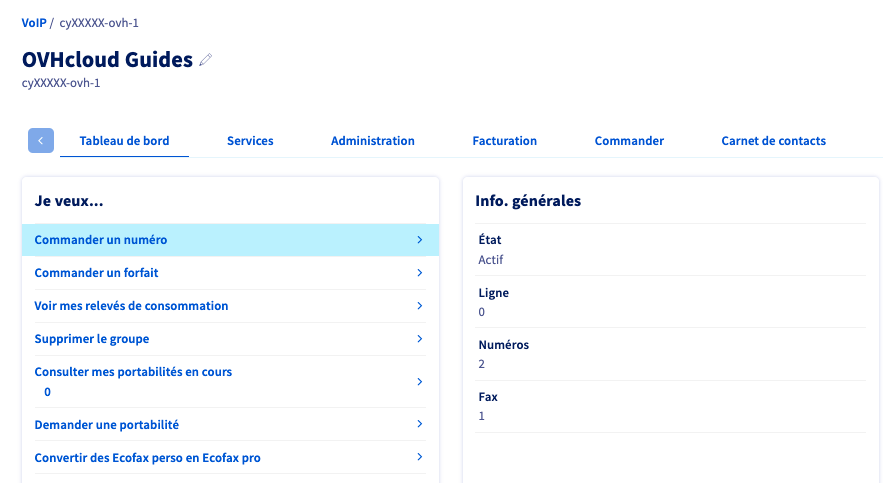{.thumbnail}

Vous accédez alors aux différents types de numéros. Cliquez sur `Vérifier l'identité` en face de « Numéros à valeur ajoutée ».

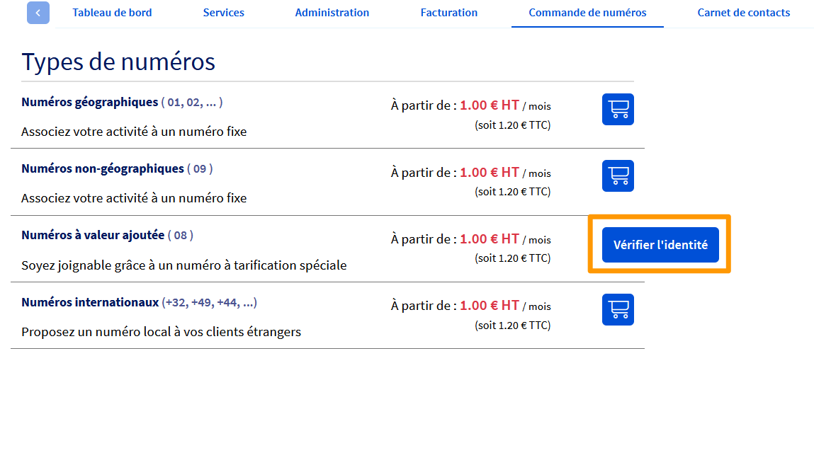{.thumbnail}
<!-- CP-STEPS-END:main-flow-intro -->

### Renseigner les coordonnées

<!-- CP-STEPS-START:renseigner-coordonnees -->
Choisissez si vous êtes un « Professionnel » ou un « Professionnel revendeur » puis renseignez précisément les coordonnées demandées.

> [!primary]
>
> **Éditeur, contact de l’éditeur et bénéficiaires : définitions.**
>
> - **Éditeur** : Personne physique ou morale exploitant le service accessible via ce numéro. 
> - **Contact de l’éditeur** : Personne physique désignée pour représenter l’éditeur du numéro spécial dans le cadre du KYC, de la conformité ou de la gestion opérationnelle. 
> - **Bénéficiaires** : Personnes physiques ou morales tirant un avantage financier, économique ou opérationnel de l’exploitation du numéro spécial, notamment : 
>     - Les personnes physiques détenant directement ou indirectement une participation significative dans l’entreprise (≥ 25 %). 
>     - Les personnes exerçant un contrôle effectif sur la société. 
>     - Les personnes pour lesquelles le service est mis en place (par exemple : service externalisé géré par un prestataire pour le compte d’une autre entreprise).

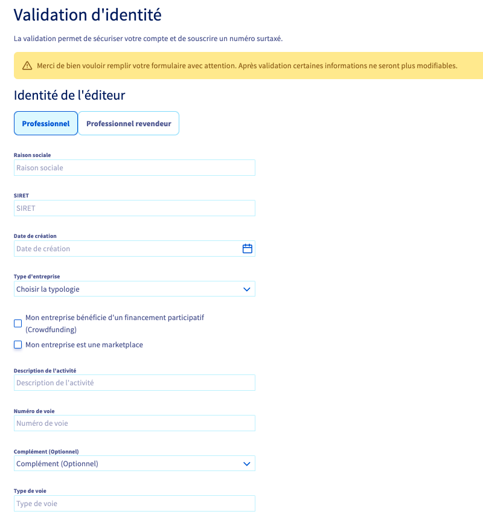{.thumbnail}

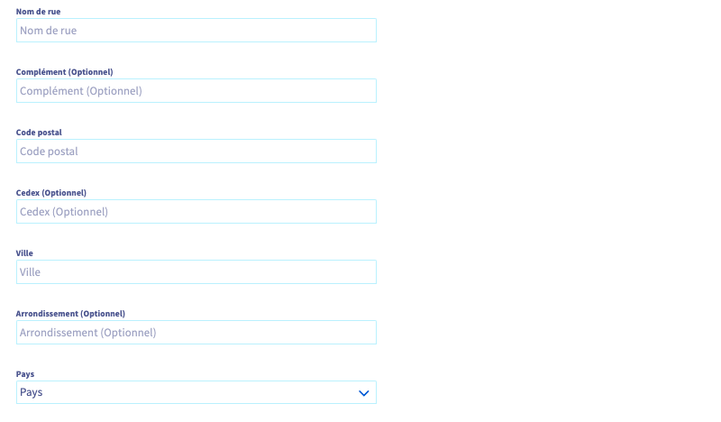{.thumbnail}

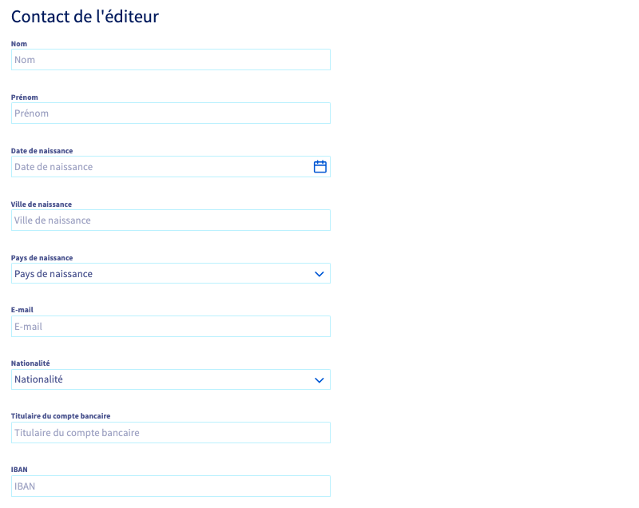{.thumbnail}
<!-- CP-STEPS-END:renseigner-coordonnees -->

### Ajouter des bénéficiaires

<!-- CP-STEPS-START:ajouter-beneficiaires -->
Si vous êtes le seul bénéficiaire, cochez la case « Mon représentant est bénéficiaire ».

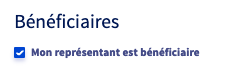{.thumbnail}

Dans le cas contraire, cliquez sur `+ Ajouter un bénéficiaire`{.action} et renseignez les coordonnées du bénéficiaire.

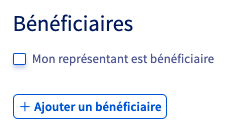{.thumbnail}

> [!primary]
>
> Vous pouvez ajouter jusqu'à 4 bénéficiaires.

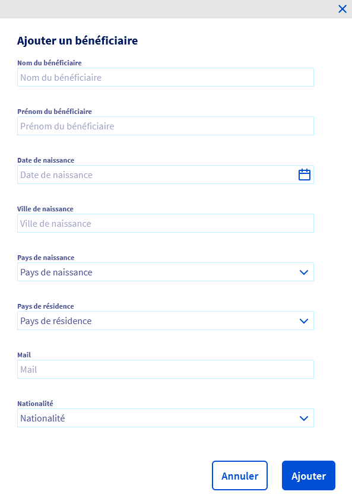{.thumbnail}

Cochez la case :

- « Je certifie être l'éditeur des contenus des numéros SVA » (si vous avez choisi le type de compte « Professionnel »);
- « Je certifie être revendeur de numéro SVA et certifie connaître et appliquer les obligations à mes propres clients » (si vous avez choisi le type de compte « Professionnel revendeur »).

Cliquez sur `Étape suivante`{.action}.

Dans la fenêtre qui s'affiche alors, prenez connaissance des informations puis saisissez `CONFIRMER` dans le champ prévu à cet effet et cliquez sur `Valider mes informations`{.action}.

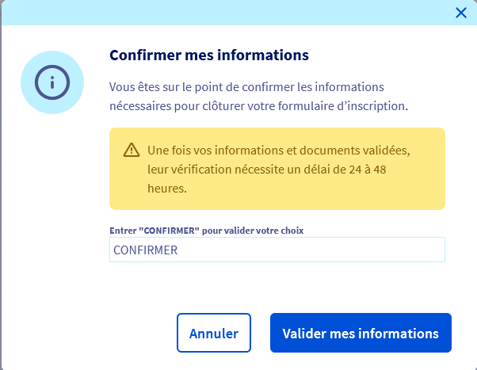{.thumbnail}
<!-- CP-STEPS-END:ajouter-beneficiaires -->

### Téléverser les documents justificatifs

Une fois vos informations saisies, vous serez redirigé vers l'interface **Lemonway** pour fournir des documents justificatifs.

Cette procédure d'inscription est appelée « **Onboarding** ».

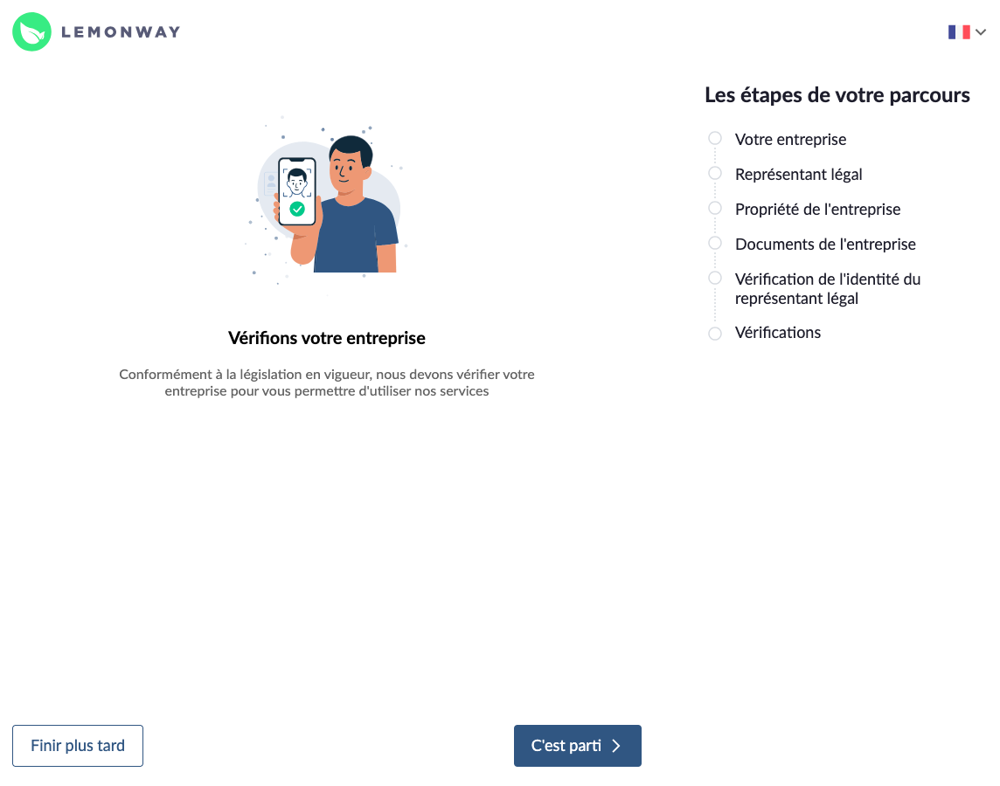{.thumbnail}

Cliquez sur `C'est parti`{.action} pour fournir vos documents.

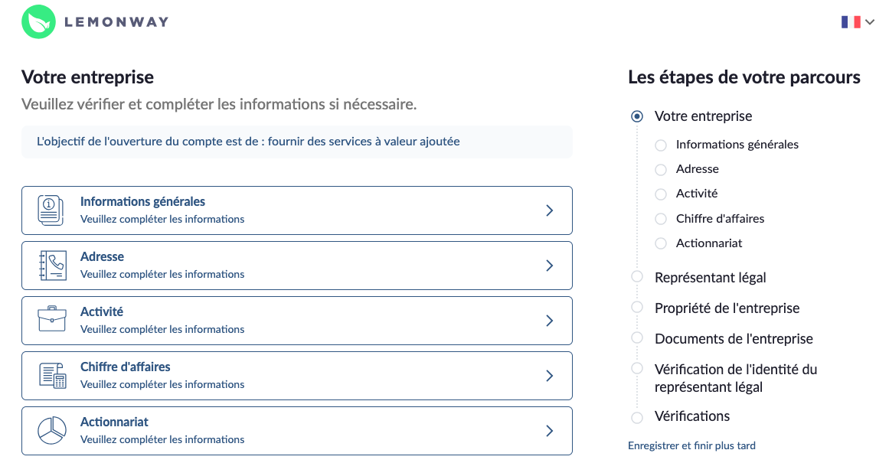{.thumbnail}

> [!primary]
>
> Si vous ne pouvez pas fournir tous vos documents en une fois, cliquez sur `Enregistrer et finir plus tard`{.action}.
>
> Pour accéder par la suite à la plateforme Lemonway : depuis le `Tableau de bord`{.action} du groupe de facturation VoIP, cliquez sur `Voir mon profil SVA`{.action}.

#### Liste des documents requis

> [!primary]
> 
> La liste suivante n'est pas exhaustive. Il s'agit des documents standard exigés à tous les clients dans le cadre de la vérification d'identité par Lemonway®.
> Des documents supplémentaires peuvent être requis pour effectuer des vérifications complémentaires.
>
> Si votre compte OVHcloud correspond à **un projet de financement participatif (*crowdfunding*)**, il sera également nécessaire, en plus des documents requis pour le type d'entité concerné, de fournir **un document décrivant le projet en détail**.

**Cliquez sur le type d'entité concerné pour accéder à la liste des documents requis.**

##### Entité juridique

/// details | Société non cotée

- Une **pièce d'identité** en cours de validité du représentant légal de la société titulaire du compte OVHcloud : carte d'identité (recto et verso), passeport, titre de séjour (recto et verso), permis de conduire biométrique (recto et verso).
- Une **pièce d'identité** en cours de validité de chacun des bénéficiaires effectifs de la société titulaire du compte OVHcloud : carte d'identité (recto et verso), passeport, titre de séjour (recto et verso), permis de conduire biométrique (recto et verso).
- Un **KBIS de moins de trois mois** de la société titulaire du compte OVHcloud.
- Les statuts de la société, datés et signés.
- Le registre des bénéficiaires effectifs type DBE-S1 (présentant les personnes physiques détenant directement ou indirectement plus de 25% du capital de la société). Vous pouvez l'obtenir gratuitement sur le site [INPI.fr](https://www.inpi.fr/beneficiaires-effectifs).
- Une **vérification d’identité par vidéo** du représentant légal. Si votre appareil ne possède pas de caméra, poursuivez depuis un autre appareil doté d'une caméra (ordinateur, smartphone ou tablette).
- La **signature électronique** du représentant légal.
- Un **Relevé d'Identité Bancaire**.

///

/// details | Société cotée dans un pays de l'UE ou un pays tiers équivalent

- Une **pièce d'identité** en cours de validité du représentant légal de la société titulaire du compte OVHcloud : carte d'identité (recto et verso), passeport, titre de séjour (recto et verso), permis de conduire biométrique (recto et verso).
- Un **KBIS de moins de trois mois** de la société titulaire du compte OVHcloud. Si non précisé sur le KBIS, le poste de la personne physique habilitée à représenter la société doit être publiquement vérifiable (par exemple sur LinkedIn) ou une délégation de pouvoir doit être fournie.
- Preuve de la présence de la société sur ledit Marché (cela peut être la page de la Bourse du pays montrant les détails de la société).
- Si les actions de la société ne sont pas au moins à 76% des actions publiques, tous les actionnaires détenant ou contrôlant plus de 25% des parts sociales seront soumis à la vérification des bénéficiaires effectifs.
- Une **vérification d’identité par vidéo** du représentant légal. Si votre appareil ne possède pas de caméra, poursuivez depuis un autre appareil doté d'une caméra (ordinateur, smartphone ou tablette).
- La **signature électronique** du représentant légal.
- Un **Relevé d'Identité Bancaire**.

///

/// details | Association/Organisme juridique

- Une **pièce d'identité** en cours de validité de la personne physique représentant l'association titulaire du compte OVHcloud : carte d'identité (recto et verso), passeport, titre de séjour (recto et verso), permis de conduire biométrique (recto et verso). La personne physique représentant l'association doit occuper le poste de président, trésorier ou secrétaire de l'association.
- Une **copie de moins d'un an du procès-verbal** de la dernière assemblée générale de l'association titulaire du compte OVHcloud.
- Les **statuts datés et signés** de l'association titulaire du compte OVHcloud
- La **parution au Journal officiel des associations et fondations d'entreprise** (JOAFE) répertoriant l'association titulaire du compte OVHcloud.
- Une **vérification d’identité par vidéo** du représentant. Si votre appareil ne possède pas de caméra, poursuivez depuis un autre appareil doté d'une caméra (ordinateur, smartphone ou tablette).
- La **signature électronique** du représentant.
- Un **Relevé d'Identité Bancaire**.

///

/// details | Administration/Autorité ou Agences publiques et autorités régionales

- Une **pièce d'identité** en cours de validité de la personne physique habilitée par l'administration titulaire du compte OVHcloud : carte d'identité (recto et verso), passeport, titre de séjour (recto et verso), permis de conduire biométrique (recto et verso).
- Un **mandat accordé par l'administration titulaire du compte OVHcloud** à la personne physique agissant en son nom.
- Une **vérification d’identité par vidéo** de la personne habilitée. Si votre appareil ne possède pas de caméra, poursuivez depuis un autre appareil doté d'une caméra (ordinateur, smartphone ou tablette).
- La **signature électronique** de la personne habilitée.
- Un **Relevé d'Identité Bancaire**.

///

/// details | Fondation

- Une **pièce d'identité** en cours de validité de la personne physique représentant la fondation titulaire du compte OVHcloud : carte d'identité (recto et verso), passeport, titre de séjour (recto et verso), permis de conduire biométrique (recto et verso).
- Un **document officiel certifiant** que la personne physique identifiée est bien autorisée à **représenter la fondation** et à gérer le compte OVHcloud.
- Les **statuts datés et signés** de la fondation titulaire du compte OVHcloud.
- La **parution au Journal officiel des associations et fondations d'entreprise** (JOAFE) répertoriant la fondation titulaire du compte OVHcloud.
- Une **vérification d’identité par vidéo** du représentant. Si votre appareil ne possède pas de caméra, poursuivez depuis un autre appareil doté d'une caméra (ordinateur, smartphone ou tablette).
- La **signature électronique** du représentant.
- Un **Relevé d'Identité Bancaire**.

///

/// details | Fonds de dotation

- Une **pièce d'identité** en cours de validité de la personne physique responsable de gérer le compte OVHcloud du fonds de dotation : carte d'identité (recto et verso), passeport, titre de séjour (recto et verso), permis de conduire biométrique (recto et verso).
- Un **document officiel** certifiant que la personne physique identifiée est bien autorisée à représenter le fonds de dotation et à gérer le compte OVHcloud.
- Les **statuts datés et signés** du fonds de dotation titulaire du compte OVHcloud.
- Une **copie de moins d'un an du procès-verbal de la dernière assemblée générale** ou la liste des membres du conseil d'administration du fonds de dotation titulaire du compte OVHcloud.
- Une **vérification d’identité par vidéo** du responsable. Si votre appareil ne possède pas de caméra, poursuivez depuis un autre appareil doté d'une caméra (ordinateur, smartphone ou tablette).
- La **signature électronique** du responsable.
- Un **Relevé d'Identité Bancaire**.

///

/// details | Artisan

- Une **pièce d'identité** en cours de validité de l'artisan qualifié titulaire du compte OVHcloud : carte d'identité (recto et verso), passeport, titre de résidence (recto et verso), permis de conduire biométrique (recto et verso).
- Un **certificat d'immatriculation au Registre des Métiers** de moins de 3 mois au nom de l'artisan titulaire du compte OVHcloud.
- Une **vérification d’identité par vidéo** de l'artisan. Si votre appareil ne possède pas de caméra, poursuivez depuis un autre appareil doté d'une caméra (ordinateur, smartphone ou tablette).
- La **signature électronique** de l'artisan.
- Un **Relevé d'Identité Bancaire**.

///

/// details | Exploitation agricole à responsabilité limitée

- Une **pièce d'identité** en cours de validité du président ou trésorier de l'EARL titulaire du compte OVHcloud : carte d'identité (recto et verso), passeport, titre de séjour (recto et verso), permis de conduire biométrique (recto et verso).
- Une **pièce d'identité** en cours de validité de chacun des **bénéficiaires effectifs** de l'EARL : carte d'identité (recto et verso), passeport, titre de séjour (recto et verso), permis de conduire biométrique (recto et verso).
- Un **certificat d'immatriculation au Registre du Commerce et des Sociétés** de moins de 3 mois au nom de l'EARL titulaire du compte OVHcloud.
- Les **statuts datés et signés** de l'EARL titulaire du compte OVHcloud.
- Une copie de la parution de l'acte dans le **Bulletin officiel des annonces civiles et commerciales** (BODACC).
- Une **vérification d’identité par vidéo** du président ou trésorier. Si votre appareil ne possède pas de caméra, poursuivez depuis un autre appareil doté d'une caméra (ordinateur, smartphone ou tablette).
- La **signature électronique** du président ou trésorier.
- Un **Relevé d'Identité Bancaire**.

///

/// details | Auto-entrepreneur

- Une **première pièce d'identité** en cours de validité du titulaire du compte : carte d'identité (recto et verso), passeport, titre de séjour (recto et verso), permis de conduire biométrique (recto et verso).
- Un **second justificatif d’identité en cours de validité ou document officiel complémentaire** du titulaire du compte : carte d'identité (recto et verso), passeport, titre de séjour (recto et verso), permis de conduire (recto et verso), dernier avis d'imposition daté de moins d'un an, livret de famille, récépissé d'enregistrement du pacte civil de solidarité ou carte vitale.
- Un **certificat d'inscription à l'INSEE datant de moins de 3 mois** au nom du titulaire du compte ou un document attestant de son inscription auprès de la Chambre de Commerce (pour un auto-entrepreneur exerçant une activité commerciale) ou auprès de la Chambre des métiers (pour un auto-entrepreneur exerçant une activité artisanale).
- Une **vérification d’identité par vidéo** du titulaire du compte. Si votre appareil ne possède pas de caméra, poursuivez depuis un autre appareil doté d'une caméra (ordinateur, smartphone ou tablette).
- La **signature électronique** du titulaire du compte.
- Un **Relevé d'Identité Bancaire**.

///

/// details | Comité social et économique (CSE)

- Une **pièce d'identité** en cours de validité de la personne physique responsable de gérer le compte OVHcloud au nom du CSE : carte d'identité (recto et verso), passeport, titre de séjour (recto et verso), permis de conduire biométrique (recto et verso).
- Une **copie de moins d'un an du procès-verbal de la dernière assemblée générale** ou la liste des membres du conseil d'administration du CSE titulaire du compte OVHcloud.
- Une **vérification d’identité par vidéo** du responsable. Si votre appareil ne possède pas de caméra, poursuivez depuis un autre appareil doté d'une caméra (ordinateur, smartphone ou tablette).
- La **signature électronique** du responsable.
- Un **Relevé d'Identité Bancaire**.

///

/// details | Groupement d'intérêt public, Centre hospitalier universitaire, Établissement public d'intérêt général, Société d'investissement immobilier, Établissements de santé privés d'intérêt collectif

- Une **pièce d'identité** en cours de validité de la personne physique responsable de gérer le compte OVHcloud au nom de l'agence publique : carte d'identité (recto et verso), passeport, titre de séjour (recto et verso), permis de conduire biométrique (recto et verso).
- Un **document officiel** certifiant que la personne physique identifiée est bien autorisée à **représenter l'agence publique** et à gérer le compte OVHcloud.
- Une **vérification d’identité par vidéo** du responsable. Si votre appareil ne possède pas de caméra, poursuivez depuis un autre appareil doté d'une caméra (ordinateur, smartphone ou tablette).
- La **signature électronique** du responsable.
- Un **Relevé d'Identité Bancaire**.

///

/// details | Compagnie d'assurance

- Une **pièce d'identité** en cours de validité de la personne physique responsable de gérer le compte OVHcloud au nom de la compagnie d'assurance : carte d'identité (recto et verso), passeport, titre de séjour (recto et verso), permis de conduire biométrique (recto et verso).
- Une **décision** (extrait de la délibération ou mandat) désignant la ou **les mandataire(s)** (non exécutifs) autorisés à gérer le compte OVHcloud au nom de la compagnie d'assurance.
- Un **extrait des délibérations** désignant les directeurs et précisant leurs capacités.
- Un **extrait de la publication dans le Journal officiel des associations et fondations d'entreprise** (JOAFE) ou, à défaut, l'extrait de l'enregistrement de compagnies d'assurance mutuelle attestant de l'immatriculation de la compagnie d'assurance titulaire du compte OVHcloud.
- Les **statuts finaux et/ou certifiés conformes**, datés et signés, de la compagnie d'assurance titulaire du compte OVHcloud.
- Une **vérification d’identité par vidéo** du responsable. Si votre appareil ne possède pas de caméra, poursuivez depuis un autre appareil doté d'une caméra (ordinateur, smartphone ou tablette).
- La **signature électronique** du responsable.
- Un **Relevé d'Identité Bancaire**.

///

/// details | Paroisse ou église

- Une **pièce d'identité** en cours de validité de la personne physique responsable de gérer le compte OVHcloud au nom de la paroisse ou de l'église : carte d'identité (recto et verso), passeport, titre de séjour (recto et verso), permis de conduire biométrique (recto et verso).
- Une copie de moins d'un an du **procès-verbal de la dernière assemblée générale** de l'association diocésaine autorisant l'ouverture du compte et désignant les personnes autorisées à le gérer.
- Un **extrait de la publication dans le Journal officiel des associations et fondations d'entreprise** (JOAFE) au nom de l'association diocésaine ou du diocèse.
- Les **statuts datés et signés** au nom de l'association diocésaine ou du diocèse.
- Une **vérification d’identité par vidéo** du responsable. Si votre appareil ne possède pas de caméra, poursuivez depuis un autre appareil doté d'une caméra (ordinateur, smartphone ou tablette).
- La **signature électronique** du responsable.
- Un **Relevé d'Identité Bancaire**.

///

##### Fonds d'investissement

/// details | Fonds avec personnalité morale

- Une **pièce d'identité** en cours de validité du mandataire du fonds titulaire du compte OVHcloud : carte d'identité (recto et verso), passeport, titre de séjour (recto et verso), permis de conduire biométrique (recto et verso).
- Un **KBIS** (extrait attestant de la création de l'entreprise) de moins de trois mois du fonds titulaire du compte OVHcloud.
- Les **statuts datés et signés** par le mandataire du fonds titulaire du compte OVHcloud.
- Une **vérification d’identité par vidéo** du mandataire. Si votre appareil ne possède pas de caméra, poursuivez depuis un autre appareil doté d'une caméra (ordinateur, smartphone ou tablette).
- La **signature électronique** du mandataire.
- Un **Relevé d'Identité Bancaire**.

///

/// details | Fonds commun de placement (FCP)

- Une **pièce d'identité** en cours de validité du mandataire de la société de gestion titulaire du compte OVHcloud : carte d'identité (recto et verso), passeport, titre de séjour (recto et verso), permis de conduire biométrique (recto et verso).
- Un **KBIS** (extrait attestant de la création de l'entreprise) de moins de trois mois de la société de gestion titulaire du compte OVHcloud.
- Le **document de règlement de gestion** du fonds titulaire du compte OVHcloud.
- Une **vérification d’identité par vidéo** du mandataire. Si votre appareil ne possède pas de caméra, poursuivez depuis un autre appareil doté d'une caméra (ordinateur, smartphone ou tablette).
- La **signature électronique** du mandataire.
- Un **Relevé d'Identité Bancaire**.

///

**La vérification d’identité par vidéo** consiste à confirmer l’identité du représentant légal ou de la personne habilitée à gérer le compte en comparant son visage à sa pièce d’identité via un processus sécurisé de reconnaissance biométrique.

<!-- CP-STEPS-START:rib-upload -->
> [!primary]
> 
> Le **Relevé d’Identité Bancaire** doit être déposé sur votre espace client OVHcloud afin de permettre les futurs reversements. Les autres documents doivent être fournis sur l’interface Lemonway. 
> Pour téléverser votre RIB, rendez-vous dans la rubrique `Télécom`{.action} > `VoIP & Fax`{.action}. 
> Cliquez sur `Gérer mes reversements`{.action} puis sur `Modifier mes coordonnées bancaires`{.action}.
>
> 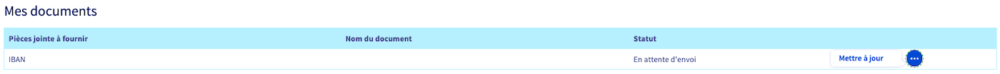{.thumbnail}
<!-- CP-STEPS-END:rib-upload -->

### Vérifier le statut de mes documents 

<!-- CP-STEPS-START:status-check -->
Dans le `Tableau de bord`{.action} de votre groupe de téléphonie, vérifiez le statut de votre **Profil SVA** :

- **Valide** : vos documents sont validés. Vous pouvez accéder à vos informations et les modifier si nécessaire en cliquant sur `Voir mon profil SVA`{.action}.

    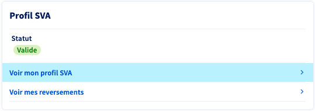{.thumbnail}

- **En attente de validation** : vos documents ne sont pas encore intégralement fournis ou validés. Cliquez sur `Voir mon profil SVA`{.action} pour accéder à la plateforme Lemonway et vérifier le statut de vos documents.

    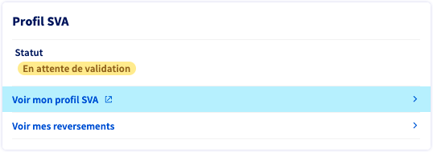{.thumbnail}

- **Incomplet** : un ou plusieurs documents fournis ne sont pas conformes. Cliquez sur `Finaliser mon formulaire de validation d'identité`{.action} ou sur `Voir mon profil SVA`{.action} pour accéder à la plateforme Lemonway et vérifier le statut de vos documents.

    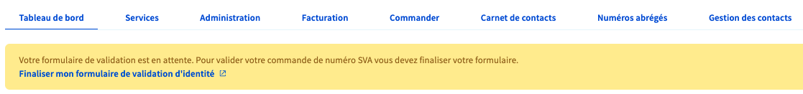{.thumbnail}

    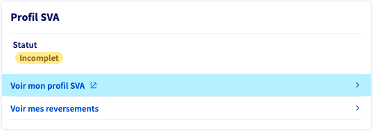{.thumbnail}

Sur les exemples ci-dessous, le document 1 est validé et le document 2 est refusé :

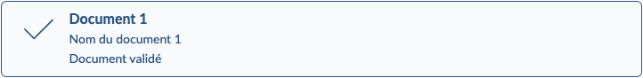{.thumbnail}

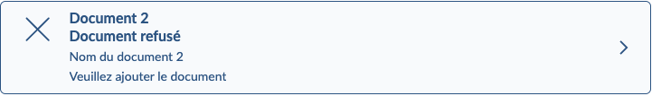{.thumbnail}

En cas de document refusé, vous devrez téléverser un nouveau justificatif qui sera vérifié dès que possible, sous 48 heures ouvrées.
<!-- CP-STEPS-END:status-check -->

## Aller plus loin

[Les recommandations déontologiques applicables aux services à valeur ajoutée téléphoniques](https://www.ovh.com/fr/support/documents_legaux/conditions%20particulieres%20deontologie%20numeros%20SVA%20Fr.pdf)

[Lemonway : notice d’information relative à la protection des données à caractère personnel](https://www.lemonway.com/protection-des-donnees)

Échangez avec notre [communauté d'utilisateurs](/links/community).
