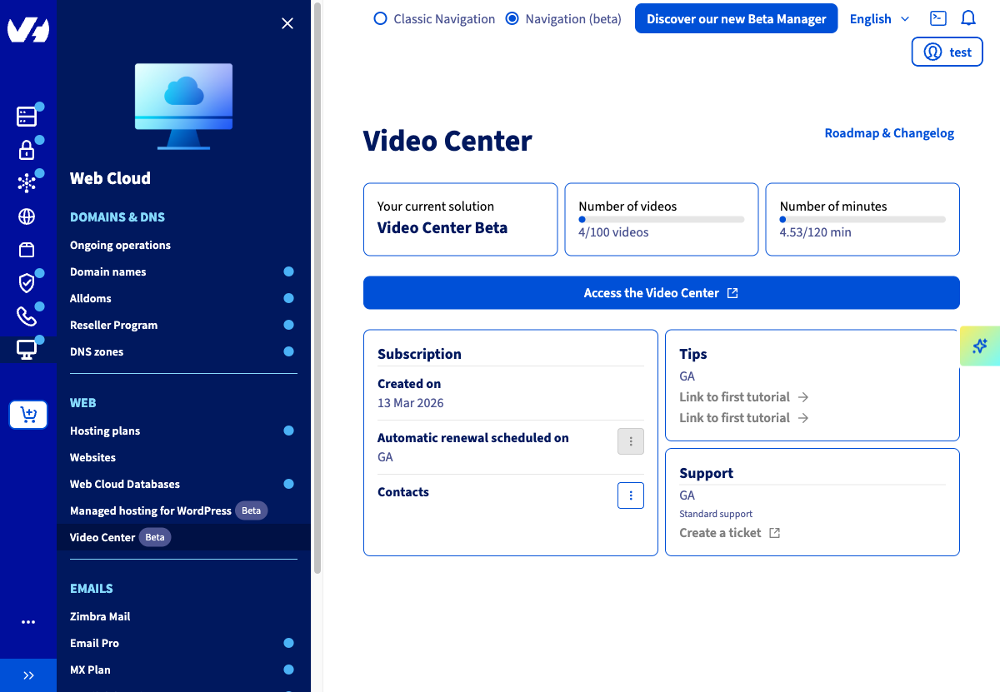
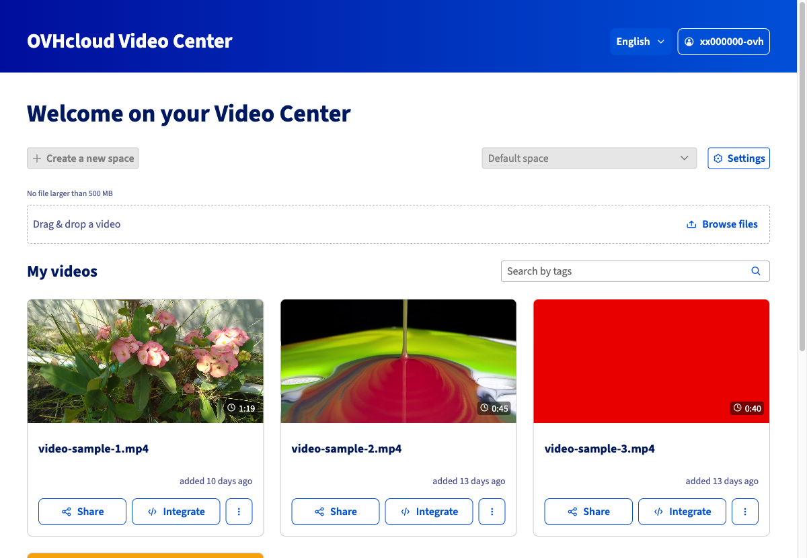
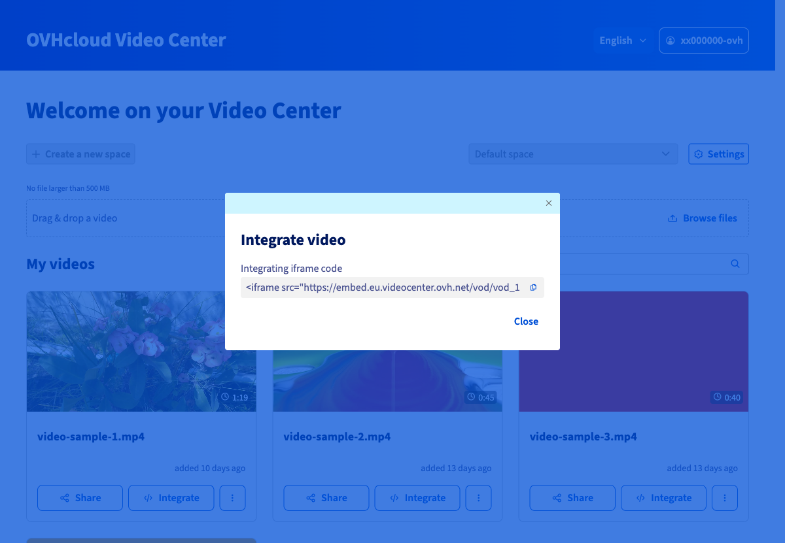
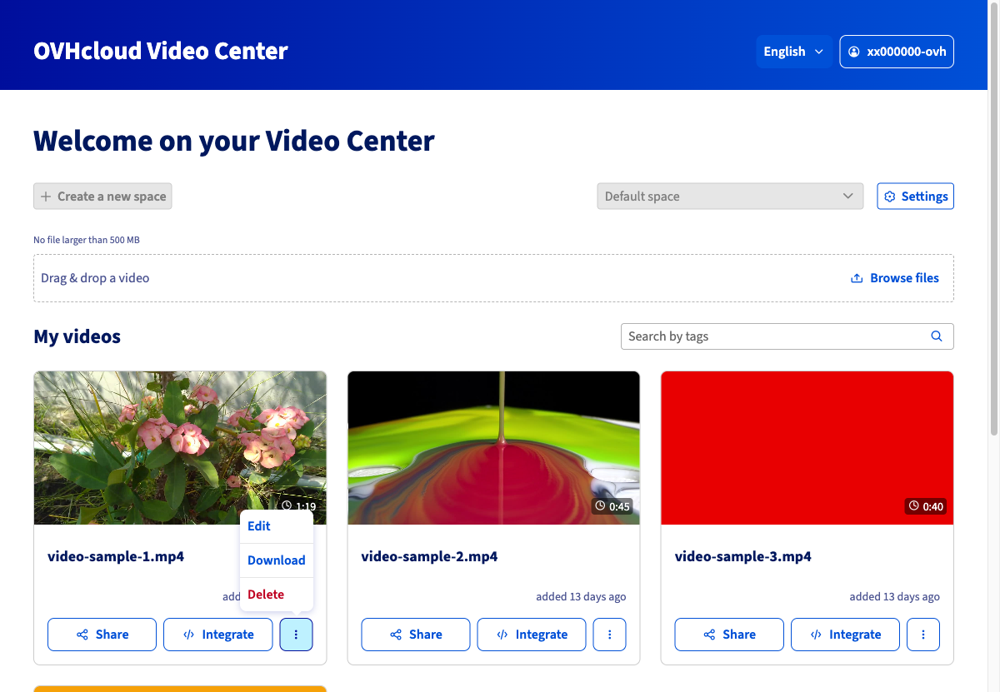

## Objective

> [!warning]
>
> The Video Center is currently in **beta**. Its features and interface are subject to change. This guide will be updated accordingly.
>

The [OVHcloud Video Center](/links/web/video-center) is a video hosting and streaming solution hosted in Europe, with no advertising or third-party tracking. It allows you to import your videos, embed them on any web page via an iframe code, and manage them from a dedicated interface.

**This guide explains how to access the Video Center from your OVHcloud Control Panel and manage your videos: importing, embedding via iframe, sharing, downloading and deleting.**

## Requirements

- An active [OVHcloud Video Center](/links/web/video-center).

<!-- CP-NAV-START:web-video-center -->
---

### OVHcloud Control Panel Access

- **Direct link:** [Video Center](/links/control-panel/web-video-center)
- **Navigation path:** `Web Cloud`{.action} > `Video Center`{.action}

---
<!-- CP-NAV-END:web-video-center -->

## Instructions

### Accessing the Video Center from the Control Panel

Go to your [OVHcloud Control Panel, Video Center section](/links/control-panel/web-video-center).

The page displays your Video Center subscription:

- **Your current solution**: name of your subscribed plan.
- **Number of videos**: number of videos already hosted against your total quota.
- **Number of minutes**: cumulative duration of your videos relative to the plan quota.

{.thumbnail}

To access the video management interface, click `Access the Video Center`{.action}. The interface opens in a new tab.

### Importing a video

From the Video Center interface, the import area is located at the top of the page, below the navigation bar.

{.thumbnail}

2 methods are available:

- **Drag and drop**: drag a video file from your file explorer directly into the dotted area.
- **Browse files**: click `Browse files`{.action}, navigate to the file to import from your local machine, then select it.

> [!primary]
>
> The maximum size per video is **500 MB**. Common video formats (MP4, MOV, AVI, etc.) are accepted.
>

Once the file is selected, the import starts automatically. The video appears in the **My videos** section once processing is complete.

### Embedding a video in a web page

The Video Center allows you to embed videos on web pages via an iframe code.

In the **My videos** section, locate the video to embed and click `Integrate`{.action}.

{.thumbnail}

The **Embed video** window displays the **iframe embed code**. Click the copy icon to copy it to your clipboard, then paste it into the HTML source code of your web page at the desired location.

Click `Close`{.action} to close the window.

### Sharing a video

The Video Center allows you to share a direct link to the video player.

In the **My videos** section, click `Share`{.action} next to the relevant video.

{.thumbnail}

The **Share video** window displays the **sharing URL**. Click the copy icon to copy it, then send it to your recipients.

Click `Close`{.action} to close the window.

### Downloading or deleting a video

To access additional actions on a video, click the `...`{.action} button to the right of the relevant video.

{.thumbnail}

The menu offers 3 options:

| Action | Description |
|---|---|
| `Edit`{.action} | Edits the video information (title, tags). |
| `Download`{.action} | Downloads the original video file to your local machine. |
| `Delete`{.action} | Permanently deletes the video from your Video Center. |

> [!warning]
>
> Deleting a video is irreversible. Any iframe code or sharing link associated with this video will immediately stop working.
>

## Go further

- [OVHcloud Video Center product page](/links/web/video-center)

Join our [community of users](/links/community).
