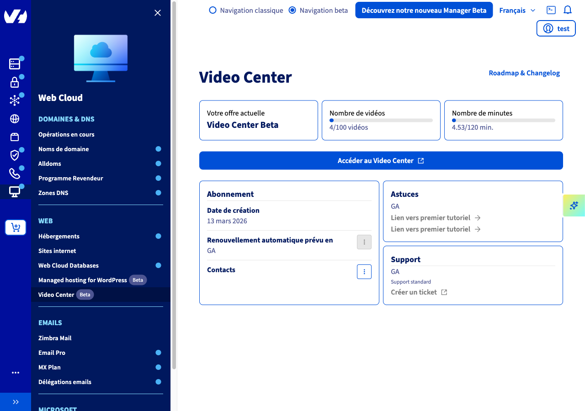
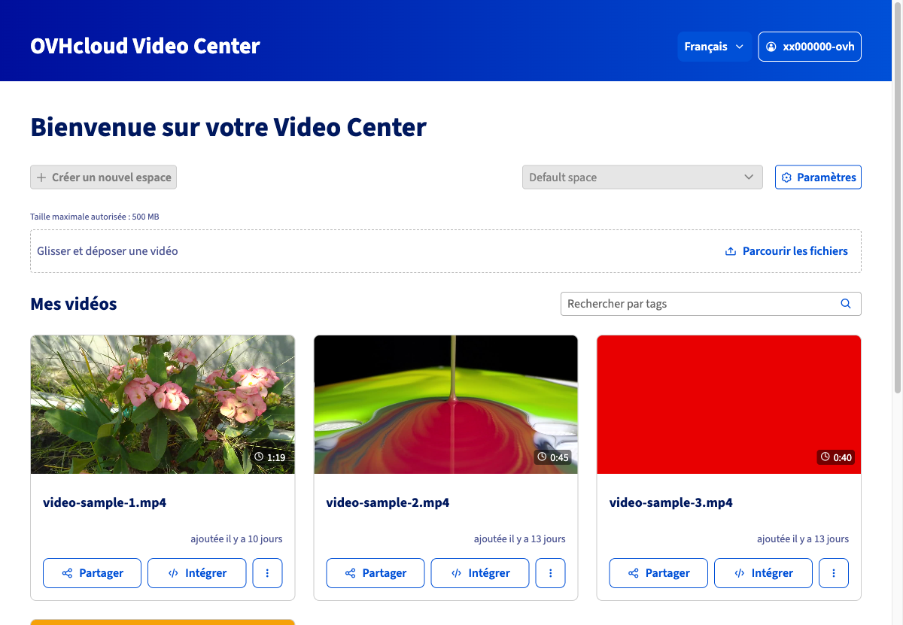
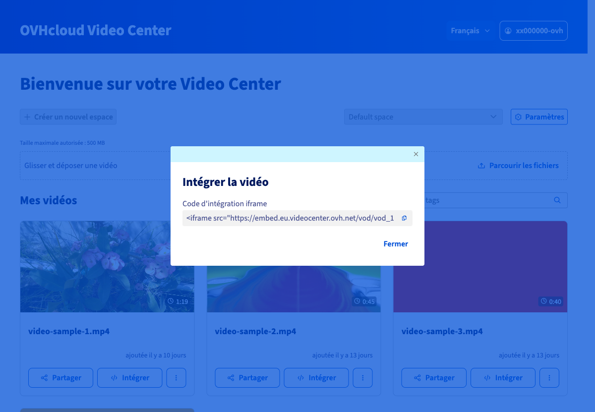
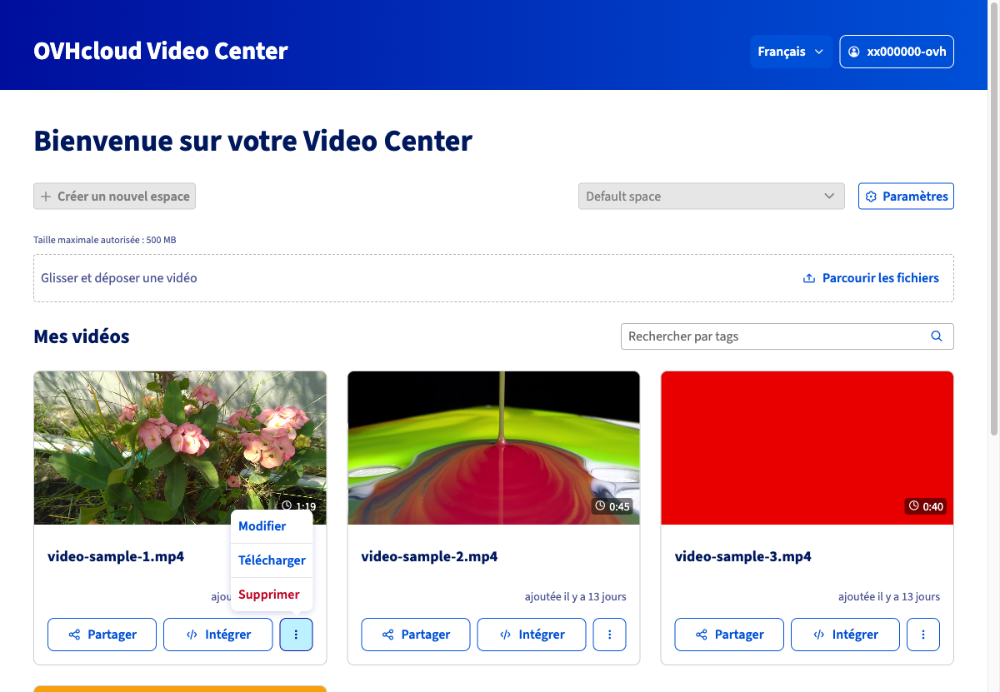

## Objectif

> [!warning]
>
> Le Video Center est actuellement en **bêta**. Ses fonctionnalités et son interface sont susceptibles d'évoluer. Ce guide sera mis à jour en conséquence.
>

L'[OVHcloud Video Center](/links/web/video-center) est une solution d'hébergement et de diffusion vidéo hébergée en Europe, sans publicité ni tracking tiers. Elle vous permet d'importer vos vidéos, de les intégrer à n'importe quelle page web via un code iframe, et de les gérer depuis une interface dédiée.

**Ce guide vous explique comment accéder au Video Center depuis votre espace client OVHcloud et gérer vos vidéos : import, intégration iframe, partage, téléchargement et suppression.**

## Prérequis

- Disposer d'un [Video Center OVHcloud](/links/web/video-center) actif.

<!-- CP-NAV-START:web-video-center -->
---

### Accès à l'espace client OVHcloud

- **Lien direct :** [Video Center](/links/control-panel/web-video-center)
- **Pour accéder à vos services :** `Web Cloud`{.action} > `Video Center`{.action}

---
<!-- CP-NAV-END:web-video-center -->

## En pratique

### Accéder au Video Center depuis l'espace client

Rendez-vous dans votre [espace client OVHcloud, section Video Center](/links/control-panel/web-video-center).

La page présente votre abonnement Video Center :

- **Votre offre actuelle** : nom de l'offre souscrite.
- **Nombre de vidéos** : nombre de vidéos déjà hébergées sur votre quota total.
- **Nombre de minutes** : durée cumulée de vos vidéos par rapport au quota de l'offre.

{.thumbnail}

Pour accéder à l'interface de gestion vidéo, cliquez sur `Accéder au Video Center`{.action}. L'interface s'ouvre dans un nouvel onglet.

### Importer une vidéo

Depuis l'interface Video Center, la zone d'import se situe en haut de la page, sous la barre de navigation.

{.thumbnail}

2 méthodes sont disponibles :

- **Glisser-déposer** : faites glisser un fichier vidéo depuis votre explorateur de fichiers directement dans la zone délimitée par les pointillés.
- **Parcourir les fichiers** : cliquez sur `Parcourir les fichiers`{.action}, naviguez jusqu'au fichier à importer depuis votre machine locale, puis sélectionnez-le.

> [!primary]
>
> La taille maximale par vidéo est de **500 Mo**. Les formats vidéo courants (MP4, MOV, AVI, etc.) sont acceptés.
>

Une fois le fichier sélectionné, l'import démarre automatiquement. La vidéo apparaît dans la section **Mes vidéos** une fois le traitement terminé.

### Intégrer une vidéo dans une page web

Le Video Center permet d'intégrer des vidéos dans des pages web via un code iframe.

Dans la section **Mes vidéos**, repérez la vidéo à intégrer et cliquez sur `Intégrer`{.action}.

{.thumbnail}

La fenêtre **Intégrer la vidéo** affiche le **code d'intégration iframe**. Cliquez sur l'icône de copie pour le copier dans le presse-papiers, puis collez-le dans le code source HTML de votre page web à l'endroit souhaité.

Cliquez sur `Fermer`{.action} pour refermer la fenêtre.

### Partager une vidéo

Le Video Center vous permet de partager un lien direct vers le lecteur vidéo.

Dans la section **Mes vidéos**, cliquez sur `Partager`{.action} en regard de la vidéo concernée.

{.thumbnail}

La fenêtre **Partager la vidéo** affiche l'**URL de partage**. Cliquez sur l'icône de copie pour la copier, puis transmettez-la à vos destinataires.

Cliquez sur `Fermer`{.action} pour refermer la fenêtre.

### Télécharger ou supprimer une vidéo

Pour accéder aux actions supplémentaires sur une vidéo, cliquez sur le bouton `...`{.action} situé à droite de la vidéo concernée.

{.thumbnail}

Le menu propose 3 options :

| Action | Description |
|---|---|
| `Modifier`{.action} | Modifie les informations (titre, tags) de la vidéo. |
| `Télécharger`{.action} | Télécharge le fichier vidéo original sur votre machine locale. |
| `Supprimer`{.action} | Supprime définitivement la vidéo de votre Video Center. |

> [!warning]
>
> La suppression d'une vidéo est irréversible. Tout code iframe ou lien de partage associé à cette vidéo cessera immédiatement de fonctionner.
>

## Aller plus loin

- [Page produit OVHcloud Video Center](/links/web/video-center)

Échangez avec notre [communauté d'utilisateurs](/links/community).
