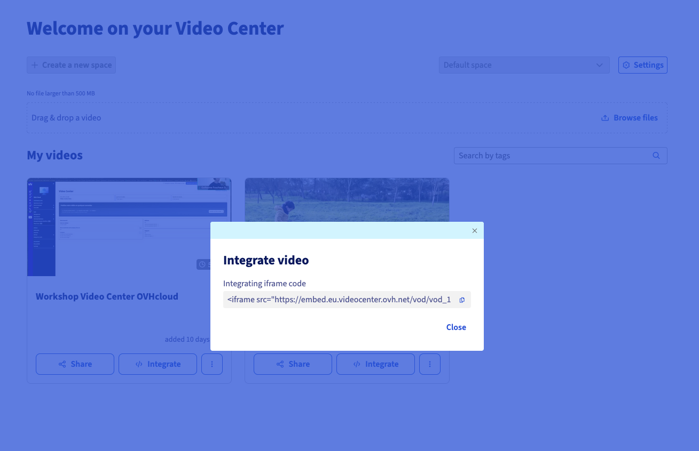

<style>
details>summary {
    color:rgb(33, 153, 232) !important;
    cursor: pointer;
}
details>summary::before {
    content:'\25B6';
    padding-right:1ch;
}
details[open]>summary::before {
    content:'\25BC';
}
</style>

## Objectif

**OVHcloud Video Center** est une plateforme d'hébergement vidéo qui génère un code d'intégration (iframe) permettant de diffuser vos vidéos sur n'importe quel site web.

**Grâce à ce guide, votre vidéo hébergée sur Video Center sera visible sur votre site web, responsive sur mobile et ordinateur.**

3 méthodes sont couvertes selon votre environnement :

- **Code embed (iframe)** : à utiliser si vous avez accès au code HTML de votre site web.
- **Éditeur CMS (Content Management System)** : adapté à Wix, Squarespace, Webflow, Joomla et autres CMS courants.
- **WordPress sans plugin** : en passant par le bloc HTML natif de l'éditeur Gutenberg.

**Durée estimée : moins de 5 minutes.**

## Prérequis

- Disposer d'un [Video Center OVHcloud](/links/web/video-center) actif.
- Avoir accès à l'édition de votre site web (back-office, éditeur de thème ou fichiers HTML).

<!-- CP-NAV-START:web-video-center -->
---

### Accès à l'espace client OVHcloud

- **Lien direct :** [Video Center](/links/control-panel/web-video-center)
- **Pour accéder à vos services :** `Web Cloud`{.action} > `Video Center`{.action}

---
<!-- CP-NAV-END:web-video-center -->

## En pratique

### Récupérer le code embed de votre vidéo

Quelle que soit la méthode choisie, commencez par copier le code embed depuis Video Center.

Le code embed est généré automatiquement par Video Center pour chaque vidéo, depuis sa page de détail. Cliquez sur les onglets ci-dessous pour afficher successivement chacune des **3** étapes.

> [!tabs]
> **Étape 1**
>>
>> Accédez à la page [Video Center](/links/control-panel/web-video-center) de votre espace client OVHcloud.
>>
>> <!-- DRAFT: To screenshot — capturer la page "Video Center" listant les vidéos hébergées sur le compte -->
>>
> **Étape 2**
>>
>> Cliquez sur la vidéo que vous souhaitez intégrer pour ouvrir sa page de détail.
>>
>> <!-- DRAFT: To screenshot — capturer la page de détail d'une vidéo dans Video Center -->
>>
> **Étape 3**
>>
>> Cliquez sur `Partager`{.action} ou `Code d'intégration`{.action}, puis copiez le code affiché.
>>
>> {.thumbnail}
>>

Le code ressemble à ceci :

```html
<iframe
  src="https://streaming.media.ovhcloud.com/vod/embed/XXXX-XXXX-XXXX"
  width="640"
  height="360"
  frameborder="0"
  allowfullscreen>
</iframe>
```

> [!primary]
> Gardez ce code à portée de main : il vous servira pour les 3 méthodes décrites ci-dessous.

### Intégrer la vidéo sur votre site web

**Choisissez la méthode qui correspond à votre environnement.**

/// details | Méthode 1 — Code embed (iframe) dans du HTML pur

Utilisez cette méthode si vous avez un accès direct au code HTML de votre page.

- **Ouvrir le fichier HTML de votre page** : dans votre éditeur de code (VS Code, Dreamweaver, etc.), ouvrez la page où vous souhaitez afficher la vidéo.
- **Positionner le curseur** : placez-le à l'emplacement souhaité pour la vidéo.
- **Coller le code embed** : collez le code copié depuis Video Center.
- **Sauvegarder et publier** : enregistrez votre fichier et mettez à jour votre serveur (**FTP** : **F**ile **T**ransfer **P**rotocol, déploiement, etc.).

Exemple de résultat dans votre fichier HTML :

```html
<section class="ma-section-video">
  <h2>Ma présentation</h2>

  <iframe
    src="https://streaming.media.ovhcloud.com/vod/embed/XXXX-XXXX-XXXX"
    width="640"
    height="360"
    frameborder="0"
    allowfullscreen>
  </iframe>
</section>
```

///

/// details | Méthode 2 — Éditeur CMS (Wix, Squarespace, Webflow, Joomla…)

La plupart des CMS proposent un **bloc HTML personnalisé** pour insérer du code tiers dans la page.

<!-- DRAFT: To screenshot — capturer à titre d'exemple l'ajout d'un bloc HTML dans un éditeur CMS générique (Wix ou Squarespace) avec le champ de saisie du code et le rendu de la vidéo dans l'éditeur -->

- **Ouvrir l'éditeur de page** : accédez à l'édition de la page où vous souhaitez afficher la vidéo.
- **Ajouter un bloc HTML** : selon votre CMS, utilisez le bloc indiqué ci-dessous.
- **Coller le code embed** : dans le champ du bloc HTML, collez le code iframe copié depuis Video Center.
- **Valider et publier** : confirmez l'insertion et publiez la page.

Bloc à utiliser selon le CMS :

- **Wix** : **App Wix** > **Code HTML**.
- **Squarespace** : **Bloc** > **Code**.
- **Webflow** : **Composant** > **Embed**.
- **Joomla** : **Éditeur** > désactivez le filtre HTML > collez le code.
- **PrestaShop** : **Module** > **HTML personnalisé**.

> [!primary]
> Si votre CMS filtre les iframes pour des raisons de sécurité, cherchez dans ses paramètres l'option **« Autoriser le code HTML brut »** ou **« Désactiver le filtre de contenu »**.

///

/// details | Méthode 3 — WordPress sans plugin (bloc HTML)

WordPress intègre nativement un bloc **HTML personnalisé** dans l'éditeur Gutenberg. Aucun plugin n'est nécessaire.

<!-- DRAFT: To screenshot — capturer l'éditeur WordPress Gutenberg avec le bloc "HTML personnalisé" ajouté, le code iframe collé dans le champ, et le rendu de la vidéo en prévisualisation -->

- **Ouvrir la page ou l'article** : dans votre tableau de bord WordPress, ouvrez la page ou l'article en édition.
- **Ajouter un bloc HTML personnalisé** : cliquez sur `+`{.action} pour ajouter un bloc, puis recherchez et sélectionnez **HTML personnalisé**.
- **Coller le code embed** : dans le bloc HTML, collez le code iframe copié depuis Video Center.
- **Prévisualiser** : cliquez sur `Prévisualiser`{.action} pour vérifier le rendu avant publication.
- **Publier** : cliquez sur `Mettre à jour`{.action} ou `Publier`{.action}.

> [!primary]
> Si vous utilisez l'ancien éditeur WordPress (TinyMCE / Classique), basculez en mode **Texte** (et non Visuel) avant de coller le code, puis repassez en mode Visuel pour vérifier le rendu.

///

### Personnaliser le lecteur vidéo intégré

/// details | Comment modifier la taille de la vidéo ?

Ajustez les attributs `width` et `height` dans le code iframe :

```html
<!-- Taille fixe standard (16:9) -->
<iframe src="..." width="640" height="360" ...></iframe>

<!-- Taille plus grande -->
<iframe src="..." width="1280" height="720" ...></iframe>

<!-- Largeur 100% du conteneur -->
<iframe src="..." width="100%" height="400" ...></iframe>
```

///

/// details | Comment rendre la vidéo responsive sur mobile ?

Enveloppez l'iframe dans un conteneur CSS pour un rendu fluide sur tous les écrans :

```html
<div style="position: relative; padding-bottom: 56.25%; height: 0; overflow: hidden;">
  <iframe
    src="https://streaming.media.ovhcloud.com/vod/embed/XXXX-XXXX-XXXX"
    style="position: absolute; top: 0; left: 0; width: 100%; height: 100%;"
    frameborder="0"
    allowfullscreen>
  </iframe>
</div>
```

> [!primary]
> Le ratio `padding-bottom: 56.25%` correspond au format **16:9** (le plus courant). Pour un format 4:3, utilisez `75%`.

///

/// details | Comment désactiver le plein écran ?

Retirez l'attribut `allowfullscreen` si vous souhaitez empêcher le plein écran :

```html
<iframe src="..." width="640" height="360" frameborder="0"></iframe>
```

///

### Vérifier l'intégration de votre vidéo

Avant de considérer l'intégration terminée, vérifiez les points suivants :

**Sur ordinateur :**

- La vidéo s'affiche correctement sur la page.
- Le lecteur se charge sans message d'erreur.
- La lecture démarre en cliquant sur Play.
- Le plein écran fonctionne (si activé).

**Sur mobile :**

- La vidéo s'adapte à la largeur de l'écran (responsive).
- La lecture fonctionne sur iOS (Safari) et Android (Chrome).
- La vidéo n'est pas coupée par les bords de l'écran.

> [!primary]
> Testez sur un appareil réel plutôt que via le mode simulation de votre navigateur — le comportement peut différer sur iOS.

## Problèmes fréquents

/// details | Pourquoi ma vidéo ne s'affiche-t-elle pas ?

Selon la cause :

- **L'URL embed est incorrecte** : retournez dans Video Center et recopiez le code embed.
- **La vidéo est encore en cours de traitement** : attendez la fin de l'encodage dans Video Center avant de l'intégrer.
- **Le CMS filtre les iframes** : activez l'autorisation des iframes dans ses paramètres.
- **Le site est en HTTPS mais l'URL embed est en HTTP** : vérifiez que l'URL dans l'iframe commence bien par `https://`.

///

/// details | Pourquoi le son ne fonctionne-t-il pas ?

Certains navigateurs bloquent la lecture automatique avec le son. La lecture manuelle (clic sur Play) fonctionne normalement.

///

/// details | Pourquoi la vidéo est-elle mal dimensionnée ou déborde-t-elle ?

Utilisez la technique responsive décrite dans la section **Personnaliser le lecteur vidéo intégré** ci-dessus avec le conteneur CSS relatif.

///

/// details | Comment résoudre un message « Contenu bloqué » dans WordPress ?

Accédez à `Réglages`{.action} > `Lecture`{.action} dans WordPress et vérifiez que les iframes externes ne sont pas bloquées. Certains plugins de sécurité (Wordfence, iThemes Security) peuvent filtrer les iframes.

> [!warning]
> Ne désactivez jamais entièrement les filtres de sécurité de votre CMS. Ajoutez uniquement le domaine `streaming.media.ovhcloud.com` à la liste des sources autorisées si cette option est disponible.

///

## Aller plus loin

[Gérer vos vidéos dans OVHcloud Video Center](/pages/web_cloud/video_center/video-center-manage-videos)

Pour des prestations spécialisées (référencement, développement, etc.), contactez les [partenaires OVHcloud](/links/partner).

Échangez avec notre [communauté d'utilisateurs](/links/community).