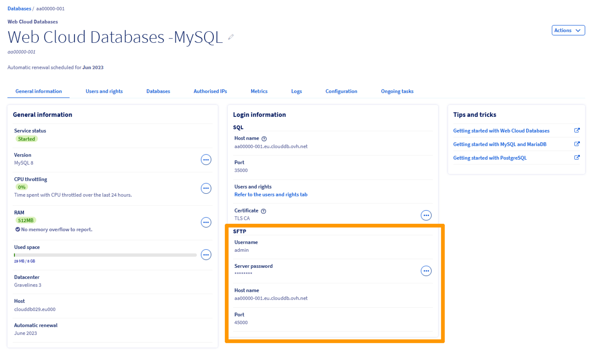

## Objective

With the [Web Cloud Databases](https://www.ovhcloud.com/en-ca/web-cloud/databases/) solution, you can host multiple databases. In some situations, you may need to view/retrieve the logs:

- your Web Cloud Databases server;
- for one of the databases hosted on your Web Cloud Databases server.

**Find out how to retrieve the logs for your databases hosted on your Web Cloud Databases server**

## Requirements

- a [Web Cloud Databases](https://www.ovhcloud.com/en-ca/web-cloud/databases/) solution (may or may not be included in a [performance web hosting](https://www.ovhcloud.com/en-ca/web-hosting/) solution).
- You must be logged in to your [OVHcloud Control Panel](https://ca.ovh.com/auth/?action=gotomanager&from=https://www.ovh.com/ca/en/&ovhSubsidiary=ca){.external}.

## Instructions

> [!warning]
>
> OVHcloud provides services that you are responsible for configuring, managing and managing. It is therefore up to you to ensure that it works properly.
> 
> We offer this tutorial to help you with common tasks. However, we recommend contacting a [specialist provider](https://partner.ovhcloud.com/en-ca/directory/) if you experience any difficulties. We will not be able to provide you with interpretation assistance for the logs available with your Web Cloud Databases solution. More information in the [Go further](#go-further) section of this tutorial.
>

### View logs for your Web Cloud Databases solution in real time

To check the logs for your Web Cloud Databases solution in real time, perform the following actions:

1. Log in to your [OVHcloud Control Panel](https://ca.ovh.com/auth/?action=gotomanager&from=https://www.ovh.com/ca/en/&ovhSubsidiary=ca).
2. On the line at the top of the Control Panel, click on the `Web Cloud`{.action} tab.
3. In the left-hand column, click on the `Web Cloud Databases`{.action} dropdown menu.
4. Select the Web Cloud Databases solution concerned.
5. On the page that appears, click on the `Logs`{.action} tab.

{.thumbnail}

This integrated console provides you with real-time logs for your Web Cloud Databases solution.

> [!primary]
>
> As detailed above, logs are only available here in real time. This means that these logs will only appear if they are generated when you are in the `Logs`{.action} tab. 
>
> If you leave the `Logs`{.action} tab and come back to it later, the history that was previously displayed will be gone.
>

### Retrieve the log history of your Web Cloud Databases solution

To retrieve the log history of your Web Cloud Databases solution, you will need to log in via SFTP.

> [!warning]
>
> Before you log in, check that the public IP address of the workstation you are using is authorized on your Web Cloud Databases server, with the `SFTP` option ticked.
>
> To check this, retrieve the public IP address of your internet access point, then go to the **Authorize an IP address** section of [this guide](/pages/web_cloud/web_cloud_databases/starting_with_clouddb).
>

To retrieve the SFTP connection information for your Web Cloud Databases solution, perform the following actions:

1. Log in to your [OVHcloud Control Panel](https://ca.ovh.com/auth/?action=gotomanager&from=https://www.ovh.com/ca/en/&ovhSubsidiary=ca).
2. On the line at the top of the Control Panel, click on the `Web Cloud`{.action} tab.
3. In the left-hand column, click on the `Web Cloud Databases`{.action} dropdown menu.
4. Select the Web Cloud Databases solution concerned.
5. On the page that pops up, stay in the `General information`{.action} tab, then move to the box labeled `Login information`{.action}.
6. Below the mention `SFTP`{.action}, you will find all the information you need to log in via SFTP.

> [!primary]
>
> If you do not know the `Server password`, click the `...`{.action} button on the right to modify it.
>

{.thumbnail}

Once you have retrieved the SFTP login credentials, log in via an FTP client (FileZilla, Cyberduck, WinSCP, etc.).

For FileZilla, go to the top left in the `File`{.action} menu, then click `Site Manager`{.action}.

Click `New site`{.action} , then enter the settings listed above.

{.thumbnail}

The log file, named `stdout.log`, is located at the root.

You can download it to your desktop to view it.

> [!primary]
>
> An additional log file named `slow-query.log` may appear in the SFTP root of your Cloud Databases Web server.
> This file contains the history of slow requests that have run on your Web Cloud Databases server. 
> 
> By default, the value is set to 1 second on Web Cloud Databases solutions in the **long_query_time** variable.
> 
> With this file, you can optimize your scripts and the content of your database(s) to improve the performance of your various associated services.
>

## Go further 

[Getting started with your Web Cloud Databases](/pages/web_cloud/web_cloud_databases/starting_with_clouddb)
 
For specialised services (SEO, development, etc.), contact [OVHcloud partners](https://partner.ovhcloud.com/en-ca/directory/).
  
Join our community of users on <https://community.ovh.com/en/>.