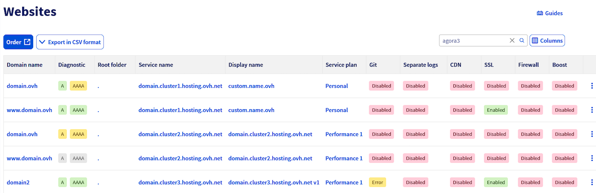

## Objetivo

A interface apresentada neste guia permite centralizar a apresentação do conjunto dos seus websites, independentemente do seu alojamento. Permite o acompanhamento das funcionalidades ativadas em cada website e permite um acesso rápido às ações essenciais. Esta interface é particularmente útil para as agências ou para os profissionais da web que gerem um grande número de domínios repartidos por vários alojamentos.

**Saiba como visualizar e gerir os seus websites a partir da Área de Cliente.**

## Requisitos

- Ter um [plano de alojamento web](/links/web/hosting).

<!-- CP-NAV-START:web-website-view -->
---

### Acesso à Área de Cliente OVHcloud

- **Ligação direta:** [Websites](/links/control-panel/web-website-view)
- **Caminho de navegação:** `Web Cloud`{.action} > `Websites`{.action} > Selecione o seu website

---
<!-- CP-NAV-END:web-website-view -->

## Instruções

<!-- CP-STEPS-START:view-websites -->
Clique nos separadores abaixo para visualizar cada uma das **2** etapas.

> [!tabs]
> **Etapa 1**
>>
>> Aceda à página [Websites](/links/control-panel/web-website-view). Aparecerá uma tabela com o conjunto dos seus websites e as suas principais informações.
>>
>> {.thumbnail}
>>
> **Etapa 2**
>>
>> A tabela apresenta as seguintes colunas:
>>
>> - **Domínio**: mostra o nome de domínio principal do site web, tal como está configurado na secção "Meus sites" do seu alojamento.
>> - **Diagnóstico**: informa-o se o seu domínio aponta corretamente para o alojamento web associado. Para mais detalhes, consulte o nosso guia "[Como verificar a associação entre um nome de domínio e um website?](/pages/web_cloud/web_hosting/my_websites_diagnosis)".
>> - **Pasta raiz**: indica o diretório do seu alojamento (www, app, public_html, etc.) para o qual o domínio aponta.
>> - **Nome do serviço**: nome técnico do serviço, sob a forma `FTPlogin.clusterXXX.hosting.ovh.net`.
>> - **Nome a ser apresentado**: alias personalizado para identificar melhor o seu serviço na Área de Cliente.
>> - **Plano**: apresenta o tipo de oferta associada ao alojamento: Starter, Perso, Pro ou Performance.
>> - **Git**: apresenta o estado da integração Git no website. Para mais detalhes, consulte o nosso guia "[Configurar e utilizar o Git com o alojamento web da OVHcloud](/pages/web_cloud/web_hosting/git_integration_webhosting)".
>> - **Logs separados**: indica se um espaço de logs está ativado no domínio (apenas domínios OVHcloud). Para mais informações, consulte a nossa página "[Acompanhe e analise o tráfego dos seus websites](/links/web/hosting-traffic-analysis)".
>> - **CDN**: apresenta o estado do CDN: Ativo / Desativado / N/A (oferta não compatível). Para mais informações, consulte a nossa página "[Shared CDN](/links/web/hosting-options-cdn)".
>> - **SSL**: indica se o SSL está ativado, permitindo uma ligação segura (**https://**). Para mais informações, consulte a nossa página "[Proteja eficazmente o seu site OVHcloud com um certificado SSL premium](/links/web/hosting-options-ssl)".
>> - **Firewall**: indica se a firewall da aplicação está ativada ou não no domínio. Para mais informações, consulte a nossa página "[As opções indispensáveis para o seu alojamento web](/links/web/hosting-options)".
>> - **Boost**: indica se a opção Boost está ativada, permitindo aumentar temporariamente os recursos CPU e RAM. Para mais detalhes, consulte o nosso guia "[Alojamento web - Como fazer evoluir a sua oferta](/pages/web_cloud/web_hosting/how_to_upgrade_web_hosting_offer)".
>>
>> Ao clicar num elemento da tabela, é redirecionado para o [alojamento web](/links/control-panel/web-hosting) em causa. Mais precisamente:
>>
>> - As colunas **Domínio**, **Diagnóstico**, **Pasta raiz**, **Git**, **Logs separados**, **CDN**, **SSL** e **Firewall** redirecionam para o separador `Meus sites`{.action}.
>> - As colunas **Nome do serviço**, **Nome a ser apresentado** e **Plano** redirecionam para o separador `Informações gerais`{.action}.
>> - A coluna **Boost** redireciona para o separador `Aplicar opção boost ao serviço`{.action}.
>>
>> > [!warning]
>> > Os logs separados não podem ser ativados para um nome de domínio externo. Esta opção só está disponível para os domínios registados na OVHcloud.
>>
<!-- CP-STEPS-END:view-websites -->

## Quer saber mais? 
 
Para serviços especializados (referenciamento, desenvolvimento, etc.), contacte os [parceiros OVHcloud](/links/partner).
 
Se pretender usufruir de uma assistência na utilização e na configuração das suas soluções OVHcloud, consulte as nossas diferentes [ofertas de suporte](/links/support).
 
Fale com a nossa [comunidade de utilizadores](/links/community).
