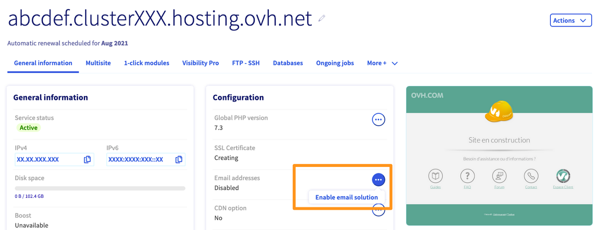
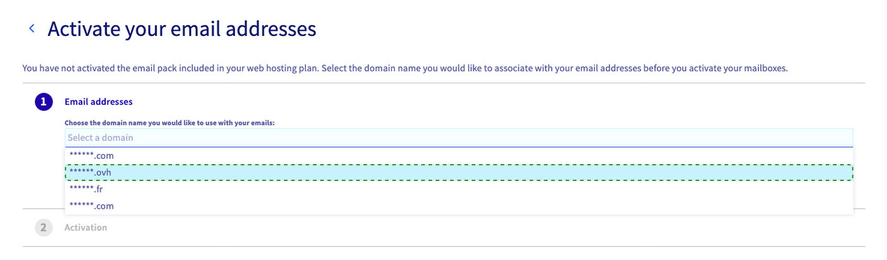
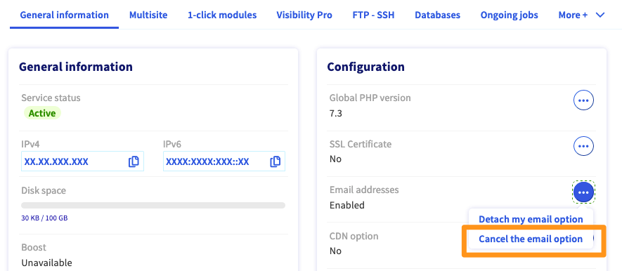

**Ostatnia aktualizacja dnia 02-03-2023**

> [!primary]
> Tłumaczenie zostało wygenerowane automatycznie przez system naszego partnera SYSTRAN. W niektórych przypadkach mogą wystąpić nieprecyzyjne sformułowania, na przykład w tłumaczeniu nazw przycisków lub szczegółów technicznych. W przypadku jakichkolwiek wątpliwości zalecamy zapoznanie się z angielską/francuską wersją przewodnika. Jeśli chcesz przyczynić się do ulepszenia tłumaczenia, kliknij przycisk "Zgłóś propozycję modyfikacji" na tej stronie.
>

## Wprowadzenie 

Jeśli zamówiłeś hosting i nie powiązałeś go bezpośrednio z nazwą domeny, pakiet e-mail dołączony do hostingu aktywuj ręcznie. Powiąż pakiet z wybraną przez Ciebie nazwą domeny.

**Dowiedz się, jak aktywować konta e-mail zawarte w hostingu.**

## Wymagania początkowe

- Posiadanie [domeny](https://www.ovhcloud.com/pl/domains/){.external}i możliwość zarządzania nią w Panelu klienta
- Posiadanie [hostingu WWW](https://www.ovhcloud.com/pl/web-hosting/){.external}.
- Dostęp do [Panelu klienta OVHcloud](https://www.ovh.com/auth/?action=gotomanager&from=https://www.ovh.pl/&ovhSubsidiary=pl){.external}.

## W praktyce

### Aktywacja pakietu e-mail

Zaloguj się do [Panelu klienta](https://www.ovh.com/auth/?action=gotomanager&from=https://www.ovh.pl/&ovhSubsidiary=pl){.external}, kliknij `Hosting`{.action}, po czym wybierz odpowiedni hosting.

W polu `Konfiguracja` znajduje się wzmianka `Konta e-mail`. Kliknij przycisk `…`{.action} po prawej stronie, a następnie przycisk `Aktywuj rozwiązanie e-mail`{.action}.

{.thumbnail}

Pojawi się okno aktywacyjne. Wybierz nazwę domeny, z którą chcesz powiązać konta e-mail i potwierdź swój wybór.

{.thumbnail}

> [!primary]
> Jeśli chcesz korzystać z większej liczby kont e-mail zawartych w ofercie, zachęcamy do zamówienia wyższej [oferty hostingu www](https://www.ovhcloud.com/pl/web-hosting/){.external} na naszej stronie handlowej.

### Zachowanie kont e-mail przed upływem terminu ważności usługi hostingowej

Kiedy Twój hosting wygaśnie lub musi zostać usunięty, możesz zachować Twoje konta e-mail.

Zaloguj się do [Panelu klienta](https://www.ovh.com/auth/?action=gotomanager&from=https://www.ovh.pl/&ovhSubsidiary=pl){.external}, kliknij `Hosting`{.action}, po czym wybierz odpowiedni hosting.

W polu `Konfiguracja` kliknij przycisk `...`{.action} po prawej stronie wzmianki `Konta e-mail`, a następnie kliknij przycisk `Odłącz opcję e-mail`{.action}.

{.thumbnail}

Odpowiednia oferta MX zostanie Ci zaproponowana w momencie zakupu. Kiedy opłacisz zamówienie, Twoje konta e-mail będą nadal działać po zawieszeniu hostingu.
 
### Usunięcie usługi e-mail powiązanej z Twoim hostingiem

Możesz trwale usunąć usługę e-mail powiązaną z Twoim hostingiem.

> [!warning]
>
> Uwaga: operacja ta jest nieodwracalna. Nie ma możliwości ponownej aktywacji usługi e-mail po zrezygnowaniu z tej opcji.

Zaloguj się do [Panelu klienta](https://www.ovh.com/auth/?action=gotomanager&from=https://www.ovh.pl/&ovhSubsidiary=pl){.external}, kliknij `Hosting`{.action}, po czym wybierz odpowiedni hosting.

W polu `Konfiguracja` kliknij przycisk `...`{.action} po prawej stronie wzmianki `Konta e-mail`, a następnie kliknij przycisk `Rezygnacja z opcji e-mail`{.action}.

{.thumbnail}

> [!warning]
>
> W celu potwierdzenia usunięcia usługi e-mail powiązanej z Twoim hostingiem, otrzymasz e-mail z linkiem do potwierdzenia. Aby operacja usunięcia została zainicjowana, kliknij link.

## Sprawdź również

W przypadku wyspecjalizowanych usług (pozycjonowanie, rozwój, etc.) skontaktuj się z [partnerami OVHcloud](https://partner.ovhcloud.com/pl/directory/).

Jeśli chcesz otrzymywać wsparcie w zakresie konfiguracji i użytkowania Twoich rozwiązań OVHcloud, zapoznaj się z naszymi [ofertami pomocy](https://www.ovhcloud.com/pl/support-levels/).

Dołącz do społeczności naszych użytkowników na stronie <https://community.ovh.com/en/>.
