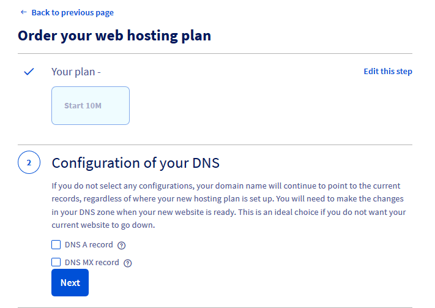

> [!primary]
> Esta tradução foi automaticamente gerada pelo nosso parceiro SYSTRAN. Em certos casos, poderão ocorrer formulações imprecisas, como por exemplo nomes de botões ou detalhes técnicos. Recomendamos que consulte a versão inglesa ou francesa do manual, caso tenha alguma dúvida. Se nos quiser ajudar a melhorar esta tradução, clique em "Contribuir" nesta página.
>

## Objetivo

Com o [Alojamento gratuito 100M](https://www.ovhcloud.com/pt/domains/free-web-hosting/){.external}, a OVHcloud oferece-lhe um alojamento Web de 100MB e uma conta de e-mail com 5 GB de armazenamento. Este guia explica como pode ativar o alojamento gratuito 100M no seu [domínio](https://www.ovhcloud.com/pt/domains/){.external}.

> [!warning]
>
> Este alojamento gratuito de 100MB é adequado para uma simples página Web de apresentação, e **não inclui uma base de dados**.
> Também é necessário que não precise de vários endereços de e-mail do tipo "MX plan". 
> Se pretender implementar um website com várias páginas e que requer uma base de dados, como um CMS (WordPress, Joomla!, PrestaShop, Drupal, etc.), sugerimos que encomende diretamente uma das nossas ofertas de alojamento Web (https://www.ovhcloud.com/pt/web-hosting/) a partir do nosso website ou do seu [Área de Cliente OVHcloud](https://www.ovh.com/auth/?action=gotomanager&from=https://www.ovh.pt/&ovhSubsidiary=pt) {.nal.
>

**Saiba como ativar o Alojamento gratuito 100M**

## Requisitos

- Dispor de um [nome de domínio](https://www.ovhcloud.com/pt/domains/){.external} no seu [Área de Cliente OVHcloud](https://www.ovh.com/auth/?action=gotomanager&from=https://www.ovh.pt/&ovhSubsidiary=pt){.external}, desassociado de qualquer alojamento Web e sem nenhum [MX Plan](/pages/web_cloud/email_and_collaborative_solutions/mx_plan/email_generalities) associado.
- Ter acesso ao seu [Área de Cliente OVHcloud](https://www.ovh.com/auth/?action=gotomanager&from=https://www.ovh.pt/&ovhSubsidiary=pt){.external}.

## Instruções

Aceda à [Área de Cliente OVHcloud](https://www.ovh.com/auth/?action=gotomanager&from=https://www.ovh.pt/&ovhSubsidiary=pt){.external}, clique em `Nomes de domínio`{.action} na barra à esquerda e escolha o domínio em questão.

No menu **Informações gerais**, encontrará *Alojamento web e e-mail gratuito*. À direita, clique no botão `...`{.action} e, a seguir, em `Ativar`{.action}.

{.thumbnail}

Aparecerá a janela de ativação. A **etapa 1** faz menção ao serviço e ao seu custo. Clique em `Seguinte`{.action}. Na **etapa 2**, escolha as alterações a fazer à sua zona DNS:

{.thumbnail}

> [!warning]
>
> Se assinalar uma ou ambas as casas `Entrada DNS A` e `Entrada DNS MX`, ou ambas, isto irá eliminar a configuração inicialmente configurada na zona DNS do seu domínio.
>
> Se a zona DNS não for gerida na [Área de Cliente OVHcloud](https://www.ovh.com/auth/?action=gotomanager&from=https://www.ovh.pt/&ovhSubsidiary=pt){.external}, deverá efetuar as modificações manualmente na sua zona DNS externa.
>
> Para mais informações, consulte o nosso guia sobre [a edição de uma zona DNS da OVHcloud](/pages/web_cloud/domains/dns_zone_edit).
>

| Escolha                                       	| Descrição                                                                                                               								|
|--------------------------------------------	|-----------------------------------------------------------------------------------------------------------------------------------------------------------|
| Entrada DNS A                         	| O domínio ficará associado ao endereço IP do alojamento gratuito 100M.                                               								|
| Entrada DNS MX 	| Os servidores de e-mail (`mx1.mail.ovh.net`, `mx2.mail.ovh.net`, `mx3.mail.ovh.net`, etc.) da OVHcloud serão aplicados no domínio. 	|

> [!primary]
>
> Se o seu projeto for migrado rapidamente para um alojamento que disponha de uma base de dados, de um espaço de armazenamento maior ou de mais endereços de e-mail, poderá migrar diretamente e unicamente do Alojamento gratuito 100M para uma oferta de alojamento **Perso** a partir do seu [Área de Cliente OVHcloud](https://www.ovh.com/auth/?action=gotomanager&from=https://www.ovh.pt/&ovhSubsidiary=pt){.external}.
>
> Migração para a oferta **Pro** ou **Performance** necessita de passar previamente da oferta alojamento gratuito 100M à oferta **Perso**.
>
> Também pode optar por eliminar a oferta gratuita tendo o cuidado de recuperar previamente os seus dados de alojamento e o conteúdo do seu endereço de e-mail.
>
> Para mais informações, consulte as nossas [ofertas de alojamento](https://www.ovhcloud.com/pt/web-hosting/).
>

**A etapa 3** recorda-lhe o preço da oferta. 

Na **etapa 4**, deverá ler os contratos e validar a encomenda.

Depois de validar a encomenda, receberá um e-mail com as informações de [ligação FTP](/pages/web_cloud/web_hosting/ftp_connection){.external} ao seu alojamento gratuito 100M.

Consulte o guia de [criação de uma conta E-mail MX Plan](/pages/web_cloud/email_and_collaborative_solutions/mx_plan/email_creation){.external} para beneficiar do endereço de e-mail incluído com o seu alojamento gratuito 100M.

## Quer saber mais?

[Aceder ao espaço de armazenamento do alojamento web](/pages/web_cloud/web_hosting/ftp_connection){.external}

[Criar um endereço de e-mail com a oferta MX Plan](/pages/web_cloud/email_and_collaborative_solutions/mx_plan/email_creation){.external}

Para serviços especializados (referenciamento, desenvolvimento, etc), contacte os [parceiros OVHcloud](https://partner.ovhcloud.com/pt/directory/).

Se pretender usufruir de uma assistência na utilização e na configuração das suas soluções OVHcloud, consulte as nossas diferentes [ofertas de suporte](https://www.ovhcloud.com/pt/support-levels/).

Fale com a nossa comunidade de utilizadores em <https://community.ovh.com/en/>
