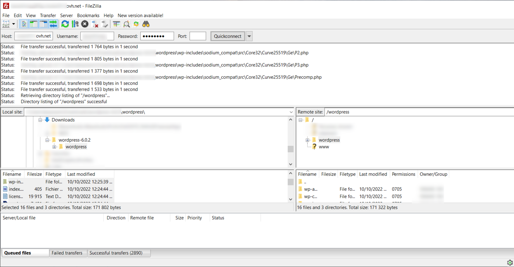

**Last updated 24th March 2023**

## Objective

This tutorial will help you install a CMS (Content Management System) like WordPress, Joomla!, Drupal or PrestaShop manually in just a few steps.

> [!warning]
>
> OVHcloud provides services that you are responsible for with regard to their configuration and management. It is therefore your responsibility to ensure that they function properly.
>
> This tutorial is designed to help you with common tasks. Nevertheless, we recommend contacting a [specialist provider](https://partner.ovhcloud.com/en-au/directory/) or the publisher of the CMS you have chosen to install if you encounter any difficulties. We will not be able to assist you. You can find more information in the [Go further](#go-further) section of this tutorial.
>
> Find below the links to the respective official pages of the CMS mentioned above:
>
> - [WordPress](https://wordpress.com/support/){.external}
> - [Joomla!](https://www.joomla.org/){.external}
> - [Drupal](https://www.drupal.org/){.external}
> - [PrestaShop](https://www.prestashop.com/en/support){.external}
>

> [!success]
>
> To install your CMS **automatically** from your [OVHcloud Control Panel](https://ca.ovh.com/auth/?action=gotomanager&from=https://www.ovh.com.au/&ovhSubsidiary=au), please refer to our documentation on [installing a 1-click module](/pages/web_cloud/web_hosting/cms_install_1_click_modules).
>

**This tutorial explains how to configure your website by manually installing a CMS.**

## Requirements

- An [OVHcloud web hosting plan](https://www.ovhcloud.com/en-au/web-hosting/) that contains at least one database
- A [domain name](https://www.ovhcloud.com/en-au/domains/)
- Access to the [OVHcloud Control Panel](https://ca.ovh.com/auth/?action=gotomanager&from=https://www.ovh.com.au/&ovhSubsidiary=au)

## Instructions

### CMS overview

To help you choose your CMS, find below a short description for each of the 4 CMS mentioned above.

#### WordPress

**WordPress** is typically used to create a website or blog. It is based on PHP technology and includes a range of tools such as a spell checker, as well as plugins for e-commerce, SEO and even your website security.

You can find more information on our [WordPress module page](https://www.ovhcloud.com/en-au/web-hosting/uc-wordpress-website/). 

- [Official WordPress website](https://https://wordpress.com/){.external}

#### Joomla!

**Joomla!** is a CMS that allows you to create websites and web applications with high performance.

The **Joomla!** community is very large and can provide assistance and services in all areas related to this CMS (help, documentation, technical assistance, themes, etc.)

You can find more information on our [Joomla! module page](https://www.ovhcloud.com/en-au/web-hosting/uc-joomla-website/). 

- [Official site of Joomla!](https://www.joomla.org/){.external}

#### Drupal

**Drupal** is a free open-source platform under PHP created in 2000. **Drupal** allows you to create dynamic websites quickly.

You can find more information on our [Drupal module page](https://www.ovhcloud.com/en-au/web-hosting/uc-drupal-website/). 

- [Official Drupal website](https://www.drupal.org/){.external} 

#### PrestaShop

A CMS created in 2005 and dedicated to building e-commerce websites. Apart from the common features of online stores, this software can also be customised with modules, themes and templates. 

You can find more information on our [PrestaShop module page](https://www.ovhcloud.com/en-au/web-hosting/uc-prestashop-website/).

- [PrestaShop official website](https://www.prestashop.com/){.external} 

> [!warning]
>
> Whichever CMS you choose, please note that OVHcloud does not provide support for using the respective software. If you experience any difficulties, please contact the publisher of your chosen CMS directly using the links listed above in this tutorial.
>

### Step 1: Prepare the installation <a name="step1"></a>

To install a CMS on your [web hosting plan](https://www.ovhcloud.com/en-au/web-hosting/), you will need to make some preparations.

#### 1.1 Check the “root folder” declaration

The “root folder” refers to the directory your future CMS will be installed in on your hosting plan. We recommend choosing an empty directory to avoid conflicts with your other multisite potentials.

Please refer to our documentation, which describes [how to add a multisite on your web hosting plan](/pages/web_cloud/web_hosting/multisites_configure_multisite), in order to define the root directory to use with your CMS.

> [!primary]
>
> If you define a “root folder” name that does not exist on your Web Hosting plan, it will be automatically created in your Web Hosting plan’s FTP storage space.
>

#### 1.2 Check the domain name resolution

- Make sure that the domain name you will use to access your CMS, along with its subdomain “www”, is mapped to the IP address of your [web hosting plan](https://www.ovhcloud.com/en-au/web-hosting/).

To retrieve the IP address of your Web Hosting plan, log in to your [OVHcloud Control Panel](https://ca.ovh.com/auth/?action=gotomanager&from=https://www.ovh.com.au/&ovhSubsidiary=au) in the `Web Cloud`{.action} section, then select your Web Hosting plan in the `Hosting`{.action} section.<br>
In the `General information`{.action} box on your right, you will find the IP address of your web hosting plan in the `IPv4`{.action} form.

If your domain’s active DNS zone is managed in your [OVHcloud Control Panel](https://ca.ovh.com/auth/?action=gotomanager&from=https://www.ovh.com.au/&ovhSubsidiary=au), compare your hosting plan’s IP address with the one in your domain’s DNS zone, using our [OVHcloud DNS zones](/pages/web_cloud/domains/dns_zone_edit) documentation .

> [!warning]
>
> If you have activated the `CDN`{.action} or `Country IP`{.action} options with your domain, use the appropriate IP address by referring to our documentation listing [all shared hosting IP addresses](/pages/web_cloud/web_hosting/clusters_and_shared_hosting_IP).
>

If you are unable to perform these checks, contact the hosting provider for your active DNS zone to update the pointing of your domain name.

> [!warning]
>
> Any changes you make to your DNS zone can take between 4 and 24 hours to propagate.
>

- Get [the information you need to log in to your Web Hosting plan’s FTP space](/pages/web_cloud/web_hosting/ftp_connection#step-1-retrieve-your-login-information).
- Retrieve access to your Web Hosting plan’s database if it already exists, or create one using our [documentation](/pages/web_cloud/web_hosting/sql_create_database).

#### 1.3 Install the free FTP client FileZilla

If you are not already using an FTP client, you can use Filezilla. You can find the free download link and a tutorial on how to use it in our documentation on [using FileZilla with your OVHcloud hosting plan](/pages/web_cloud/web_hosting/ftp_filezilla_user_guide).

#### 1.4 Prepare a database <a name="step1-4"></a>

CMSs need a database to work. Our [Web Hosting](https://www.ovhcloud.com/en-au/web-hosting/) solutions include these.

Use our documentation to [create a database from your web hosting plan](/pages/web_cloud/web_hosting/sql_create_database).

If you have a Cloud Databases web hosting plan in MySQL or MariaDB and you would like to use it to manually install your CMS, please refer to our guide on [creating a database on a Cloud Databases web service](/pages/web_cloud/web_cloud_databases/create-db-and-user-on-db-server#creating-a-database).

Once you have created the database, retrieve the connection settings (server, database name, user name, and password) and save them for [step 3](#step3) in this guide.

> [!primary]
>
> If you would like to install your CMS with an existing database, you can retrieve the connection settings for your database directly from the website files linked to it.
>
> If this is also the same CMS you need to install, you can use [this guide](/pages/web_cloud/web_hosting/sql_change_password#step-3-change-the-password-for-your-websites-database-in-its-configuration-file) to identify the configuration files in your [FTP storage space](/pages/web_cloud/web_hosting/ftp_connection).
>
> Then log in to your database to list the prefixes of the tables already inside. This is to avoid choosing a table "prefix" already used by another of your sites.
>
> - To connect to your database linked to your Web Hosting plan, see [this guide](/pages/web_cloud/web_hosting/sql_create_database#accessing-the-phpmyadmin-interface).
> - To connect to a database on a Web Cloud Databases solution, see [this guide](/pages/web_cloud/web_cloud_databases/connecting-to-database-on-database-server).
>

### Step 2: Start the installation

#### 2.1 Retrieve your CMS source files

Go to the CMS publisher’s website to download the source files.

Below are links to the CMS download pages mentioned in this tutorial:

- [WordPress](https://wordpress.org/download/#download-install){.external}
- [Joomla!](https://downloads.joomla.org/){.external}
- [Drupal](https://www.drupal.org/download){.external}
- [Prestashop](https://www.prestashop.com/en/download){.external}

> [!primary]
>
> Retrieve the PHP version and the MySQL or MariaDB version required to run your CMS.
>
> To do this, go to the link to the official CMS page that you want to install:
>
> - [WordPress](https://wordpress.org/about/requirements/){.external}
> - [Joomla!](https://downloads.joomla.org/technical-requirements){.external}
> - [Drupal](https://www.drupal.org/docs/getting-started/system-requirements/php-requirements){.external}
> - [Prestashop](https://www.prestashop.com/en/system-requirements){.external}
>
> Then configure the PHP version on your web hosting plan by referring to our guide on [Changing a Web Hosting plan’s PHP version](/pages/web_cloud/web_hosting/php_configure_php_on_your_web_hosting_2014).
>
> If you are already using a PHP version that is equal to or higher than the required PHP version, no changes are required.
>

Follow the instructions provided by your CMS publisher until the source files are downloaded to your computer, then continue reading this tutorial.

> [!warning]
>
> If you have other websites hosted on your Web Hosting plan, check that they are compatible with the PHP version you choose for your new CMS.
>

#### 2.2 Uncompress the downloaded source files to a new folder

>[!primary]
>
> To make things easier, replace the name of the **CMS** folder with the name of the CMS you have chosen (**WordPress**, **Joomla!**, **Drupal**, **PrestaShop**).
>

The downloaded file is in a compressed (zipped) format. Create a folder named **CMS** on your computer and then uncompress the contents of the downloaded file into the **CMS** folder.

To do this, open the folder in which you downloaded the compressed file, right-click on the file in question and then select “Extract all... ”.

Enter the destination **CMS** folder to extract your files to that folder.

#### 2.3 Move the source files from the CMS folder to the root folder of your web hosting plan

Once you have unpacked the files in your **CMS** folder, [log in to your storage space via FTP](/pages/web_cloud/web_hosting/ftp_connection) using [FTP FileZilla client](/pages/web_cloud/web_hosting/ftp_filezilla_user_guide) and copy the files from the **CMS** folder to the root folder you defined on your hosting in [step 1](#step1) of this guide.

Below is an example with the CMS *WordPress*:

{.thumbnail}

>[!warning]
>
> We strongly recommend that you use an empty root folder to avoid conflicts with other websites. Ensure that the destination folder does not contain any items before moving the files.
>

>[!primary]
>
> If the root folder you defined was not created automatically during the actions described in [step 1](#step1), you can create it via FileZilla.
>
> It may take a few minutes to upload files to your web hosting plan.
>
> Once the transfer is complete, check that all the elements in the local **CMS** folder have been correctly transferred to the root folder on your Web Hosting plan.
>

**Special Case**: If you have a limited internet speed and/or a hosting plan **Pro** or higher, you can use **SSH** connection to put your CMS source files in your Web Hosting plan’s storage space. 

To log in to your hosting plan via SSH, please refer to our guide on [Accessing a web hosting plan via SSH](/pages/web_cloud/web_hosting/ssh_on_webhosting).

Once you have logged in via **SSH**, run the following commands:

- Go to the root folder where you want to install your CMS on your web hosting plan:

```bash
cd NameOfYourTargetFolder
```

- Retrieve your CMS source files directly from your root folder using the command corresponding to the CMS you have chosen:

> [!tabs]
> **WordPress**
>> 
>> ```bash
>> wget http://wordpress.org/latest.tar.gz
>> ```
>>
>> **latest** allows you to automatically install the latest version of the CMS.
>>
> **Joomla!**
>> 
>> ```bash
>> wget https://downloads.joomla.org/cms/joomla4/4-2-8/Joomla_4-2-8-Stable-Full_Package.tar.gz
>> ```
>> 
>> **Joomla4** and **4-2-8** are the latest versions of Joomla!.
>> Replace these values with the version you want to install.
>> 
> **Drupal**
>> 
>> ```bash
>> wget https://ftp.drupal.org/files/projects/admin_toolbar-8.x-2.4.tar.gz
>> ```
>> 
>> **8.x-2.4** is the latest version of Drupal available to date.
>> Replace this value with the version you want to install.
>> 
> **PrestaShop**
>> 
>> ```bash
>> wget https://github.com/PrestaShop/PrestaShop/archive/1.7.8.8.tar.gz
>> ```
>> 
>> **1.7.8.8** is the latest version of PrestaShop available to date. Replace this value with the version you want to install.
>> 

- Unpack the source files of your CMS into your root folder using the command corresponding to the CMS you have chosen:

> [!tabs]
> **WordPress**
>> 
>> ```bash
>> tar xvf latest.tar.gz
>> ```
>> 
> **Joomla!**
>> 
>> ```bash
>> tar xvf Joomla_4-2-8-Stable-Full_Package.tar.gz
>> ```
>> 
> **Drupal**
>> 
>> ```bash
>> tar xvf admin_toolbar-8.x-2.4.tar.gz
>> ```
>> 
> **PrestaShop**
>> 
>> ```bash
>> tar xvf 1.7.8.8.tar.gz
>> ```
>> 

- A **CMS** folder is created in your root folder. Move its contents to the base of your root folder:

```bash
mv CMS/* ./
```

- Delete the empty **CMS** folder:

```bash
rmdir ./CMS/
```

- Delete the compressed file corresponding to the CMS you have chosen:

> [!tabs]
> **WordPress**
>> ```bash
>> rm -f latest.tar.gz
>> ```
>> 
> **Joomla!**
>> ```bash
>> rm -f Joomla_4-2-8-Stable-Full_Package.tar.gz
>> ```
>> 
> **Drupal**
>> ```bash
>> rm -f admin_toolbar-8.x-2.4.tar.gz
>> ```
>> 
> **PrestaShop**
>> ```bash
>> rm -f 1.7.8.8.tar.gz
>> ```
>> 

### Step 3: Finalise the installation <a name="step3"></a>

> [!success]
>
> Before you continue with the installation, clear your Internet browser cache to avoid any errors.
>

From this stage onwards, the procedure will differ depending on which CMS you have chosen beforehand.

To continue with the installation, follow the guide corresponding to your CMS:

- [Finalise a WordPress installation](/pages/web_cloud/web_hosting/cms_manual_installation_wordpress)
- [Finalise a Joomla! installation](/pages/web_cloud/web_hosting/cms_manual_installation_joomla)
- [Finalise a Drupal installation](/pages/web_cloud/web_hosting/cms_manual_installation_drupal)
- [Finalise a PrestaShop installation](/pages/web_cloud/web_hosting/cms_manual_installation_prestashop)

## Go further <a name="go-further"></a>

[Migrating your website and emails to OVHcloud](/pages/web_cloud/web_hosting/hosting_migrating_to_ovh)

[Publishing a website on your Web Hosting space](/pages/web_cloud/web_hosting/hosting_how_to_get_my_website_online)

[Hosting multiple websites on your Web Hosting plan](/pages/web_cloud/web_hosting/multisites_configure_multisite)

For specialised services (SEO, development, etc.), contact [OVHcloud partners](https://partner.ovhcloud.com/en-au/directory/).

If you would like assistance using and configuring your OVHcloud solutions, please refer to our [support offers](https://www.ovhcloud.com/en-au/support-levels/).

Join our community of users on <https://community.ovh.com/en/>. 
