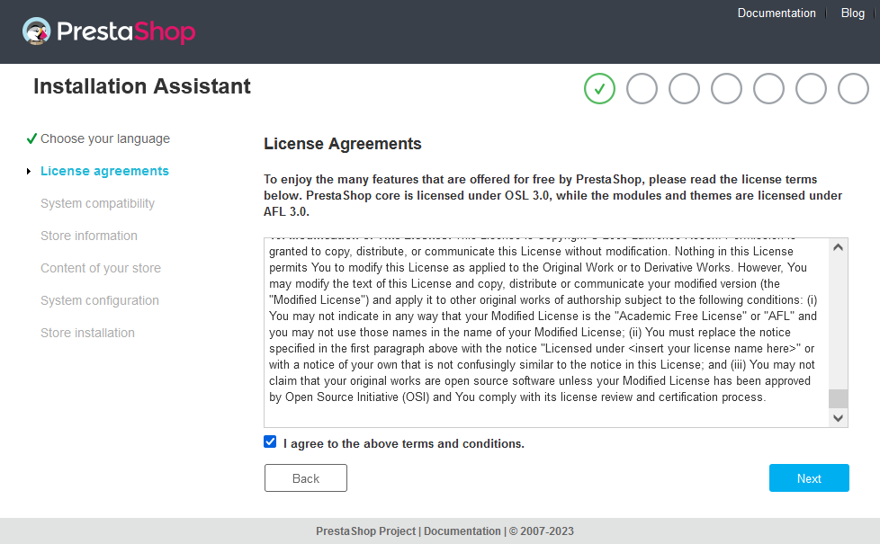
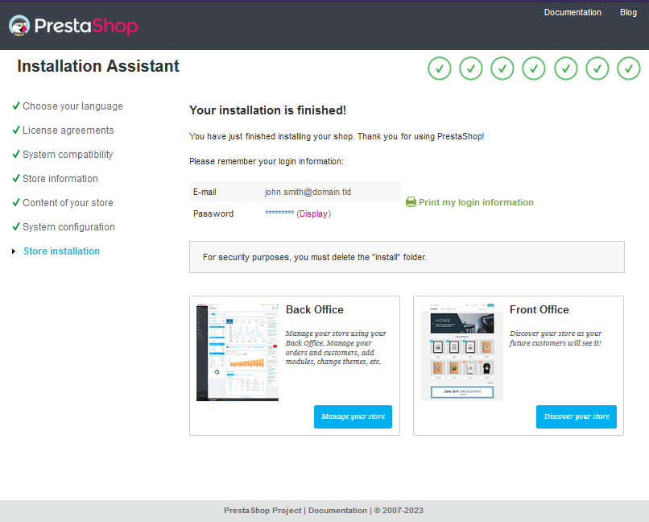

**Dernière mise à jour le 17/03/2023**

## Objectif

Vous trouverez ici tous les éléments pour installer manuellement le CMS (Content Management System) PrestaShop en quelques étapes.

> [!warning]
>
> OVHcloud met à votre disposition des services dont la configuration, la gestion et la responsabilité vous incombent. Il vous revient de ce fait d'en assurer le bon fonctionnement.
> 
> Nous mettons à votre disposition ce guide afin de vous accompagner au mieux sur des tâches courantes. Néanmoins, nous vous recommandons de faire appel à un [prestataire spécialisé](https://partner.ovhcloud.com/fr-ca/directory/) ou [l'éditeur du CMS PrestaShop](https://www.prestashop.com/en/support){.external} si vous éprouvez des difficultés. En effet, nous ne serons pas en mesure de vous fournir une assistance. Plus d'informations dans la section [« Aller plus loin »](#go-further) de ce guide.
>

> [!success]
>
> Pour installer PrestaShop **automatiquement** depuis votre [espace client OVHcloud](https://ca.ovh.com/auth/?action=gotomanager&from=https://www.ovh.com/ca/fr/&ovhSubsidiary=qc), consultez notre documentation sur l'[installation d'un module « en un clic »](/pages/web_cloud/web_hosting/cms_install_1_click_modules).
>
> Pour installer **manuellement un autre CMS** (WordPress, Joomla!, Drupal), consultez notre documentation sur l'[installation manuelle d'un CMS](/pages/web_cloud/web_hosting/cms_manual_installation).
>

**Découvrez comment installer manuellement votre CMS PrestaShop**

## Prérequis

- Disposer d'une offre d'[hébergement web](https://www.ovhcloud.com/fr-ca/web-hosting/) qui contient au moins une base de données.
- Disposer d'un [nom de domaine](https://www.ovhcloud.com/fr-ca/domains/)
- Être connecté à l'[espace client OVHcloud](https://ca.ovh.com/auth/?action=gotomanager&from=https://www.ovh.com/ca/fr/&ovhSubsidiary=qc){.external}

## En pratique

### Etape 1 - préparer l'installation 

Pour installer le CMS **PrestaShop** sur votre offre d'[hébergement web](https://www.ovhcloud.com/fr-ca/web-hosting/), quelques préparatifs sont nécessaires.

Suivez l'**ensemble des étapes** décrites dans notre tutoriel sur l'[installation manuelle d'un CMS](/pages/web_cloud/web_hosting/cms_manual_installation) avant de poursuivre vers l'étape 2 ci-dessous.

### Etape 2 - finaliser l'installation manuelle 

> [!success]
>
> Avant de continuer l'installation, videz le cache de votre navigateur Internet, afin d'éviter toute erreur.
>

Si vous n'avez pas téléchargé la dernière version disponible de PrestaShop, la page suivante apparaît :

{.thumbnail}

Cliquez sur `No thanks`{.action} si vous souhaitez conserver la version de PrestaShop que vous venez de télécharger ou sur `Yes please!`{.action} si vous souhaitez utilisez la version la plus récente du CMS.

#### 2.1 - Se rendre sur votre site PrestaShop via votre navigateur

Saisissez votre domaine dans la barre de recherche de votre navigateur Internet.

Si les fichiers sources de votre PrestaShop ont été placés correctement dans votre dossier racine, la page de PrestaShop permettant de sélectionner la langue apparaît :

{.thumbnail}

Sélectionnez la langue du site puis cliquez sur `Suivant`{.action}.

#### 2.2 - Valider les conditions d'utilisation

Prenez connaissance des conditions d'utilisation, cochez la case `J'accepte les termes et conditions ci-dessus`{.action} puis cliquez sur `Suivant`{.action}.

{.thumbnail}

#### 2.3 - Renseigner les informations de votre boutique en ligne

PrestaShop vous demandera une série d'informations sur votre future boutique en ligne :

{.thumbnail}

**Informations à propos de votre boutique**

- *Nom de votre boutique* : Saisissez le nom de votre boutique en ligne
- *Activité principale* : Sélectionnez votre secteur d'activité parmi les propositions du menu déroulant
- *Pays* : Sélectionnez votre pays
- *Activer le SSL* : Cochez **Yes** pour forcer la réécriture de votre URL en « https:// ». Vous devez au préalable disposer d'un certificat SSL actif sur votre hébergement ou votre nom de domaine. Pour plus d'informations sur ce sujet, consultez notre guide sur [la gestion d'un certificat SSL sur votre hébergement web OVHcloud](/pages/web_cloud/web_hosting/ssl_on_webhosting).

**Votre compte**

- *Prénom* : Saisissez votre prénom
- *Nom* : Saisissez votre nom
- *Adresse e-mail* : Saisissez votre adresse e-mail
- *Mot de passe de la boutique* : Choisissez un mot de passe pour accéder à l'espace d'administration de votre boutique en ligne (backoffice)
- *Confirmer mot de passe* : Saisissez à nouveau le mot de passe

Vérifiez les informations saisies puis cliquez sur `Suivant`{.action}.

#### 2.4 - Installer le contenu par défaut pour votre boutique

PrestaShop vous propose d'installer du contenu et des modules pour votre futur site de E-commerce :

{.thumbnail}

Faites vos choix puis cliquez sur `Suivant`{.action}.

#### 2.5 - Lier votre PrestaShop avec votre base de données OVHcloud

{.thumbnail}

Munissez-vous des identifiants de votre base de données (au besoin, consultez **l'étape 1.4** du guide sur l'[installation manuelle d'un CMS](/pages/web_cloud/web_hosting/cms_manual_installation)).

Renseignez les informations demandées concernant la base de données :

- *Adresse de la base de données* : renseignez le nom du serveur de votre base de données, présent dans l'e-mail d'installation ou dans votre espace client OVHcloud. 

> [!primary]
> 
> - Le nom du serveur d'une base de données incluse avec votre offre d'hébergement Web a généralement cette forme : `NameOfYourDatabase.mysql.db`. 
>
> - Le nom du serveur d'une base de données Web Cloud Databases commence par votre identifiant client OVHcloud et a la forme suivante : `aa00000-XXX.eu.clouddb.ovh.net`, **«aa00000»** correspond à votre identifiant OVHcloud sans le **« -ovh »** et les **« X »** sont à remplacer par le reste de la référence de votre service Web Cloud Databases.
>

- *Nom de la base de données* : ce nom a été défini lors de la création de la base de données dans l'[espace client OVHcloud](https://ca.ovh.com/auth/?action=gotomanager&from=https://www.ovh.com/ca/fr/&ovhSubsidiary=qc).

- *Identifiant* : il est identique au nom de la base de données si vous utilisez une base de données incluse avec votre hébergement web.
Pour les bases de données créées sur un service Web Cloud Databases, référez-vous aux informations mentionnées dans **l'étape 1.4** de notre guide sur l'[installation manuelle d'un CMS](/pages/web_cloud/web_hosting/cms_manual_installation).

- *Mot de passe* : vous l'avez vous-même défini lors de la création de votre base de données. Il est possible que vous l'ayez modifié entre temps.

- *Préfixe des tables* : si l'installation se fait avec une toute nouvelle base de données, renseignez le « préfixe » de votre choix. Si vous utilisez une base de données déjà utilisée par un autre site, référez-vous à **l'étape 1.4** de notre guide sur l'[installation manuelle d'un CMS](/pages/web_cloud/web_hosting/cms_manual_installation) pour ne pas renseigner un « préfixe » de table déjà utilisé dans votre base de données.

- *Supprimer les tables existantes* : **Décochez cette case si vous utilisez déjà votre base de données avec un autre site web**.

>[!alert]
>
> Si vous laissez cochée la case **Supprimer les tables existantes**, cela supprimera toutes les tables déjà présentes dans votre base de données.
>

Cliquez sur `Testez dès maintenant la connexion à votre base de données!`{.action} pour vérifier les paramètres saisis :

{.thumbnail}

Si le message « Votre base de données est connectée » apparaît, cliquez sur `Suivant`{.action}. Sinon, vérifiez les paramètres que vous avez saisis jusqu'à ce que la connexion fonctionne. Si besoin, référez-vous à **l'étape 1.4** du tutoriel sur l'[installation manuelle d'un CMS](/pages/web_cloud/web_hosting/cms_manual_installation).

#### 2.6 - Terminer l'installation de PrestaShop

La dernière étape correspond à un résumé de l'installation que vous venez de réaliser :

{.thumbnail}

Récupérez les identifiants de connexion de votre PrestaShop avant de quitter la page.

>[!warning]
>
> **Par sécurité, il est recommandé de supprimer le dossier d'installation présent sur votre espace FTP.**
>
> Pour réaliser cette action, consultez notre guide [« comment se connecter à l'espace de stockage FTP de son hébergement web OVHcloud »](/pages/web_cloud/web_hosting/ftp_connection) et appuyez-vous sur le [forum PrestaShop](https://www.prestashop.com/forums/){.external} pour vous assurer de supprimer les bons fichiers.
>

> [!success]
>
> Vous pouvez maintenant démarrer la création du contenu de votre site PrestaShop !
>

## Aller plus loin 

[Site officiel PrestaShop](https://prestashop.com)

Pour des prestations spécialisées (référencement, développement, etc), contactez les [partenaires OVHcloud](https://partner.ovhcloud.com/fr-ca/directory/).

Si vous souhaitez bénéficier d'une assistance à l'usage et à la configuration de vos solutions OVHcloud, nous vous proposons de consulter nos différentes [offres de support](https://www.ovhcloud.com/fr-ca/support-levels/).

Échangez avec notre communauté d'utilisateurs sur <https://community.ovh.com>.
