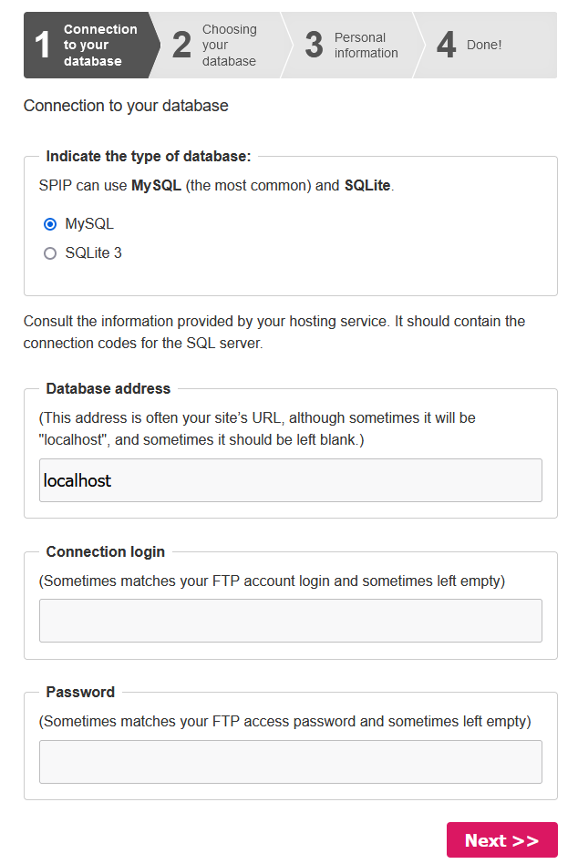
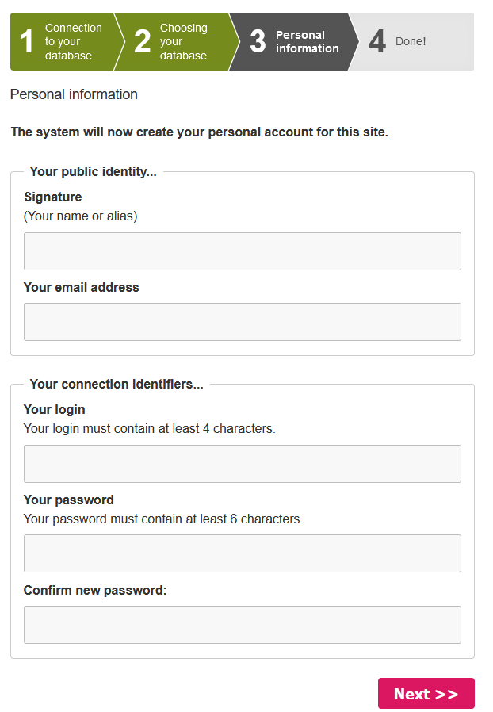

## Objectif

Le **CMS** (**C**ontent **M**anagement **S**ystem) SPIP est une solution adaptée aux sites éditoriaux comme les magazines en ligne, les journaux ou les sites institutionnels. Grâce à son architecture modulaire et à son système de squelettes personnalisables, SPIP permet de concevoir des sites web riches en fonctionnalités, tout en offrant une grande liberté de personnalisation.

**Découvrez comment installer manuellement le CMS Spip sur votre hébergement web OVHcloud.**

## Prérequis

- Disposer d'une offre d'[hébergement web OVHcloud](https://www.ovhcloud.com/fr/web-hosting/) incluant au moins une base de données.
- Disposer d'un [nom de domaine](https://www.ovhcloud.com/fr/domains/).
- Être connecté à votre [espace client OVHcloud](https://www.ovh.com/auth/?action=gotomanager&from=https://www.ovh.com/fr/&ovhSubsidiary=fr).

## En pratique

### Préparer l'installation

Pour installer le CMS **Spip** sur votre [hébergement web](https://www.ovhcloud.com/fr/web-hosting/), quelques préparatifs sont nécessaires.

Suivez l'**ensemble des étapes** décrites dans notre tutoriel sur l'[installation manuelle d'un CMS](/pages/web_cloud/web_hosting/cms_manual_installation) avant de poursuivre à l'étape suivante.

### Finaliser l'installation manuelle

> [!primary]
>
> Avant de continuer l'installation, videz le cache de votre navigateur Internet, afin d'éviter tout dysfonctionnement.
>

#### Se rendre sur votre site web Spip via votre navigateur

Saisissez `votre_domain/ecrire` dans la barre de recherche de votre navigateur Internet pour démarrer l'installation de votre site web Spip. La page suivante s'affiche :

{.thumbnail}

Sélectionnez la langue de votre site web Spip et cliquez sur `Next`{.action} pour confirmer. L'écran suivant s'affiche :

{.thumbnail}

Saisissez les informations pour vous connecter à votre SGBD (MySQL par exemple). Une fois la connexion à votre base de données réussie, l'écran suivant s'affiche :

{.thumbnail}

Sélectionnez la base de données que vous souhaitez utiliser pour votre site web ou créez en une nouvelle. Choisissez un préfixe pour les tables de votre base de données. Par défaut, le préfixe `spip` est utilisé. Cliquez sur `Next`{.action} pour valider les informations. L'écran suivant s'affiche :

{.thumbnail}

Entrez les informations demandées et cliquez sur `Next`{.action} pour confirmer. L'écran suivant s'affiche :

{.thumbnail}

L'écran affiche la liste des plugins disponible pour votre site web et vous informe que l'installation de Spip s'est bien déroulée.

### Conclusion

Vous venez d'installer manuellement le CMS Spip sur votre hébergement web OVHcloud. Votre site web Spip est accessible en ligne via votre nom de domaine. Pour vous connecter à l'espace administrateur de votre site web Spip, saisissez `votre_domain/ecrire` dans la barre de recherche de votre navigateur Internet.

## Aller plus loin 

[Tutoriel - Installer manuellement WordPress](/pages/web_cloud/web_hosting/cms_manual_installation_wordpress)

[Tutoriel - Installer manuellement Joomla!](/pages/web_cloud/web_hosting/cms_manual_installation_joomla)

[Tutoriel - Installer manuellement Drupal](/pages/web_cloud/web_hosting/cms_manual_installation_drupal)

[Tutoriel - Installer manuellement PrestaShop](/pages/web_cloud/web_hosting/cms_manual_installation_prestashop)

[Tutoriel - Installer manuellement Pico](/pages/web_cloud/web_hosting/cms_manual_installation_pico)

[Tutoriel - Installer manuellement Typo3](/pages/web_cloud/web_hosting/cms_manual_installation_typo3)

[Tutoriel - Installer manuellement Grav](/pages/web_cloud/web_hosting/cms_manual_installation_grav)

[Tutoriel - Installer manuellement un CMS sur mon hébergement](/pages/web_cloud/web_hosting/cms_manual_installation)

Pour des prestations spécialisées (référencement, développement, etc), contactez les [partenaires OVHcloud](https://partner.ovhcloud.com/fr/directory/).

Échangez avec notre communauté d'utilisateurs sur <https://community.ovh.com>.
