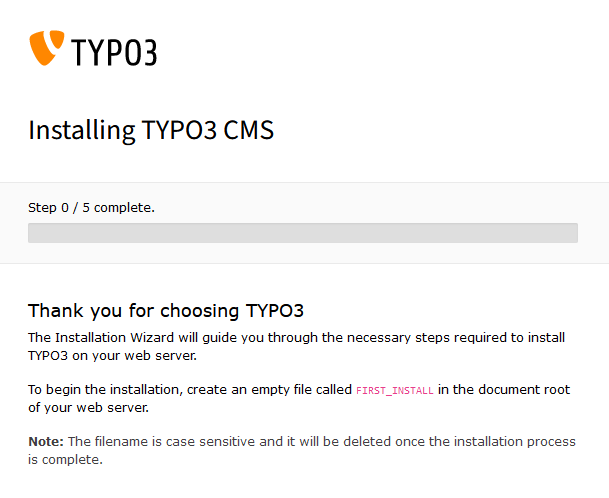
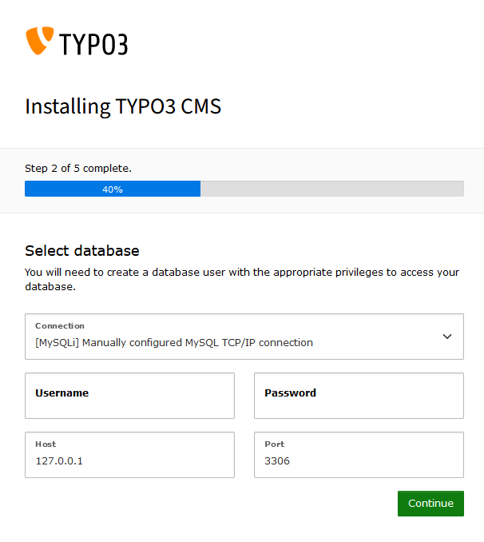
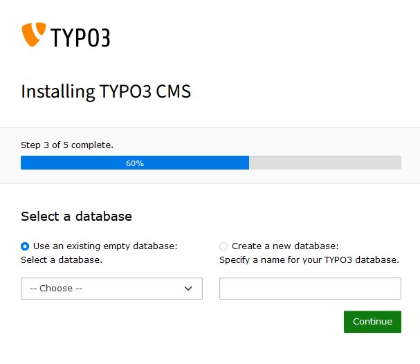
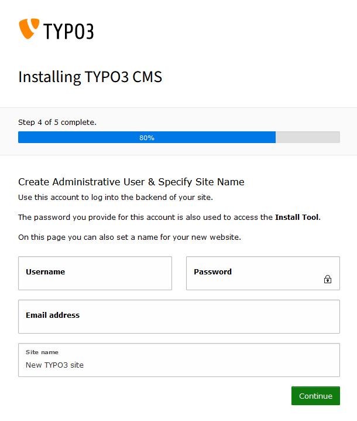

## Objectif

Le **CMS** (**C**ontent **M**anagement **S**ystem) Typo3 permet de développer des sites web complexes et évolutifs, pour les entreprises de toutes tailles, des sites institutionnels aux plateformes de e-commerce. Avec une forte communauté de développeurs et un large éventail d'extensions, TYPO3 offre des outils puissants pour personnaliser et étendre votre site selon vos besoins spécifiques.

**Découvrez comment installer manuellement le CMS Typo3 sur votre hébergement web OVHcloud.**

## Prérequis

- Disposer d'une offre d'[hébergement web OVHcloud](https://www.ovhcloud.com/fr/web-hosting/) incluant au moins une base de données.
- Disposer d'un [nom de domaine](https://www.ovhcloud.com/fr/domains/).
- Être connecté à votre [espace client OVHcloud](https://www.ovh.com/auth/?action=gotomanager&from=https://www.ovh.com/fr/&ovhSubsidiary=fr).

## En pratique

### Préparer l'installation

Pour installer le CMS **Typo3** sur votre [hébergement web](https://www.ovhcloud.com/fr/web-hosting/), quelques préparatifs sont nécessaires.

Suivez l'**ensemble des étapes** décrites dans notre tutoriel sur l'[installation manuelle d'un CMS](/pages/web_cloud/web_hosting/cms_manual_installation) avant de poursuivre à l'étape suivante.

### Finaliser l'installation manuelle

> [!primary]
>
> Avant de continuer l'installation, videz le cache de votre navigateur Internet, afin d'éviter tout dysfonctionnement.
>

#### Se rendre sur votre site web Typo3 via votre navigateur

Saisissez votre nom de domaine dans la barre de recherche de votre navigateur Internet.

Si les fichiers source de Typo3 ont été placés correctement dans votre dossier racine, la page suivante apparaît :

{.thumbnail}

Comme indiqué, créez un fichier vide nommé `FIRST_INSTALL` dans le répertoire où vous avez déposé vos fichiers et dossiers Typo3. Retournez sur votre navigateur Internet et actualisez la page. Si des erreurs surviennent, l'écran ci-dessous apparaît, avec la description des erreurs.

{.thumbnail}

Résolvez les erreurs ou cliquez sur `Continue with errors`{.action}.

La deuxième étape de l'installation s'affiche.

{.thumbnail}

Entrez les informations relatives à votre SGBD puis cliquez sur `Continue`{.action}.

La troisième étape de l'installation s'affiche.

{.thumbnail}

Sélectionnez le nom de la base de données que vous souhaitez utiliser pour votre site web, ou créez-en une nouvelle, puis cliquez sur `Continue`{.action}.

La quatrième étape de l'installation s'affiche.

{.thumbnail}

Entrez le nom de votre site web, ainsi que les informations relatives à votre utilisateur admin.

La cinquième et dernière étape de l'installation s'affiche.

{.thumbnail}

Lisez les informations affichées à l'écran et choisissez l'option qui vous convient :

- `Create empty starting page` : sélectionnez cette option pour créer une page par défaut à votre site web. Après avoir validé cette étape, saisissez votre nom de domaine dans votre navigateur Internet pour accéder à votre site web Typo3.
- `Take me straight to the backend` : sélectionnez cette option pour être redirigé vers le dashboard de votre site web Typo3. Via ce dashboard, vous devrez créer vous-même vos pages web, alimenter leurs contenu et bien plus. Pour plus d'informations, consultez la [documentation officielle de Typo3](https://docs.typo3.org/Home/GettingStarted.html).

Cliquez sur `Open the TYPO3 Backend`{.action} pour confirmer l'option que vous venez de choisir.

### Conclusion

Vous venez d'installer manuellement le CMS Typo3 sur votre hébergement web OVHcloud. Après avoir configuré votre site web, ajouté du contenu, personnalisé le thème et installé des plugins, votre site web Typo3 est accessible en ligne via votre nom de domaine.

## Aller plus loin 

[Tutoriel - Installer manuellement WordPress](/pages/web_cloud/web_hosting/cms_manual_installation_wordpress)

[Tutoriel - Installer manuellement Joomla!](/pages/web_cloud/web_hosting/cms_manual_installation_joomla)

[Tutoriel - Installer manuellement Drupal](/pages/web_cloud/web_hosting/cms_manual_installation_drupal)

[Tutoriel - Installer manuellement PrestaShop](/pages/web_cloud/web_hosting/cms_manual_installation_prestashop)

[Tutoriel - Installer manuellement Pico](/pages/web_cloud/web_hosting/cms_manual_installation_pico)

[Tutoriel - Installer manuellement Grav](/pages/web_cloud/web_hosting/cms_manual_installation_grav)

[Tutoriel - Installer manuellement un CMS sur mon hébergement](/pages/web_cloud/web_hosting/cms_manual_installation)

Pour des prestations spécialisées (référencement, développement, etc), contactez les [partenaires OVHcloud](https://partner.ovhcloud.com/fr/directory/).

Échangez avec notre communauté d'utilisateurs sur <https://community.ovh.com>.