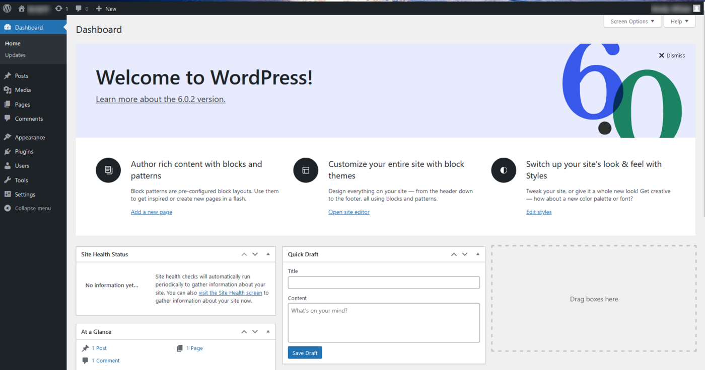

**Last updated 24th March 2023**

## Objective

This tutorial will help you install the WordPress CMS (Content Management System) manually in just a few steps.

> [!warning]
>
> OVHcloud provides services that you are responsible for with regard to their configuration and management. It is therefore your responsibility to ensure that they function properly.
>
> This tutorial is designed to help you with common tasks. Nevertheless, we recommend contacting a [specialist provider](https://partner.ovhcloud.com/en/directory/) or the [WordPress support](https://wordpress.com/support/){.external} if you encounter any difficulties. We will not be able to assist you. You can find more information in the [Go further](#go-further) section of this guide.
>

> [!success]
>
> To install WordPress **automatically** from your [OVHcloud Control Panel](https://ca.ovh.com/auth/?action=gotomanager&from=https://www.ovh.com/world/&ovhSubsidiary=we), please refer to our documentation on [installing a 1-click module](/pages/web_cloud/web_hosting/cms_install_1_click_modules).
>
> To manually **install another CMS** (Joomla!, Drupal, PrestaShop), please refer to our documentation on [installing a CMS manually](/pages/web_cloud/web_hosting/cms_manual_installation).
>

**This tutorial explains how to install your WordPress CMS manually.**

## Requirements

- An [OVHcloud web hosting plan](https://www.ovhcloud.com/en/web-hosting/) that contains at least one database
- A [domain name](https://www.ovhcloud.com/en/domains/)
- Access to the [OVHcloud Control Panel](https://ca.ovh.com/auth/?action=gotomanager&from=https://www.ovh.com/world/&ovhSubsidiary=we)

## Instructions

### Step 1: Prepare for the installation 

To install the **WordPress** CMS on your [web hosting plan](https://www.ovhcloud.com/en/web-hosting/), you will need to make some preparations.

Follow **all steps** described in our tutorial on [installing a CMS manually](/pages/web_cloud/web_hosting/cms_manual_installation) before continuing with step 2 below.

### Step 2: Finalise the installation 

> [!success]
>
> Before you continue with the installation, clear your web browser cache to avoid any errors.
>

#### 2.1 Access your WordPress website via your browser

Enter your domain name into the address bar of your web browser.

If the WordPress source files have been correctly placed in your root folder, the WordPress page for selecting the language appears:

{.thumbnail}

Select the site language and click `Continue`{.action}.

#### 2.2 Link your WordPress to your database

WordPress will ask you to retrieve the login details for your database:

{.thumbnail}

Have your database login details ready (if necessary, see **Step 1.4** in the [manual installation of a CMS tutorial](/pages/web_cloud/web_hosting/cms_manual_installation)). Click on `Let's go!`{.action} to continue.

The following page appears:

{.thumbnail}

Enter the information requested for the database:

- Database name: this name was defined when the database was created in the [OVHcloud Control Panel](https://ca.ovh.com/auth/?action=gotomanager&from=https://www.ovh.com/world/&ovhSubsidiary=we).

- Username: It is identical to the database name if you are using a database included with your web hosting plan. For databases created on Web Cloud Databases, please refer to the information in **Step 1.4** in the [manual installation of a CMS](/pages/web_cloud/web_hosting/cms_manual_installation) tutorial.

- Password: You defined it yourself when you created your database. You may have modified it in the meantime.

- Database Host: The name of your database server, included in the installation email and displayed in your OVHcloud Control Panel. 

> [!primary]
> 
> - The server name of a database included with your web hosting plan usually has this format: `NameOfYourDatabase.mysql.db`. 
>
> - The server name of a Web Cloud Databases database starts with your OVHcloud NIC handle and is in the following format: `OVHID(without-ovh)-XXX.eu.clouddb.ovh.net` where **"XXX"** is to be replaced by the reference of your Web Cloud Databases service.
>

- Table Prefix: if you are installing WordPress with a new database, you can enter a custom prefix. If you are using a database that is already in use by another website, please refer to **Step 1.4** in the [manual installation of a CMS tutorial](/pages/web_cloud/web_hosting/cms_manual_installation) to avoid associating WordPress with a table prefix used by another software.

Click `Submit`{.action} to validate the database connection information.

If everything went well, the following page appears:

{.thumbnail}

Click `Launch Installation`{.action}.

#### 2.3 Configure administrative access to the backend of your WordPress and provide your admin email address

Once you have set it up, WordPress will ask you for information on your future website and to set up your Administrator account.

This will give you access to the administration panel (backend) of your WordPress CMS.

{.thumbnail}

Enter the information requested:

- *Site title*: Enter your website’s title.
- *Username*: Define the Administrator login for WordPress.
- *Password*: Set the password for this Administrator account.
- *Your Email*: Enter a valid email address.
- *Search engine visibility*: Untick this box to have search engines reference your WordPress.

Click `Install WordPress`{.action} as soon as you have entered all of the information correctly.

#### 2.4 Finalise the manual installation and test Administrator access

Installation is complete when the following page is displayed:

{.thumbnail}

At this stage, simply click on the `Log in`{.action} button to test access to the admin panel of your new WordPress CMS. Enter the credentials created previously in step 3.3.

> [!primary]
>
> OVHcloud support does not include third-party solutions such as WordPress. Support teams are therefore unable to assist you with using or configuring a CMS.
>
> For support of this type, please use the forums dedicated to the WordPress software.
>

Once connected, the following page appears:

{.thumbnail}

> [!success]
>
> You can now start creating the content for your WordPress website!
>

## Go further 

[Official WordPress website](https://wordpress.org)

For specialised services (SEO, development, etc.), contact [OVHcloud partners](https://partner.ovhcloud.com/en/directory/).

If you would like assistance using and configuring your OVHcloud solutions, please refer to our [support offers](https://www.ovhcloud.com/en/support-levels/).

Join our community of users on <https://community.ovh.com/en/>.
