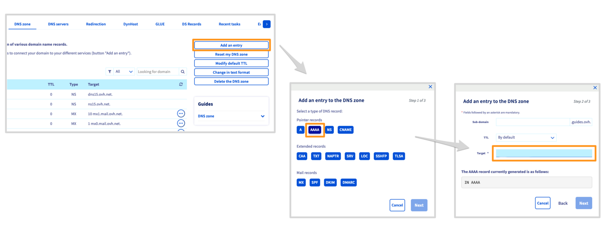

## Objective

The Internet has been operating since the early 1990s, following the IPv4 standard. This standard provides IP addresses in the format X.X.X.X (in which "X" stands for numbers between 0 and 255) to each device connected to the public network (servers, computers, smartphones, tablets, etc.). However, this protocol limits the number of devices connected to the Internet to around 4 billion, which in 2022 was less than one connected device per two people on Earth.

For this reason, the **IPv6** protocol was introduced, allowing up to 340 sextillion devices to be connected to the Internet. The broad deployment of IPv6 takes time because the new standard has to be incorporated throughout the entire Internet.

Since less IPv4 addresses are available, it is more difficult to add new devices to the Internet using the IPv4 standard. However, connections with an IPv6 address are only useful if public resources, for example your website, are also available with this protocol. This means that the more websites IPv6 is enabled for, the more important it becomes for everyone concerned to migrate to this new protocol.

For more information, see [Wikipedia](https://en.wikipedia.org/wiki/IPv6){.external}'s article on IPv6.

Our web hosting plans have been compatible with IPv6 since 2011. However, enabling this protocol remained optional for the configuration until recently. 

**This guide explains how to verify if your website is available via IPv6 and how to configure your hosting's IPv6 address.**

## Requirements

- A [domain name](https://www.ovhcloud.com/asia/domains/){.external}
- An [OVHcloud web hosting plan](https://www.ovhcloud.com/asia/web-hosting/)
- Access to the [OVHcloud Control Panel](https://ca.ovh.com/auth/?action=gotomanager&from=https://www.ovh.com/asia/&ovhSubsidiary=asia)

## Instructions

> [!warning]
>
> OVHcloud provides services that you are responsible for with regard to their configuration and management. It is therefore your responsibility to ensure that they function properly.
>
> This guide is designed to help you with common tasks. Nevertheless, we recommend contacting a [specialist provider](https://partner.ovhcloud.com/asia/directory/) or reach out to the OVHcloud community if you encounter any difficulties. We will not be able to assist you. You can find more information in the [Go further](#go-further) section of this guide.
>

If your website is not configured to work with an IPv6 address, you can add [the IPv6 address of your OVHcloud web hosting](/pages/web_cloud/web_hosting/clusters_and_shared_hosting_IP) in your domain name’s active DNS zone. The goal is for web browsers to find an IPv6 address associated with your website via your domain name.

### Check your website's IPv6 availability

To check if your website already uses an IPv6 address, use [ipv6-test.com](https://ipv6-test.com/validate.php){.external}. It will show you whether your website responds to this IP protocol. If not, follow the steps below.

### Step 1: Retrieve your web hosting plan’s IPv6 address

Log in to your [OVHcloud Control Panel](https://ca.ovh.com/auth/?action=gotomanager&from=https://www.ovh.com/asia/&ovhSubsidiary=asia){.external}. In the `Web Cloud`{.action} section, click on `Hosting plans`{.action}, select the plan concerned, then go to the `General information`{.action} tab.

In the **IPv6** box, copy the address and proceed to the next step.

{.thumbnail}

### Step 2: Configure your domain name’s active DNS zone

> [!warning]
>
> Our CDN options are currently incompatible with IPv6 addresses. If you configure an IPv6 address for your website, your visitors will not benefit from the CDN.
>
> Bear in mind that adding, modifying or deleting a DNS record in a domain name’s active DNS zone will take between **4 and 24 hours** to propagate fully.
>

In order for your browser to find the IPv6 address with your domain name, edit your domain’s active DNS zone. Use our guide “[Editing an OVHcloud DNS zone](/pages/web_cloud/domains/dns_zone_edit#edit-your-domain-names-ovhcloud-dns-zone)” to create a DNS record of the type **AAAA**.

In the `Web Cloud`{.action} section, click on `Domain names`{.action}. Select your domain name, then go to the `DNS zone`{.action} tab. Click the `Add an entry`{.action} button to the right of the table. 

Insert the previously copied IPv6 address using the **AAAA** record type.

{.thumbnail}

## Go further 

[Editing an OVHcloud DNS zone](/pages/web_cloud/domains/dns_zone_edit#edit-your-domain-names-ovhcloud-dns-zone)

For specialised services (SEO, development, etc.), contact [OVHcloud partners](https://partner.ovhcloud.com/asia/directory/).

If you would like assistance using and configuring your OVHcloud solutions, please refer to our [support offers](https://www.ovhcloud.com/asia/support-levels/).

Join our community of users on <https://community.ovh.com/en/>.