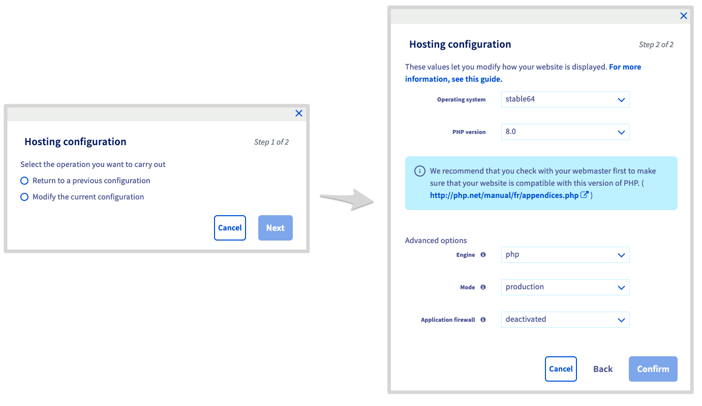

> [!primary]
> Diese Übersetzung wurde durch unseren Partner SYSTRAN automatisch erstellt. In manchen Fällen können ungenaue Formulierungen verwendet worden sein, z.B. bei der Beschriftung von Schaltflächen oder technischen Details. Bitte ziehen Sie im Zweifelsfall die englische oder französische Fassung der Anleitung zu Rate. Möchten Sie mithelfen, diese Übersetzung zu verbessern? Dann nutzen Sie dazu bitte den Button "Beitragen" auf dieser Seite.
>

## Ziel

Mit den [OVHcloud Webhosting](https://www.ovhcloud.com/de/web-hosting/){.external} Angeboten können Sie Ihre gewünschte Website hosten, solange diese mit der [Konfiguration unserer Shared Hosting Infrastrukturen](https://webhosting-infos.hosting.ovh.net){.external} kompatibel ist.
Auf unseren Shared Hosting Infrastrukturen können Sie jedoch die folgenden Einstellungen für Ihr Webhosting ändern:

- [Ausführungsumgebung](#runtime-evironment)
- [die PHP-Version](#php-versions)
- [PHP Runtime Engine](#php-runtime)
- [Application Firewall](#firewall)
- [Entwicklungsmodus](#runtime-mod)

Diese Konfigurationseinstellungen können auf zwei Arten geändert werden:

- über Ihr [OVHcloud Kundencenter](https://www.ovh.com/auth/?action=gotomanager&from=https://www.ovh.de/&ovhSubsidiary=de);
- über den FTP-Speicherplatz Ihres OVHcloud Webhostings mithilfe einer Datei mit dem Namen “.ovhconfig“.

> [!primary]
>
> Die “.ovhconfig“ Dateien sind Serverkonfigurationsdateien und werden von der Shared Hosting Infrastruktur automatisch als solche erkannt.
> Sie sind nativ und standardmäßig im „FTP-Wurzelverzeichnis“ des FTP-Speicherplatzes Ihres Webhostings vorhanden.
> Sie enthalten die Werte der oben beschriebenen Elemente.
>

Zusammenfassend lässt sich sagen, dass eine Änderung der Konfiguration Ihres Webhostings über das [OVHcloud Kundencenter](https://www.ovh.com/auth/?action=gotomanager&from=https://www.ovh.de/&ovhSubsidiary=de) oder eine Änderung der Werte in der Datei “.ovhconfig“ dieselbe Operation darstellt.

### Inhalt

- [1 - Beschreibung der auf den OVHcloud Webhostings verfügbaren Konfigurationseinstellungen](#all-parameters)
- [2 - Methode 1: Webhosting-Konfiguration über das OVHcloud Kundencenter ändern](#setting-ovh-manager)
- [3 - Methode 2: Webhosting-Konfiguration über die Datei “.ovhconfig“ ändern](#setting-ovhconfig)
- [4 - Fortgeschrittene Verwendung der “.ovhconfig“ Dateien](#ovhconfig-more)

**Diese Anleitung erklärt, wie Sie die Ausführungsumgebung, die PHP-Version, die Anwendungsfirewall, die Engine, den Modus und die Datei “.ovhconfig“ eines Webhostings ändern.**

<iframe width="560" height="315" src="https://www.youtube-nocookie.com/embed/X31MNMLw064" title="YouTube video player" frameborder="0" allow="accelerometer; autoplay; clipboard-write; encrypted-media; gyroscope; picture-in-picture; web-share" allowfullscreen></iframe>

## Voraussetzungen

- Sie verfügen über ein [OVHcloud Webhosting](https://www.ovhcloud.com/de/web-hosting/){.external}, mit Ausnahme eines [Cloud Web Hosting Angebots](https://www.ovhcloud.com/de/web-hosting/cloud-web-offer/).
- Sie haben über das [OVHcloud Kundencenter](https://www.ovh.com/auth/?action=gotomanager&from=https://www.ovh.de/&ovhSubsidiary=de) Zugriff auf Ihr Webhosting-Angebot oder können sich mit den Informationen für den [FTP-Speicherplatz](/pages/web_cloud/web_hosting/ftp_connection) verbinden.

## In der praktischen Anwendung

### 1 - Beschreibung der auf OVHcloud Webhostings verfügbaren Konfigurationseinstellungen <a name="all-parameters"></a>

Bevor Sie beginnen, finden Sie im Folgenden die technische Beschreibung jeder der aktualisierbaren Einstellungen auf den OVHcloud Webhostings.

> [!warning]
>
> Das Ändern von mindestens einem dieser Elemente kann sich auf die Anzeige oder das ordnungsgemäße Funktionieren Ihrer Website auswirken. **Stellen Sie im Vorfeld sicher, dass Ihre Website mit den Änderungen kompatibel ist, die Sie an der Konfiguration Ihres Webhostings vornehmen möchten**. Bei Zweifeln oder Schwierigkeiten wenden Sie sich an einen [spezialisierten Dienstleister](https://partner.ovhcloud.com/de/directory/).
>

#### 1.1 - Laufzeitumgebungen <a name="runtime-evironment"></a>

Ausführungsumgebungen enthalten eine Reihe von Programmiersprachen. Abhängig von der ausgewählten Laufzeitumgebung sind die Programmiersprachen in verschiedenen Versionen verfügbar. Der Zweck dieser Umgebungen besteht darin, Ihnen die Möglichkeit zu geben, die Dateien, aus denen sich Ihre Website zusammensetzt, korrekt auszuführen und Ihren technischen Anforderungen anzupassen.

Auf OVHcloud Webhostings bieten wir **3** Ausführungsumgebungen: *Legacy*, *Stable* und *Stable64*.
Nachfolgend finden Sie die Elemente, die in unseren verschiedenen Ausführungsumgebungen enthalten sind:

|Umgebung|Legacy|Stable|Stable64|
|---|---|---|---|
|Architektur|32 bits|32 bits|64 bits|
|Minimale PHP-Version|5.4|5.4|7.4|
|OpenSSL|1.0.1t|1.0.1t|1.1.1n|
|Python|2.7 und 3.4|2.7 und 3.7|2.7 und 3.7|
|Ruby|2.1|2.1|2.5|
|Rails|4.1|4.1|5.2|
|Perl|5.20|5.20|5.28|
|Git|2.1|2.1|2.20|

> [!primary]
>
> Die Umgebung *Legacy* kann für ältere Websites nützlich sein, die noch ältere PHP-Versionen verwenden. Wir empfehlen Ihnen jedoch dringend, die Umgebung *Stable64* zu verwenden, die von den neuesten Updates profitiert. **Stellen Sie jedoch sicher, dass Ihre Website kompatibel ist, bevor Sie Änderungen vornehmen.**
> 

#### 1.2 - Die PHP Versionen <a name="php-versions"></a>

PHP ist eine dynamische Programmiersprache, die zur Erstellung von Websites verwendet wird. Für Ihre Website kann es erforderlich sein, dass Sie abhängig von deren Alter, durchgeführten Updates oder bestimmten für das reibungslose Funktionieren der Website erforderlichen Variablen die verwendete PHP-Version ändern.

Es gibt mehrere Versionen der Programmiersprache PHP. Versionsänderungen bringen verschiedene Korrekturen sowie das Hinzufügen oder Beenden von Features. OVHcloud bietet die neuesten PHP-Hauptversionen an, deren Liste Sie [hier](https://www.ovhcloud.com/de/web-hosting/uc-programming-language/) einsehen können.

Einige PHP-Versionen funktionieren nur in bestimmten Ausführungsumgebungen. Nachfolgend finden Sie die auf den Shared Hosting Angeboten von OVHcloud und den kompatiblen [Ausführungsumgebungen](#runtime-evironment) verfügbaren PHP-Versionen:

|PHP-Versionen|Kompatible Ausführungsumgebungen|
|---|---|
|5.4, 5.5, 5.6 und 7.0|Legacy, Stable|
|7.1, 7.2 und 7.3|Stable|
|7.4, 8.0, 8.1 und 8.2|stable64|

> [!primary]
>
> Da manche Funktionen von neueren Versionen nicht mehr unterstützt werden, **stellen Sie vor jeder Änderung sicher, dass die neue PHP-Version mit Ihrer Website kompatibel ist.**
>

Auch wenn OVHcloud die Installation der neuesten PHP-Versionen auf seinen Servern verwaltet, obliegt es Ihnen, sicherzustellen, dass Ihre Website **immer auf dem neuesten Stand** ist und mit den neuesten PHP-Versionen kompatibel ist. Je nach Website, die Sie verwenden, gibt es zwei Möglichkeiten, dies zu überprüfen:

**Fall Nr. 1 - Sie verwenden ein Content Management System (CMS)** wie *WordPress*, *Joomla!*, *PrestaShop* oder *Drupal*: 

- Lesen Sie die offizielle Dokumentation des Herausgebers Ihres CMS.
- Notieren Sie sich die Informationen zu den technischen Voraussetzungen für den Betrieb Ihres CMS sowie die Vorgehensweise, um es zu aktualisieren.
- Falls nötig, aktualisieren Sie Ihr CMS und stellen Sie sicher, dass die neue Version mit dem OVHcloud Webhosting kompatibel ist.

**Fall Nr. 2 - Sie verwenden eine Website, die auf einer personalisierten Lösung basiert**: 

- Wenden Sie sich an den Webmaster, der die Website erstellt hat.
- Weitere Informationen zu Versionsmigrationen finden Sie in der [offiziellen PHP-Dokumentation](http://php.net/manual/en/appendices.php){.external}.
- Aktualisieren Sie bei Bedarf den Code Ihrer Website und stellen Sie sicher, dass diese weiterhin mit dem OVHcloud Webhosting kompatibel ist.

Falls nötig, gibt es zwei Möglichkeiten, die aktuell von Ihrem Webhosting verwendete PHP-Version zu ermitteln:

- **Über das OVHcloud Kundencenter**. Verbinden Sie sich mit dem [OVHcloud Kundencenter](https://www.ovh.com/auth/?action=gotomanager&from=https://www.ovh.de/&ovhSubsidiary=de){.external} und gehen Sie dann in den Bereich `Web Cloud`{.action}. Klicken Sie in der linken Spalte auf `Hosting-Pakete`{.action} und wählen Sie das betreffende Webhosting aus. Im Tab `Allgemeine Informationen`{.action} finden Sie die Version unter *Globale PHP-Version*. 

{.thumbnail}

> [!primary]
> Wenn ein blaues, rundes Symbol vorhanden ist, warten Sie einige Minuten, bis die Version aktualisiert wurde.
>

- **Über ein Skript**. Erstellen Sie ein **.php** Skript, das nur den folgenden Code enthält:

```php
<?php phpinfo(); ?>
```

Stellen Sie es anschließend auf Ihrem [FTP-Speicherplatz](/pages/web_cloud/web_hosting/ftp_connection) online, und rufen Sie es an, indem Sie auf seine vollständige Adresse/URL zugreifen.

> [!warning]
>
> Die Änderung der PHP-Version über eine “.htaccess“-Datei ist bei den neuesten [OVHcloud Webhosting] Angeboten nicht mehr möglich (https://www.ovhcloud.com/de/web-hosting/).<br>
> Mit dem Befehl zur Änderung der PHP-Version in der Datei “.htaccess“ können auch keine aktuellen PHP-Versionen auf unseren Infrastrukturen verwendet werden.
> Die Datei “.ovhconfig“ muss verwendet werden.
>

#### 1.3 - PHP-Runtime Engines <a name="php-runtime"></a>

PHP-Runtime Engines sind Programme, mit denen Aktionen auf dem Webserver auf eine bestimmte Weise ausgeführt werden können. In der Regel wird diese Einstellung geändert, um die Ausführungsgeschwindigkeit der von den Besuchern Ihrer Website generierten Abfragen zu beeinflussen.

Auf OVHcloud Webhostings bieten wir **2** PHP-Runtime Engines: *php* („PHP-FPM“) und *phpcgi*.

Durch die Wahl der *php* Engine können Sie den PHP-Beschleuniger („PHP-FPM“) aktivieren oder deaktivieren. Dieses wurde an unsere Infrastruktur angepasst, um die Ausführungsgeschwindigkeit der PHP Skripte zu beschleunigen. 

Die *phpcgi* Engine führt die Anfragen „seriell“ aus, im Gegensatz zur *php* („PHP-FPM“) Engine, die diese Anfragen „parallel“ ausführt.

Im Vergleich dazu bietet der PHP-Beschleuniger („PHP-FPM“) eine bis zu siebenmal höhere Leistung als die *phpcgi* Engine. 

#### 1.4 - Die Application Firewall <a name="firewall"></a>

Eine Firewall ist eine Sicherheit, die eingehende Anfragen Ihres Webhostings filtert. Bei unseren Webhostings funktioniert diese Konfigurationseinstellung als **aktivierbar** oder **deaktivierbar**.
Die Firewall-Filtereinstellungen können nicht geändert werden.

Weitere Informationen zu diesem Thema finden Sie in unserer Anleitung „[Application Firewall aktivieren](/pages/web_cloud/web_hosting/multisites_activating_application_firewall)“.

> [!warning]
>
> Wenn Sie Zahlungsmodule verwenden, kann die Aktivierung der Firewall gelegentlich zu Störungen bei der Kommunikation zwischen dem Zahlungsmodul und den Banken führen. Deaktivieren Sie in diesem Fall die Option.
>

#### 1.5 - Die Ausführungsmodi <a name="runtime-mod"></a>

Mithilfe von Ausführungsmodi können Sie das Cacheverhalten statischer Dateien (z. B. Bilder) Ihrer Website sowie die PHP-Fehlerbehandlung (z. B. nützlich, wenn Ihre Website eine leere Seite anzeigt) steuern. 

Sie können **2** Modi aktivieren: *Produktion* und *Entwicklung*.

|Modus|Statischer Dateicache|PHP-Fehlerbehandlung|
|---|---|---|
|*Production*|Maximiert das Zwischenspeichern statischer Dateien in Internetbrowsern.|PHP-Fehler werden auf Ihrer Website nicht angezeigt.|
|*Development*|Kein Cache angewendet.|PHP-Fehler werden auf Ihrer Website angezeigt.|

> [!primary]
>
> Bei PHP-Versionen 7.1 und höher werden die Fehler auf der Website angezeigt, unabhängig vom verwendeten Modus. 
> 

Nun, da Sie die verschiedenen bearbeitbaren Einstellungen für Ihr OVHcloud Webhosting kennen, erfahren Sie, wie Sie diese Einstellungen ändern können.

### 2 - Methode 1: Webhosting-Konfiguration über das OVHcloud Kundencenter ändern <a name="setting-ovh-manager"></a>

> [!warning]
>
> Es sei daran erinnert, dass Änderungen an mindestens einem dieser Elemente Auswirkungen auf die Darstellung oder das ordnungsgemäße Funktionieren Ihrer Website haben können. **Stellen Sie im Vorfeld sicher, dass Ihre Website mit den Änderungen kompatibel ist, die Sie an der Konfiguration Ihres Webhostings vornehmen möchten.** Wenden Sie sich im Zweifelsfall oder bei Schwierigkeiten an einen [spezialisierten Anbieter](https://partner.ovhcloud.com/de/directory/).
>

#### 2.1 - Zugang zur Verwaltung der Webhosting-Konfiguration

Verbinden Sie sich mit Ihrem [OVHcloud Kundencenter](https://www.ovh.com/auth/?action=gotomanager&from=https://www.ovh.de/&ovhSubsidiary=de){.external} und gehen Sie dann in den Bereich `Web Cloud`{.action}. Klicken Sie in der linken Spalte auf `Hosting-Pakete`{.action} und wählen Sie das betreffende Webhosting aus. Stellen Sie sicher, dass Sie sich im Tab befinden
`Allgemeine Informationen`{.action}. Rechts neben `Globale PHP-Version`{.action} in der Mitte der Seite klicken Sie auf `...`{.action} und dann auf `Konfiguration ändern`{.action}.

{.thumbnail}

> [!PRIMARY]
>
> Wenn die Schaltfläche `Konfiguration ändern`{.action} abgeblendet ist, wird möglicherweise eine Überprüfung der **PHP-Version** durchgeführt. Ist das der Fall, erscheint neben der Version ein blaues, rundes Symbol, das anzeigt, dass eine Überprüfung durchgeführt wird. Warten Sie einige Minuten, bis der Button `Konfiguration ändern`{.action} wieder verfügbar ist.
>
> Wenn die Option `Globale PHP-Version`{.action} in Ihrem [OVHcloud Kundencenter](https://www.ovh.com/auth/?action=gotomanager&from=https://www.ovh.de/&ovhSubsidiary=de) nicht angezeigt wird, überprüfen Sie, ob die *.ovhconfig*-Datei im FTP-Wurzelverzeichnis Ihres OVHcloud Shared Hostings vorhanden ist.
>
> Alle Informationen zur Datei *.ovhconfig* finden Sie im dritten Teil „[Methode 2: Webhosting-Konfiguration über die Datei “.ovhconfig“](#setting-ovhconfig)“ dieser Anleitung.
>

#### 2.2 - Webhosting-Konfiguration ändern

Im angezeigten Fenster haben Sie zwei Möglichkeiten. Wählen Sie die Aktion aus, die Sie durchführen möchten, und klicken Sie auf `Weiter`{.action}.

|Auswahl|Detail|
|---|---|
|`Zurück zur vorherigen Konfiguration`|Wählen Sie nach Auswahl dieser Option die wiederherzustellende Konfiguration neben `Historische Auswahl` aus. Diese Option steht möglicherweise nicht zur Verfügung, wenn Sie in der Vergangenheit keine Änderungen vorgenommen haben.|
|`Aktuelle Konfiguration ändern`|Wählen Sie nach Auswahl dieser Option die gewünschten Konfigurationsänderungen aus den angebotenen Feldern aus. Bei Bedarf kehren Sie zum ersten Teil „[Beschreibung der auf den OVHcloud Webhostings verfügbaren Konfigurationseinstellungen](#all-parameters)“ dieser Anleitung zurück.|

> [!primary]
>
> Durch das Ändern der Ausführungsumgebung Ihres Webhostings werden die PHP-Sessions automatisch zurückgesetzt.
> 

Wenn Sie bereit sind, klicken Sie auf `Bestätigen`{.action}, um die Änderung zu übernehmen. Warten Sie einen Moment, bis die Operation abgeschlossen ist.

{.thumbnail}

### 3 - Methode 2: Webhosting-Konfiguration in der Datei “.ovhconfig“ <a name="setting-ovhconfig"></a> ändern

#### 3.1 - Verbindung mit dem FTP-Speicherplatz Ihres Webhostings

Halten Sie Ihre Haupt-FTP-ID, das zugehörige Passwort sowie die Adresse des FTP-Servers bereit.
Loggen Sie sich hierzu in Ihrem [OVHcloud Kundencenter](https://www.ovh.com/auth/?action=gotomanager&from=https://www.ovh.de/&ovhSubsidiary=de){.external} ein und gehen Sie dann in den Bereich `Web Cloud`{.action}. Klicken Sie in der linken Spalte auf `Hosting-Pakete`{.action} und wählen Sie das betreffende Hosting aus. Gehen Sie dann auf den Tab `FTP - SSH`{.action}. Dort finden Sie die notwendigen Informationen, um sich einzuloggen. 

Bezüglich des Passworts des FTP-Benutzers folgen Sie den Anweisungen in unserer Dokumentation [„Passwort eines FTP-Benutzers ändern“](/pages/web_cloud/web_hosting/ftp_change_password).

{.thumbnail}

#### 3.2 - Datei “.ovhconfig“ abrufen oder erstellen

Wenn Sie sich in Ihrem [FTP-Speicherplatz](/pages/web_cloud/web_hosting/ftp_connection) eingeloggt haben, sehen Sie alle Dateien, die derzeit auf diesem gespeichert sind. Bleiben Sie auf dem Wurzelverzeichnis Ihres Hostings (das mit „/“ angegeben werden kann). Dort finden Sie die Datei “.ovhconfig“.

{.thumbnail}

Es gibt daher zwei Möglichkeiten:

- **Die Datei “.ovhconfig“ ist vorhanden**: Laden Sie sie auf Ihre eigene Maschine / Ihr eigenes Gerät herunter. Erstellen Sie eine Kopie, bevor Sie Änderungen vornehmen. Bei Bedarf können Sie die Originaldatei wiederherstellen.
- **Die Datei “.ovhconfig“ ist nicht vorhanden** : Erstellen Sie sie auf Ihrem eigenen Computer / Gerät und nennen Sie sie “.ovhconfig“.

#### 3.3 - Den Inhalt der Datei “.ovhconfig“ <a name="update-ovhconfig"></a> ändern

Wenn Sie die Datei “.ovhconfig“ haben, bearbeiten Sie sie. Verwenden Sie hierzu ein Programm wie einen Texteditor. Ihre “.ovhconfig“-Datei muss einen Code enthalten, der folgendem ähnelt:

```php
app.engine=php
app.engine.version=8.0

http.firewall=none
environment=production

container.image=stable64
```

> [!success]
>
> Wenn Sie gerade die Datei “.ovhconfig“ erstellt haben, kopieren Sie den oben stehenden Code in Ihre Datei und lesen Sie diese Anleitung weiter.
>

Passen Sie die Werte der Variablen entsprechend der Konfiguration an, die Sie mit Ihrem Webhosting verwenden möchten.

|Variablen|Detail|
|---|---|
|app.engine|Ermöglicht das Ändern der [PHP-Engine](#php-runtime), die vom Hosting verwendet wird. Geben Sie **php** ein, um den PHP-FPM Booster zu aktivieren, und **phpcgi**, um ihn zu deaktivieren.|
Mit |app.engine.version|können Sie die vom Hosting verwendete [PHP-Version](#php-versions) unter [den von OVHcloud angebotenen Versionen](https://www.ovhcloud.com/de/web-hosting/uc-programming-language/){.external} definieren. Geben Sie die gewünschte Version ein (die der ausgewählten Laufzeitumgebung entspricht).|
|http.firewall|Hier können Sie die [mit den OVHcloud Webhostings gelieferte Firewall](https://www.ovhcloud.com/de/web-hosting/options/){.external} aktivieren oder deaktivieren. Geben Sie **security** ein, um es zu aktivieren, oder **none**, um es zu deaktivieren.|
|environment|Ermöglicht die Verwaltung des Cacheverhaltens der statischen Dateien Ihrer Website sowie der PHP-Fehlerbehandlung. Dies entspricht dem [Ausführungsmodus](#runtime-mod). Geben Sie **production** ein, um das Caching zu maximieren und PHP-Fehler zu verbergen. **development**, damit kein Cache angewendet wird und PHP-Fehler angezeigt werden.|
|container.image|Ermöglicht das Ändern der [Ausführungsumgebung](#runtime-evironment), die vom Hosting verwendet wird. Geben Sie die gewünschte Ausführungsumgebung ein (**legacy**,**stable** oder **stable64**). Wenn Sie die Laufzeitumgebung **stable64** wählen, überprüfen Sie, ob Ihre Website mit der 64-Bit-Architektur kompatibel ist.|

Bei Bedarf kehren Sie zum ersten Teil „[Beschreibung der auf den OVHcloud Webhostings verfügbaren Konfigurationseinstellungen](#all-parameters)“ dieser Anleitung zurück.

Wenn nötig finden Sie unten die detaillierte technische Beschreibung der Datei “.ovhconfig“:

```php
; ovhconfig
;
; this file must be placed in $HOME/.ovhconfig or in $DOCUMENT_ROOT/.ovhconfig

; __app.engine__
;
; values: php (php engine + opcache accelerator)
; notice: if php, a phpcgi engine will be activated as fallback (if previous engine crash)
;
;   php:
;       IMPORTANT: register_globals and magic_quotes_gpc are off for security
;       php optiones .htaccess (like php version) are ignored
;   phpcgi:
;       IMPORTANT this is a fallback to previous system
;       in this case __app.engine.version__ will be considerated as AUTO and php version will be old system
;       (meaning depending .htaccess or .phpX extension)
;
app.engine=php

; __app.engine.version__ specify version of your engine
;
; for php:
;   default: 8.0
; for phpcgi:
;   this options is ignored (= fallback in AUTO)
;
app.engine.version=8.0

; __http.firewall__ used to add application firewall  (filter http requests)
;
; values: none | security
; default: none
;
http.firewall=none

; __environment__
;
; values: production | development
;
;   production:
;       apache will maximise local cache
;       mod_expires will grow up TTL of js, css, pdf, images, video, audio
;       you can override it changing expiration explicitly in your .htaccess
;       feel free to look on our guide.
;   development:
;       no expiration is added, files are not locally in cache,
;       will speed up tests but decrease performances
;
; choosen environment will also be available in your variable ENVIRONMENT unix env
;
; default: production
;
environment=production

; __container.image__
;
; values: legacy | stable | stable64
;
container.image=stable64
```

#### 3.4 - Datei “.ovhconfig“ auf den Speicherplatz herunterladen

Nachdem Sie die Datei “.ovhconfig“ bearbeitet haben, laden Sie sie auf Ihren [FTP-Speicherplatz](/pages/web_cloud/web_hosting/ftp_connection) hoch. Verbinden Sie sich hierzu erneut mit Ihrem [FTP-Speicherplatz](/pages/web_cloud/web_hosting/ftp_connection) und gehen Sie in das Wurzelverzeichnis Ihres [FTP-Speicherplatzes](/pages/web_cloud/web_hosting/ftp_connection) (das mit einem „/“ gekennzeichnet werden kann). Laden Sie die soeben bearbeitete Datei “.ovhconfig“ in Ihren [FTP-Speicherplatz](/pages/web_cloud/web_hosting/ftp_connection) hoch. Wenn die Datei bereits vorhanden ist, ersetzen Sie sie.

### 4 - Fortgeschrittene Verwendung der “.ovhconfig“ Dateien <a name="ovhconfig-more"></a>

Wenn Sie Ihr Webhosting für das Hosting mehrerer Websites verwenden (z. B. *Multisites*), kann es mehrere Gründe geben, warum Sie für einige Ihrer *Multisites* eine andere PHP-Version verwenden möchten.

Erstellen Sie eine “.ovhconfig“ Datei, die die gewünschte PHP-Version für die betreffenden *Multisites* enthält. Befolgen Sie die Schritte im Abschnitt „[3.3 - Inhalt der Datei “.ovhconfig“](#update-ovhconfig)“ in dieser Anleitung, falls erforderlich. Wenn Sie die Datei “.ovhconfig“ auf Ihren [FTP-Speicherplatz](/pages/web_cloud/web_hosting/ftp_connection) hochladen, tun Sie dies im Wurzelverzeichnis, in dem sich die Dateien befinden, aus denen die betreffende „*multisites*„-Website besteht. Das Wurzelverzeichnis Ihrer *Multisites* finden Sie in Ihrem [OVHcloud Kundencenter](https://www.ovh.com/auth/?action=gotomanager&from=https://www.ovh.de/&ovhSubsidiary=de) auf dem betreffenden Hosting im Tab `Multisite`{.action}.

Lesen Sie bei Bedarf unsere Anleitung „[Eine Multisite auf Ihrem Webhosting konfigurieren](/pages/web_cloud/web_hosting/multisites_configure_multisite)“.

> [!warning]
>
> **Es ist nicht möglich, eine zweite [Ausführungsumgebung](#runtime-evironment), eine zweite [Entwicklungsmodus](#runtime-mod) und/oder eine zweite [PHP-Engine](#php-runtime)** auf demselben Webhosting anzugeben. Es werden nur diejenigen berücksichtigt, die in der Datei “.ovhconfig“ im Wurzelverzeichnis Ihres [FTP-Speicherplatzes](/pages/web_cloud/web_hosting/ftp_connection) angegeben sind.
>

{.thumbnail}

## Weiterführende Informationen

[Mit dem Speicherplatz Ihres Webhostings verbinden](/pages/web_cloud/web_hosting/ftp_connection)

Kontaktieren Sie für spezialisierte Dienstleistungen (SEO, Web-Entwicklung etc.) die [OVHcloud Partner](https://partner.ovhcloud.com/de/directory/).

Wenn Sie Hilfe bei der Nutzung und Konfiguration Ihrer OVHcloud Lösungen benötigen, beachten Sie unsere [Support-Angebote](https://www.ovhcloud.com/de/support-levels/).

Für den Austausch mit unserer User Community gehen Sie auf <https://community.ovh.com/en/>.