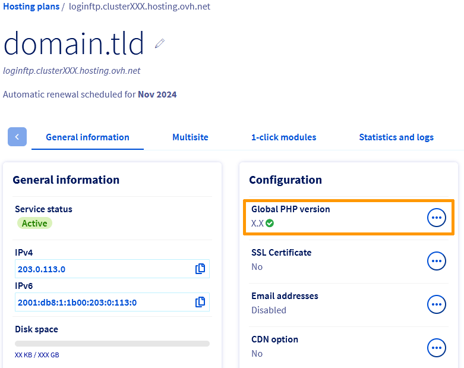

> [!primary]
> Tłumaczenie zostało wygenerowane automatycznie przez system naszego partnera SYSTRAN. W niektórych przypadkach mogą wystąpić nieprecyzyjne sformułowania, na przykład w tłumaczeniu nazw przycisków lub szczegółów technicznych. W przypadku jakichkolwiek wątpliwości zalecamy zapoznanie się z angielską/francuską wersją przewodnika. Jeśli chcesz przyczynić się do ulepszenia tłumaczenia, kliknij przycisk "Zgłóś propozycję modyfikacji" na tej stronie.
>

## Wprowadzenie

Oferty hostingu [OVHcloud](https://www.ovhcloud.com/pl/web-hosting/){.external} umożliwiają hostowanie wybranej strony WWW, o ile jest ona kompatybilna z [konfiguracją infrastruktury współdzielonej](https://webhosting-infos.hosting.ovh.net){.external}.
Na serwerach współdzielonych możesz zmienić następujące parametry hostingu:

- [środowisko uruchomieniowe](#runtime-environment)
- [wersja PHP](#php-versions)
- [Silnik PHP](#php-runtime)
- [Firewall aplikacyjny](#firewall)
- [tryb wykonania](#runtime-mod)

Te ustawienia konfiguracji można zmienić na dwa sposoby:

- z poziomu [Panelu klienta OVHcloud](https://www.ovh.com/auth/?action=gotomanager&from=https://www.ovh.pl/&ovhSubsidiary=pl);
- z przestrzeni dyskowej FTP Twojego hostingu WWW OVHcloud za pomocą pliku o nazwie ".ovhconfig".

> [!primary]
>
> Pliki ".ovhconfig" są plikami konfiguracyjnymi serwera i zostają automatycznie rozpoznane przez infrastrukturę hostingu.
> Są one dostępne domyślnie w "katalogu głównym FTP" przestrzeni dyskowej FTP na Twoim hostingu.
> Zawierają one wartości wyżej wymienionych elementów.
>

Zmiana konfiguracji hostingu w [Panelu klienta OVHcloud](https://www.ovh.com/auth/?action=gotomanager&from=https://www.ovh.pl/&ovhSubsidiary=pl) lub zmiana wartości w pliku ".ovhconfig" jest tym samym zadaniem.

### Podsumowanie

- [1 - Opis parametrów konfiguracji dostępnych na hostingu OVHcloud](#all-parameters)
- [2 - Metoda 1: Zmiana konfiguracji hostingu w Panelu klienta OVHcloud](#setting-ovh-manager)
- [3 - Metoda 2: Zmiana konfiguracji hostingu WWW z poziomu pliku ".ovhconfig"](#setting-ovhconfig)
- [4 - Zaawansowane korzystanie z plików ".ovhconfig"](#ovhconfig-more)

**Dowiedz się, jak zmienić środowisko uruchomieniowe, wersję PHP, zaporę aplikacyjną, silnik, tryb i plik ".ovhconfig" hostingu.**

<iframe width="560" height="315" src="https://www.youtube-nocookie.com/embed/X31MNMLw064" title="YouTube video player" frameborder="0" allow="accelerometer; autoplay; clipboard-write; encrypted-media; gyroscope; picture-in-picture; web-share" allowfullscreen></iframe>

## Wymagania początkowe

- Posiadanie [hostingu OVHcloud](https://www.ovhcloud.com/pl/web-hosting/){.external}, z wyjątkiem [hostingu Cloud Web](https://www.ovhcloud.com/pl/web-hosting/cloud-web-offer/).
- Dostęp do hostingu z poziomu [Panelu klienta OVHcloud](https://www.ovh.com/auth/?action=gotomanager&from=https://www.ovh.pl/&ovhSubsidiary=pl) lub informacje potrzebne do zalogowania się do [przestrzeni dyskowej FTP](/pages/web_cloud/web_hosting/ftp_connection).

## W praktyce

### 1 - Opis parametrów konfiguracyjnych dostępnych na hostingu OVHcloud <a name="all-parameters"></a>

Zanim rozpoczniesz pracę z hostingiem OVHcloud, zapoznaj się z opisem technicznym każdego z parametrów, które można zmienić.

> [!warning]
>
> Modyfikacja co najmniej jednego z tych elementów może mieć wpływ na wyświetlanie lub prawidłowe działanie witryny. **Upewnij się wcześniej, że Twoja strona WWW jest kompatybilna ze zmianami, które chcesz wprowadzić w konfiguracji Twojego hostingu**. W razie wątpliwości lub trudności skontaktuj się z [wyspecjalizowanym dostawcą](https://partner.ovhcloud.com/pl/directory/).
>

#### 1.1 - Środowiska uruchomieniowe <a name="runtime-environment"></a>

Środowiska wykonawcze zawierają zestaw języków programowania. W zależności od wybranego środowiska wykonawczego, języki są dostępne w mniej lub bardziej zaawansowanych wersjach. Celem tych środowisk jest umożliwienie Ci poprawnego uruchamiania plików, z których składa się Twoja strona WWW, zgodnie z Twoimi potrzebami technicznymi.

W przypadku hostingu OVHcloud proponujemy **3** środowiska uruchomieniowe: *Legacy*, *Stable* i *Stable64*.
Poniżej znajdziesz elementy zawarte w naszych różnych środowiskach wykonawczych:

|Środowisko|Legacy|Stable|Stable64|
|---|---|---|---| 
|Architektura|32 bity|32 bity|64 bity|
|Minimalna wersja PHP|5.4|5.4|7.4|
|OpenSSL|1.0.1t|1.0.1t|1.1.1n|
|Python|2.7 i 3.4|2.7 i 3.7|2.7 i 3.7|
|Ruby|2.1|2.1|2.5|
|Rails|4.1|4.1|5.2|
|Perl|5.20|5.20|5.28|
|Git|2.1|2.1|2.20|

> [!primary]
>
> Środowisko *Legacy* może być użyteczne w przypadku starszych stron WWW korzystających z poprzednich wersji PHP. Zalecamy korzystanie ze środowiska *Stable64*, które zawiera najnowsze aktualizacje. **Przed wprowadzeniem jakichkolwiek zmian upewnij się jednak, że Twoja strona WWW jest z nimi kompatybilna.**
> 

#### 1.2 - Wersje PHP <a name="php-versions"></a>

PHP jest dynamicznym językiem programowania używanym do tworzenia stron WWW. W zależności od wieku Twojej strony WWW, wykonywanych aktualizacji oraz niektórych zmiennych niezbędnych do prawidłowego działania Twojej strony, możesz być zmuszony do zmiany wersji PHP, której używa.

Istnieje kilka wersji języka programowania PHP. Zmiany wersji zawierają różne poprawki, a także dodawanie lub wyłączanie funkcji. OVHcloud udostępnia najnowsze główne wersje PHP, których listę [tutaj](https://www.ovhcloud.com/pl/web-hosting/uc-programming-language/).

Niektóre wersje PHP działają tylko z niektórymi środowiskami wykonawczymi. Poniżej znajdziesz wersje PHP dostępne na hostingu www OVHcloud i kompatybilne [środowiska uruchomieniowe](#runtime-environment):

|Wersje PHP|Zgodne środowiska wykonawcze|
|---|---| 
|5.4, 5.5, 5.6 i 7.0|Legacy, Stable|
|7.1, 7.2 i 7.3|Stable|
|7.4, 8.0, 8.1 i 8.2|stable64|

> [!primary]
>
> W związku z faktem, że niektóre funkcjonalności mogą zniknąć w kolejnych wersjach, **przed wprowadzeniem jakichkolwiek zmian upewnij się, że nowa, wybrana wersja PHP jest kompatybilna ze stroną WWW.**
>

OVHcloud zapewnia instalację najnowszych wersji PHP na swoich serwerach, jednak upewnij się, że Twoja strona WWW jest **zawsze aktualna** i kompatybilna z najnowszymi wersjami PHP. W zależności od rodzaju Twojej strony WWW, istnieją dwie metody weryfikacji jej kompatybilności:

**Przypadek nr 1 - używasz Content Management System (CMS)** takiego jak *WordPress*, *Joomla!*, *PrestaShop* lub *Drupal*: 

- Zapoznaj się z oficjalną dokumentacją stworzoną przez producenta używanego przez Ciebie CMS.
- Zapamiętaj informacje dotyczące wymagań technicznych niezbędnych do prawidłowego działania Twojego CMS oraz instrukcję przeprowadzenia jego aktualizacji.
- W razie potrzeby zaktualizuj CMS, upewniając się, że nowa wersja jest kompatybilna z hostingiem WWW OVHcloud.

**Przypadek nr 2 - korzystasz ze strony zbudowanej w oparciu o spersonalizowane rozwiązanie**: 

- Skontaktuj się z webmasterem, który zbudował stronę.
- Skorzystaj z [oficjalnej dokumentacji PHP](http://php.net/manual/en/appendices.php){.external} zawierającej więcej informacji na temat migracji wersji.
- Jeśli to konieczne, zaktualizuj kod Twojej strony WWW i upewnij się, czy jest kompatybilny z hostingiem OVHcloud.

W razie potrzeby sprawdź wersję PHP aktualnie używaną przez Twój hosting na dwa sposoby:

- **W Panelu klienta OVHcloud**. Zaloguj się do [Panelu klienta OVHcloud](https://www.ovh.com/auth/?action=gotomanager&from=https://www.ovh.pl/&ovhSubsidiary=pl){.external} i przejdź do sekcji `Web Cloud`{.action}. W lewej kolumnie kliknij `Hosting`{.action}, następnie wybierz odpowiedni hosting. W zakładce `Informacje ogólne`{.action} znajdź wersję poniżej *Ogólna wersja PHP*. 

{.thumbnail}

> [!primary]
> Jeśli pojawiło się niebieskie kółko aktualizacji, odczekaj kilka minut, aż aktualizacja wersji się zakończy.
>

- **Za pośrednictwem skryptu**. Utwórz skrypt **.php** zawierający tylko następujący kod:

```php
<?php phpinfo(); ?>
```

Następnie umieść go online na Twojej [przestrzeni dyskowej FTP](/pages/web_cloud/web_hosting/ftp_connection), po czym zadzwoń pod jej kompletny adres/URL.

> [!warning]
>
> Modyfikacja wersji PHP za pomocą pliku ".htaccess" nie jest już możliwa w najnowszych ofertach hostingu [OVHcloud](https://www.ovhcloud.com/pl/web-hosting/).<br>
> Polecenie umożliwiające zmianę wersji PHP w pliku ".htaccess" również nie pozwala używać najnowszych wersji PHP w naszej infrastrukturze.
> Musisz obowiązkowo użyć pliku ".ovhconfig".
>

#### 1.3 - Frameworki PHP <a name="php-runtime"></a>

Frameworki PHP to programy służące do wykonywania operacji na serwerze WWW przy użyciu określonej metody. Zazwyczaj parametr ten jest modyfikowany, aby wpływać na szybkość wykonywania zapytań generowanych przez użytkowników Twojej strony WWW.

W przypadku hostingu OVHcloud proponujemy **2** frameworki PHP: *php* ("PHP-FPM") i *phpcgi*.

Wybór silnika *php* pozwala aktywować lub dezaktywować akcelerator PHP ("PHP-FPM"). Akcelerator został dostosowany do infrastruktury OVH w celu zwiększenia prędkości wykonywania skryptów PHP. 

Dzieje się tak, ponieważ silnik *phpcgi* wykonuje zapytania "szeregowo", w przeciwieństwie do silnika *php* ("PHP-FPM"), który wykonuje je "równolegle".

Dla porównania, akcelerator PHP ("PHP-FPM") oferuje nawet siedmiokrotny wzrost wydajności w porównaniu do silnika *phpcgi*.

#### 1.4 - Zapora aplikacyjna <a name="firewall"></a>

Firewall to zabezpieczenie, które filtruje zapytania wchodzące z Twojego hostingu. To ustawienie konfiguracji w hostingu OVH działa w formie opcji **możliwy do aktywacji** lub **nieaktywny**.
Nie będzie można zmienić ustawień filtrowania zapory.

Więcej szczegółów na ten temat można znaleźć w przewodniku "[Aktywacja zapory aplikacyjnej](/pages/web_cloud/web_hosting/multisites_activating_application_firewall)".

> [!warning]
>
> Jeśli korzystasz z modułów płatności, włączanie zapory aplikacyjnej może czasami powodować zakłócenia w komunikacji między modułem płatności a bankami. W takim przypadku wyłącz tę opcję.
>

#### 1.5 - Tryby wykonywania <a name="runtime-mod"></a>

Tryby wykonywania umożliwiają zarządzanie pamięcią podręczną plików statycznych Twojej strony WWW (np. obrazów), jak również przetwarzanie błędów PHP (przydatne, gdy strona WWW wyświetla na przykład pustą stronę). 

Dostępne są **2** tryby, które możesz aktywować: *Production* i *Development*.

|Tryb|Pamięć podręczna plików statycznych|Przetwarzanie błędów PHP|
|---|---|---| 
|*Production*|Zwiększa do maksimum zapisywanie plików statycznych w pamięci podręcznej przeglądarek internetowych.|Błędy PHP nie są wyświetlane na Twojej stronie WWW.|
|*Development*|Pamięć podręczna nie jest używana.|Błędy PHP są wyświetlane na Twojej stronie WWW.|

> [!primary]
>
> W przypadku wersji 7.1 PHP i wyższych błędy wyświetlają się na stronie WWW, niezależnie od użytego trybu. 
> 

Teraz już znasz różne modyfikowalne ustawienia Twojego hostingu WWW OVHcloud, poznaj obydwie metody modyfikacji tych ustawień.

### 2 - Metoda 1: modyfikacja konfiguracji hostingu w Panelu klienta OVHcloud <a name="setting-ovh-manager"></a>

> [!warning]
>
> Przypominamy, że zmiana co najmniej jednego z tych elementów może mieć wpływ na wyświetlanie lub prawidłowe działanie Twojej strony WWW. **Upewnij się wcześniej, czy Twoja strona WWW jest zgodna ze zmianami, które chcesz wprowadzić w konfiguracji Twojego hostingu.** W przypadku wątpliwości lub trudności skontaktuj się z [wyspecjalizowanym dostawcą](https://partner.ovhcloud.com/pl/directory/).
>

#### 2.1 - Dostęp do interfejsu zarządzania konfiguracją hostingu WWW

Zaloguj się do [Panelu klienta OVHcloud](https://www.ovh.com/auth/?action=gotomanager&from=https://www.ovh.pl/&ovhSubsidiary=pl){.external} i przejdź do sekcji `Web Cloud`{.action}. W lewej kolumnie kliknij `Hosting`{.action}, następnie wybierz odpowiedni hosting. Następnie przejdź do zakładki `Informacje ogólne`{.action}. Z prawej strony wzmianki `Ogólna wersja PHP`{.action} znajdującej się prawie na środku strony, kliknij przycisk `...`{.action}, a następnie `Zmień konfigurację`{.action}.

{.thumbnail}

> [!primary]
>
> Jeśli przycisk `Zmień konfigurację`{.action} jest wyszarzony, możliwe jest, że trwa weryfikacja **globalnej wersji PHP**. W takim przypadku obok wersji wyświetli się okrągły niebieski symbol oznaczający, że weryfikacja jest w toku. Odczekaj kilka minut, aby przycisk `Zmień konfigurację`{.action} stał się znowu dostępny.
>
> Jeśli opcja `Globalna wersja PHP`{.action} nie wyświetla się w Twoim [Panelu klienta OVHcloud](https://www.ovh.com/auth/?action=gotomanager&from=https://www.ovh.pl/&ovhSubsidiary=pl), sprawdź, czy plik *.ovhconfig* znajduje się w katalogu głównym FTP Twojego hostingu OVHcloud.
>
> Wszystkie informacje dotyczące pliku *.ovhconfig* znajdziesz w trzeciej części "[Metoda 2: Modyfikacja konfiguracji hostingu WWW z poziomu pliku ".ovhconfig"](#setting-ovhconfig)" niniejszego przewodnika.
>

#### 2.2 - Zmień konfigurację hostingu

W oknie, które się pojawi, masz do wyboru dwie opcje. Wybierz opcję odpowiadającą operacji, którą chcesz przeprowadzić, następnie kliknij `Dalej`{.action}.

|Wybór|Szczegóły|
|---|---| 
|`Przywróć poprzednią konfigurację`|Po zaznaczeniu tej opcji wybierz konfigurację, którą chcesz przywrócić obok przycisku Wybór poprzedniej konfiguracji`. Opcja ta może być niedostępna, jeśli nie przeprowadzałeś zmian konfiguracji w przeszłości.|
|`Zmień bieżącą konfigurację`|Po zaznaczeniu tej opcji wybierz spośród poszczególnych pól modyfikacje do wprowadzenia w danej konfiguracji. W razie potrzeby wróć do pierwszej części niniejszego przewodnika "[Opis ustawień konfiguracji dostępnych na hostingu WWW OVHcloud](#all-parameters)".|

> [!primary]
>
> Zmiana środowiska uruchomieniowego hostingu automatycznie resetuje sesje PHP.
> 

Kiedy wszystko jest gotowe, kliknij `Zatwierdź`{.action}, aby zastosować modyfikację. Odczekaj kilka chwil, aż zmiany staną się widoczne.

{.thumbnail}

### 3 - Metoda 2: zmiana konfiguracji hostingu WWW z poziomu pliku ".ovhconfig" <a name="setting-ovhconfig"></a>

#### 3.1 - Logowanie do przestrzeni dyskowej FTP Twojego hostingu

Przygotuj główny identyfikator FTP, hasło oraz adres serwera FTP.
W tym celu zaloguj się do [Panelu klienta OVHcloud](https://www.ovh.com/auth/?action=gotomanager&from=https://www.ovh.pl/&ovhSubsidiary=pl){.external} i przejdź do sekcji `Web Cloud`{.action}. W lewej kolumnie kliknij `Hosting`{.action}, a następnie wybierz odpowiedni hosting. Teraz przejdź do zakładki `FTP - SSH`{.action}. Znajdziesz tam informacje potrzebne do zalogowania się. 

Jeśli chodzi o hasło użytkownika FTP, zapoznaj się z instrukcjami zawartymi w przewodniku OVH ["Zmiana hasła do konta FTP"](/pages/web_cloud/web_hosting/ftp_change_password).

{.thumbnail}

#### 3.2 - Odzyskaj lub utwórz plik ".ovhconfig"

Po zalogowaniu się do [przestrzeni dyskowej FTP](/pages/web_cloud/web_hosting/ftp_connection) możesz wyświetlić wszystkie aktualnie hostowane na niej pliki. Pozostań w katalogu głównym Twojego hostingu (oznaczonym "/"). Powinieneś w nim odnaleźć plik ".ovhconfig".

{.thumbnail}

Istnieją dwie możliwości:

- **plik ".ovhconfig" znajduje się w katalogu** : pobierz go na swoje urządzenie/komputer. Wykonaj kopię przed edycją. Kopia ta pozwoli Ci przywrócić oryginalny plik, jeśli będzie to konieczne.
- **plik ".ovhconfig" nie istnieje** : utwórz go na Twoim komputerze / urządzeniu i nazwij go ".ovhconfig".

#### 3.3 - Zmień zawartość pliku ".ovhconfig" <a name="update-ovhconfig"></a>

Kiedy masz już plik ".ovhconfig", edytuj go. W tym celu użyj programu typu edytor tekstu. Twój plik ".ovhconfig" musi zawierać kod podobny do tego kodu:

```php
app.engine=php
app.engine.version=8.0

http.firewall=none
environment=production

container.image=stable64
```

> [!success]
>
> Jeśli właśnie utworzyłeś plik ".ovhconfig", skopiuj powyższy kod do pliku i kontynuuj lekturę tego przewodnika.
>

Wpisz wartości zmiennych odpowiadające konfiguracji, którą chcesz zastosować na Twoim hostingu.

|Zmienne|Szczegóły|
|---|---| 
|app.engine|Pozwala zmodyfikować [silnik PHP](#php-runtime) używany przez hosting. Wpisz **php**, aby włączyć akcelerator PHP-FPM i **phpcgi**, aby go wyłączyć.|
|app.engine.version|Pozwala zdefiniować [wersja PHP](#php-versions) używana przez hosting spośród [wersji proponowanych przez OVHcloud](https://www.ovhcloud.com/pl/web-hosting/uc-programming-language/){.external}. Wpisz wybraną przez Ciebie wersję (odpowiednią dla wybranego środowiska wykonawczego).|
|http.firewall|Umożliwia włączenie lub wyłączenie [firewalla dostarczonego z hostingiem OVHcloud](https://www.ovhcloud.com/pl/web-hosting/options/){.external}. Wpisz **security**, aby go włączyć lub **none**, aby go wyłączyć.|
|environment|Pozwala zarządzać mechanizmem pamięci podręcznej dla plików statycznych Twojej strony WWW, a także przetwarzaniem błędów PHP. Odpowiada to [tryb wykonania](#runtime-mod). Wpisz **production**, aby zmaksymalizować buforowanie i ukryć błędy PHP lub **development**, aby pamięć podręczna nie była stosowana a błędy PHP były wyświetlane.|
|container.image|Pozwala zmodyfikować [środowisko uruchomieniowe](#runtime-environment) używane przez hosting. Wprowadź środowisko uruchomieniowe (**legacy**,**stable** lub **stable64**). Jeśli wybierzesz środowisko uruchomieniowe **stable64**, sprawdź, czy Twoja strona jest zgodna z architekturą 64-bitową.|

W razie potrzeby wróć do pierwszej części "[Opis ustawień konfiguracyjnych dostępnych na hostingu WWW OVHcloud](#all-parameters)" niniejszego przewodnika.

Jeśli to konieczne, zapoznaj się ze szczegółowym opisem technicznym pliku ".ovhconfig":

```php
; ovhconfig
;
; this file must be placed in $HOME/.ovhconfig or in $DOCUMENT_ROOT/.ovhconfig

; __app.engine__
;
; values: php (php engine + opcache accelerator)
; notice: if php, a phpcgi engine will be activated as fallback (if previous engine crash)
;
;   php:
;       IMPORTANT: register_globals and magic_quotes_gpc are off for security
;       php optiones .htaccess (like php version) are ignored
;   phpcgi:
;       IMPORTANT this is a fallback to previous system
;       in this case __app.engine.version__ will be considerated as AUTO and php version will be old system
;       (meaning depending .htaccess or .phpX extension)
;
app.engine=php

; __app.engine.version__ specify version of your engine
;
; for php:
;   default: 8.0
; for phpcgi:
;   this options is ignored (= fallback in AUTO)
;
app.engine.version=8.0

; __http.firewall__ used to add application firewall  (filter http requests)
;
; values: none | security
; default: none
;
http.firewall=none

; __environment__
;
; values: production | development
;
;   production:
;       apache will maximise local cache
;       mod_expires will grow up TTL of js, css, pdf, images, video, audio
;       you can override it changing expiration explicitly in your .htaccess
;       feel free to look on our guide.
;   development:
;       no expiration is added, files are not locally in cache,
;       will speed up tests but decrease performances
;
; choosen environment will also be available in your variable ENVIRONMENT unix env
;
; default: production
;
environment=production

; __container.image__
;
; values: legacy | stable | stable64
;
container.image=stable64
```

#### 3.4 - Pobierz plik ".ovhconfig" na przestrzeń dyskową

Po zmodyfikowaniu pliku ".ovhconfig" prześlij go na swoją [przestrzeń dyskową FTP](/pages/web_cloud/web_hosting/ftp_connection). W tym celu zaloguj się ponownie do [przestrzeni dyskowej FTP](/pages/web_cloud/web_hosting/ftp_connection) i przejdź do katalogu głównego [przestrzeni dyskowej FTP](/pages/web_cloud/web_hosting/ftp_connection) (oznaczonego "/"). Przekaż plik ".ovhconfig", który właśnie zmodyfikowałeś, do [przestrzeni dyskowej FTP](/pages/web_cloud/web_hosting/ftp_connection). Jeśli plik już istnieje, zastąp go.

### 4 - Zaawansowane korzystanie z plików ".ovhconfig" <a name="ovhconfig-more"></a>

Jeśli instalujesz na Twoim hostingu kilka stron WWW (w opcji MultiSite*), może się zdarzyć, że będziesz chciał używać różnych wersji PHP dla różnych stron *MultiSite*.

Utwórz plik ".ovhconfig" zawierający wybraną wersję PHP dla jednej lub kilku stron podpiętych w opcji MultiSite*. W razie potrzeby skorzystaj z operacji opisanych w części "[3.3 - Modyfikowanie zawartości pliku ".ovhconfig"](#update-ovhconfig)" niniejszego przewodnika. Po zapisaniu pliku ".ovhconfig" na Twojej [przestrzeni dyskowej FTP](/pages/web_cloud/web_hosting/ftp_connection) prześlij go do katalogu głównego, w którym znajdują się pliki tworzące daną stronę WWW "*multisites*". Wyszukaj katalog główny Twoich *stron podpiętych w opcji MultiSite* w [Panelu klienta OVHcloud](https://www.ovh.com/auth/?action=gotomanager&from=https://www.ovh.pl/&ovhSubsidiary=pl) w zakładce `MultiSite`{.action} odpowiedniego hostingu.

Zapoznaj się z naszym przewodnikiem "[Konfiguracja MultiSite na Twoim hostingu](/pages/web_cloud/web_hosting/multisite_configure_multisite)", jeśli jest to wymagane.

> [!warning]
>
> **Nie można określić drugiego [środowisko uruchomieniowe](#runtime-environment), drugiego [tryb wykonywania](#runtime-mod) i/lub drugiego [framework PHP](#php-runtime)** na tym samym hostingu. Uwzględnione zostaną tylko dane podane w pliku ".ovhconfig" znajdującym się w katalogu głównym Twojej [przestrzeni dyskowej FTP](/pages/web_cloud/web_hosting/ftp_connection).
>

{.thumbnail}

## Sprawdź również

[Logowanie do przestrzeni dyskowej hostingu WWW](/pages/web_cloud/web_hosting/ftp_connection)

W przypadku wyspecjalizowanych usług (pozycjonowanie, rozwój, etc.) skontaktuj się z [partnerami OVHcloud](https://partner.ovhcloud.com/pl/directory/).
 
Jeśli chcesz otrzymywać wsparcie w zakresie konfiguracji i użytkowania Twoich rozwiązań OVHcloud, zapoznaj się z naszymi [ofertami pomocy](https://www.ovhcloud.com/pl/support-levels/).
 
Dołącz do społeczności naszych użytkowników na stronie <https://community.ovh.com/en/>.