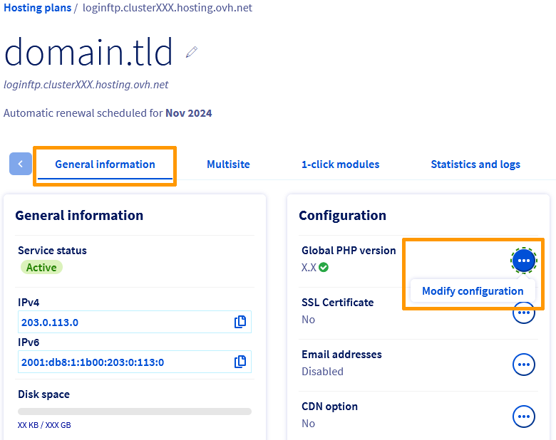
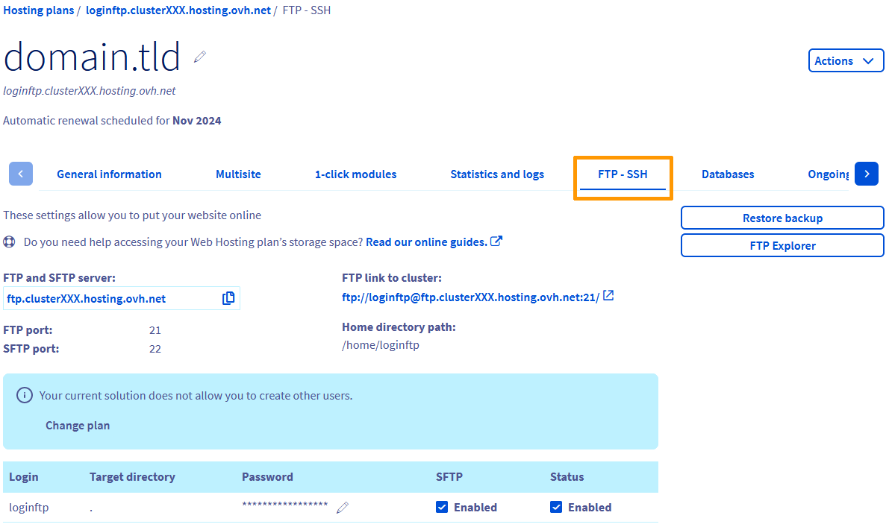

> [!primary]
> Esta tradução foi automaticamente gerada pelo nosso parceiro SYSTRAN. Em certos casos, poderão ocorrer formulações imprecisas, como por exemplo nomes de botões ou detalhes técnicos. Recomendamos que consulte a versão inglesa ou francesa do manual, caso tenha alguma dúvida. Se nos quiser ajudar a melhorar esta tradução, clique em "Contribuir" nesta página.
>

## Objetivo

As ofertas de [alojamento web da OVHcloud](/links/web/hosting){.external} permitem alojar o site que quiser, desde que seja compatível com a [configuração das nossas infraestruturas partilhadas](https://webhosting-infos.hosting.ovh.net){.external}.
No entanto, nas nossas infraestruturas partilhadas, pode modificar os seguintes parâmetros para o seu alojamento web:

- [o ambiente de execução](#runtime-environment)
- [a versão de PHP](#php-versions)
- [o motor de execução PHP](#php-runtime)
- [Firewall da aplicação](#firewall)
- [o modo de execução](#runtime-mod)

Existem duas formas de alterar estas definições de configuração:

- a partir da sua [Área de Cliente OVHcloud](/links/manager) ;
- a partir do espaço de armazenamento FTP do seu alojamento web OVHcloud, por meio de um ficheiro chamado ".ovhconfig".

> [!primary]
>
> Os ficheiros ".ovhconfig" são ficheiros de configuração de servidores e são automaticamente reconhecidos como tal pela infraestrutura de alojamento partilhado.
> Eles estão presentes de forma nativa e por predefinição na "raiz FTP" do espaço de armazenamento FTP do seu alojamento web.
> Contêm os valores dos elementos acima mencionados.
>

Em resumo, alterar a configuração do seu alojamento web a partir da [Área de Cliente OVHcloud](/links/manager) ou modificar os valores presentes no ficheiro ".ovhconfig" equivale a realizar a mesma operação.

### Índice

- [1 - Descrição dos parâmetros de configuração disponíveis nos alojamentos web da OVHcloud](#all-parameters)
- [2 - Método 1: Alterar a configuração do alojamento web a partir da Área de Cliente OVHcloud](#setting-ovh-manager)
- [3 - Método 2: Alterar a configuração do alojamento web a partir do ficheiro ".ovhconfig"](#setting-ovhconfig)
- [4 - Utilização avançada dos ficheiros ".ovhconfig"](#ovhconfig-more)

**Saiba como alterar o ambiente de execução, a versão PHP, a firewall aplicacional, o motor, o modo e o ficheiro ".ovhconfig" de um alojamento web.**

<iframe width="560" height="315" src="https://www.youtube-nocookie.com/embed/X31MNMLw064" title="YouTube video player" frameborder="0" allow="accelerometer; autoplay; clipboard-write; encrypted-media; gyroscope; picture-in-picture; web-share" allowfullscreen></iframe>

## Requisitos

- Dispor de um serviço de [alojamento web OVHcloud](/links/web/hosting){.external}, com exceção de um [serviço de alojamento Cloud Web](/links/web/hosting-cloud-web-offer).
- Ter acesso à sua oferta de alojamento web a partir da [Área de Cliente OVHcloud](/links/manager) ou conhecer as informações que permitem ligar-se à [Área de armazenamento FTP](/pages/web_cloud/web_hosting/ftp_connection).

## Instruções

### 1 - Descrição dos parâmetros de configuração disponíveis nos alojamentos web da OVHcloud <a name="all-parameters"></a>

Antes de começar, encontrará de seguida a descrição técnica de cada um dos parâmetros editáveis nos alojamentos web da OVHcloud.

> [!warning]
>
> A alteração de, pelo menos, um destes itens pode afetar a visualização ou o funcionamento do website. **Assegure-se de que o seu website é compatível com as alterações que deseja efetuar na configuração do seu alojamento web**. Contacte um [fornecedor especializado](/links/partner) em caso de dúvida ou se encontrar dificuldades.
>

#### 1.1 - Os ambientes de execução <a name="runtime-environment"></a>

Os ambientes de execução contêm um conjunto de linguagens de programação. Em função do ambiente de execução escolhido, as linguagens estão disponíveis em versões mais ou menos avançadas. O objetivo destes ambientes é permitir-lhe executar corretamente os ficheiros que compõem o seu website, de acordo com as suas necessidades técnicas.

Nos alojamentos web da OVHcloud, oferecemos **3** ambientes de execução: *Legacy*, *Stable* e *Stable64*.
Encontre aqui os elementos contidos nos nossos diferentes ambientes de execução:

|Ambiente|Legacy|Stable|Stable64|
|---|---|---|---| 
|Arquitetura|32 bits|32 bits|64 bits|
|Versão PHP mínima|5.4|5.4|7.4|
|OpenSSL|1.0.1t|1.0.1t|1.1.1n|
|Python|2.7 e 3.4|2.7 e 3.7|2.7 e 3.7|
|Ruby|2.1|2.1|2.5|
|Rails|4.1|4.1|5.2|
|Perl|5.20|5.20|5.28|
|git|2.1|2.1|2.20|

> [!primary]
>
> O ambiente *Legacy* pode ser útil para sites antigos que ainda utilizem versões antigas de PHP. No entanto, recomendamos vivamente que utilize o ambiente *Stable64* que beneficia das últimas atualizações. **Certifique-se de que o seu website é compatível antes de realizar qualquer alteração.**
> 

#### 1.2 - As versões de PHP <a name="php-versions"></a>

PHP é uma linguagem de programação dinâmica utilizada para criar websites. Para o seu website, e em função da sua antiguidade, das atualizações efetuadas ou de certas variáveis necessárias ao seu bom funcionamento, poderá ser necessário alterar a versão de PHP que utiliza.

Existem várias versões da linguagem de programação PHP. A evolução das versões traz correções diversas, assim como a adição ou o encerramento de funcionalidades. A OVHcloud propõe as últimas versões principais de PHP da qual pode encontrar a lista [aqui](/links/web/hosting-programming-language).

Certas versões de PHP só funcionam com certos ambientes de execução. Encontrará abaixo as versões de PHP disponíveis nos alojamentos partilhados OVHcloud e [os ambientes de execução](#runtime-environment) compatíveis:

|Versões PHP|Ambientes de execução compatíveis|
|---|---| 
|5.4, 5.5, 5.6 e 7.0|Legacy, Stable|
|7.1, 7.2 e 7.3|Stable|
|7.4, 8.0, 8.1 e 8.2|stable64|

> [!primary]
>
> Uma vez que as novas versões podem não incluir determinadas funcionalidades, **certifique-se de que a nova versão de PHP é compatível com o seu website antes de realizar qualquer alteração.**
>

Embora a OVHcloud trate da instalação das versões mais recentes de PHP nos seus servidores, cabe-lhe a si assegurar que o seu website está **sempre atualizado** e compatível com as versões mais recentes de PHP. Em função do website que utiliza, existem duas formas de verificar:

**Caso n°1 - utiliza um Content Management System (CMS)** tal como *WordPress*, *Joomla!*, *PrestaShop* ou *Drupal* : 

- Consulte a documentação oficial criada pelo editor do CMS que utiliza.
- Tome nota das informações relativas aos requisitos técnicos necessários ao funcionamento do seu CMS, assim como à manipulação necessária para o atualizar.
- Se necessário, atualize o seu CMS garantindo que a nova versão é compatível com o alojamento web da OVHcloud.

**Caso n°2 - utiliza um site baseado numa solução personalizada** : 

- Aproxime-se do webmaster que criou o website.
- Consulte a [documentação oficial PHP](http://php.net/manual/en/appendices.php){.external} para obter mais informações sobre as migrações da versão.
- Se necessário, atualize o código do seu website assegurando-se de que este é compatível com o alojamento web da OVHcloud.

Se necessário, pode conhecer a versão de PHP atualmente utilizada pelo seu alojamento web de duas formas:

- **Através da Área de Cliente OVHcloud**. Aceda à [Área de Cliente OVHcloud](/links/manager){.external} e aceda à secção `Web Cloud`{.action}. Na coluna da esquerda, clique em `Alojamentos`{.action} e escolha o alojamento web em causa. No separador `Informações gerais`{.action}, localize a versão abaixo de *Versão global de PHP*. 

{.thumbnail}

> [!primary]
> Se vir um símbolo redondo azul, aguarde alguns minutos para que a versão seja atualizada.
>

- **Através de um script**. Crie um script **.php** que contenha apenas o seguinte código:

```php
<?php phpinfo(); ?>
```

De seguida, coloque-o online no seu [espaço de armazenamento FTP](/pages/web_cloud/web_hosting/ftp_connection) e ligue-o para o seu endereço/URL completo.

> [!warning]
>
> A modificação da versão de PHP através de um ficheiro ".htaccess" já não é possível nas ofertas mais recentes de [alojamento web OVHcloud](/links/web/hosting).<br>
> O comando que permite mudar a versão de PHP no ficheiro ".htaccess" também não permite a utilização de versões recentes de PHP nas nossas infraestruturas.
> É obrigatório que utilize o ficheiro ".ovhconfig".
>

#### 1.3 - Os motores de execução PHP <a name="php-runtime"></a>

Os motores de execução PHP são programas que permitem executar ações no servidor web segundo um determinado método. Geralmente, esta configuração é modificada para agir sobre a velocidade de execução dos pedidos gerados pelos visitantes do seu website.

Nos alojamentos web da OVHcloud, disponibilizamos **2** motores de execução PHP: *php* ("PHP-FPM") e *phpcgi*.

A escolha do motor *php* permite ativar ou desativar o acelerador PHP ("PHP-FPM"). que foi adaptado à nossa infraestrutura para acelerar a velocidade de execução dos scripts PHP. 

O motor *phpcgi* executa os pedidos "em série" ao contrário do motor *php* ("PHP-FPM") que os executa "em paralelo".

Em comparação, o acelerador PHP ("PHP-FPM") oferece um ganho de performance até sete vezes mais rápido do que a utilização do motor *phpcgi*. 

#### 1.4 - A firewall aplicacional <a name="firewall"></a>

Uma firewall é uma segurança que filtra os pedidos recebidos do seu alojamento web. Nos nossos alojamentos web, esta definição de configuração funciona como uma opção **ativável** ou **desativável**.
Não será possível alterar as definições de filtragem da firewall propriamente dita.

Consulte o guia "[Ativação da firewall da aplicação](/pages/web_cloud/web_hosting/multisites_activating_application_firewall)" para mais informações sobre o assumpto.

> [!warning]
>
> Se utilizar módulos de pagamento, a ativação da firewall aplicacional pode, por vezes, causar perturbações na comunicação entre o módulo de pagamento e os bancos. Nesse caso, desative a opção.
>

#### 1.5 - Modos de execução <a name="runtime-mod"></a>

Os modos de execução permitem gerir o comportamento da cache dos ficheiros estáticos do seu website (as imagens, por exemplo) e o tratamento dos erros PHP (úteis quando o seu site apresenta uma página branca, por exemplo). 

Existem **2** modos que pode ativar: *Production* e *Development*.

|Modo|Cache dos ficheiros estáticos|Tratamento dos erros PHP|
|---|---|---| 
|*Production*|Maximiza o armazenamento em cache dos ficheiros estáticos nos browsers.|Os erros PHP não aparecem no seu site.|
|*Development*|Não é aplicada nenhuma cache.|Os erros PHP aparecem no seu site.|

> [!primary]
>
> Para as versões 7.1 e posteriores de PHP, os erros aparecerão no site, independentemente do modo utilizado. 
> 

Agora que conhece os diferentes parâmetros alteráveis para o seu alojamento web OVHcloud, descubra os dois métodos para modificar estes parâmetros.

### 2 - Método 1: alterar a configuração do alojamento web a partir da Área de Cliente OVHcloud <a name="setting-ovh-manager"></a>

> [!warning]
>
> Lembre-se de que a alteração de, pelo menos, um destes itens pode afetar a visualização ou o funcionamento do website. **Assegure-se de que o seu website é compatível com as alterações que deseja efetuar na configuração do seu alojamento web.** Contacte um [fornecedor especializado](/links/partner) em caso de dúvida ou se encontrar dificuldades.
>

#### 2.1 - Aceder à gestão da configuração do alojamento web

Aceda à [Área de Cliente OVHcloud](/links/manager){.external} e aceda à secção `Web Cloud`{.action}. Na coluna da esquerda, clique em `Alojamentos`{.action} e escolha o alojamento web em causa. Certifique-se de que está no separador
`Informações gerais`{.action}. À direita da entrada `Versão global de PHP`{.action}", localizada quase no centro da página, clique no botão `...`{.action} e, a seguir, em `Alterar configuração`{.action}.

{.thumbnail}

> [!primary]
>
> Se o botão `Alterar configuração`{.action} estiver cinzento, é possível que esteja a decorrer uma verificação da **versão global** de PHP. Se for o caso, aparecerá um símbolo redondo azul junto da versão, indicando que a verificação está em curso. Aguarde alguns minutos para que o botão `Alterar configuração`{.action} volte a ficar acessível.
>
> Se a opção "Versão global de PHP"{.action} não aparecer na [Área de Cliente OVHcloud](/links/manager), verifique se o ficheiro *.ovhconfig* existe na raiz de FTP do seu alojamento partilhado OVHcloud.
>
> Encontre todas as informações relativas ao ficheiro *.ovhconfig* na terceira parte "[Método 2: alterar a configuração do alojamento web a partir do ficheiro ".ovhconfig"](#setting-ovhconfig)" deste guia.
>

#### 2.2 - Alterar a configuração do alojamento web

Aparecerá uma janela com duas opções possíveis. Selecione a que corresponde à ação que deseja realizar e clique em ‘Seguinte`{.action}.

|Escolha|Detalhes|
|---|---| 
|`Voltar a uma configuração anterior`|Depois de selecionar esta opção, escolha a configuração a restaurar ao lado de `Choice Histórico`. Esta opção não estará disponível se não tiver efetuado nenhuma alteração anteriormente.
|`Alterar a configuração atual`|Depois de selecionar esta opção, escolha as alterações que deseja introduzir na configuração entre os campos propostos. Se necessário, volte à primeira parte "[Descrição dos parâmetros de configuração disponíveis nos alojamentos web da OVHcloud](#all-parameters)" deste guia.|

> [!primary]
>
> Alterar o ambiente de execução do seu alojamento web reinicializa automaticamente as sessões PHP.
> 

Clique em `Validar`{.action} para aplicar a alteração. Aguarde alguns instantes até que ela se realize.

{.thumbnail}

### 3 - Método 2: modificar a configuração do alojamento web a partir do ficheiro ".ovhconfig" <a name="setting-ovhconfig"></a>

#### 3.1 - Aceder ao espaço de armazenamento FTP do seu alojamento web

Tenha consigo o seu nome de utilizador FTP, a respetiva palavra-passe e o endereço do servidor FTP.
Para isso, aceda à [Área de Cliente OVHcloud](/links/manager){.external} e aceda à secção `Web Cloud`{.action}. Na coluna da esquerda, clique em `Alojamentos`{.action} e selecione o alojamento correspondente. Aceda ao separador FTP - SSH`{.action}. Nele, encontrará informações que lhe permitem aceder. 

Se for caso disso, consulte as instruções descritas na nossa documentação ["Alterar a palavra-passe de um utilizador FTP"](/pages/web_cloud/web_hosting/ftp_change_password) para obter uma palavra-passe para o utilizador FTP.

{.thumbnail}

#### 3.2 - Recuperar ou criar o ficheiro ".ovhconfig"

Quando estiver conectado ao [espaço de armazenamento FTP](/pages/web_cloud/web_hosting/ftp_connection), visualizará o conjunto dos ficheiros alojados atualmente no seu espaço de armazenamento FTP. Fique posicionado na raiz do seu alojamento (que pode ser simbolizado por um "/"). Deverá encontrar o ficheiro ".ovhconfig".

{.thumbnail}

A partir daí, existem duas possibilidades:

- **O ficheiro ".ovhconfig" está presente** : descarregue-o para a sua própria máquina / aparelho. Faça uma cópia antes de modificá-lo. Esta ferramenta permitir-lhe-á restaurar o ficheiro original, se necessário.
- **O ficheiro ".ovhconfig" é inexistente** : crie-o na sua própria máquina/aparelho e dê-lhe o nome ".ovhconfig".

#### 3.3 - Alterar o conteúdo do ficheiro ".ovhconfig" <a name="update-ovhconfig"></a>

Depois de obter o ficheiro ".ovhconfig", edite-o. Para o fazer, utilize um programa de edição de texto. O seu ficheiro ".ovhconfig" deve conter um código semelhante ao seguinte:

```php
app.engine=php
app.engine.version=8.0

http.firewall=none
environment=production

container.image=stable64
```

> [!success]
>
> Se acabou de criar o ficheiro ".ovhconfig", copie o código acima no seu ficheiro e continue a ler este guia.
>

Personalize os valores das variáveis em função da configuração que pretende utilizar com o seu alojamento web.

|Variáveis|Detalhe|
|---|---| 
|app.engine|Permite alterar [o motor PHP](#php-runtime) utilizado pelo alojamento. Introduza **php** para ativar o acelerador PHP-FPM e **phpcgi** para o desativar.|
|app.engine.version|Permite definir [a versão de PHP](#php-versions) utilizada pelo alojamento entre [as que a OVHcloud propõe](/links/web/hosting-programming-language){.external}. Insira a versão da sua escolha (adequada ao ambiente de execução que escolheu utilizar).|
|http.firewall|Permite ativar ou desativar a [firewall fornecida com os alojamentos web da OVHcloud](/links/web/hosting-options){.external}. Introduza **security** para a ativar ou **none** para a desativar.|
|environment|Permite gerir o comportamento da cache dos ficheiros estáticos do seu website, assim como o tratamento dos erros PHP. Corresponde a [modo de execução](#runtime-mod). Insira **production** para maximizar a colocação em cache e ocultar os erros PHP ou **development** para que nenhuma cache seja aplicada e que os erros PHP sejam apresentados.|
|container.image|Permite alterar [o ambiente de execução](#runtime-environment) utilizado pelo alojamento. Indique o ambiente de execução (**legacy**,**stable** ou **stable64**) à sua escolha. Se escolher o ambiente de execução **stable64**, verifique se o seu site é compatível com a arquitetura de 64 bits.|

Se necessário, volte à primeira parte "[Descrição dos parâmetros de configuração disponíveis nos alojamentos web da OVHcloud](#all-parameters)" deste guia.

Se necessário, encontre abaixo a descrição técnica detalhada do ficheiro ".ovhconfig":

```php
; ovhconfig
;
; this file must be placed in $HOME/.ovhconfig or in $DOCUMENT_ROOT/.ovhconfig

; __app.engine__
;
; values: php (php engine + opcache accelerator)
; notice: if php, a phpcgi engine will be activated as fallback (if previous engine crash)
;
;   php:
;       IMPORTANT: register_globals and magic_quotes_gpc are off for security
;       php optiones .htaccess (like php version) are ignored
;   phpcgi:
;       IMPORTANT this is a fallback to previous system
;       in this case __app.engine.version__ will be considerated as AUTO and php version will be old system
;       (meaning depending .htaccess or .phpX extension)
;
app.engine=php

; __app.engine.version__ specify version of your engine
;
; for php:
;   default: 8.0
; for phpcgi:
;   this options is ignored (= fallback in AUTO)
;
app.engine.version=8.0

; __http.firewall__ used to add application firewall  (filter http requests)
;
; values: none | security
; default: none
;
http.firewall=none

; __environment__
;
; values: production | development
;
;   production:
;       apache will maximise local cache
;       mod_expires will grow up TTL of js, css, pdf, images, video, audio
;       you can override it changing expiration explicitly in your .htaccess
;       feel free to look on our guide.
;   development:
;       no expiration is added, files are not locally in cache,
;       will speed up tests but decrease performances
;
; choosen environment will also be available in your variable ENVIRONMENT unix env
;
; default: production
;
environment=production

; __container.image__
;
; values: legacy | stable | stable64
;
container.image=stable64
```

#### 3.4 - Transferir o ficheiro ".ovhconfig" no espaço de armazenamento

Depois de" alterado o ficheiro ".ovhconfig, transfira-o para o seu [espaço de armazenamento FTP](/pages/web_cloud/web_hosting/ftp_connection). Para isso, volte a ligar-se ao seu [espaço de armazenamento FTP](/pages/web_cloud/web_hosting/ftp_connection) e coloque-se na raiz do seu [espaço de armazenamento FTP](/pages/web_cloud/web_hosting/ftp_connection) (que pode ser simbolizado por um "/"). Carregue o ficheiro ".ovhconfig" que acabou de modificar no seu [espaço de armazenamento FTP](/pages/web_cloud/web_hosting/ftp_connection). Se o ficheiro já existir, substitua-o.

### 4 - Utilização avançada dos ficheiros ".ovhconfig" <a name="ovhconfig-more"></a>

Se utiliza o seu alojamento web para alojar vários websites (em *multi-sites*), existem várias razões pelas quais pretende beneficiar de uma versão de PHP diferente para alguns dos seus *multi-sites*.

Crie um ficheiro ".ovhconfig" que contenha a versão de PHP pretendida para os *multisites* em causa. Recorra às operações descritas na parte "[3.3 - Alterar o conteúdo do ficheiro ".ovhconfig"](#update-ovhconfig)" deste guia, se necessário. Quando descarregar o ficheiro ".ovhconfig" para o seu [espaço de armazenamento FTP](/pages/web_cloud/web_hosting/ftp_connection), deverá fazê-lo na pasta raiz onde estão localizados os ficheiros que compõem o website "*multisites*" em causa. Encontre a pasta raiz dos seus *multisites* a partir da sua [Área de Cliente OVHcloud](/links/manager) no separador `Multisite`{.action} do alojamento em causa.

Consulte o guia "[Configurar um multisite no alojamento web](/pages/web_cloud/web_hosting/multisites_configure_multisite)" se necessário.

> [!warning]
>
> **Não é possível especificar um segundo [ambiente de execução](#runtime-environment), um segundo [modo de execução](#runtime-mod) e/ou um segundo [motor de execução PHP](#php-runtime)** num mesmo alojamento web. Apenas serão tidos em conta os que constam do ficheiro ".ovhconfig" que está na raiz do seu [espaço de armazenamento FTP](/pages/web_cloud/web_hosting/ftp_connection).
>

{.thumbnail}

## Quer saber mais?

[Ligar-se ao espaço de armazenamento do alojamento web](/pages/web_cloud/web_hosting/ftp_connection)

Para serviços especializados (referenciamento, desenvolvimento, etc), contacte os [parceiros OVHcloud](/links/partner).
 
Se pretender usufruir de uma assistência na utilização e na configuração das suas soluções OVHcloud, consulte as nossas diferentes [ofertas de suporte](/links/support).
 
Fale com nossa [comunidade de utilizadores](/links/community).