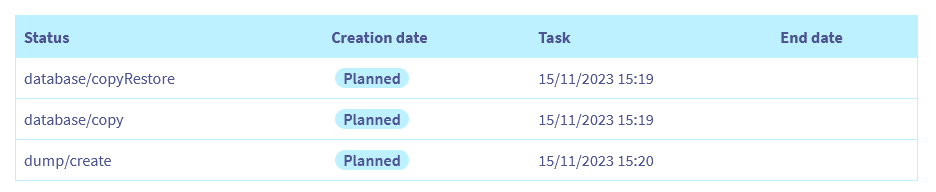

> [!primary]
> Diese Übersetzung wurde durch unseren Partner SYSTRAN automatisch erstellt. In manchen Fällen können ungenaue Formulierungen verwendet worden sein, z.B. bei der Beschriftung von Schaltflächen oder technischen Details. Bitte ziehen Sie im Zweifelsfall die englische oder französische Fassung der Anleitung zu Rate. Möchten Sie mithelfen, diese Übersetzung zu verbessern? Dann nutzen Sie dazu bitte den Button "Beitragen" auf dieser Seite.
>

## Ziel

Ihre Datenbank ist ein zentrales Element beim Aufbau Ihrer dynamischen Website. Während des Lebenszyklus Ihrer Website kann es aus praktischen oder technischen Gründen erforderlich sein, den Inhalt Ihrer Datenbank in eine andere Ihrer Datenbanken zu kopieren [start SQL](https://www.ovhcloud.com/de/web-hosting/options/start-sql/) oder [Web Cloud Databases](https://www.ovhcloud.com/de/web-cloud/databases/).

**Diese Anleitung erklärt, wie Sie den Inhalt einer OVHcloud-Datenbank in eine andere OVHcloud-Datenbank kopieren.**

> [!primary]
>
> Mit dieser Funktion werden Datenbanken nicht verschoben, sondern kopiert. Im Gegensatz zu einem Migrationsprozess wird die ursprüngliche Datenbank nicht automatisch gelöscht. Nur der Inhalt der Quelldatenbank wird dupliziert, um in die Zieldatenbank kopiert zu werden.
>

## Voraussetzungen

- Sie verfügen über Datenbankangebote [start SQL](https://www.ovhcloud.com/de/web-hosting/options/start-sql/) und/oder [Web Cloud Databases](https://www.ovhcloud.com/de/web-cloud/databases/). Beide Datenbanken müssen erstellt werden, bevor das Replikations-Tool verwendet werden kann.
- Sie sind im [OVHcloud Kundencenter](https://www.ovh.com/auth/?action=gotomanager&from=https://www.ovh.de/&ovhSubsidiary=de) eingeloggt
- Über ausreichende Rechte für alle betroffenen Datenbankdienste verfügen. Weitere Informationen finden Sie in unserer Anleitung [Verwaltung der Kontakte der Dienste](/pages/account_and_service_management/account_information/managing_contacts).

## In der praktischen Anwendung

Bevor Sie beginnen, stellen Sie sicher, dass:

- Ihr **D**ata**b**ase **M**anagement **S**ystem (MySQL, PostgreSQL usw.) ist für Ihre beiden Datenbanken (Quelle und Ziel) identisch.
- Die Version Ihres DBMS ist die gleiche für Ihre beiden Datenbanken (Quelle und Ziel). Obwohl die Kopie mit verschiedenen Versionen verwendet werden kann, sollten Sie die gleichen Versionen verwenden.
- Der Inhalt der Quelldatenbank darf die Größe der Zieldatenbank nicht überschreiten.

### Quelldatenbank identifizieren

Diese Funktion ist für die Kopie verfügbar: 

- einer Datenbank [Start SQL](https://www.ovhcloud.com/de/web-hosting/options/start-sql/) (in einigen unserer [Webhostings](https://www.ovhcloud.com/de/web-hosting/) oder [separat bestellt](https://www.ovhcloud.com/de/web-hosting/options/start-sql/));
- einer Datenbank auf einem Server [Web Cloud Databases](https://www.ovhcloud.com/de/web-cloud/databases/) (bei unseren [Performance Hostings](https://www.ovhcloud.com/de/web-hosting/performance-offer/) oder [separat bestellt](https://www.ovhcloud.com/de/web-cloud/databases/) enthalten. 

Je nach Ihrer Situation ist der Zugriffspfad zur Quelldatenbank unterschiedlich.

#### Start SQL-Datenbank

Wählen Sie in Ihrem [OVHcloud Kundencenter](https://www.ovh.com/auth/?action=gotomanager&from=https://www.ovh.de/&ovhSubsidiary=de) `Web Cloud`{.action} aus dem Menü oben im Interface aus. Gehen Sie in der linken Spalte in den Tab `Hosting-Pakete`{.action} und klicken Sie auf das Webhosting, in dem sich die Quelldatenbank befindet, deren Inhalt kopiert werden soll.

{.thumbnail}

Wenn Sie auf den Tab `Datenbanken`{.action} klicken, wird eine Liste Ihrer Start SQL-Datenbanken angezeigt.

{.thumbnail}

#### Web Cloud Databases

Wählen Sie in Ihrem [OVHcloud Kundencenter](https://www.ovh.com/auth/?action=gotomanager&from=https://www.ovh.de/&ovhSubsidiary=de) `Web Cloud`{.action} aus dem Menü oben im Interface aus. Gehen Sie in der linken Spalte in den Tab `Web Cloud Databases`{.action} und wählen Sie den Web Cloud Databases Server aus, auf dem sich Ihre Quelldatenbank befindet, deren Inhalt kopiert werden soll.

{.thumbnail}

Wenn Sie auf den Tab `Datenbanken`{.action} klicken, wird eine Liste der Datenbanken auf Ihrem Web Cloud Databases Server angezeigt.

{.thumbnail}

### Inhalt einer Datenbank kopieren

Bleiben Sie im Tab `Datenbanken`{.action} und klicken Sie unabhängig von Ihrem Angebot auf den Button `...`{.action} rechts neben der Zeile für die Datenbank, deren Inhalt Sie kopieren möchten, und wählen Sie `Datenbank kopieren`{.action}.

){.thumbnail}

Es wird ein Fenster angezeigt, in dem Sie Ihre Zieldatenbank identifizieren können.

{.thumbnail}

Wenn Sie keine Zieldatenbank haben, klicken Sie auf den Link, um eine neue Datenbank zu kaufen, wie im folgenden Screenshot dargestellt:

{.thumbnail}

Sie haben die Wahl zwischen einem Angebot „[start SQL](https://www.ovhcloud.com/de/web-hosting/options/start-sql/)“ oder einem Datenbankserver „[Web Cloud Databases](https://www.ovhcloud.com/de/web-cloud/databases/)“.

> [!primary]
>
> Beim Kauf Ihrer neuen Datenbank ist diese nicht standardmäßig aktiviert. Vergessen Sie nicht, es zu aktivieren. Loggen Sie sich hierzu in Ihr [OVHcloud Kundencenter](https://www.ovh.com/auth/?action=gotomanager&from=https://www.ovh.de/&ovhSubsidiary=de) ein und gehen Sie in den Bereich `Web Cloud`{.action}.
> 
> - Für eine „Shared SQL“ Datenbank: Folgen Sie unserer Anleitung „[Datenbank auf Ihrem Webhosting erstellen](/pages/web_cloud/web_hosting/sql_create_database)“;
> - Für eine Datenbank, die auf einem „Web Cloud Databases“ Server vorhanden sein wird: Folgen Sie unserer Anleitung „[Datenbank auf einem Web Cloud Databases Server erstellen](/pages/web_cloud/web_cloud_databases/create-db-and-user-on-db-server)“.
>

Wenn Sie bereits über eine Zieldatenbank verfügen, wählen Sie zunächst deren Typ aus:

- `In Datenbank kopieren`{.action}: Wenn Sie den Inhalt der Quelldatenbank in eine **Start SQL**-Datenbank (Ziel) kopieren möchten.
- `In eine Web Cloud Databases kopieren`{.action} : wenn Sie den Inhalt Ihrer Quelldatenbank in eine **Web Cloud Databases** (Ziel) Datenbank kopieren möchten.

#### Wahl 1 - In eine Start SQL-Datenbank kopieren

Sie haben `In Datenbank kopieren`{.action} ausgewählt. Es werden zwei Dropdownlisten angezeigt. Klicken Sie auf das erste Webhosting und wählen Sie das Webhosting aus, auf dem sich Ihre Start SQL-Zieldatenbank befindet. Wenn Sie das Webhosting ausgewählt haben, klicken Sie auf die zweite Dropdown-Liste, um die Start SQL-Zieldatenbank auszuwählen.

Klicken Sie auf `Weiter`{.action}. Die folgende Bestätigungsmeldung wird angezeigt:

{.thumbnail}

Wenn Sie die ausgewählte Zieldatenbank nicht überschreiben möchten, klicken Sie auf `Zurück`{.action}, um Ihre Auswahl zu ändern, oder auf `Abbrechen`{.action}, um alle Änderungen abzubrechen. Klicken Sie andernfalls auf `Bestätigen`{.action}, um zu bestätigen, dass der Inhalt der Quelldatenbank in die Zieldatenbank dupliziert werden soll.

Die folgende Bestätigungsmeldung wird angezeigt:

{.thumbnail}

Die Datenbankkopie kann einige Minuten dauern. Um zu überprüfen, ob die Kopie erfolgreich ausgeführt wurde, gehen Sie zum Tab `Aktuelle Tasks`{.action}. In der Tabelle wird eine neue Zeile für Ihre Kopie mit dem Status „Geplant“ angezeigt. Wenn der Vorgang abgeschlossen ist, wird die Zeile gelöscht.

{.thumbnail}

#### Wahl 2 - In eine Datenbank auf einem Web Cloud Databases Server kopieren

Sie haben `In eine Web Cloud Databases kopieren`{.action} ausgewählt. Es werden zwei Dropdownlisten angezeigt. Klicken Sie auf das erste Angebot und wählen Sie das Angebot Web Cloud Databases aus, auf dem sich Ihre Zieldatenbank befindet. Wenn Sie das Angebot Web Cloud Databases ausgewählt haben, klicken Sie auf die zweite Dropdown-Liste, um die Zieldatenbank auf Ihrem Web Cloud Databases Server auszuwählen.

Klicken Sie auf `Weiter`{.action}. Die folgende Bestätigungsmeldung wird angezeigt:

{.thumbnail}

Wenn Sie die ausgewählte Zieldatenbank nicht überschreiben möchten, klicken Sie auf `Zurück`{.action}, um Ihre Auswahl zu ändern, oder auf `Abbrechen`{.action}, um alle Änderungen abzubrechen. Klicken Sie andernfalls auf `Bestätigen`{.action}, um zu bestätigen, dass der Inhalt der Quelldatenbank in die Zieldatenbank dupliziert werden soll.

Die Datenbankkopie kann einige Minuten dauern. Um zu überprüfen, ob die Kopie erfolgreich ausgeführt wurde, gehen Sie zum Tab `Aktuelle Tasks`{.action}. In der Tabelle wird eine neue Zeile für Ihre Kopie mit dem Status „Geplant“ angezeigt. Wenn der Vorgang abgeschlossen ist, wird die Zeile gelöscht.

{.thumbnail}

### Konfiguration Ihrer Website mit einer neuen Datenbank

Nachdem Sie die Quelldatenbank kopiert haben, müssen Sie eine letzte Aktion ausführen, wenn Sie die neue Datenbank verwenden möchten.

Stellen Sie auf der Registerkarte `Aktuelle Tasks`{.action} sicher, dass der Kopiervorgang abgeschlossen ist (die Zeile Ihrer Kopie ist nicht mehr vorhanden).

Um die neue Datenbank mit Ihrer Website zu verbinden, bearbeiten Sie die Konfigurationsdatei Ihres **C**ontent **M**anagement **S**ystem (**CMS**) und geben Sie die Verbindungsinformationen für die neue Datenbank ein.

> [!warning]
>
> Es wird empfohlen, vor der Bearbeitung eine Kopie der Konfigurationsdatei Ihrer Website zu erstellen. So wird sichergestellt, dass die neue Version der Datei mit der alten überschrieben werden kann, wenn die Konfiguration fehlschlägt.

Wenn Sie beispielsweise WordPress verwenden, müssen Sie die Konfigurationsdatei *wp-config.php* im Wurzelverzeichnis Ihres WordPress-Ordners im Speicherplatz (FTP) Ihres Hostings bearbeiten und die folgenden Felder aktualisieren:

- DB_NAME
- DB_USER
- DB_PASSWORD
- DB_HOST

Für weitere Informationen oder wenn Sie ein anderes CMS verwenden, lesen Sie unsere Anleitung [Passwort einer Webhosting-Datenbank ändern](/pages/web_cloud/web_hosting/sql_change_password).

> [!primary]
>
> Die Kopie Ihrer Datenbank ist keine Migration. Die Quelldatenbank ist noch vorhanden, bis Sie sie löschen. So können Sie Ihre Website weiterhin mit der alten Datenbank neu konfigurieren.
>

### Anwendungsbeispiele

Beim Kopieren des Datenbankinhalts können Probleme auftreten.

#### In der Liste werden keine Datenbanken angezeigt

Diese Benachrichtigung bedeutet, dass nur eine Datenbank aktiv ist. Zum Kopieren der Quelldatenbank ist auch eine aktive Zieldatenbank erforderlich. Dazu können Sie:

- Konfigurieren Sie eine neue Datenbank auf Ihrem Webhosting;
- Konfigurieren Sie eine neue Datenbank auf Ihrem Server [Web Cloud Databases](https://www.ovhcloud.com/de/web-cloud/databases/);
- Ein Angebot „[start SQL](https://www.ovhcloud.com/de/web-hosting/options/start-sql/)“ oder einen Datenbankserver „[Web Cloud Databases](https://www.ovhcloud.com/de/web-cloud/databases/)“ bestellen

#### Es wird bereits eine Aktion ausgeführt

Diese Meldung bedeutet, dass bereits ein Task für die Datenbank ausgeführt wird. Gehen Sie auf den Tab `Aktuelle Tasks`{.action} und überprüfen Sie, ob Sie eine Operation durchgeführt haben. Ist das der Fall, warten Sie, bis die Kopie der Datenbank abgeschlossen ist, und wiederholen Sie dann ggf. die Kopie der Datenbank.

#### Die Zieldatenbank enthält nicht genügend Speicherplatz

Ihre Zieldatenbank enthält nicht genügend Speicherplatz. Sie haben zwei Möglichkeiten:

- Eine neue Datenbank mit mehr Speicherplatz bestellen [start-sql](https://www.ovhcloud.com/de/web-hosting/options/start-sql/).
- Wenn Sie über einen [Web Cloud Databases](https://www.ovhcloud.com/de/web-cloud/databases/) Server verfügen, wechseln Sie zu einem Angebot Web Cloud Databases mit mehr Speicherplatz.

#### Die Quell- und Zieldatenbanken sind nicht kompatibel

Diese Benachrichtigung bedeutet, dass das **D**ata**b**ase **M**anagement **S**ystem (**DBMS**) Ihrer Quelldatenbank nicht mit dem DBMS Ihrer Zieldatenbank übereinstimmt.

Dieser Fehler kann beispielsweise auftreten, wenn Sie MySQL für die Quelldatenbank und PostgreSQL für die Zieldatenbank verwenden.

## Weiterführende Informationen

[In das OVHcloud Kundencenter einloggen](/pages/account_and_service_management/account_information/ovhcloud-account-login)

[Eine Datenbank auf Ihrem Datenbankserver sichern und exportieren](/pages/web_cloud/web_cloud_databases/save-export-on-database-server)

[Datenbank auf Ihrem Datenbankserver wiederherstellen und importieren](/pages/web_cloud/web_cloud_databases/restore-import-on-database-server/)

[Backup einer Webhosting-Datenbank abrufen](/pages/web_cloud/web_hosting/sql_database_export)

[Backup in eine Webhosting-Datenbank importieren](/pages/web_cloud/web_hosting/sql_importing_mysql_database)

Kontaktieren Sie für spezialisierte Dienstleistungen (SEO, Web-Entwicklung etc.) die [OVHcloud Partner](https://partner.ovhcloud.com/de/directory/).

Wenn Sie Hilfe bei der Nutzung und Konfiguration Ihrer OVHcloud Lösungen benötigen, beachten Sie unsere [Support-Angebote](https://www.ovhcloud.com/de/support-levels/).

Für den Austausch mit unserer User Community gehen Sie auf <https://community.ovh.com/en/>.