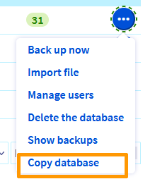

## Objective

Your database is a central part of building your dynamic website. During the life cycle of your website, for practical or technical reasons, you may copy the content of your database to another one of your databases [start SQL](https://www.ovhcloud.com/en-sg/web-hosting/options/start-sql/) or [Web Cloud Databases](https://www.ovhcloud.com/en-sg/web-cloud/databases/).

**Find out how to copy the content of an OVHcloud database into another OVHcloud database.**

> [!primary]
>
> With this feature, databases are not moved but copied. This is because the original database is not deleted automatically, as is the case with a migration process. Only the contents of the source database are duplicated for copying to the destination database.
>

## Requirements

- You must have [start SQL](https://www.ovhcloud.com/en-sg/web-hosting/options/start-sql/) and/or [Web Cloud Databases](https://www.ovhcloud.com/en-sg/web-cloud/databases/) database solutions. The two databases concerned must be created beforehand in order to use the replication tool.
- access to the [OVHcloud Control Panel](https://ca.ovh.com/auth/?action=gotomanager&from=https://www.ovh.com/sg/&ovhSubsidiary=sg)
- Sufficient rights to all database services concerned. You can find more information in our guide [Managing contacts for your services](/pages/account_and_service_management/account_information/managing_contacts).

## Instructions

Before you begin, make sure that:

- Your **D**ata**b**ase **M**anagement **S**ystem (MySQL, PostgreSQL, etc.) is the same for your two databases (source and destination).
- The version of your DBMS is the same for both your databases (source and destination). Although the copy may work with different versions, it is recommended that you use the same versions.
- The contents of the source database must not exceed the size of the destination database.

### Identify my source database

This feature is available for copying: 

- a database [Start SQL](https://www.ovhcloud.com/en-sg/web-hosting/options/start-sql/) (included in some of our [web hosting](https://www.ovhcloud.com/en-sg/web-hosting/) or [ordered separately](https://www.ovhcloud.com/en-sg/web-hosting/options/start-sql/));
- a database hosted on a [Web Cloud Databases](https://www.ovhcloud.com/en-sg/web-cloud/databases/) server  (included with our [Performance hosting](https://www.ovhcloud.com/en-sg/web-hosting/performance-offer/) or [ordered separately](https://www.ovhcloud.com/en-sg/web-cloud/databases/)). 

Depending on your situation, the path to your source database is different.

#### Start SQL database

In your [OVHcloud Control Panel](https://ca.ovh.com/auth/?action=gotomanager&from=https://www.ovh.com/sg/&ovhSubsidiary=sg), select `Web Cloud`{.action} in the menu at the top of the interface. In the left-hand column, go to the `Hosting plans`{.action} tab, then click on the web hosting plan that contains the source database whose content you want to copy.

{.thumbnail}

By clicking on the `Databases`{.action} tab, you will see a list of your Start SQL databases.

{.thumbnail}

#### Web Cloud Databases

In your [OVHcloud Control Panel](https://ca.ovh.com/auth/?action=gotomanager&from=https://www.ovh.com/sg/&ovhSubsidiary=sg), select `Web Cloud`{.action} in the menu at the top of the interface. In the left-hand column, go to the `Web Cloud Databases`{.action} tab, then select the Web Cloud Databases server where your source database whose content you want to copy is located.

{.thumbnail}

By clicking on the `Databases`{.action} tab, you will see a list of the databases on your Cloud Databases Web server.

{.thumbnail}

### Copy the contents of a database

In the `Databases`{.action} tab, regardless of your solution, click the `...`{.action} button to the right of the row corresponding to the database whose contents you want to copy, then select `Copy database`{.action}.

{.thumbnail}

A window will pop up to identify your destination database.

{.thumbnail}

If you do not have a destination database, and as shown in the screenshot below, click on the link to purchase a new database:

{.thumbnail}

You can choose between buying a "[start SQL](https://www.ovhcloud.com/en-sg/web-hosting/options/start-sql/)" solution, or a "[Web Cloud Databases](https://www.ovhcloud.com/en-sg/web-cloud/databases/)" database server.

> [!primary]
>
> When you purchase your new database, it is not activated by default. Don't forget to enable it. To do this, log in to your [OVHcloud Control Panel](https://ca.ovh.com/auth/?action=gotomanager&from=https://www.ovh.com/sg/&ovhSubsidiary=sg), then go to the `Web Cloud`{.action} section.
> 
> - For a Shared SQL database: follow our guide on "[Creating a database on your Web Hosting plan](/pages/web_cloud/web_hosting/sql_create_database)";
> - For a database that will be present on a "Web Cloud Databases" server: follow our guide "[Creating a database on a Web Cloud Databases server](/pages/web_cloud/web_cloud_databases/create-db-and-user-on-db-server)".
>

If you already have a destination database, first choose its type:

-`Copy to database`{.action} : if you want to copy the contents of your source database to a **Start SQL** (destination) database.
-`Copy to a Web Cloud Databases`{.action} : if you want to copy the content from your source database to a **Web Cloud Databases** database (destination).

#### Choice 1 - Copy to a Start SQL database

You have just selected `Copy to database`{.action}. Two drop-down lists appear. Click the first button, then select the web hosting plan your destination Start SQL database is hosted on. Once you have selected a web hosting plan, click on the second dropdown list to choose the destination Start SQL database.

Click `Next`{.action}. The following confirmation message is displayed:

{.thumbnail}

If you do not want to overwrite the destination database you have chosen, click `Back`{.action} to change your choice, or `Cancel`{.action} to cancel everything. Otherwise, click `Confirm`{.action} to confirm that you want to duplicate the contents of the source database to the destination database.

The following confirmation message is displayed:

{.thumbnail}

It may take several minutes to copy the database. To check that the copy has been processed, go to the `Ongoing tasks`{.action} tab. In the table, a new row will appear for your copy with a status of "scheduled". Once the operation is complete, the line disappears.

{.thumbnail}

#### Choice 2 - Copy to a database on a Web Cloud Databases server

You have just selected `Copy to a Web Cloud Databases`{.action}. Two drop-down lists appear. Click on the first link, then select the Web Cloud Databases solution that your destination database is based on. Once you have selected the Web Cloud Databases solution, click on the second dropdown list to choose the destination database on your Web Cloud Databases server.

Click `Next`{.action}. The following confirmation message is displayed:

{.thumbnail}

If you do not want to overwrite the destination database you have chosen, click `Back`{.action} to change your choice, or `Cancel`{.action} to cancel everything. Otherwise, click `Confirm`{.action} to confirm that you want to duplicate the contents of the source database to the destination database.

It may take several minutes to copy the database. To check that the copy has been processed, go to the `Ongoing tasks`{.action} tab. In the table, a new row will appear for your copy with a status of "scheduled". Once the operation is complete, the line disappears.

{.thumbnail}

### Configuring your website with a new database

Once you have made a copy of your source database, you will need to take a final action if you want to use your new database.

In the `Ongoing tasks`{.action} tab, ensure that the copy is complete (the line corresponding to your copy has disappeared).

To connect the new database to your website, edit the configuration file for your **C**ontent **M**anagement **S**ystem (**CMS**) and enter the connection information for the new database.

> [!warning]
>
> It is recommended that you make a copy of your website’s configuration file before editing it. This ensures that you can replace the new version of the file with the old one if your configuration fails.

For example, if you use WordPress, you will need to modify the *wp-config.php* configuration file in the root folder of your WordPress application, in your hosting plan’s storage space (FTP), then update the following fields:

- DB_NAME
- DB_USER
- DB_PASSWORD
- DB_HOST

For more details, or if you are using another CMS, please refer to our guide on [Changing the password for a web hosting plan database](/pages/web_cloud/web_hosting/sql_change_password).

> [!primary]
>
> Copying your database is not a migration. Your source database still exists until you delete it. This way, you can still reconfigure your website with its old database.
>

### Use cases

During the process of copying the contents of the database, you may encounter difficulties.

#### No databases are displayed in the list

This notification means that you only have one active database. To copy your source database, you also need an active destination database. To do this, you can:

- Configure a new database available on your Web Hosting plan;
- Configure a new database on your server [Web Cloud Databases](https://www.ovhcloud.com/en-sg/web-cloud/databases/);
- Order a "[start SQL](https://www.ovhcloud.com/en-sg/web-hosting/options/start-sql/)" solution or a database server "[Web Cloud Databases](https://www.ovhcloud.com/en-sg/web-cloud/databases/)"

#### You already have an action in progress

This message means that a task is already in progress on your database. Go to the `Ongoing tasks`{.action} tab, and check that you have an operation already in progress. If so, wait for it to finish before retrying the copy of your database if necessary.

#### The destination database does not contain enough space

Your destination database does not contain enough space. There are two ways to do this:

- Order a new database [start SQL](https://www.ovhcloud.com/en-sg/web-hosting/options/start-sql/) with more space.
- If you have a [Web Cloud Databases](https://www.ovhcloud.com/en-sg/web-cloud/databases/) server, switch to a Web Cloud Databases solution with more storage space.

#### The source and destination databases are incompatible

This notification means that the **D**ata**b**ase **M**anagement **S**ystem (**DBMS**) in your source database is not the same as the DBMS in your destination database.

For example, this error can occur when you use MySQL for your source database, and PostgreSQL for your destination database.

## Go further

[Log in to the OVHcloud Control Panel](/pages/account_and_service_management/account_information/ovhcloud-account-login)

[Back up and export a database on your database server](/pages/web_cloud/web_cloud_databases/save-export-on-database-server)

[Restore and import a database on your database server](/pages/web_cloud/web_cloud_databases/restore-import-on-database-server/)

[Retrieve the backup of a web hosting plan’s database](/pages/web_cloud/web_hosting/sql_database_export)

[Import a backup into a web hosting database](/pages/web_cloud/web_hosting/sql_importing_mysql_database)

For specialised services (SEO, development, etc.), contact [OVHcloud partners](https://partner.ovhcloud.com/en-sg/directory/).

If you would like assistance using and configuring your OVHcloud solutions, please refer to our [support offers](https://www.ovhcloud.com/en-sg/support-levels/).

Join our community of users on <https://community.ovh.com/en/>.