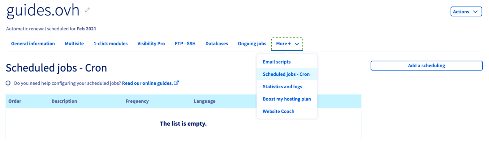

## Objective

On OVHcloud Web Hostings, you can use scripts to automate certain operations. Creating a scheduled task ("cron job") is the easiest way to ensure your scripts are running at specific times without further actions necessary on your part. 

**This guide explains how to create cron jobs to automate scheduled tasks on a Web Hosting.**

> [!warning]
>
> OVHcloud provides services that you are responsible for with regard to their configuration and management. It is therefore your responsibility to ensure that they function properly.
>
> This guide is designed to help you with common tasks. Nevertheless, we recommend contacting a [specialist provider](https://partner.ovhcloud.com/en-sg/directory/) or reach out to the [OVHcloud community](https://community.ovh.com/en/) if you encounter any difficulties. We will not be able to assist you. You can find more information in the [Go further](#go-further) section of this guide.
>

## Requirements

- An [OVHcloud Web Hosting plan](https://www.ovhcloud.com/en-sg/web-hosting/)
- Access to the [OVHcloud Control Panel](https://ca.ovh.com/auth/?action=gotomanager&from=https://www.ovh.com/sg/&ovhSubsidiary=sg) with the necessary permissions to manage the Web Hosting plan 

## Instructions

Log in to your [OVHcloud Control Panel](https://ca.ovh.com/auth/?action=gotomanager&from=https://www.ovh.com/sg/&ovhSubsidiary=sg) and select `Web Cloud`{.action} in the top navigation bar. Click `Hosting plans`{.action}, then choose the Web Hosting plan concerned. Next, navigate to the `cron`{.action} tab by selecting it in the `More`{.action} submenu.

In this section you will see an overview of your scheduled jobs and their settings.

{.thumbnail}

### Creating an automated task

#### Step 1: Defining general settings

To create a new cron task, click on the `Add a scheduling`{.action} button on the right-hand side. You can customise the settings for the task in the new window.

{.thumbnail}

|Option|Description|   
|---|---|   
|Command to be executed|Define the path to the file containing your script. Example: www/jobs/cron.php|   
|Language|Select the PHP version the script is using.|
|Activation|Choose whether the task will be active after creation or activated later.| 
|Logs by email|If necessary, select a contact (admin or technical) to whom a report will be sent in case of an execution error. You can also provide an alternative email address.| 
|Description|Enter a description to keep track of what your tasks do.| 

Click on `Next`{.action} to proceed to the second step.

#### Step 2: Setting the frequency

The interface offers two modes to configure the frequency of your task. Use the **Basic mode** for a beginner-friendly selection of scheduling options. If you prefer to directly enter a frequency, similar to a cron table format (*crontab*), choose the **Advanced mode**.

|Basic mode|
|---|
|Use the drop-down menus to specify the time of day, days of a month, week days and months for the task.|
|{.thumbnail}|

|Advanced mode| 
|---|
|Enter numeric values as you would in a *crontab*. The asterisk operator denotes "every value" of the time period, meaning the task would continuously run **once an hour every day** in this example.|
|{.thumbnail}|

> [!primary]
>
> The `Days`{.action} form allows you to define execution frequencies on a monthly cycle.
>
> The `Days of the week`{.action} form allows you to define additional execution frequencies, but on a weekly cycle.
>

You can switch between the two modes during configuration to view the changes accordingly. Please also note the [limitations when scheduling a task on a Web Hosting](./#limitations-of-web-hosting-tasks).

{.thumbnail}

#### Step 3: Finishing the setup

The summary lists all your settings including the *crontab* notation of the execution frequency. If everything is correct, click on `Confirm`{.action}.

{.thumbnail}

The task will be ready within a few minutes. You can then modify all of its settings or delete the task by clicking on `...`{.action} in the overview table in your OVHcloud Control Panel.

### Limitations of Web Hosting tasks

|Functionality|Description|
|---|---|
|Hourly scheduling|You might notice that the field for "Minutes of the hour" is disabled in the interface (set to "?" in the *crontab* view). A task can only be executed once an hour as the highest repetition frequency and the minute of execution cannot be specified.|
|Running time|The time limit for a task is 60 minutes. If a script exceeds this running time, it will be stopped automatically by the system.|
|Variables|You can only define variables in a script. Adding them to the URL calling the script will not work (Example: www/jobs/cron.php?variable=value).|
|Data limit|A task can only generate up to 5 MB of data (*stdin/stderr*). For example, if a script writes data into a .txt file, the execution will be stopped automatically once the file reaches 5 MB in size.|
|Scripts producing errors|If a script is faulty, it will be automatically disabled after 10 failed execution attempts. Simply reactivate it in the Control Panel. (Click on `...`{.action}, then on `Edit`{.action}.)|
|Execution reports|Reports will be sent to your selected email address only once a day (during night hours).|

### Troubleshooting

#### Testing your script with a web browser

A simple test to see if your script will produce an error is to run it in a web browser. For example, if the file path of your script is "www/cron.php" and your hosting domain is "mypersonaldomain.ovh", you would use the URL "http://<i></i>mypersonaldomain.ovh/cron.php". If no error is showing up but the script is not performing as expected, follow up with the suggestions below.

#### Verifying the usage of absolute paths

Always make sure to use absolute paths to files in your scripts. The "DIR" constant, for example, can help to receive the current path in PHP scripts ([PHP documentation](http://php.net/manual/en/language.constants.predefined.php)).
 
#### Checking your execution logs

In your Web Hosting's logs, accessible from the [OVHcloud Control Panel](https://ca.ovh.com/auth/?action=gotomanager&from=https://www.ovh.com/sg/&ovhSubsidiary=sg), you will see the log category labelled "cron".

Please refer to [this guide](/pages/web_cloud/web_hosting/logs_and_statistics) for details.

##### **Example logs**

- Example of a successfully finished execution output

<pre class="bgwhite"><code>
[2020-08-11 00:36:01] ## OVH ## START - 2020-08-11 00:36:01.524384 executing: /usr/local/php7.2/bin/php /homez.161/myftpusername/www/myscript.sh
[2020-08-11 00:36:01] 
[2020-08-11 00:36:01] ## OVH ## END - 2020-08-10 22:39:44.086166 exitcode: 0
</code></pre>

- Example of a failed execution output due to exceeded execution time

<pre class="bgwhite"><code>
[2020-08-11 00:36:01] ## OVH ## START - 2020-08-11 00:36:01.524384 executing: /usr/local/php7.2/bin/php /homez.161/myftpusername/www/sleep.sh

[2020-08-11 01:36:01] ## OVH ## ERROR - CRON TASK INTERRUPTED BY OVH - reason: your script duration exceeded the maximum permitted (3600 seconds)
[2020-08-11 01:36:01] ## OVH ## END - 2020-08-11 01:36:01.086166 exitcode: 0
</code></pre>

- Example of a failed execution output because the script file was not found in the specified path

<pre class="bgwhite"><code>
[2020-08-11 00:36:01] ## OVH ## START - 2020-08-11 00:36:01.524384 executing: /usr/local/php7.2/bin/php /homez.161/myftpusername/www/noscript.sh

[2020-08-11 00:36:01] ## OVH ## ERROR command '/homez.161/myftpusername/www/noscript.sh' not found
[2020-08-11 00:36:01] ## OVH ## END - 2020-08-11 00:36:01.086166 exitcode: 255
</code></pre>

- Example of a failed execution output because of a permissions error (chmod) or incorrect configuration of the .ovhconfig file

<pre class="bgwhite"><code>
[2020-08-11 18:07:10] ## OVH ## Your job could not be initiated for an unknown reason.
[2020-08-11 18:07:10]
[2020-08-11 18:07:10] ## OVH ## END - 2020-08-11 18:07:10.969840 exitcode: 255
</code></pre>

## Go further 

[Configuring the .ovhconfig file of your Web Hosting plan](/pages/web_cloud/web_hosting/configure_your_web_hosting)

[Using SSH on a Web Hosting plan](/pages/web_cloud/web_hosting/ssh_on_webhosting)

For specialised services (SEO, development, etc.), contact [OVHcloud partners](https://partner.ovhcloud.com/en-sg/directory/).

If you would like assistance using and configuring your OVHcloud solutions, please refer to our [support offers](https://www.ovhcloud.com/en-sg/support-levels/).

Join our community of users on <https://community.ovh.com/en/>.