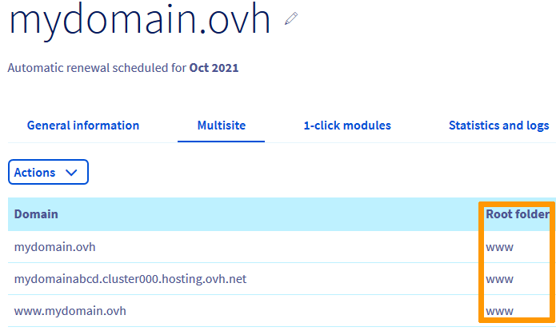

> [!primary]
> Tłumaczenie zostało wygenerowane automatycznie przez system naszego partnera SYSTRAN. W niektórych przypadkach mogą wystąpić nieprecyzyjne sformułowania, na przykład w tłumaczeniu nazw przycisków lub szczegółów technicznych. W przypadku jakichkolwiek wątpliwości zalecamy zapoznanie się z angielską/francuską wersją przewodnika. Jeśli chcesz przyczynić się do ulepszenia tłumaczenia, kliknij przycisk "Zgłóś propozycję modyfikacji" na tej stronie.
>

**Ostatnia aktualizacja z dnia 04-05-2023**

## Wprowadzenie 

Pojawi się strona **"Index of"** w przynajmniej jednym z następujących przypadków:

- Konfiguracja [MultiSite](/pages/web_cloud/web_hosting/multisites_configure_multisite) Twojej domeny nie została poprawnie skonfigurowana w katalogu docelowym
- Folder docelowy, do którego Twoja nazwa domeny nie zawiera plików **"index.html"** lub **"index.php"**

{.thumbnail}

**Dowiedz się, jak naprawić wyświetlanie strony "Index of".**

> [!warning]
>
> OVHcloud oddaje do Twojej dyspozycji usługi, których konfiguracja, zarządzanie i odpowiedzialność spoczywają na Ciebie. W związku z tym należy zapewnić ich prawidłowe funkcjonowanie.
>
> Oddajemy w Twojej ręce niniejszy przewodnik, którego celem jest pomoc w jak najlepszym wykonywaniu bieżących zadań. W przypadku trudności zalecamy skorzystanie z pomocy [wyspecjalizowanego usługodawcy](https://partner.ovhcloud.com/pl/directory/) i lub kontakt z producentem oprogramowania. Niestety firma OVHcloud nie będzie mogła udzielić wsparcia w tym zakresie. Więcej informacji znajduje się w sekcji [Sprawdź również](#gofurther) ten przewodnik.

>

## Wymagania początkowe

- Posiadanie [domeny](https://www.ovhcloud.com/pl/domains/)
- Posiadanie [hostingu](https://www.ovhcloud.com/pl/web-hosting/)
- Zalogowanie do [Panelu klienta OVHcloud](https://www.ovh.com/auth/?action=gotomanager&from=https://www.ovh.pl/&ovhSubsidiary=pl)

## W praktyce

### Zrozumieć pochodzenie strony "Index of"

Twoja domena jest zadeklarowana, aby uzyskać dostęp do katalogu docelowego ("`Katalog główny`") na serwerze [FTP](/pages/web_cloud/web_hosting/ftp_connection) na hostingu. Jest to w zakładce [MultiSite](/pages/web_cloud/web_hosting/multisites_configure_multisite) Twojego hostingu w [Panelu klienta OVHcloud](https://www.ovh.com/auth/?action=gotomanager&from=https://www.ovh.pl/&ovhSubsidiary=pl).

Strona **Index of** wskazuje, że dany katalog docelowy nie zawiera pliku **index.php** lub **index.html**. Plik ten stanowi "*punkt wejścia*" Twojej strony WWW. Nazwa tego pliku jest znormalizowana.

Aby wyświetlić Twoją stronę WWW, w części hostingu `Multisite`{.action} należy powiązać domenę z katalogiem głównym, który zawiera ten plik **index.php** lub **index.html*.

> [!primary]
>
> Aby tymczasowo powiązać domenę z `Katalogiem głównym` niezawierającym pliku **index.php** lub **index.html**, możesz zablokować wyświetlanie listy katalogów na swojej stronie internetowej zgodnie z tym [tutorial](/pages/web_cloud/web_hosting/htaccess_what_else_can_you_do#blokada-listowania-zawartosci-katalogu). Możesz również chronić dostęp do Twoich katalogów za pomocą [hasła](/pages/web_cloud/web_hosting/htaccess_protect_directory_by_password).
>
> W przypadku trudności z wdrożeniem tej konfiguracji zalecamy skorzystanie z [pomocy specjalisty](https://partner.ovhcloud.com/pl/directory/). Zespół pomocy technicznej OVHcloud nie będzie w stanie udzielić wsparcia w przypadku jakichkolwiek zmian w wewnętrznym programowaniu Twojej strony WWW.

### Rozwiąż najczęstszy przypadek na stronie "Index of"

Przeprowadziłeś pliki strony **mydomain.ovh** do katalogu `www` hostingu przez [FTP](/pages/web_cloud/web_hosting/ftp_connection). Poza tym Twoja domena nie jest powiązana z tym folderem w kolumnie `Katalog główny` Twojej strony w opcji `MultiSite`{.action}.

{.thumbnail}

Zmień `Katalog główny` klikając przycisk `...`{.action} po prawej stronie tabeli, a następnie `Zmień domenę`{.action}:

{.thumbnail}

W oknie, które się wyświetla:

* Zaznacz kratkę `Zmień również ustawienia subdomeny www.mydomain.ovh.`{.action} (1);
* Wskaż katalog zawierający plik **index.php** lub **index.html** Twojej strony jako `Katalog główny` (2);
* Kliknij `Dalej` (3).

{.thumbnail}

> [!primary]
>
> Używanie katalogu `www` jako `Katalogu główny` nie jest w żadnym wypadku obowiązkowe. Możesz zainstalować Twoją stronę WWW w innym katalogu Twojego [serwera FTP](/pages/web_cloud/web_hosting/ftp_connection).
>

W następnym oknie kliknij `Zatwierdź`{.action}.

{.thumbnail}

W ciągu kilku minut (odświeżając przeglądarkę) otrzymasz następujący wynik:

{.thumbnail}

Sprawdź, czy Twoja strona wyświetla się poprawnie. W przeciwnym razie zrestartuj urządzenie i w razie potrzeby wyczyść cache przeglądarki.

Upewnij się również, czy w Twoim katalogu docelowym znajduje się plik **index.php** lub **index.html**.

## Sprawdź również 

[Rozwiąż najczęstsze błędy związane z modułami za pomocą 1 kliknięcia](/pages/web_cloud/web_hosting/diagnostic_errors_module1clic)

[Usunięcie błędu "Strona nie została zainstalowana"](/pages/web_cloud/web_hosting/multisites_website_not_installed)

[Instalacja kilku stron WWW na jednym hostingu](/pages/web_cloud/web_hosting/multisites_configure_multisite)

W przypadku wyspecjalizowanych usług (pozycjonowanie, rozwój, etc.) skontaktuj się z [partnerami OVHcloud](https://partner.ovhcloud.com/pl/directory/).

Jeśli chcesz otrzymywać wsparcie w zakresie konfiguracji i użytkowania Twoich rozwiązań OVHcloud, zapoznaj się z naszymi [ofertami pomocy](https://www.ovhcloud.com/pl/support-levels/).

Dołącz do społeczności naszych użytkowników na stronie <https://community.ovh.com/en/>. 