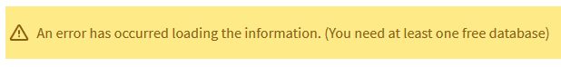
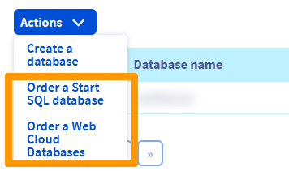
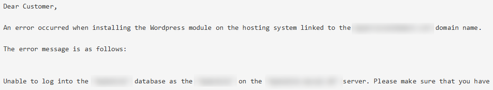
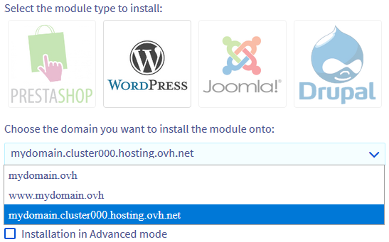
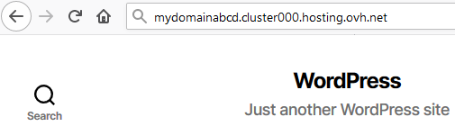

**Last updated 15rd February 2023**

## Objective

Creating a [1-click module](/pages/web_cloud/web_hosting/cms_install_1_click_modules) in automatic or advanced mode can produce various issues.

**This guide explains how to diagnose the most common cases of errors when creating 1-click modules.**

> [!warning]
> OVHcloud is providing you with services for which you are responsible, with regard to their configuration and management. You are therefore responsible for ensuring they function correctly.
>
> This guide is designed to assist you in common tasks as much as possible. Nevertheless, we recommend that you contact a [specialist service provider](https://partner.ovhcloud.com/en-gb/directory/) and/or discuss the issue with our community on if you face difficulties or doubts. You can find more information in the [Go further](#gofurther) section of this guide.
>

## Requirements

- A compatible [OVHcloud Web Hosting plan](https://www.ovhcloud.com/en-gb/web-hosting/)
- Access to the [OVHcloud Control Panel](https://www.ovh.com/auth/?action=gotomanager&from=https://www.ovh.co.uk/&ovhSubsidiary=GB)
- Using the [1-click module](/pages/web_cloud/web_hosting/cms_install_1_click_modules) feature to create a new website

## Instructions

> [!primary]
>
> We point out the most common errors here. If you have further difficulties, please consult our [Web Hosting FAQ](/pages/web_cloud/web_hosting/faq-web_hosting).
>

### "An error has occurred loading the information. (You need at least one free database)"

{.thumbnail}

This message might appear when you try to auto-create a new module. Each 1-click module needs one database to function and the error occurs when the hosting currently has no unused database available. The following solutions might be considered:

#### Solution 1: change your hosting plan

> [!primary]
>
> View our comparison of different [hosting plans](https://www.ovhcloud.com/en-gb/web-hosting/).
>

In the [OVHcloud Control Panel](https://www.ovh.com/auth/?action=gotomanager&from=https://www.ovh.co.uk/&ovhSubsidiary=GB), click on `Web Cloud`{.action}, then `Hosting plans`{.action}. Select the plan concerned, then click `Upgrade` in the `Plan` section.

{.thumbnail}

With the [Pro](https://www.ovhcloud.com/en-gb/web-hosting/professional-offer/) and [Performance](https://www.ovhcloud.com/en-gb/web-hosting/performance-offer/) offers, you can create up to three additional 1-click modules. **Performance** hosting plans also allow you to enable a [Web Cloud Databases](https://www.ovh.co.uk/cloud/cloud-databases/) for free.

#### Solution 2: delete an unused database 

> [!warning]
>
> A database deletion is permanent. Its backups would also be deleted. If you are unsure about the changes you need to make, contact your webmaster or one of our [partners](https://partner.ovhcloud.com/en-gb/directory/).
>

To delete a database in the [OVHcloud Control Panel](https://www.ovh.com/auth/?action=gotomanager&from=https://www.ovh.co.uk/&ovhSubsidiary=GB), click on `Web Cloud`{.action}, then `Hosting plans`{.action}, then on the `Databases`{.action} tab. Make sure to delete the correct database via the `...`{.action} button.

{.thumbnail}

#### Solution 3: order new databases

In the [OVHcloud Control Panel](https://www.ovh.com/auth/?action=gotomanager&from=https://www.ovh.co.uk/&ovhSubsidiary=GB), click on `Web Cloud`{.action}, then `Hosting plans`{.action}. Switch to the `Databases`{.action} tab and click `Actions`{.action}.

{.thumbnail}

> [!primary]
>
> Check our various [database offers](https://www.ovhcloud.com/en-gb/web-hosting/options/start-sql/).
>

#### Solution 4: install your module on a database you already use

To install your module on an existing database, you will need to use the [advanced mode](/pages/web_cloud/web_hosting/cms_install_1_click_modules#advanced-module-installation).

To find your database login details, please check this [guide](/pages/web_cloud/web_hosting/cms_install_1_click_modules#advanced-module-installation).

### "The installation directory is not empty"

{.thumbnail}

After creating your module, you receive an email stating that your module’s creation failed for the installation directory is not empty.

This message means that the **Root folder** of your FTP web hosting space that your domain is linked to contains at least one file or folder.

To link your domain to another directory, click on `Modify domain`{.action} in the `Multisite`{.action} tab, then enter the name of a new **Root folder**. (An empty directory will be created automatically on your web hosting.)

{.thumbnail}

You can also log in to your hosting plan via [FTP](/pages/web_cloud/web_hosting/ftp_connection) then delete or move the folder content after backing it up.

### "An error has occurred loading the information. (There is not enough space on your hosting (you need at least xxx MB))"

{.thumbnail}

This message indicates that the [storage space](/pages/web_cloud/web_hosting/ftp_connection) of your hosting has too much data. You must delete or move one before you can install a new [1-click module](/pages/web_cloud/web_hosting/cms_install_1_click_modules).

In this situation, [log in via FTP](/pages/web_cloud/web_hosting/ftp_connection) to your hosting plan, [back up locally](/pages/web_cloud/web_hosting/ftp_filezilla_user_guide#file-transfers) your data, then delete the files that are not necessary for your website to work properly.

> [!primary]
>
> If you have any questions about which data to delete in order to reduce the amount of data on your hosting plan, please contact our [user community](https://community.ovh.com/en/) or [OVHcloud partners](https://partner.ovhcloud.com/en-gb/directory/). 
> We will not be able to assist you with this.
>

### "Unable to connect to database" 

{.thumbnail}

After launching your module installation in advanced mode, you receive an email stating that your module cannot connect to the specified database.

First check your [database credentials](/pages/web_cloud/web_hosting/cms_install_1_click_modules#advanced-module-installation).

Then delete your module via the `1-click modules`{.action} tab.

{.thumbnail}

Then try installing a new module.

### "You have insufficient rights on this database."

{.thumbnail}

Your database can no longer be modified because the amount of data in your database exceeds the limit. This message appears when installing a module in [advanced mode](/pages/web_cloud/web_hosting/cms_install_1_click_modules#advanced-module-installation).

In this situation, install your module via [simple mode](/pages/web_cloud/web_hosting/cms_install_1_click_modules#basic-module-installation) or choose another database when installing it in advanced mode. If required, order an additional [database service](https://www.ovh.co.uk/web-hosting/sql-options.xml).

If you don't have any other databases and you don't want to order an additional database, [import a copy of your database](/pages/web_cloud/web_hosting/sql_database_export#instructions) then delete any unnecessary data.

> [!warning]
>
> **Deleting items in your database may cause your site to shut down.**
>
> For any further questions, please contact our [user community](https://community.ovh.com/en/) or [OVHcloud partners](https://partner.ovhcloud.com/en-gb/directory/). 
> We will not be able to assist you with this.
>

### "Can't connect to database 'xxxxxxxx' at 'xxxxxx-xxx.eu.clouddb.ovh.net'. The error is: Access denied for user 'xxxx'@'xxxxxx' (using password: YES)"

{.thumbnail}

You have launched the installation of a 1-click module in [advanced mode](/pages/web_cloud/web_hosting/cms_install_1_click_modules#basic-module-installation) on a database located on a [Web Cloud Databases server](/pages/web_cloud/web_cloud_databases/starting_with_clouddb). You received this error message by email. This means that the user logged in during the installation does not have sufficient rights to the database, or that the credentials entered are incorrect.

In this situation, first modify the [user rights](/pages/web_cloud/web_cloud_databases/create-db-and-user-on-db-server#managing-user-rights) concerned, so that they have **Administrator** or **Read/write** rights on the database.

You can also verify your login details by [connecting directly](/pages/web_cloud/web_cloud_databases/connecting-to-database-on-database-server#instructions) to your database server. Then run the module installation again.

### "Can't connect to database 'xxxxxxxx' at 'xxxxxxxx.mysql.db'. The error is: Unknown MySQL server host 'xxxxxxxx.mysql.db'"

{.thumbnail}

You have launched the installation of a 1-click module in [advanced mode](/pages/web_cloud/web_hosting/cms_install_1_click_modules#advanced-module-installation) on a database located on a [Web Cloud Databases server](/pages/web_cloud/web_cloud_databases/starting_with_clouddb). You received this error message by email. This means that the database server name you specified is incorrect.

Click on the `Web Cloud`{.action} section of your [OVHcloud Control Panel](https://www.ovh.com/auth/?action=gotomanager&from=https://www.ovh.co.uk/&ovhSubsidiary=GB) then on the `Databases`{.action} tab on the left-hand side of your screen.

Then click on the solution concerned: The name of the server to be used is indicated under `Host name` in the `SQL` section of `Login information`.
 
### Your domain name is not offered when you create the module

{.thumbnail}

Click on the `Multisite`{.action} tab and perform the following checks:

|Scenario|What to do|
|---|---|
|The domain or subdomain linked to the website you want to create does not appear in the `Multisite`{.action} section.|Add your domain by following [this guide](/pages/web_cloud/web_hosting/multisites_configure_multisite#step-21-adding-an-ovhcloud-registered-domain).|
|The domain name has been deleted from the `Multisite`{.action} without any action on your side.|If your domain or its [DNS zone](/pages/web_cloud/domains/dns_zone_edit#understanding-dns) is not managed from your [OVHcloud Control Panel](https://www.ovh.com/auth/?action=gotomanager&from=https://www.ovh.co.uk/&ovhSubsidiary=GB), follow this [guide](/pages/web_cloud/web_hosting/multisites_configure_multisite#step-22-adding-an-external-domain) to add your domain name to the `Multisite`{.action}.|

### Your module appears under a web address such as "xxxxx.cluster0xx.hosting.ovh.net"

{.thumbnail}

Back up the actual **1-click module** and its **Database**, if necessary. Then, [delete your module](#deleteModule), then its [database](#deleteDB) and create a new module on the correct `Domain name`.

### Your old website is still displayed

This can have several causes: 

- You have recently changed your [DNS zone](/pages/web_cloud/domains/dns_zone_edit#understanding-dns) or DNS servers, or you have [transferred your domain name](/pages/web_cloud/domains/transfer_incoming_generic_domain). Wait until these operations are completed (48 hours for changes on your `DNS servers`). Restart your devices regularly (PC, smartphone, internet connection, etc.) and refresh your web browser’s cache.

- Your domain name is still linked to your old hosting plan. In this case, edit your [DNS Zone](/pages/web_cloud/domains/dns_zone_edit#edit-your-domain-names-ovhcloud-dns-zone) or [DNS servers](/pages/web_cloud/domains/dns_server_general_information#modifying-dns-servers), or contact your old hosting provider to do so.

### The "Administrator" password to access the "back-office" of your 1-click module no longer works 

If your current password to access your CMS admin interface is rejected, please read the “Change your module password” paragraph in our documentation on [managing your 1-click module](/pages/web_cloud/web_hosting/cms_manage_1_click_module#password-change).

## Go further 

For specialised services (SEO, development, etc.), contact [OVHcloud partners](https://partner.ovhcloud.com/en-gb/directory/).

If you would like assistance using and configuring your OVHcloud solutions, please check our [support offers](https://www.ovhcloud.com/en-gb/support-levels/).

Join our community of users on <https://community.ovh.com/en/>.
