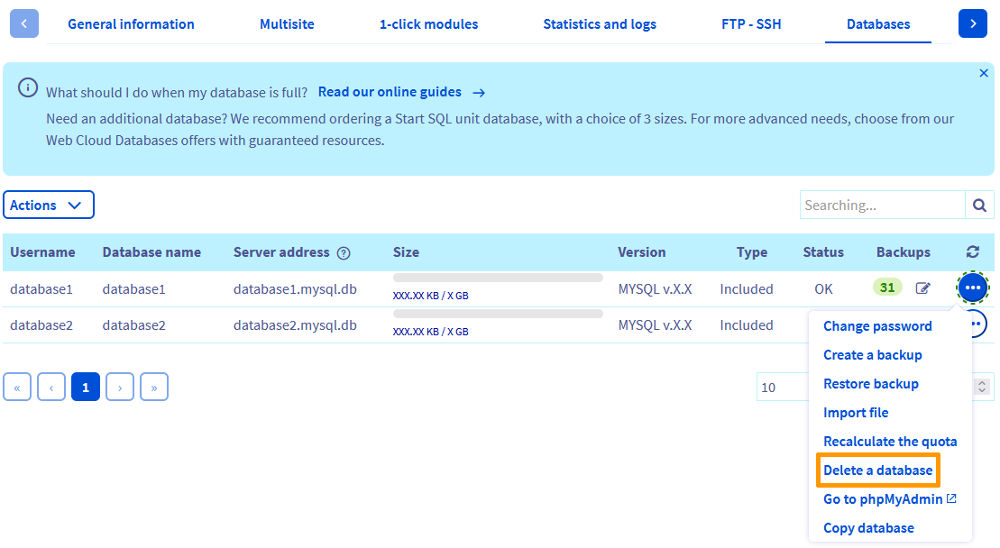

## Objectif

Les « [modules en 1 clic](/pages/web_cloud/web_hosting/cms_install_1_click_modules) » permettent de créer votre site web rapidement. Cette technologie permet de créer votre site web en utilisant les **C**ontent **M**anagement **S**ystem (**CMS**) les plus connus, comme *Wordpress*, *Joomla!*, *Drupal* ou *PrestaShop*.
Cependant, si la configuration de ces derniers n'est pas correctement réalisée, l’installation du « module en 1 clic » peut échouer et/ou occasionner des dysfonctionnements.

**Découvrez comment diagnostiquer les cas les plus courants d'erreurs liées aux créations de « module en 1 clic »**

> [!warning]
>
> OVHcloud met à votre disposition des services dont la configuration, la gestion et la responsabilité vous incombent. Il vous revient de ce fait d'en assurer le bon fonctionnement.
>
> Nous mettons à votre disposition ce guide afin de vous accompagner au mieux sur des tâches courantes. Néanmoins, nous vous recommandons de faire appel à un [prestataire spécialisé](/links/partner) et/ou de contacter l'éditeur du service si vous éprouvez des difficultés. En effet, nous ne serons pas en mesure de vous fournir une assistance. Plus d'informations dans la section « [Aller plus loin](#go-further) » de ce guide.
>

## Prérequis

- Disposer d'une offre d'[hébergement web](/links/web/hosting) compatible.
- Être connecté à l'[espace client OVHcloud](/links/manager).
- Avoir utilisé la fonctionnalité « [Module en 1 clic](/pages/web_cloud/web_hosting/cms_install_1_click_modules) » pour créer un nouveau site web.

## En pratique

> [!primary]
>
> Vous trouverez ici les erreurs les plus courantes. Si vous rencontrez une situation différente de celles présentées, consultez notre [FAQ sur les hébergements Web](/pages/web_cloud/web_hosting/faq-web_hosting).
>

### Votre nom de domaine n'est pas proposé lors de la création du « module en 1 clic »

{.thumbnail}

Connectez-vous à votre [espace client OVHcloud](/links/manager), puis rendez-vous dans la partie `Web Cloud`{.action}. Cliquez sur `Hébergements`{.action} dans la colonne de gauche, puis sélectionnez l'hébergement web concerné par l'installation. Sur la page qui s'affiche, cliquez sur l’onglet `Multisite`{.action}, puis effectuez les vérifications suivantes :

|Scénario|Solution|
|---|---|
|Le domaine ou le sous-domaine lié au site web que vous souhaitez créer n'apparaît pas dans le tableau présent dans l'onglet `Multisite`{.action}.|Ajoutez votre domaine en suivant [ces indications](/pages/web_cloud/web_hosting/multisites_configure_multisite).|
|Le nom de domaine a été supprimé du multisite sans action de votre part.|Si votre domaine ou sa [Zone DNS](/pages/web_cloud/domains/dns_zone_edit) ne sont pas gérés depuis votre compte OVHcloud, ajoutez votre domaine depuis l'onglet `Multisite`{.action} en suivant [ce guide](/pages/web_cloud/web_hosting/multisites_configure_multisite).|

### « Une erreur s'est produite lors du chargement des informations (You need at least one free database) »

{.thumbnail}

Ce message apparaît quand vous lancez l'installation de votre « module en 1 clic » lorsque vous n'avez pas ou plus la possibilité de créer une nouvelle base de données associée à votre hébergement web.

#### Solution n°1 : commander une nouvelle base de données

Si vous n'avez plus de bases de données incluses avec votre hébergement web, vous pouvez commander une nouvelle [base de données Start SQL](/links/web/hosting-options-startsql) tout en l'associant à votre hébergement web actuel. Vous pourrez ensuite relancer l’installation du « module en 1 clic ». Si vous avez besoin de plus d’espace de stockage (supérieur à 1 Go), nous vous recommandons plutôt d'utiliser notre service [Web Cloud Databases](/links/web/databases).

Dans votre [espace client OVHcloud](/links/manager), rendez-vous dans la partie `Web Cloud`{.action}. Cliquez sur `Hébergements`{.action} dans la colonne de gauche, puis sélectionnez l'hébergement web concerné par l'ajout d'une base de données supplémentaire. Sur la page qui s'affiche, cliquez sur l'onglet `Bases de données`{.action}, puis sur `Actions`{.action} pour commander une base de données supplémentaire:

{.thumbnail}

Une fois terminé, vous serez en mesure d'installer un nouveau « module en 1 clic ».

> [!primary]
>
> Pour rappel, n'hésitez pas à consulter au préalable nos offres de base de données unitaires [start SQL](/links/web/hosting-options-startsql), ainsi que notre offre [Web Cloud Databases](/links/web/databases).
>

#### Solution n°2 : modifier votre offre d'hébergement web

> [!primary]
>
> Retrouvez le comparatif de nos différentes [offres d'hébergement](/links/web/hosting).
>

Dans votre [espace client OVHcloud](/links/manager), cliquez sur `Web Cloud`{.action}. Cliquez sur `Hébergements`{.action}, puis sélectionnez l'hébergement web concerné. Sur la page qui s'affiche dans la partie `Abonnement` - `Offre`, cliquez sur le bouton `...`{.action} `Changer d'offre`{.action} :

{.thumbnail}

Les offres [Pro](/links/web/hosting-professional-offer) et [Performance](/links/web/hosting-performance-offer) vous permettront de créer jusqu'à trois « modules en 1 clic » supplémentaires avec une base de données indépendante pour chacun d'eux. Les offres **Performance** vous permettront aussi d'activer gratuitement un serveur [Web Cloud Databases](/links/web/databases).

Une fois terminé, vous serez en mesure d'installer un nouveau « module en 1 clic ».

#### Solution n°3 : supprimer une base de données inutilisée 

> [!warning]
>
> L'opération de suppression d'une base de données est définitive. Elle entraîne également la suppression des sauvegardes de la base de données concernée. En cas de doutes, contactez votre webmaster ou l'un de nos [partenaires](/links/partner).
>

Pour supprimer une base de données depuis votre [espace client OVHcloud](/links/manager), rendez-vous dans la partie `Web Cloud`{.action}. Cliquez sur `Hébergements`{.action} dans la colonne de gauche, puis sélectionnez l'hébergement Web concerné.

Sur la page qui s'affiche, cliquez sur l'onglet `Bases de données`{.action}. Dans le tableau qui apparaît, cliquez sur le bouton `...`{.action} à droite de la ligne correspondant à la base de données que vous souhaitez supprimer, puis sur `Supprimer la base de données`{.action} :

{.thumbnail}

Une fois terminé, vous serez en mesure d'installer un nouveau « module en 1 clic ».

#### Solution n°4 : installer votre « module en 1 clic » sur une base de données déjà utilisée

Pour installer votre « module en 1 clic » sur une base de données déjà existante, vous devrez utiliser la fonctionnalité d'installation en [mode avancé](/pages/web_cloud/web_hosting/cms_install_1_click_modules) d'un nouveau « module en 1 clic ».

Pour retrouver les identifiants de votre base de données, consultez notre guide [Installer votre site web avec un « module en 1 clic » (CMS)](/pages/web_cloud/web_hosting/cms_install_1_click_modules).

Si vous possédez un serveur [Web Cloud Databases](/pages/web_cloud/web_cloud_databases/starting_with_clouddb), vous pouvez créer une base de données de la taille de votre choix, dans la limite de l'espace disque allouée.

Une fois terminé, vous serez en mesure d'installer un nouveau « module en 1 clic ».

> [!primary]
>
> Dans cette situation, vous pourrez sauvegarder les données d'un seul site web en utilisant un [script PHP ou une commande SSH](/pages/web_cloud/web_hosting/sql_database_export).
>
> Pour toute question sur les manipulations à réaliser, contactez la [communauté OVHcloud](/links/community) ou l'un de nos [partenaires](/links/partner). 
> Nous ne serons pas en mesure de vous apporter une assistance sur ce sujet.
>

### Votre « module en 1 clic » s'affiche sur une adresse web de type « xxxxx.cluster0xx.hosting.ovh.net »

{.thumbnail}

Après avoir réalisé toutes les sauvegardes nécessaires, [supprimez votre « module en 1 clic »](#delete-the-module), puis sa [base de données](#delete-the-database). Relancez ensuite l'installation de votre « module en 1 clic » sur le nom de domaine souhaité.

### « Le répertoire d'installation n'est pas vide »

{.thumbnail}

Après avoir lancé la création de votre « module en 1 clic », vous avez reçu un e-mail indiquant que le répertoire d'installation de votre « module en 1 clic » n'est pas vide.

Ce message signifie que le **Dossier racine** associé à votre nom de domaine contient déjà un ou plusieurs fichiers ou dossiers.

Pour relier votre nom de domaine à un autre répertoire, connectez-vous à votre [espace client OVHcloud](/links/manager), puis rendez-vous dans la partie `Web Cloud`{.action}. Cliquez sur `Hébergements`{.action} dans la colonne de gauche, puis sélectionnez l'hébergement Web concerné. Sur la page qui s'affiche, cliquez sur l'onglet `Multisite`{.action}. Dans le tableau qui apparaît, cliquez sur le bouton `...`{.action} à droite de la ligne correspondant à votre nom de domaine, puis cliquez sur `Modifier le domaine`{.action}. Enfin, indiquez le nom d'un nouveau **Dossier racine** (un répertoire vide sera créé automatiquement sur votre hébergement web).

{.thumbnail}

Vous pouvez également vous connecter à votre hébergement web via le protocole [FTP](/pages/web_cloud/web_hosting/ftp_connection), puis supprimer le contenu du dossier. Ceci après l'avoir sauvegardé en local ou après l'avoir vidé en déplaçant tout son contenu dans un autre répertoire FTP.

### « Either no configuration (ovhConfig or runtime), or the current configuration is not valid (please, double check the module's requirement) (as a reminder, the global configuration is used for module). »

Ce message indique que le fichier « .ovhconfig » est inexistant ou invalide pour pouvoir installer votre « module en 1 clic ». Ce fichier contient la version de PHP et l'environnement d'exécution appliqués à votre hébergement web.

Il est recommandé d'utiliser la version de PHP la plus récente possible. **Avant** de changer la configuration du fichier « .ovhconfig », si vous disposez d'autres sites web sur votre hébergement web, assurez-vous que ces derniers sont compatibles avec la nouvelle version de PHP et/ou le nouvel environnement d'exécution que vous allez appliquer sur votre hébergement web.

Pour vérifier cette configuration, consultez notre guide « [Modifier la configuration de son hébergement web](/pages/web_cloud/web_hosting/configure_your_web_hosting) ».

### « Une erreur s'est produite lors du chargement des informations (There is not enough space on your hosting (you need at least xxx MB)) »

{.thumbnail}

Ce message indique que l'[espace de stockage FTP](/pages/web_cloud/web_hosting/ftp_connection) de votre hébergement web comporte un volume de données trop important. 

#### Solution n°1 : supprimer des données pour libérer de l'espace de stockage FTP

Dans ce cas, supprimez (ou déplacez) vos données pour installer un nouveau « [module en 1 clic](/pages/web_cloud/web_hosting/cms_install_1_click_modules) ».

Dans cette situation, [connectez-vous en FTP](/pages/web_cloud/web_hosting/ftp_connection) à votre hébergement web, [sauvegardez localement](/pages/web_cloud/web_hosting/ftp_filezilla_user_guide) vos données, puis supprimez les fichiers qui ne sont pas nécessaires au fonctionnement de votre site web.

> [!primary]
>
> Pour toute question concernant la suppression de données pour réduire la quantité de données sur votre hébergement web, contactez notre [communauté d'utilisateurs](/links/community) ou les [partenaires OVHcloud](/links/partner). 
> Le support OVHcloud n'est pas habilité à vous apporter une assistance à ce sujet.
>

#### Solution n°2 : modifier votre offre d'hébergement web

> [!primary]
>
> Retrouvez le comparatif de nos différentes [offres d'hébergement web](/links/web/hosting).
>

Dans votre [espace client OVHcloud](/links/manager), rendez-vous dans la partie `Web Cloud`{.action}. Cliquez sur `Hébergements`{.action}, puis sélectionnez l'hébergement web concerné. Sur la page qui s'affiche dans la partie `Abonnement` - `Offre`, cliquez sur le bouton `...`{.action} `Changer d'offre`{.action} :

{.thumbnail}

Les offres [Pro](/links/web/hosting-professional-offer) et [Performance](/links/web/hosting-performance-offer) vous permettront de créer jusqu'à trois « modules en 1 clic » supplémentaires avec une base de données indépendante pour chacun d'eux. Les offres **Performance** vous permettront aussi d'activer gratuitement un serveur [Web Cloud Databases](/links/web/databases).

### « Impossible de se connecter à la base de données » 

{.thumbnail}

Après avoir lancé l'installation de votre « module en 1 clic » en mode avancé, vous avez reçu un e-mail indiquant que votre « module en 1 clic » ne peut pas se connecter à la base de données indiquée.

Vous devez donc vérifier les identifiants de votre base de données. Pour les retrouver, consultez ce [guide](/pages/web_cloud/web_hosting/cms_install_1_click_modules).

Supprimez ensuite votre « module en 1 clic ». Pour cela, connectez-vous à votre [espace client OVHcloud](/links/manager), puis rendez-vous dans la partie `Web Cloud`{.action}. Cliquez sur `Hébergements`{.action} dans la colonne de gauche, puis sélectionnez l'hébergement Web concerné. Sur la page qui s'affiche, cliquez sur l'onglet `Modules en 1 clic`{.action}. Dans le tableau qui apparaît, cliquez sur le bouton `...`{.action} à droite de la ligne correspondant à votre nom de domaine, puis cliquez sur `Supprimer le module`{.action}.

{.thumbnail}

> [!warning]
>
> **Supprimer des éléments dans votre base de données peut entraîner une coupure de votre site web.**
>
> Veillez à supprimer uniquement l'installation que vous venez de lancer. Pour cela, vérifiez qu'il s'agit bien du répertoire concerné dans la colonne `Path` (chemin).
>

Puis relancez l'installation d'un nouveau « module en 1 clic ».

### « You have insufficient rights on this database. »

{.thumbnail}

Ce message apparaît exclusivement lors de l'installation d'un « module en 1 clic » en **mode avancé**. Votre base de données ne peut plus être modifiée, car la quantité de données qu'elle contient dépasse la limite autorisée. Dans ce cas, votre base de données est bloquée en lecture seule.

Dans cette situation, installez votre « module en 1 clic » en passant par le [mode « simple »](/pages/web_cloud/web_hosting/cms_install_1_click_modules) ou choisissez une autre base de données lors de son installation en mode avancé. Si besoin, commandez une [offre de bases de données](/links/web/hosting-options-startsql) complémentaire.

Si vous ne disposez pas d'autres bases de données et que vous ne souhaitez pas commander une offre complémentaire, [importez localement une copie de votre base](/pages/web_cloud/web_hosting/sql_database_export), puis supprimez les données inutiles.

> [!warning]
>
> **Supprimer des éléments dans votre base de données peut entraîner une coupure de votre site web.**
>
> Pour toute question complémentaire, contactez notre [communauté d'utilisateurs](/links/community) ou les [partenaires OVHcloud](/links/partner). 
> Nous ne serons pas en mesure de vous apporter une assistance sur ce sujet.
>

### « Can't connect to database 'xxxxxxxx' at 'xxxxxx-xxx.eu.clouddb.ovh.net'. The error is: Access denied for user 'xxxx'@'xxxxxxxx' (using password: YES) »

{.thumbnail}

Vous avez lancé l'installation d'un « module en 1 clic » en [mode avancé](/pages/web_cloud/web_hosting/cms_install_1_click_modules) sur une base de données située sur un serveur [Web Cloud Databases](/pages/web_cloud/web_cloud_databases/starting_with_clouddb). Vous avez reçu ce message d'erreur par e-mail. Il signifie que l'utilisateur indiqué lors de l'installation ne possède pas les droits suffisants sur la base de données ou que les identifiants indiqués sont incorrects.

Dans cette situation, modifiez tout d'abord les [droits de l'utilisateur](/pages/web_cloud/web_cloud_databases/create-db-and-user-on-db-server) concerné, afin qu'il dispose des droits **Administrateur** ou en **Lecture/écriture** sur la base de données.

Vérifiez également ses identifiants en vous [connectant directement](/pages/web_cloud/web_cloud_databases/connecting-to-database-on-database-server) à votre serveur de bases de données, puis relancez l'installation de votre « module en 1 clic ».

### « Can't connect to database 'xxxxxxxx' at 'xxxxxxxx.mysql.db'. The error is: Unknown MySQL server host 'xxxxxxxx.mysql.db' »

{.thumbnail}

Vous avez lancé l'installation d'un « module en 1 clic » en [mode avancé](/pages/web_cloud/web_hosting/cms_install_1_click_modules) sur une base de données située sur un serveur [Web Cloud Databases](/pages/web_cloud/web_cloud_databases/starting_with_clouddb). Vous avez reçu ce message d'erreur par e-mail. Il signifie que le nom de serveur de bases de données que vous avez indiqué est incorrect.

Pour retrouver le nom de votre serveur de bases de données , connectez-vous à votre [espace client OVHcloud](/links/manager), puis rendez-vous dans la partie `Web Cloud`{.action}. Cliquez sur `Web Cloud Databases`{.action} dans la colonne de gauche, puis sélectionnez le serveur de bases de données concerné.

Sur la page qui s'affiche, le nom du serveur à utiliser est indiqué dans l'encadré `Informations de connexion`, sous-partie `SQL`, sous la mention `Nom d'hôte`.

### Votre ancien site web continue de s'afficher

Dans l'onglet `Modules en 1 clic` de l'hébergement web contenant votre site web, lorsque vous cliquez sur le lien de votre site web dans la colonne `Chemin`, un nouvel onglet s'ouvre avec votre site web. Le nom de domaine associé à votre installation s'affiche dans l'adresse de votre navigateur internet. Par exemple, si votre nom de domaine se nomme « domain.tld », il se peut qu'un autre nom de domaine s'affiche, ou bien une page OVHcloud standard.

Ce dysfonctionnement peut avoir plusieurs causes :

- Vérifiez que le nom de domaine que vous consultez (« domain.tld ») est bien celui avec lequel vous venez de faire l'installation du « module en 1 clic ».

- Si vous avez effectué récemment un changement dans la [zone DNS active](/pages/web_cloud/domains/dns_zone_edit)/[serveurs DNS](/pages/web_cloud/domains/dns_server_edit) de votre nom de domaine ou un [transfert de nom de domaine](/pages/web_cloud/domains/transfer_incoming_generic_domain). Patientez jusqu'à ce que ces opérations soient finalisées (4-24 heures pour une modification dans la zone DNS et 24-48 heures pour une modification des serveurs DNS). N'oubliez pas également de redémarrer vos appareils (PC, smartphone, box, etc.) et à vider le cache de votre navigateur internet.

- Votre nom de domaine est toujours relié à votre ancien hébergement web. Modifiez dans ce cas la [zone DNS active](/pages/web_cloud/domains/dns_zone_edit) associée à votre nom de domaine ou ses [serveurs DNS](/pages/web_cloud/domains/dns_server_edit). Si la zone DNS active de votre nom de domaine n'est pas gérée chez OVHcloud, contactez votre fournisseur DNS à ce sujet.

### Le mot de passe « Administrateur » d'accès à « l'interface d'administration » de votre module en 1 clic ne fonctionne pas 

En cas de rejet de votre mot de passe actuel d'accès à l’interface d’administration de votre **C**ontent **M**anagement **S**ystem (**CMS**), consultez le paragraphe « Modifier le mot de passe de votre module » de notre documentation sur la [gestion de votre module en 1 clic](/pages/web_cloud/web_hosting/cms_manage_1_click_module).

### Le préfixe des tables de votre base de données est déjà utilisé sur votre base de données

Cette erreur ne concerne que les installations de « modules en 1 clic » en *mode avancé*.

Elle vous informe par e-mail que, lors de la tentative d'installation du « module en 1 clic », vous avez renseigné un préfixe de tables déjà utilisé sur la base de données précédemment sélectionnée pour installer votre « module en 1 clic ». L'installation est alors annulée. 

Relancez l'installation avec un autre préfixe de tables ou une autre base de données pour corriger la situation.

### Les DNS du nom de domaine ne pointent pas vers un hébergement web OVHcloud

Cette erreur vous informe que les entrées DNS du nom de domaine utilisé pour votre site web ne pointent pas vers un hébergement web OVHcloud. Or il n'est pas possible d'installer un « module en 1 clic » sur un domaine qui ne pointe pas sur un hébergement OVHcloud.
Pour résoudre cette situation, vous devez éditer votre zone DNS. Pour en savoir plus sur les adresses IP à renseigner, lisez le guide [Liste des adresses IP des clusters et hébergements web](/pages/web_cloud/web_cloud_databases/configure-database-server). Vous devrez ensuite [Éditer votre zone DNS](/pages/web_cloud/domains/dns_zone_edit).
Si votre zone DNS n’est pas hébergée chez OVHcloud, contactez votre fournisseur de zone DNS afin qu'il effectue le nécessaire.

Une fois terminé, relancez l'installation d'un nouveau « module en 1 clic ».

### Votre base de données nécessite d'être en version "X", or celle-ci est actuellement en version "Y"

Ce message reçu par e-mail vous informe que la version de votre base de données est trop ancienne pour installer votre « module en 1 clic ». 

Vous retrouverez dans ce même e-mail la version dans laquelle votre base de données doit se trouver. Trois possibilités s'offrent à vous :

- Mise à jour du **S**ystème de **G**estion de **B**ase de **D**onnées (SGBD tels que MySQL, PostgreSQL, MariaDB, etc.) dans une version plus récente.
- Installation d'une nouvelle base de données associée à votre hébergement web. Ceci en vous assurant que le SGDB et la version sont compatibles avec le « module en 1 clic » souhaité.
- Si vous possédez un serveur [Web Cloud Databases](/pages/web_cloud/web_cloud_databases/starting_with_clouddb), vérifiez que votre serveur utilise le bon SGBD et la bonne version puis créez la base de données de votre choix.

Une fois terminé, relancez l'installation d'un nouveau « module en 1 clic ».

## Aller plus loin 

[Installer son site avec les modules en 1 clic](/pages/web_cloud/web_hosting/cms_install_1_click_modules)

[Les problemes recurrents lors de l’utilisation d’un logiciel FTP](/pages/web_cloud/web_hosting/ftp_recurring_ftp_problems)

Pour des prestations spécialisées (référencement, développement, etc), contactez les [partenaires OVHcloud](/links/partner)

Si vous souhaitez bénéficier d'une assistance à l'usage et à la configuration de vos solutions OVHcloud, nous vous proposons de consulter nos différentes [offres de support](/links/support).

Échangez avec notre [communauté d'utilisateurs](/links/community).