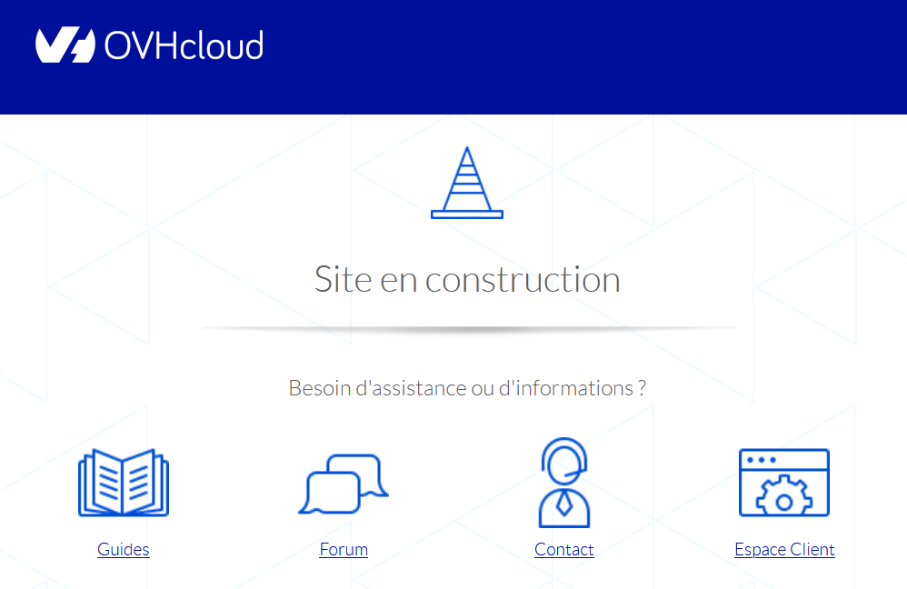
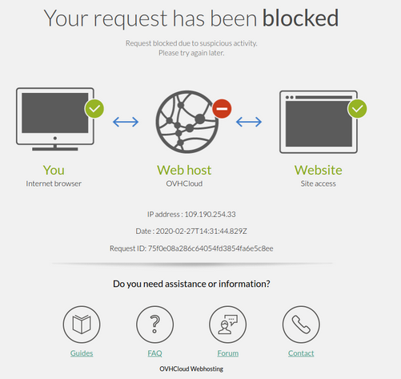
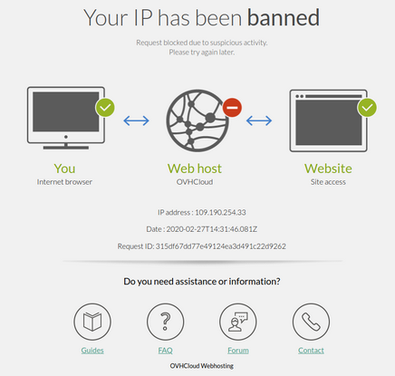

**Dernière mise à jour le 24/04/2023**

## Gestion de votre offre

### Comment configurer mon hébergement ?

Pour configurer votre hébergement, connectez-vous tout d'abord à votre [espace client OVHcloud](https://www.ovh.com/auth/?action=gotomanager&from=https://www.ovh.com/fr/&ovhSubsidiary=fr). Depuis la rubrique `Hébergements`, vous pourrez notamment gérer vos certificats SSL, la version PHP, l'option CDN, le multisite, les bases de données, etc.

**Trucs et Astuces** : Pour vous aider à configurer votre hébergement, nous vous invitons à prendre connaissance de la rubrique « *Premiers pas* » que vous retrouverez [ici](/products/web-cloud-hosting).

### Comment gérer mes mots de passe ?

Pour gérer vos mots de passe, vous devez tout d'abord vous connecter à votre [espace client OVHcloud](https://www.ovh.com/auth/?action=gotomanager&from=https://www.ovh.com/fr/&ovhSubsidiary=fr). En cas d'oubli de votre identifiant ou de votre mot de passe, cliquez sur `Identifiant ou mot de passe oublié`{.action} sous la fenêtre de connexion. Un e-mail vous sera envoyé avec une procédure de réinitialisation.

Vous pouvez également consulter le guide « [Modifier le mot de passe de votre compte](/pages/account_and_service_management/account_information/manage-ovh-password) ».

Une fois connecté à votre espace client :

- Pour modifier le mot de passe de votre espace FTP, suivez les instructions de [ce guide](/pages/web_cloud/web_hosting/ftp_change_password).
- Pour modifier le mot de passe de votre base de données, suivez les instructions de [ce guide](/pages/web_cloud/web_hosting/sql_change_password).
- Pour modifier le mot de passe de votre adresse e-mail MX Plan, suivez les instructions de [ce guide](/pages/web_cloud/email_and_collaborative_solutions/mx_plan/email_change_password).

### Comment mettre en ligne mon site ? 

Pour mettre en ligne votre site, vous devez disposer d'un [nom de domaine](https://www.ovhcloud.com/fr/domains/) qui correspondra à l'adresse Web depuis laquelle votre site sera accessible (exemple : *mondomaine.com*). Vous aurez également besoin d'un [hébergement](https://www.ovhcloud.com/fr/web-hosting/) sur lequel installer votre site.

Pour suivre les étapes nécessaires à la construction de votre site, consultez cette [page](https://www.ovhcloud.com/fr/web-hosting/uc-website/) puis suivez les instructions du guide « [Mettre en ligne un site Internet sur son hébergement web](/pages/web_cloud/web_hosting/hosting_how_to_get_my_website_online) ».

**Trucs et Astuces** : Pour vous aider à créer votre site, OVHcloud vous permet d'installer sur votre hébergement un logiciel d'assistance à la création de sites (WordPress, PrestaShop, Joomla! et Drupal), grâce la fonctionnalité [Modules en 1 clic](/pages/web_cloud/web_hosting/cms_install_1_click_modules).

### Comment transférer mon site et mes e-mails sur les serveurs OVHcloud ? 

Consultez le guide « [Migrer son site et ses e-mails vers OVHcloud](/pages/web_cloud/web_hosting/hosting_migrating_to_ovh) ».

### Comment héberger plusieurs sites web sur un même hébergement mutualisé ?

Consultez le guide « [Partager son hébergement entre plusieurs sites](/pages/web_cloud/web_hosting/multisites_configure_multisite) ».

### Comment changer de formule d'hébergement ?

Afin de commander la formule d'hébergement Web la plus adaptée à vos besoins, vous pouvez consultez nos offres sur [cette page](https://www.ovhcloud.com/fr/web-hosting/).

Une fois votre choix fait, suivez les instructions de notre documentation [« Faire évoluer son offre d’hébergement web »](/pages/web_cloud/web_hosting/how_to_upgrade_web_hosting_offer).

### Comment conserver l'offre e-mail liée à mon hébergement mutualisé lors d'une résiliation ?

Lorsque vous résiliez ou supprimez votre hébergement mutualisé, l'offre e-mail qui est attachée est également résiliée. Pour conserver vos adresses e-mails, il vous faudra détacher l'offre e-mail avant la résiliation de l'hébergement. 

Pour cela, dirigez-vous sur l'onglet `Informations générales`{.action} de votre hébergement. Dans la section **Configuration**, cliquez sur le bouton `...`{.action} à droite de « **Adresses e-mails** ». Cliquez sur `Délier mon option e-mail`{.action} et suivez les instructions pour commander une offre e-mail indépendante qui vous permettra de conserver vos adresses e-mails déjà créées.

### Lors d'une résiliation d'un hébergement mutualisé Performance, comment conserver l'offre Web Cloud Databases liée ?

Les hébergements mutualisés **Performance** comprennent une offre Web Cloud Databases activable gratuitement.
Lorsque vous résiliez ou supprimez votre hébergement mutualisé **Performance**, l'offre Web Cloud Databases qui est attachée est également résiliée. Pour conserver votre Web Cloud Databases, il vous faudra le détacher avant la résiliation de l'hébergement. 

Pour cela, cliquez sur l'onglet `Informations générales`{.action} de votre hébergement. Dans la section **Configuration**, cliquez sur le bouton `...`{.action} à droite de « **Web Cloud Databases** ». Cliquez sur `Délier`{.action} et suivez les instructions afin de commander une offre Web Cloud Databases indépendante, ce qui vous permettra de conserver votre Web Cloud Databases déjà créé.

### Comment augmenter la RAM d'une offre Web Cloud Databases liée à un hébergement mutualisé « Performance » ?

Pour augmenter la RAM d'une offre Web Cloud Databases liée à un hébergement mutualisé **Performance**, vous devrez obligatoirement et préalablement délier l'offre Web Cloud Databases de votre hébergement **Performance** pour basculer sur une offre supérieure.

Pour cela, connectez-vous à votre [espace client OVHcloud](https://www.ovh.com/auth/?action=gotomanager&from=https://www.ovh.com/fr/&ovhSubsidiary=fr). Rendez-vous dans la partie `Web Cloud`{.action} puis sur l'hébergement concerné à gauche dans l'onglet `Hébergements`{.action}. 

Sur la page `Informations générales`{.action} qui s'affiche, vous retrouvez un encadré intitulé `Configuration`{.action} au centre de la page. A droite de la mention `Web Cloud Databases`{.action}, cliquez sur le bouton `...`{.action} puis sur `Délier`{.action}. Choisissez la durée du renouvellement la plus courte puis poursuivez jusqu'à la validation de la commande.

Retrouvez plus d'informations dans notre guide sur la ["Configuration d'une offre Web Cloud Databases"](/pages/web_cloud/web_cloud_databases/configure-database-server#modify-ram-web-cloud-db)

**Cette action est irréversible et l'offre Web Cloud Databases sera ensuite facturée indépendamment de votre hébergement web Performance.**

## Diagnostic

> [!warning]
>
> Si vous rencontrez une anomalie non-répertoriée dans cette FAQ, consultez les pages « Diagnostic » de [notre documentation](/products/web-cloud-hosting).
>

### Que faire si mon site web dysfonctionne ? 

Plusieurs raisons peuvent expliquer le dysfonctionnement de votre site. Pour en identifier la cause, commencez par vérifier qu'aucun de vos abonnements n'a besoin d'être **renouvelé** en vous connectant à votre [espace client OVHcloud](https://www.ovh.com/auth/?action=gotomanager&from=https://www.ovh.com/fr/&ovhSubsidiary=fr).

Consultez ensuite les [évènements en cours sur notre infrastructure](https://www.status-ovhcloud.com/). Si tous vos services sont actifs et ne sont affectés par aucun incident ou maintenance, nous vous invitons à réaliser un diagnostic plus approfondi.

### Que faire si, après la mise en ligne de mon site, la page « Site en construction » d'OVHcloud reste affichée ?

{.thumbnail}

À l'installation de votre hébergement, OVHcloud met en place cette page d'attente sous la forme d'un fichier **index.html** contenu dans le dossier `www` de votre serveur FTP.

Ce fichier est automatiquement désactivé lors de la création de votre [module en 1 clic](/pages/web_cloud/web_hosting/cms_install_1_click_modules).

Si vous avez choisi [d'installer votre site manuellement](/pages/web_cloud/web_hosting/cms_manual_installation), [connectez-vous à votre espace FTP](/pages/web_cloud/web_hosting/ftp_connection) afin de le renommer en **index.html.old**.

### Que faire si mon site s'affiche sur une adresse web de type « xxxxx.cluster0xx.hosting.ovh.net » ?

{.thumbnail}

Deux scénarii sont possibles. Soit votre site a été créé avec cette adresse web, soit celle-ci est apparue suite à une modification.

#### Scénario 1 : votre site a été créé avec une adresse web de type « xxxxx.cluster0xx.hosting.ovh.net »

> [!warning]
>
> La suppression d'une base de données, comme celle d'un module en 1 clic, est définitive. Elle entraîne également la **suppression des sauvegardes** des données concernées. Avant de supprimer votre site sur l'hébergement OVHcloud, **assurez-vous d'être capable de le recréer à l'identique**. Si vous n'êtes pas certain des manipulations à effectuer, contactez votre Webmaster ou l'un de nos [partenaires](https://partner.ovhcloud.com/fr/directory/).
>

Dans le premier cas, après avoir réalisé toutes les sauvegardes nécessaires, supprimez votre module depuis la partie `Hébergements` de votre espace client OVHcloud :

{.thumbnail}

Puis supprimez sa base de données depuis l'onglet du même nom situé à droite de votre écran, toujours dans la partie `Hébergements` :

{.thumbnail}
 
Enfin, relancez son installation sur le nom de domaine souhaité, en utilisant la fonctionnalité [Module en 1 clic](/pages/web_cloud/web_hosting/cms_manage_1_click_module).

#### Scénario 2 : votre site s'affiche avec une adresse web de type « xxxxx.cluster0xx.hosting.ovh.net » suite à une modification

Si votre site s'affiche avec cette URL suite à une manipulation, restaurez-le à son état antérieur.

> [!alert]
>
> La restauration de votre hébergement OVHcloud entraînera celle de **l'ensemble des sites** qu'il contient.
>
> Lors d'une restauration, le contenu de votre espace FTP, ou celui de votre base de données, est remplacé par une sauvegarde. Vous ne pourrez donc pas récupérer ensuite les données présentes sur le serveur FTP ou celles de la base de données avant la restauration.
>

Pour restaurer le code source de votre site, consultez notre guide « [Restaurer l’espace de stockage de son hébergement web](/pages/web_cloud/web_hosting/ftp_save_and_backup) ».

Si votre site comporte une base de données, consultez notre guide « [Restaurer une sauvegarde de votre base de données](/pages/web_cloud/web_hosting/sql_importing_mysql_database#restaurer-une-sauvegarde-depuis-lespace-client) ».

### Que faire si mon site redirige vers le webmail OVHcloud ?

{.thumbnail}

Cette anomalie indique une configuration erronée au niveau des [serveurs DNS](/pages/web_cloud/domains/dns_server_general_information) ou de la [zone DNS](/pages/web_cloud/domains/dns_zone_edit) associés à votre nom de domaine.

Le cas le plus courant est le suivant : vous avez commandé séparément votre nom de domaine et votre hébergement, ils ne sont donc pas reliés entre eux via leur zone DNS.

Rendez-vous dans la partie `Domaines`{.action} de votre [espace client OVHcloud](https://www.ovh.com/auth/?action=gotomanager&from=https://www.ovh.com/fr/&ovhSubsidiary=fr). Cliquez sur le nom de domaine concerné puis sur l'onglet `Serveurs DNS`{.action}.

Notez ensuite les serveurs DNS indiqués puis rendez-vous dans l'onglet `Zone DNS`{.action}.

Comparez les `Cibles` des entrées de type `NS` indiquées dans l'onglet `Zone DNS`{.action} avec les `Serveurs DNS` indiqués dans l'onglet du même nom :

- Si les éléments sont identiques, remplacez la cible `213.186.33.5` par le code à quatre nombres noté dans l'onglet `Informations générales` sous la mention `IPv4` (pour plus de détails sur les manipulations à effectuer, suivez les instructions de [ce guide](/pages/web_cloud/domains/dns_zone_edit#en-pratique)).

- Si les éléments ne sont pas identiques, mais que les `Serveurs DNS` indiqués dans l'onglet du même nom apparaissent dans [cette liste](/pages/web_cloud/web_hosting/clusters_and_shared_hosting_IP), effectuez une réinitialisation en suivant les instructions de [ce guide](/pages/web_cloud/domains/dns_server_general_information#reinitialiser-les-serveurs-dns).

- Si les éléments ne sont pas identiques et que les `Serveurs DNS` indiqués dans l'onglet du même nom n'apparaissent pas dans [cette liste](/pages/web_cloud/web_hosting/clusters_and_shared_hosting_IP), contactez votre Webmaster ou recherchez un [prestataire spécialisé](https://partner.ovhcloud.com/fr/directory/) via la page des [partenaires OVHcloud](https://partner.ovhcloud.com/fr/directory/).

### Que faire si mon site affiche une erreur « La page ne se redirige pas correctement » ?

{.thumbnail}

> [!alert]
>
> La restauration de votre hébergement OVHcloud entraînera celle de l'ensemble des sites qu'il contient.
>
> Lors d'une restauration, le contenu de votre espace FTP, ou celui de votre base de données, est remplacé par une sauvegarde. Vous ne pourrez donc pas récupérer ensuite les données présentes sur le serveur FTP ou celles de la base de données juste avant la restauration.
>

Restaurez votre site à son état précédent :

- Pour restaurer le code source de votre site, consultez notre guide « [Restaurer l’espace de stockage de son hébergement web](/pages/web_cloud/web_hosting/ftp_save_and_backup) ».

- Si votre site comporte une base de données, consultez notre guide « [Restaurer une sauvegarde de votre base de données](/pages/web_cloud/web_hosting/sql_importing_mysql_database#restaurer-une-sauvegarde-depuis-lespace-client) ».

Si les restaurations ne vous permettent pas de rétablir l'accès à votre site, contactez votre Webmaster ou recherchez un [prestataire spécialisé](https://partner.ovhcloud.com/fr/directory/) sur le site des [partenaires OVHcloud](https://partner.ovhcloud.com/fr/directory/).

### Que faire si mon site affiche une erreur « 503 error Backend fetch failed (Varnish cache) » ?

{.thumbnail}

Si vous avez activé [l'option CDN](/pages/web_cloud/web_hosting/cdn_how_to_use_cdn) de votre hébergement, désactivez le mode *Maintenance* sur votre site WordPress ou PrestaShop.

Si vous n'avez pas activé cette option ni utilisé le mode *Maintenance*, contactez votre Webmaster ou recherchez un [prestataire spécialisé](https://partner.ovhcloud.com/fr/directory/) sur le site des [partenaires OVHcloud](https://partner.ovhcloud.com/fr/directory/).

### Que faire si mon site affiche une erreur « Your request has been blocked » ?

{.thumbnail}

Ce message indique que le type de requête HTTP que vous tentez de faire sur votre site est interdit pour un temps limité. Dans cette situation, [examinez les logs](/pages/web_cloud/web_hosting/logs_and_statistics) de votre site afin de déterminer quelles requêtes ont provoqué ce blocage.

Pour vous aider à corriger ces anomalies, contactez votre Webmaster ou l'un de nos [partenaires](https://partner.ovhcloud.com/fr/directory/).

### Que faire si mon site affiche une erreur « Your IP has been banned » ?

{.thumbnail}

Ce message indique que l'adresse IP que vous utilisez pour vous connecter à votre site est bloquée pour un temps limité. 

Dans cette situation, [examinez les logs](/pages/web_cloud/web_hosting/logs_and_statistics) de votre site, afin de déterminer quelles requêtes ont provoqué ce blocage. 
Vérifiez également que votre poste informatique n'est pas infecté par un virus. 
Vous pouvez enfin contacter l'un de [nos partenaires](https://partner.ovhcloud.com/fr/directory/), afin qu'il vérifie le code informatique de votre site.

### J'ai commandé un domaine comportant des accents et il s'affiche écrit de façon étrange dans mon espace client. Que dois-je faire ?

{.thumbnail}

Vous n'avez aucune action à mener dans cette situation. Même si votre domaine s'affiche en [notation internationalisée (IDN)](https://fr.wikipedia.org/wiki/Nom_de_domaine_internationalis%C3%A9){.external} dans votre espace client, il fonctionnera et s'affichera de façon tout à fait normale ailleurs. L'adresse Web de votre site s'affichera telle que vous l'avez demandée. Vos adresses e-mail s'afficheront également telles que vous le souhaitez chez vos correspondants.

> [!warning]
>
> L'utilisation d'une adresse e-mail avec un domaine IDN dans un logiciel de messagerie (Outlook, Mail de macOS, etc.) n'est pas recommandée et peut provoquer des incompatibilités.
>

## Aller plus loin 

[FAQ - E-mails mutualisés MX Plan](/pages/web_cloud/email_and_collaborative_solutions/mx_plan/faq-emails)

Si vous souhaitez bénéficier d'une assistance à l'usage et à la configuration de vos solutions OVHcloud, nous vous proposons de consulter nos différentes [offres de support](https://www.ovhcloud.com/fr/support-levels/).

Échangez avec notre communauté d'utilisateurs sur <https://community.ovh.com>.
