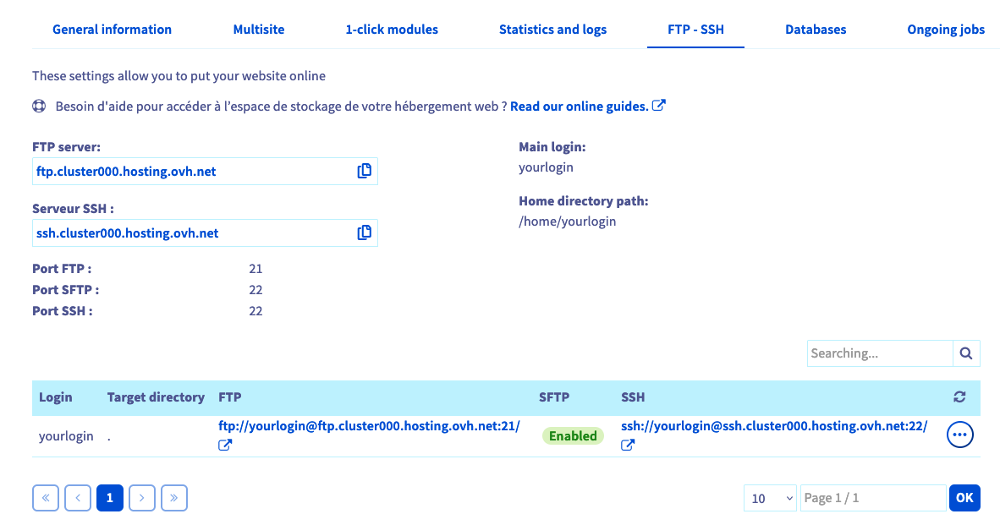
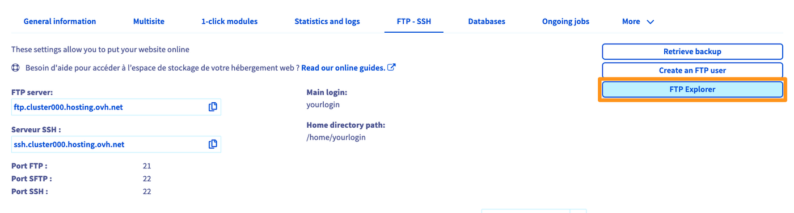

**Letzte Aktualisierung am 31.05.2023**

> [!primary]
>
> Diese Übersetzung wurde durch unseren Partner SYSTRAN automatisch erstellt. In manchen Fällen können ungenaue Formulierungen verwendet worden sein, z.B. bei der Beschriftung von Schaltflächen oder technischen Details. Bitte ziehen Sie im Zweifelsfall die englische oder französische Fassung der Anleitung zu Rate. Möchten Sie mithelfen, diese Übersetzung zu verbessern? Dann nutzen Sie dazu bitte den Button "Beitragen" auf dieser Seite.
>

## Ziel 

Die OVHcloud Webhostings bieten Zugriff auf einen FTP-Speicherplatz, um die Dateien Ihrer Websites oder Anwendungen online zu stellen. Zugriff auf diesen Bereich ist über einen FTP- oder SSH-Benutzer mit den dazugehörigen Passwörtern möglich.

**Diese Anleitung erklärt, wie Sie sich mit dem FTP-Speicherplatz Ihres OVHcloud Webhostings verbinden.**

## Voraussetzungen

- Sie haben ein [OVHcloud Webhosting](https://www.ovhcloud.com/de/web-hosting/).
- Sie haben Zugriff auf Ihr [OVHcloud Kundencenter](https://www.ovh.com/auth/?action=gotomanager&from=https://www.ovh.de/&ovhSubsidiary=de). 

> [!primary]
> Nur die Webhosting-Angebote **Pro** und **Performance** erlauben die Aktivierung mehrerer FTP-Benutzer und verfügen über SSH-Verbindungen.
>

## In der praktischen Anwendung

### Schritt 1: Erforderliche Verbindungsdaten abrufen

Um sich mit Ihrem FTP-Speicherplatz zu verbinden, benötigen Sie folgende Informationen:

- Aktiver FTP oder SSH Benutzer
- Das Passwort für diesen FTP- oder SSH-Benutzer
- Die Adresse des FTP- oder SSH-Servers Ihres Webhostings
- Den Verbindungsport zum FTP oder SSH Server Ihres Webhostings


> [!primary]
>
> Diese Informationen wurden Ihnen in der E-Mail mitgeteilt, in der die Installation Ihres Webhostings nach Bestellung bestätigt wurde. Sie sind auch im [OVHcloud Kundencenter](https://www.ovh.com/auth/?action=gotomanager&from=https://www.ovh.de/&ovhSubsidiary=de) verfügbar.
>
> **Wenn Sie diese Daten bereits haben**, gehen Sie direkt zu Schritt 2: [Zugang zu Ihrem FTP-Speicherplatz](#ftp_storage_access).
> 

Wenn Sie die Verbindungsdaten nicht zur Hand haben, loggen Sie sich in Ihr [OVHcloud Kundencenter](https://www.ovh.com/auth/?action=gotomanager&from=https://www.ovh.de/&ovhSubsidiary=de){.external} ein und gehen Sie in den Bereich `Web Cloud`{.action}. Klicken Sie links im Menü auf den Bereich `Hosting-Pakete`{.action}. Wählen Sie das betreffende Webhosting aus und gehen Sie dann auf den Tab `FTP - SSH`{.action}.

Die Informationen zu Ihrem Speicherplatz sowie eine Tabelle mit den auf Ihrem Webhosting erstellten FTP- und SSH-Benutzern werden angezeigt.

{.thumbnail}

> [!primary]
>
> Wenn Sie von diesem Tab aus einen neuen FTP/SSH-Benutzer erstellen möchten, klicken Sie rechts auf den Button `Benutzer erstellen`{.action}.
> Definieren Sie die Namensendung für den neuen `Benutzer`{.action} sowie das `Wurzelverzeichnis`{.action}, in dem dieser Benutzer tätig werden kann, und klicken Sie dann auf `Weiter`{.action}.
> Wählen Sie ein Passwort für diesen neuen Benutzer-Account aus, klicken Sie auf `Weiter`{.action} und dann auf `Bestätigen`{.action}.
>

Alle für die Verbindung mit dem FTP-Speicherplatz erforderlichen Elemente finden Sie auf dieser Seite.

Nachstehend finden Sie eine Beschreibung der wesentlichen Informationen, die auf `FTP - SSH`{.action} angezeigt werden:

- **FTP- und SFTP-Server**: Adresse des FTP-Servers Ihres Webhostings, damit Sie auf Ihren FTP-Speicherplatz zugreifen können. Hierzu wird beispielsweise eine Client-Software eingesetzt, die über das (S)FTP-Protokoll verfügt.

> Der Standardport für SSH ist "21". Verwenden Sie den Port "22" für eine Verbindung über das SFTP-Protokoll (falls dieses aktiviert ist).

- **SSH-Server**: SSH-Server-Adresse Ihres Webhostings, damit Sie auf Ihren FTP-Speicherplatz zugreifen können. Verwenden Sie hierzu das SSH-Protokoll in einer Kommandozeile.

> Die Portnummer für SSH-Verbindungen ist "22".

- **Haupt-Login**: Haupt-FTP-Kennung auf Ihrem Webhosting. Sie finden alle erstellten FTP-Benutzer Ihres Hostings in der Tabelle in der Spalte "Login".

> [!primary]
>
> Je nach Ihrem [OVHcloud Webhosting-Angebot](https://www.ovhcloud.com/de/web-hosting/){.external} werden einige der oben beschriebenen Informationen (insbesondere bezüglich SSH) möglicherweise nicht angezeigt.
>

Wenn Sie das Passwort eines FTP- oder SSH-Benutzers nicht mehr kennen, lesen Sie unsere Anleitung "[Passwort eines FTP-Benutzers ändern](/pages/web_cloud/web_hosting/ftp_change_password)".

{.thumbnail}

An diesem Punkt verfügen Sie über alle notwendigen Elemente, um sich mit Ihrem FTP-Speicherplatz zu verbinden.

### Schritt 2: Zugang zu Ihrem FTP-Speicherplatz <a name="ftp_storage_access"></a>

Die Verbindung zum FTP-Speicherplatz ist auf mehrere Arten möglich. Folgen Sie den Schritten dieser Anleitung je nach Ihrer gewünschten Methode.

- [1. Verbindung über den "FTP Explorer"](#ftpexplorer): Ermöglicht den Zugriff auf Ihren FTP-Speicherplatz über Ihren Webbrowser.

- [2. Verbindung über einen FTP-Client](#ftpsoftware): Ermöglicht den Zugriff auf Ihren FTP-Speicherplatz über eine Client-Software (z.B. [FileZilla](/pages/web_cloud/web_hosting/ftp_filezilla_user_guide) oder [Cyberduck](/pages/web_cloud/web_hosting/ftp_cyberduck_user_guide_on_mac)). 
Installieren Sie zunächst das gewählte FTP-Programm auf Ihrem Computer.

- [3. Verbindung über einen SSH Zugang](#ssh): Ermöglicht den Zugriff auf Ihren FTP-Speicherplatz über einen SSH-Zugang. Für die Nutzung dieses Zugriffstyps sind fortgeschrittene Kenntnisse sowie ein [OVHcloud Webhosting](https://www.ovhcloud.com/de/web-hosting/){.external} **Pro** oder **Performance** erforderlich.

#### 1. Via "FTP Explorer" verbinden <a name="ftpexplorer"></a>

Um den "FTP-Explorer" zu verwenden, loggen Sie sich in Ihr [OVHcloud Kundencenter](https://www.ovh.com/auth/?action=gotomanager&from=https://www.ovh.de/&ovhSubsidiary=de){.external} ein und gehen Sie in den Bereich `Web Cloud`{.action}.

Klicken Sie links im Menü auf den Bereich `Hosting-Pakete`{.action}. Wählen Sie das betreffende Webhosting aus, gehen Sie auf den Tab `FTP - SSH`{.action} und klicken Sie dann auf den Button `FTP-Explorer`{.action}.

{.thumbnail}

Geben Sie auf der neu geöffneten Seite Ihre FTP-Kennung und das zugehörige Passwort ein und klicken Sie auf `Anmeldung`{.action}. Wenn die Informationen korrekt sind, erscheint die Ansicht Ihres Speicherplatzes.

{.thumbnail}

#### 2. Via FTP-Client verbinden <a name="ftpsoftware"></a>

Nachdem Sie zuvor das FTP-Programm Ihrer Wahl auf Ihrem Computer installiert haben (z.B. [FileZilla](/pages/web_cloud/web_hosting/ftp_filezilla_user_guide) oder [Cyberduck](/pages/web_cloud/web_hosting/ftp_cyberduck_user_guide_on_mac), starten Sie es. 

Geben Sie in den dafür vorgesehenen Feldern die Verbindungsdaten ein. 

> [!warning]
>
> Da dieser Vorgang von der von Ihnen verwendeten Software und deren Version abhängt, kann diese Anleitung nicht alle Optionen aufführen.
>

Hier eine Erinnerung an die Informationen, die Sie eingeben müssen:

- **FTP- und SFTP-Server**: FTP-Server-Adresse, mit der auf Ihren FTP-Speicherplatz zugegriffen werden kann. Je nach verwendetem Client sind verschiedene Bezeichnungen möglich: „Server“, „Serveradresse“, „Host“ „Hostname“, etc.
- **Haupt-Login**: ID für den Zugriff auf Ihren FTP Speicherplatz. Je nach verwendetem Client sind verschiedene Bezeichnungen möglich: „Benutzer“, „Benutzername“, „Kennung“, „Login“, „Username“, etc.
- **Passwort des FTP-Benutzers**: Passwort für den FTP-Login. Je nach verwendetem Client sind verschiedene Bezeichnungen wie „Passwort“ oder „Password“ möglich.
- **Verbindungsport**: Der Verbindungsport wird meistens automatisch angegeben. Falls Sie diesen jedoch selbst eingeben müssen:
    - Verwenden Sie den Port "21" für eine Verbindung über das FTP-Protokoll.
    - Verwenden Sie den Port "22" für eine Verbindung, die das SFTP-Protokoll verwendet (sofern dieses aktiviert ist).

Wenn die Informationen korrekt sind, zeigt das von Ihnen verwendete Programm den Inhalt Ihres FTP-Speicherplatzes an. Es kann eine Nachricht (auch "Status"genannt) angezeigt werden, um zu bestätigen, dass der Inhalt von Ihrem FTP-Programm erfolgreich gelesen wurde.

#### 3. Via SSH-Zugriff verbinden <a name="ssh"></a>

Um sich via SSH zu verbinden, verwenden Sie ein Terminal, um direkt über die Kommandozeile mit Ihrem FTP-Speicherplatz zu kommunizieren. 

Weitere Informationen zu SSH finden Sie in unserer Anleitung zur [Nutzung von SSH mit Ihrem OVHcloud Shared Hosting](/pages/web_cloud/web_hosting/ssh_on_webhosting).

Ein SSH-Client ist nativ auf *macOS*, *Linux* und *Windows 10* installiert. Eine ältere Windows-Umgebung erfordert die Installation von Software wie [PuTTY](/pages/web_cloud/web_hosting/ssh_using_putty_on_windows) oder das Hinzufügen der Funktion "*OpenSSH*". 

> [!warning]
> 
> Da dieser Vorgang für das von Ihnen verwendete Betriebssystem spezifisch ist, können wir ihn in dieser Anleitung nicht detailliert beschreiben.
>

Sobald die SSH-Verbindung hergestellt ist, gibt es je nach gewählter Methode zwei Methoden, um sich zu verbinden: 

- **Software**: Die Verbindungsinformationen werden in Textfelder eingetragen.
- **Kommandozeile**: Eine spezifische Syntax muss eingehalten werden.

Verwenden Sie in der Kommandozeile folgende Syntax:

```bash
ssh sshlogin@sshserver -p connectionport
```

Ersetzen Sie die Elemente `sshlogin`, `sshserver` und `connectionport` mit Ihren eigenen Daten. 

Anschließend werden Sie aufgefordert, das Passwort des SSH-Benutzers einzugeben.

Wenn die Informationen korrekt sind, werden Sie mit Ihrem FTP-Speicherplatz verbunden. 

Wenn nötig lesen Sie unsere Anleitung "[SSH-Zugang Ihres Webhostings verwenden](/pages/web_cloud/web_hosting/ssh_on_webhosting)".

{.thumbnail}

## Weiterführende Informationen

[Passwort eines FTP-Benutzers ändern](/pages/web_cloud/web_hosting/ftp_change_password)

[SSH-Zugang Ihres Webhostings verwenden](/pages/web_cloud/web_hosting/ssh_on_webhosting)

[Verwendung von PuTTY für Windows](/pages/web_cloud/web_hosting/ssh_using_putty_on_windows)

[Tutorial - FileZilla mit Ihrem OVHcloud Hosting nutzen](/pages/web_cloud/web_hosting/ftp_filezilla_user_guide)

[Tutorial - Cyberduck mit Ihrem OVHcloud Hosting nutzen](/pages/web_cloud/web_hosting/ftp_cyberduck_user_guide_on_mac)

Kontaktieren Sie für spezialisierte Dienstleistungen (SEO, Web-Entwicklung etc.) die [OVHcloud Partner](https://partner.ovhcloud.com/de/directory/).

Wenn Sie Hilfe bei der Nutzung und Konfiguration Ihrer OVHcloud Lösungen benötigen, beachten Sie unsere [Support-Angebote](https://www.ovhcloud.com/de/support-levels/).

Für den Austausch mit unserer User Community gehen Sie auf <https://community.ovh.com/en/>.
