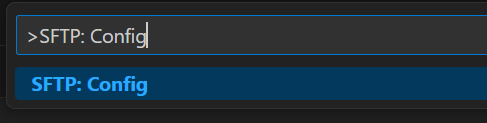
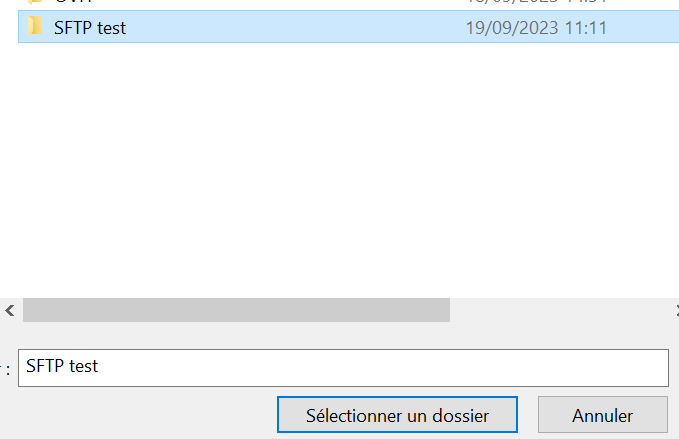
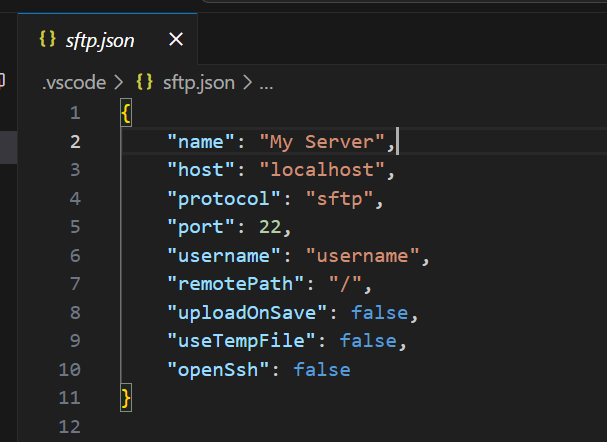
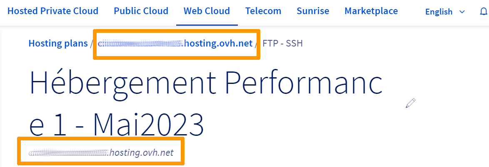
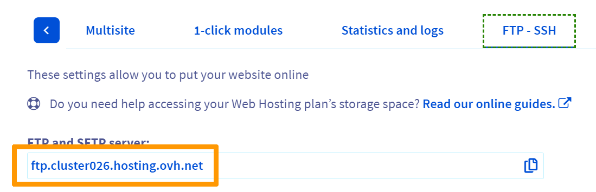
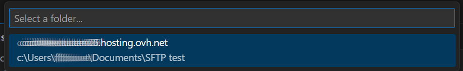

## Objectif

Si vous disposez d’un hébergement web OVHcloud, vous pouvez accéder à un espace de stockage qui vous permet de gérer votre site internet. L’accès à cet espace de stockage est possible à distance, via SFTP. Même s’il est possible de se connecter via un terminal, vous pouvez également utiliser l’IDE (environnement de développement intégré) Visual Studio Code pour gérer à distance les dossiers et fichiers de votre site web. 

**Ce guide vous explique comment administrer à distance votre site internet via VSCode.**
  
## Prérequis
- Disposer d'une offre d'[hébergement web OVHcloud](https://www.ovhcloud.com/fr/web-hosting/){.external} bénéficiant d'un accès SSH

- Avoir installé VSCode sur sa machine


## En pratique
  
### Installer l’extension SFTP pour VSCode

Après avoir démarré VSCode, sélectionnez `Ctrl + Shift + X` pour chercher une extension. En haut à gauche de l’interface, entrez le nom de l’extension « SFTP/FTP sync » de Natizyskunk et cliquez sur  `Install`{.action}.

{.thumbnail}

Il est également possible d’installer l’[extension](https://marketplace.visualstudio.com/items?itemName=Natizyskunk.sftp#sftp-sync-extension-for-vs-code){.external} depuis la marketplace de Visual Studio.
  
### Initialiser le projet en local

Pour synchroniser les fichiers de votre site web présents sur l’hébergement web avec votre machine, vous devez indiquer à VSCode l’emplacement de votre projet en local. Pour cela, créez un dossier à l’emplacement souhaité.

Retournez dans VSCode, sélectionnez `Ctrl + Shift + P` et entrez la commande suivante : `SFTP: Config`.

{.thumbnail}

Grâce à cette commande, VSCode va créer le fichier de configuration sftp.json à la racine du dossier local précédemment créé. Mais comme VSCode ne connait pas encore l’emplacement de votre projet en local, le message suivant devrait apparaitre :

{.thumbnail}

Cliquez sur `Open Folder`{.action}, dirigez-vous à l’emplacement du dossier local de votre choix et cliquez sur  `Sélectionner un dossier`{.action} pour confirmer.

{.thumbnail}

Dans VSCode, entrez à nouveau la commande `SFTP: Config`. Cette fois-ci, un fichier de configuration nommé sftp.json apparaît alors dans VSCode.

{.thumbnail}

Ce fichier est présent dans le dossier .vscode, lui-même positionné à la racine de votre projet local.

### Configurer le fichier sftp.json

Avant de travailler sur votre projet, vous devez le télécharger dans votre dossier local précédemment créé. Mais dans un premier temps, il vous faut configurer convenablement le fichier «sftp.json». Les informations utiles sont présentes dans votre [espace client OVHcloud](https://www.ovh.com/manager/#/hub){.external}. Dans la partie `Web Cloud`{.action}, cliquez sur `Hébergements`{.action}. Sélectionnez l'hébergement concerné, puis cliquez sur l'onglet `FTP - SSH`{.action}.

Dans le fichier «sftp.json», rentrez les valeurs pour les entrées suivantes :
- name : repérez le aux deux emplacements surlignés en orange

{.thumbnail}

> [!primary]
>
> Notez bien que la valeur de `name` est arbitraire, et que vous pouvez attribuer la valeur que vous souhaitez. Cependant, si vous configurez plusieurs fichiers «sftp.json», il est préférable d'entrer les valeurs indiqués ci-dessus pour des raions de cohérence et de simplicité.
>

- host : toujours dans l’onglet `FTP-SSH`{.action}, repérez-le sous la mention Serveur `FTP et SFTP`{.action}

{.thumbnail}

- username : repérez le dans la colonne `Login`{.action} du tableau
- remotePath : repérez-le sous la mention `chemin du répertoire home`{.action}. Cependant, si vous possédez plusieurs utilisateurs, le chemin indiqué n’est peut-être pas exact. À la place, essayez `home/<username>`

Enfin, n'oubliez pas d'ajouter cette ligne dans le fichier «sftp.json» :`"openSsh": true`

> [!primary]
>
> Pour ne pas avoir à entrer votre mot de passe après chaque commande dans VSCode, vous pouvez l’enregistrer une fois pour toute dans le fichier «sftp.json» en ajoutant la ligne : `"password": "<password>"`
>


Voici un exemple de fichier «sftp.json» :

```json

{
    "name": "cicdwee.cluster026.hosting.ovh.net",
    "host": "ftp.cluster026.hosting.ovh.net",
    "protocol": "sftp",
    "port": 22,
    "username": "myusername",
    "password": "mypassword",
    "remotePath": "/home/myusername",
    "uploadOnSave": false,
    "useTempFile": false,
    "openSsh": true
}

```

Pour plus de détail concernant les options de sftp.json, reportez vous au [wiki](https://github.com/Natizyskunk/vscode-sftp/wiki/configuration){.external} du projet.

### Télécharger le projet en local

Une fois le fichier «sftp.json» configuré, vous pouvez télécharger le contenu de votre projet afin de récupérer l’ensemble des dossiers et fichiers de votre site web. Pour ce faire, allez dans VSCode et entrez la commande suivante : `SFTP: Download Project`.

VSCode vous demande alors de sélectionner le dossier que vous souhaitez télécharger sur votre hébergement web. Entrez la valeur que vous avez indiqué pour l’entrée `name` du fichier «sftp.json» (`cicdwee.cluster026.hosting.ovh.net` dans notre exemple).

{.thumbnail}

S'il vous est demandé, entrez ensuite le mot de passe lié à l’utilisateur que vous avez indiqué dans le fichier «sftp.json», puis validez. Le téléchargement se lance. Une fois celui-ci achevé, vous pouvez voir l’ensemble des dossiers et fichiers de votre projet dans l’explorateur de fichiers, à gauche de l’interface VSCode.

{.thumbnail}

> [!primary]
>
> Pour rappel, la bonne configuration du fichier sftp.json est primordiale. En effet, si une erreur s'affiche avant que vous puissiez télécharger votre projet, il est fort probable que votre fichier sftp.json soit mal configuré. Pour toute question, reportez-vous à la [FAQ](https://github.com/Natizyskunk/vscode-sftp/blob/HEAD/FAQ.md){.external}.
>


### Effectuer des modifications sur les fichiers

Maintenant que le projet est téléchargé en local sur votre machine, vous pouvez facilement éditer, ajouter ou supprimer des fichiers sur VSCode.

Si vous souhaitez que vos modifications locales soient synchronisées chaque fois que vous sauvegardez un fichier, ajoutez cette ligne dans le fichier sftp.json : ` "uploadOnSave": true`

Gardez la valeur à false dans le cas contraire.

À présent, vous êtes capable d'accéder au site internet de votre hébérgement web via VSCode. Vous pouvez désormais modifier, ajouter et supprimer des fichiers, et tout ça à distance.

## Aller plus loin

Gardez à l'esprit que ce guide présente une manière rapide et efficace pour administrer votre projet à distance. Idéal pour des petits projets ou une première expérience, cette solution présente des limites. En effet, si vous modifiez plusieurs fichiers et que ceux-ci sont synchronisés sur votre hébérgement, il vous est impossible de voir l'historique de vos modifications pour éventuellement revenir dessus ou rattraper une erreur.
Pour ce faire, vous devez installer ou brancher sur VSCode des outils tel que Git, Github ou encore Github Action qui améliorerons grandement l'historisation et l'intégration des changements sur votre site web. Pour plus d'information à ce sujet, suivez ce [guide].
<!--- TODO mettre à jour le lien quand dispo -->

Échangez avec notre communauté d’utilisateurs sur <https://community.ovh.com/>