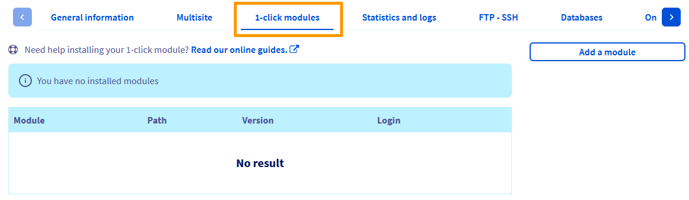
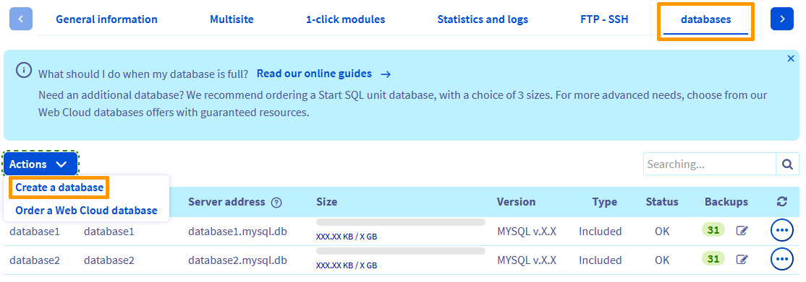
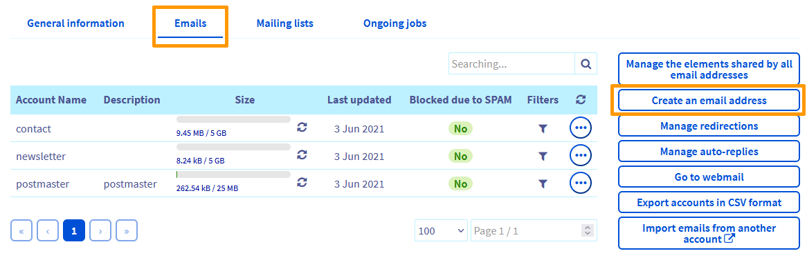

## Objective

This guide is designed for customers who have just purchased a Web Hosting plan to build and host a website. With your Web Hosting plan, you can set up a website using a turn-key solution (WordPress, PrestaShop), or develop your own platform on permanently available servers. This guide will help you get started with building your website. Thank you for choosing OVHcloud.

**This guide explains how to build your website and to set up your email addresses.**

## Requirements

- You have ordered an [OVHcloud Web Hosting plan](https://www.ovhcloud.com/en-gb/web-hosting/){.external}.
- You have received an email confirming that your Web Hosting plan has been set up.
- You have a [domain name](https://www.ovhcloud.com/en-gb/domains/){.external} that can be used to access your website.
- You have access to the [OVHcloud Control Panel](https://www.ovh.com/auth/?action=gotomanager&from=https://www.ovh.co.uk/&ovhSubsidiary=GB).

## Instructions

> [!success]
>
> Before reading this guide any further, please ensure that the domain or subdomain you would like to use is correctly associated with your OVHcloud web hosting plan. To do this, please refer to our guide on "[Hosting multiple websites on your Web Hosting plan](/pages/web_cloud/web_hosting/multisites_configure_multisite)".
>

### Step 1: Define your project

Are you looking to create a blog, or an online store? Do you want to share your passion, or boost your company’s online profile? Or do you want to migrate an existing website to OVHcloud? To ensure that your project is a success, it is important to have a clear idea of your objective.

With your OVHcloud Web Hosting plan, you can build a website from scratch, or migrate an existing one.

- **Building a new website**

You can either build your website manually, using your own programming skills, or you can use turn-key tools like Content Management Systems (CMSs). The first method requires more technical skills, but gives you total flexibility when ti comes to customising your project. The second method provides you with a ready-to-use website structure, and doesn’t require technical knowledge.

In the Control Panel, OVHcloud provides a tool that allows you to install a CMS in one click. The choices available are WordPress, PrestaShop, Drupal and Joomla!. Not sure which CMS to use? You can use this [comparison page](https://www.ovhcloud.com/en-gb/web-hosting/uc-cms-comparison/){.external} to help you decide which one is best for you. If the CMS you want to use is not offered by OVHcloud, you can install it manually on your Web Hosting plan.

- **Migrating an existing website to OVHcloud**

Website migration can sometimes be quite tricky, particularly if you are migrating a website that is currently online and cannot experience service interruptions. As a result, this guide only includes a few of the steps you will need to take to migrate your services. Please refer to our guide: [Migrating your website and emails to OVHcloud](/pages/web_cloud/web_hosting/hosting_migrating_to_ovh){.external}.

### Step 2: Set up your website

Once you have clearly defined your project, you just have to build it on your Web Hosting plan. The following steps will take you through how to put your website online. There are three ways to do this, depending on the amount of time and technical knowledge you have.

#### Using OVHcloud 1-click modules – no technical skills required

This solution uses OVHcloud 1-click modules, a tool you can use to install a CMS quickly and easily. OVHcloud sets up your website, and provides you with your admin credentials.

To ensure that the OVHcloud module's installation is successful, please ensure that its installation directory is empty (which should be the case if you have not connected to your storage space). To install a 1-click module, please log in to your [OVHcloud Control Panel](https://www.ovh.com/auth/?action=gotomanager&from=https://www.ovh.co.uk/&ovhSubsidiary=GB){.external}. Go to the `Hosting plans`{.action} section, then click on the domain name corresponding to the Web Hosting plan you have just ordered. In the `1-click modules`{.action} tab, click the `Add a module`{.action} button.

{.thumbnail}

Finally, to begin installing the 1-click module, select the CMS you want to install, select the domain you would like to set up your website on, check that the `Install in advanced mode`{.action} box is not ticked, and click the `Install`{.action} button.

At this stage, you will need to wait a few minutes to receive an email confirming that the module has been installed. This email will also contain the details required to log in to your website as an admin. You can then follow the remaining steps below.

If you need more information on OVHcloud 1-click modules, please read our documentation: [Installing your website with a 1-click module](/pages/web_cloud/web_hosting/cms_install_1_click_modules){.external}.

#### A quick solution in just a few clicks – no technical knowledge required

This solution uses OVHcloud modules, a tool you can use to install a CMS easily. OVHcloud sets up your website using the custom information you have entered (the custom credentials for logging in to your CMS, for example). To use this method, you will need to have a least one database in your solution.

To ensure that the OVHcloud module installation is successful, please check that:

- The module’s installation directory is empty (which should be the case if you have not connected to your storage space yet).
- You have already created a database in your Web Hosting plan.

To create the database, log in to the [OVHcloud Control Panel](https://www.ovh.com/auth/?action=gotomanager&from=https://www.ovh.co.uk/&ovhSubsidiary=GB){.external}, then go to the `Web Cloud`{.action} section. In the left-hand column, click `Hosting plans`{.action}, then select the name of the Web Hosting plan concerned.

In the `Databases`{.action} tab, there are two possible scenarios: 

- **You have at least one database available to create on your web hosting plan**: Click on the `Actions`{.action} button above the table, then on the `Create a database`{.action} button.

{.thumbnail}

- **You no longer have any databases available to create on your web hosting plan**: Click on the `Actions`{.action} button above the table. You can choose to:
    - Order a [Start SQL](https://www.ovhcloud.com/en-gb/web-hosting/options/start-sql/) database in addition to the databases included with your web hosting plan. To do this, click the `Actions`{.action} button above the table, then the `Order a database`{.action} button.
    - Order a [Web Cloud Databases](https://www.ovhcloud.com/en-gb/web-cloud/databases/) database server. To do this, click the `Actions`{.action} button above the table, then the `Order a Web Cloud Databases`{.action} button. Then refer to our guide on [Getting started with your Web Cloud Databases](/pages/web_cloud/web_cloud_databases/starting_with_clouddb) to create a database with this solution.

Once you have created a database, to install a 1-click module, go to the `1-click modules`{.action} tab and click `Add a module`{.action}. Select the CMS you want to install, tick the option `Install in advanced mode`{.action}, then click `Next`{.action}.

{.thumbnail}

Enter the information requested to launch the module installation. Once you have done this, please wait a few minutes until you receive an email confirming that the installation has been successful. You can then follow the remaining steps below.

If you need more details on installing a module in advanced mode, please read our documentation: [Installing your website with a 1-click module](/pages/web_cloud/web_hosting/cms_install_1_click_modules){.external}.

#### Manual installation – technical knowledge required

This solution is useful if you want to create or migrate a website without using OVHcloud modules. You must have the website files that you want to install. You will need to [log in to your FTP storage space manually](/pages/web_cloud/web_hosting/ftp_connection) to upload your website files to it, then if possible, link the website to a database you have created beforehand.

> [!success]
>
> If you have forgotten the password for accessing your FTP storage space, change it using our guide “[Changing an FTP user password](/pages/web_cloud/web_hosting/ftp_change_password)”.
>

As every website is unique, there is no universal straightforward method for getting them online. However, in our documentation, we provide tips on the changes you will need to make to your OVHcloud Web Hosting plan: [How to get my website online](/pages/web_cloud/web_hosting/hosting_how_to_get_my_website_online). Once you have set up your website in this way, follow the remaining steps below.

### Step 3: Create your email addresses

This stage is optional if you don’t want to use the email addresses included in your [Web Hosting plan](https://www.ovhcloud.com/en-gb/web-hosting/){.external}. To create one or more email addresses, please ensure that you are logged in to your [OVHcloud Control Panel](https://www.ovh.com/auth/?action=gotomanager&from=https://www.ovh.co.uk/&ovhSubsidiary=GB){.external}. Go to the `Emails`{.action} section, then click on the domain name corresponding to the Web Hosting plan you have just ordered. In the `Emails`{.action} section, click `Create an email address`{.action}.

{.thumbnail}

Enter the information requested to create your email address. Repeat this step for each additional email address you wish to create. If you are in the process of migrating your emails to OVHcloud, we would recommend that you use the [OVH Mail Migrator](https://omm.ovh.net/){.external} tool to help you with this. 

If you need more information on creating an email address, please refer to our documentation: [How to set up an email address](/pages/web_cloud/email_and_collaborative_solutions/mx_plan/email_creation){.external}.

### Step 4: Check or modify your domain configuration

At this stage, your website must be installed on your OVHcloud Web Hosting plan, and your email addresses must be created. Your email addresses may not work if your domain name is not correctly configured. This is linked to the DNS records that keep your website accessible, and allow you to receive emails via the email addresses that use your domain name.

For example, when a web user visits your website, they enter your web address (your domain name) into their browser. When they do this, a DNS lookup is performed. This process links your domain name to the IP address of the server hosting your website. This link is made using the information entered into a DNS zone: a kind of directory where your domain’s configuration is recorded.

If you have ordered your domain name with your OVHcloud Web Hosting plan, and not made any changes to the DNS zone via the OVHcloud Control Panel, you can skip to the next step. If you have made changes, or are unsure whether you have changed anything, we would recommend that you follow this step.

#### Understanding OVHcloud DNS records 

There are several OVHcloud DNS records. We will focus on two particular records that keep your website accessible and allow you to receive emails via your email addresses.

- **The A record, for the website**

To check the A record that you need to use in your domain’s DNS zone, log in to your [OVHcloud Control Panel](https://www.ovh.com/auth/?action=gotomanager&from=https://www.ovh.co.uk/&ovhSubsidiary=GB){.external}. Go to the `Hosting plans`{.action} section, then click on the domain name corresponding to the Web Hosting plan you have just ordered. In the `General information`{.action} tab, copy the IP address that appears next to "IPv4".

{.thumbnail}

- **The MX records, for emails**

To check the MX records that you need to use in your domain’s DNS zone, log in to your [OVHcloud Control Panel](https://www.ovh.com/auth/?action=gotomanager&from=https://www.ovh.co.uk/&ovhSubsidiary=GB){.external}. Go to the `Emails`{.action} section, then click on the domain name corresponding to the Web Hosting plan you have just ordered. In the `General information`{.action} tab, copy the information that appears next to “MX records”. The MX records can differ from one service to another, depending on the DNS filter that you have decided to apply.

{.thumbnail}

#### Check and/or modify the DNS records

Now that you are familiar with the DNS records on your OVHcloud Web Hosting plan, you will need to check and edit them if required. You will need to edit them differently, depending on your project.

- **Ordering a domain name with an OVHcloud Web Hosting plan**

Your domain is already correctly configured. Follow the next step. However, if you have edited your domain’s DNS zone in your [OVHcloud Control Panel](https://www.ovh.com/auth/?action=gotomanager&from=https://www.ovh.co.uk/&ovhSubsidiary=GB){.external}, it may no longer be correctly configured.
    
To access your OVHcloud domain’s DNS zone, go to the `Domains`{.action} section, then click on the domain name concerned. Then, in the `DNS zone`{.action} tab, check and edit the information as required.

- **Domain names that do not use the OVHcloud DNS zone**
    
You must check your domain’s DNS zone with the service provider managing your domain name and edit the information, if required.

- **Migrate your services (websites and email) to OVHcloud**

If you are migrating your services, changes to your DNS zone may make your website unavailable if they are not made at the right time. Please note that you must edit your domain’s DNS servers as the final part of the process.

> [!primary]
>
> Any changes made to a DNS zone can take 4-24 hours to fully propagate.
>

### Step 5: Customise your website

Your website is now online. This stage is optional if you have migrated an existing website, as it is already customised! However, if you have just set up a new website using our modules, you can customise it by editing the theme, and start publishing your content on it.

If you need help with your website’s features, we recommend referring to the CMS publisher’s official website, which will contain more advanced documentation to offer you focused support.

### Step 6: Use your email addresses

Now, you just need to start using your email addresses. To do this, OVHcloud offers an online webmail application. The webmail is available at the following address: <https://www.ovhcloud.com/en-gb/mail/>. You will need to enter the credentials for the email addresses that you have created with OVHcloud.

If you would like to configure your email address on an email client or device (e.g. a smartphone or tablet), please refer to our email guides: </products/web-cloud-email-collaborative-solutions-mx-plan>.
## Go further

[Migrating your website and emails to OVHcloud](/pages/web_cloud/web_hosting/hosting_migrating_to_ovh){.external}

[How to get your website online](/pages/web_cloud/web_hosting/hosting_how_to_get_my_website_online){.external}

[Web hosting modules](/pages/web_cloud/web_hosting/cms_install_1_click_modules){.external}

[How to set up an email address](/pages/web_cloud/email_and_collaborative_solutions/mx_plan/email_creation){.external}

For specialised services (SEO, development, etc.), contact [OVHcloud partners](https://partner.ovhcloud.com/en-gb/directory/).

If you would like assistance using and configuring your OVHcloud solutions, please refer to our [support offers](https://www.ovhcloud.com/en-gb/support-levels/).

Join our community of users on <https://community.ovh.com/en/>.