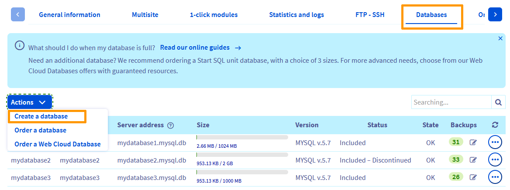

> [!primary]
> Tłumaczenie zostało wygenerowane automatycznie przez system naszego partnera SYSTRAN. W niektórych przypadkach mogą wystąpić nieprecyzyjne sformułowania, na przykład w tłumaczeniu nazw przycisków lub szczegółów technicznych. W przypadku jakichkolwiek wątpliwości zalecamy zapoznanie się z angielską/francuską wersją przewodnika. Jeśli chcesz przyczynić się do ulepszenia tłumaczenia, kliknij przycisk “Zgłóś propozycję modyfikacji” na tej stronie.
>

## Wprowadzenie 

Właśnie kupiłeś hosting, aby stworzyć swoją stronę internetową. Umożliwia on zbudowanie strony opartej na gotowych rozwiązaniach (WordPress, PrestaShop, Joomla!, Drupal) lub własnej strony WWW działającej na stale dostępnych serwerach OVHcloud. Dziękujemy za zaufanie. Przewodnik, który dla Ciebie udostępniamy, zawiera informacje, jak w prosty sposób stworzyć własną stronę internetową.

**Dowiedz się, jak właściwie rozpocząć korzystanie z hostingu.**

## Wymagania początkowe

- Zakupienie [hostingu OVHcloud](https://www.ovhcloud.com/pl/web-hosting/){.external}.
- Otrzymanie wiadomości e-mail potwierdzającej uruchomienie usługi.
- Posiadanie [nazwy domeny](https://www.ovhcloud.com/pl/domains/){.external}, czyli adresu, pod którym dostępna będzie Twoja strona.
- Dostęp do [Panelu klienta OVHcloud](https://www.ovh.com/auth/?action=gotomanager&from=https://www.ovh.pl/&ovhSubsidiary=pl){.external}.

## W praktyce

> [!success]
>
> Zanim przejdziesz do dalszej lektury tego przewodnika, upewnij się, że nazwa domeny lub subdomeny, której chcesz użyć, jest poprawnie powiązana z Twoim hostingiem WWW OVHcloud. W tym celu zapoznaj się z przewodnikiem "[Udostępnienie hostingu WWW OVHcloud kilku stronom WWW](/pages/web_cloud/web_hosting/multisites_configure_multisite)".
>

### Etap 1: Wybór projektu WWW

Chcesz stworzyć blog czy sklep internetowy? Dzielić się swoją pasją czy promować w Internecie własny biznes? A może chcesz przenieść istniejącą już stronę na serwer OVH? Aby z sukcesem zrealizować projekt, należy jasno określić swój cel.

Dzięki hostingowi OVHcloud, możesz stworzyć nową stronę internetową lub przenieść istniejącą już stronę.

- **Tworzenie nowej strony internetowej**

Jeżeli posiadasz odpowiednią wiedzę w zakresie programowania, możesz sam stworzyć stronę internetową lub skorzystać z gotowych rozwiązań CMS (Content Management System). Pierwsze z podanych rozwiązań wymaga umiejętności technicznych, jednak daje możliwość stworzenia unikalnej strony WWW. Drugie rozwiązanie umożliwia skorzystanie z gotowego projektu strony bez konieczności posiadania umiejętności technicznych.

OVHcloud udostępnia w Panelu klienta narzędzia umożliwiające automatyczną instalację wybranego systemu CMS: WordPress, PrestaShop, Drupal lub Joomla!. Jeżeli nie wiesz, który z systemów CMS wybrać, poniższe [zestawienie](https://www.ovhcloud.com/pl/web-hosting/uc-cms-comparison/){.external} pomoże Ci podjąć decyzję. Jeżeli OVHcloud nie ma w swojej ofercie systemu CMS, który chcesz wykorzystać, możesz zainstalować go ręcznie na hostingu.

- **Przenoszenie istniejącej już strony na serwer OVH**

Przenoszenie strony może okazać się trudne, zwłaszcza jeżeli dotyczy ono świadczonych aktualnie usług, których przerwanie nie jest możliwe. Niniejszy przewodnik opisuje jedynie niektóre z etapów, które należy przeprowadzić w ramach przenoszenia usług. Aby zapoznać się z całym procesem przenoszenia strony internetowej zapraszamy do przeczytania przewodnika zatytułowanego [Przenoszenie strony internetowej na serwer OVHcloud](/pages/web_cloud/web_hosting/hosting_migrating_to_ovh){.external}.

### Etap 2: instalacja strony internetowej

Gdy projekt został już dokładnie określony, jedyne co pozostaje, to umieszczenie go na hostingu. Kolejny etap polega więc na umieszczeniu Twojej strony internetowej w sieci. W tym celu możesz skorzystać z trzech możliwości w zależności od czasu i umiejętności technicznych, którymi dysponujesz w tym zakresie.

#### W pełni automatyczna instalacja bez tworzenia bazy danych, dla osób nie posiadających wymaganych umiejętności technicznych

Rozwiązanie to wykorzystuje pre-instalowane moduły OVHcloud dostępne w Panelu klienta. Jest to narzędzie umożliwiające prostą i szybką instalację systemu CMS. OVHcloud przeprowadza instalację strony, a następnie przekazuje klientowi dane do logowania.

Aby instalacja modułu OVHcloud była możliwa, upewnij się, że katalog instalacyjny modułu jest pusty (co ma miejsce, jeżeli nie zalogowałeś się jeszcze do Twojej przestrzeni dyskowej). Aby dokonać szybkiej instalacji modułu, zaloguj się do [Panelu klienta](https://www.ovh.com/auth/?action=gotomanager&from=https://www.ovh.pl/&ovhSubsidiary=pl){.external}. Wybierz sekcję `Hosting`{.action}, a następnie nazwę hostingu, który zakupiłeś. W zakładce `Moduły`{.action} wybierz opcję `Dodaj moduł`{.action}.

{.thumbnail}

Aby rozpocząć instalację modułu, wybierz CMS, który chcesz zainstalować i upewnij się, że pole `Instalacja w trybie zaawansowanym`{.action} nie jest zaznaczone. Następnie kliknij `Instalacja`{.action}.

Teraz należy jedynie czekać na wiadomość e-mail z potwierdzeniem zainstalowania modułu i informacjami dotyczącymi logowania się na stronę. Następnie możesz przeprowadzić poniższe etapy.

Jeżeli chcesz uzyskać więcej informacji dotyczących modułów OVHcloud dostępnych z automatyczną instalacją, zapoznaj się z dokumentacją: [Instalacja strony za pomocą modułów](/pages/web_cloud/web_hosting/cms_install_1_click_modules){.external}.

#### W pełni automatyczna instalacja z przygotowywaniem bazy danych, dla osób nie posiadających wymaganych umiejętności technicznych

Rozwiązanie to wykorzystuje moduły OVHcloud — narzędzie umożliwiające prostą instalację systemu CMS. OVHcloud instaluje stronę dzięki spersonalizowanym informacjom dostarczanym przez klienta (np. personalizacja danych do logowania do CMS). Rozwiązanie to wymaga, aby hosting posiadał co najmniej jedną bazę danych.

Aby instalacja modułu OVHcloud była możliwa, koniecznie upewnij się, że:

- katalog instalacyjny modułu jest pusty (co ma miejsce, jeżeli nie zalogowałeś się jeszcze do Twojej przestrzeni dyskowej);
- baza danych została już utworzona na Twoim hostingu.

Aby utworzyć bazę danych, zaloguj się do [Panelu klienta OVHcloud](https://www.ovh.com/auth/?action=gotomanager&from=https://www.ovh.pl/&ovhSubsidiary=pl){.external}, a następnie przejdź do sekcji `Web Cloud`{.action}. W lewej kolumnie kliknij `Hosting`{.action}, następnie wybierz odpowiedni hosting.

W zakładce `Bazy danych`{.action} możliwe są dwa scenariusze: 

- **Masz co najmniej jedną bazę danych dostępną w opcji "utwórz" na Twoim hostingu** : kliknij przycisk `Operacje`{.action} nad tabelą, która się wyświetla następnie kliknij przycisk `Tworzenie bazę danych`{.action}.

{.thumbnail}

- **Nie masz już dostępnych baz danych w opcji "utwórz" na Twoim hostingu** : kliknij przycisk `Operacje`{.action} nad tabelą, która się wyświetli. Będziesz mógł (do wyboru):
    - Zamów bazę danych [Start SQL](https://www.ovhcloud.com/pl/web-hosting/options/start-sql/) jako uzupełnienie baz danych zawartych w hostingu. W tym celu kliknij przycisk `Operacje`{.action} nad tabelą, a następnie przycisk `Zamów bazę danych`{.action}.
    - Zamów serwer baz danych [Web Cloud Databases](https://www.ovhcloud.com/pl/web-cloud/databases/). W tym celu kliknij przycisk `Operacje`{.action} nad tabelą, a następnie przycisk `Zamów bazę danych Web Cloud Databases`{.action}. Następnie zapoznaj się z naszym przewodnikiem "[Pierwsze kroki z Web Cloud Databases](/pages/web_cloud/web_cloud_databases/starting_with_clouddb)", aby utworzyć bazę danych dla tej oferty.

Gdy baza danych została już utworzona, wybierz zakładkę `Moduły`{.action}, by przeprowadzić instalację modułu, a następnie wybierz opcję `Dodaj moduł`{.action}. Wybierz CMS, który chcesz zainstalować i upewnij się, że pole `Instalacja w trybie zaawansowanym`{.action} nie jest zaznaczone, następnie wybierz opcję `Instalacja`{.action}.

{.thumbnail}

Wpisz wymagane informacje aż do rozpoczęcia instalacji modułu. Teraz należy jedynie czekać na wiadomość e-mail z potwierdzeniem instalacji, a następnie przeprowadzić wskazane poniżej etapy.

Jeżeli chcesz uzyskać więcej informacji dotyczących modułów OVHcloud dostępnych za pomocą 1 kliknięcia, zapoznaj się z dokumentacją: [Instalacja strony za pomocą modułów](/pages/web_cloud/web_hosting/cms_install_1_click_modules){.external}.

#### Konfiguracja ręczna, wymagane umiejętności techniczne

Rozwiązanie to ma zastosowanie, jeśli chcesz stworzyć lub przenieść stronę WWW bez korzystania z modułów OVHcloud. Musisz mieć dostęp do plików strony WWW, które chcesz zainstalować. Dlatego należy [ręcznie zalogować się do przestrzeni dyskowej FTP](/pages/web_cloud/web_hosting/ftp_connection), aby wgrać pliki strony WWW, a następnie, jeśli to możliwe, powiązać ją z wcześniej utworzoną bazą danych.

> [!success]
>
> Jeśli nie pamiętasz hasła dostępowego do przestrzeni dyskowej FTP, zmodyfikuj je za pomocą naszego przewodnika "[Zmiana hasła dostępowego do przestrzeni dyskowej FTP Twojego hostingu](/pages/web_cloud/web_hosting/ftp_change_password)".
>

Biorąc pod uwagę, że strony internetowe mogą się w znaczącym stopniu od siebie różnić, nie ma uniwersalnego sposobu postępowania, jednak możemy pokierować Cię w zakresie hostingu OVHcloud przy użyciu naszej dokumentacji: [Umieszczanie strony w sieci](/pages/web_cloud/web_hosting/hosting_how_to_get_my_website_online){.external} oraz [Przenoszenie strony na serwer OVHcloud](/pages/web_cloud/web_hosting/hosting_migrating_to_ovh){.external}, o ile jest on wykorzystywany. Gdy strona zostanie już ręcznie zainstalowana na hostingu, przeprowadź wskazane poniżej etapy.

### Etap 3: tworzenie adresów e-mail

Możesz pominąć ten etap, jeżeli nie chcesz korzystać z adresów e-mail wchodzących w skład Twojego [pakietu hostingowego](https://www.ovhcloud.com/pl/web-hosting/){.external}. Aby stworzyć jeden lub kilka adresów e-mail, upewnij się najpierw, że jesteś zalogowany do [Panelu klienta](https://www.ovh.com/auth/?action=gotomanager&from=https://www.ovh.pl/&ovhSubsidiary=pl){.external}.Wybierz sekcję `E-maile`{.action}, a następnie nazwę hostingu, który zakupiłeś. Następnie w zakładce `E-maile`{.action} wybierz opcję `Załóż adres e-mail`{.action}.

{.thumbnail}

Wpisz wymagane informacje aż do utworzenia adresu e-mail. Powtórz ten etap, aby utworzyć większą liczbę adresów. Jeżeli jesteś w trakcie przenoszenia Twoich adresów e-mail na serwer OVHcloud, skorzystaj z naszego narzędzia [OVH Mail Migrator](https://omm.ovh.net/){.external}, które pomoże Ci wykonać wszystkie kroki. 

Jeżeli chcesz otrzymać więcej informacji dotyczących tworzenia adresu e-mail lub przenoszenia usług do OVHcloud, zapoznaj się z dokumentacją: [Tworzenie konta e-mail](/pages/web_cloud/email_and_collaborative_solutions/mx_plan/email_creation){.external} oraz [Przenoszenie strony na serwer OVHcloud](/pages/web_cloud/web_hosting/hosting_migrating_to_ovh){.external}, o ile jest on wykorzystywany.

### Etap 4: weryfikacja lub modyfikacja konfiguracji domeny

Na tym etapie hosting OVHcloud powinien być już zainstalowany, a adresy e-mail utworzone. Możliwe, że adresy te nie są jeszcze funkcjonalne, jeżeli konfiguracja nazwy domeny nie jest prawidłowa. Konfiguracja ta powiązana jest z rekordami DNS, które gwarantują dostępność strony internetowej i odbiór wiadomości wysyłanych na Twoje adresy e-mail w nazwie domeny.

Na przykład osoby odwiedzające Twoją stronę internetową wpisują do przeglądarki adres Twojej strony (Twoją nazwę domeny). W tym momencie następuje rozpoznawanie nazw DNS. Jest to proces umożliwiający przypisanie nazwy domeny do serwera, na którym znajduje się Twoja strona internetowa. Korelacja ta możliwa jest dzięki informacjom wskazanym w strefie DNS: jest to rodzaj katalogu, w którym zarejestrowana została konfiguracja Twojej domeny.

Jeżeli zakupiłeś nazwę domeny wraz z hostingiem OVHcloud i nie dokonałeś żadnej modyfikacji w strefie DNS z Panelu klienta OVHcloud, możesz przejść do kolejnego etapu. W przeciwnym wypadku, lub jeżeli nie masz całkowitej pewności co do wykonywanych działań, zalecamy pozostanie na obecnym etapie.

#### Typy rekordów DNS w OVHcloud 

Istnieje wiele rekordów DNS dostępnych w OVHcloud. Skupimy się w szczególności na dwóch z nich — tych, które zagwarantują dostępność Twojej strony internetowej i otrzymywanie wiadomości wysłanych na Twoje adresy e-mail.

- **Rekord A, dla strony internetowej**

Aby sprawdzić rekord A, którego należy użyć w strefie DNS Twojej domeny, zaloguj się do [Panelu klienta](https://www.ovh.com/auth/?action=gotomanager&from=https://www.ovh.pl/&ovhSubsidiary=pl){.external}.Wybierz sekcję `Hosting`{.action}, a następnie nazwę hostingu, który zakupiłeś. Następnie w zakładce `Informacje ogólne`{.action} odszukaj adres IP, który znajduje się obok `IPv4`{.action}.

{.thumbnail}

- **Rekordy MX, dla adresów e-mail**

Aby sprawdzić rekordy MX, których należy użyć w strefie Twojej domeny, zaloguj się do [Panelu klienta](https://www.ovh.com/auth/?action=gotomanager&from=https://www.ovh.pl/&ovhSubsidiary=pl){.external}.Wybierz sekcję `E-maile`{.action}, a następnie nazwę hostingu, który zakupiłeś. Następnie w zakładce `Informacje ogólne`{.action} odszukaj informacje, które znajdują się obok `Rekordów MX`{.action}. Rekordy te mogą różnić się w zależności od filtra DNS, który postanowiłeś zastosować.

{.thumbnail}

#### Sprawdzanie lub modyfikowanie rekordów DNS

Teraz, gdy znasz już typy rekordów powiązane z Twoim hostingiem OVHcloud, należy je sprawdzić lub zmienić, jeżeli to konieczne. Czynności, które należy przeprowadzić zależą od projektu, który realizujesz.

- **Zakup domeny wraz z hostingiem OVHcloud**

Konfiguracja Twojej domeny jest już prawidłowa. Przejdź do następnego etapu. Jeżeli natomiast dokonałeś zmian w [Panelu klienta](https://www.ovh.com/auth/?action=gotomanager&from=https://www.ovh.pl/&ovhSubsidiary=pl){.external} w strefie DNS Twojej domeny, może okazać się, że konfiguracja jest nieprawidłowa.
 
Aby uzyskać dostęp do strefy DNS Twojej domeny OVHcloud wybierz sekcję `Domeny`{.action} Kliknij nazwę danej domeny. Następnie w zakładce `Strefa DNS`{.action} sprawdź i zmodyfikuj niezbędne informacje.

- **Domena nie korzystająca ze strefy DNS OVHcloud**
 
Sprawdź strefę DNS Twojej domeny u usługodawcy, który nią zarządza. Jeżeli to konieczne, zmodyfikuje niezbędne informacje.

- **Przenoszenie usług (stron internetowych i adresów e-mail) na serwer OVHcloud**

W takim przypadku zmiany wprowadzone w DNS mogą spowodować brak dostępności usług, jeżeli są przeprowadzane w nieodpowiednim momencie. Zgodnie z różnymi etapami opisanymi w dokumentacji [Przenoszenie strony na serwer OVHcloud](/pages/web_cloud/web_hosting/hosting_migrating_to_ovh){.external}, zmiana serwerów DNS domeny powinna odbywać się na końcu procesu.

> [!primary]
>
> Zmiana w strefie DNS staje się widoczna po czasie wynoszącym od 4 do maksymalnie 24 godzin.
>

### Etap 5: personalizacja strony internetowej

Twoja strona jest już dostępna. Możesz pominąć ten etap, jeżeli przeniosłeś istniejącą stronę, która została już spersonalizowana! Jednak w przypadku gdy zainstalowałeś nową stronę internetową, na przykład za pomocą naszych modułów, możesz ją spersonalizować zmieniając jej tytuł i publikując Twoje pierwsze treści.

Jeżeli chcesz otrzymać pomoc w zakresie funkcjonalności Twojej strony, zachęcamy do zapoznania się ze stroną jej wydawcy, na której znajdziesz przydatną dokumentację.

### Etap 6: korzystanie z adresów e-mail

Możesz już korzystać z adresów e-mail. W tym celu OVHcloud udostępnia aplikację internetową (Webmail): RoundCube. Jest ona dostępna pod adresem <https://www.ovhcloud.com/pl/mail/>, gdzie uzyskasz informacje dotyczące danych do logowania na pocztę e-mail utworzoną na serwerze.
Jeżeli chcesz otrzymać więcej informacji odnośnie korzystania z RoundCube, zapoznaj się z naszym przewodnikiem: [Korzystanie z RoundCube](/pages/web_cloud/email_and_collaborative_solutions/mx_plan/email_roundcube){.external}. Jeżeli chcesz skonfigurować adres e-mail na komputerze lub urządzeniu mobilnym (np. na smartphonie lub tablecie), zapoznaj się z dokumentacją dostępną na poniższej stronie: </products/web-cloud-email-collaborative-solutions-mx-plan>.
## Sprawdź również

[Przenoszenie strony na serwer OVHcloud](/pages/web_cloud/web_hosting/hosting_migrating_to_ovh){.external}

[Umieszczanie strony w sieci](/pages/web_cloud/web_hosting/hosting_how_to_get_my_website_online){.external}

[Instalacja strony z modułu OVHcloud](/pages/web_cloud/web_hosting/cms_install_1_click_modules){.external}

[Tworzenie konta e-mail](/pages/web_cloud/email_and_collaborative_solutions/mx_plan/email_creation){.external}

[Korzystanie z RoundCube](/pages/web_cloud/email_and_collaborative_solutions/mx_plan/email_roundcube){.external}

W przypadku wyspecjalizowanych usług (pozycjonowanie, rozwój, etc.) skontaktuj się z [partnerami OVHcloud](https://partner.ovhcloud.com/pl/directory/).

Jeśli chcesz otrzymywać wsparcie w zakresie konfiguracji i użytkowania Twoich rozwiązań OVHcloud, zapoznaj się z naszymi [ofertami pomocy](https://www.ovhcloud.com/pl/support-levels/).

Dołącz do społeczności naszych użytkowników na stronie <https://community.ovh.com/en/>. 