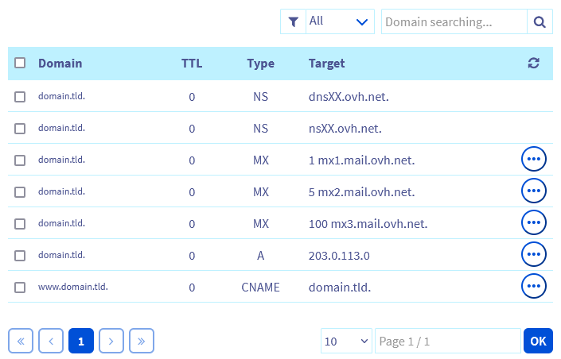
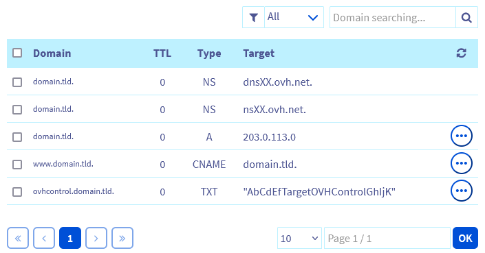

> [!primary]
> Questa traduzione è stata generata automaticamente dal nostro partner SYSTRAN. I contenuti potrebbero presentare imprecisioni, ad esempio la nomenclatura dei pulsanti o alcuni dettagli tecnici. In caso di dubbi consigliamo di fare riferimento alla versione inglese o francese della guida. Per aiutarci a migliorare questa traduzione, utilizza il pulsante "Contribuisci" di questa pagina.
>

## Obiettivo

Questa guida ti mostra le operazioni da effettuare per migrare in OVHcloud siti Web, cartelle, domini, database e indirizzi email, senza interruzioni di servizio.

> [!warning]
>
> OVHcloud mette a tua disposizione servizi di cui tu sei responsabile per la configurazione e la gestione. Assicurarne il corretto funzionamento è quindi responsabilità dell'utente.
> 
> Questa guida ti aiuta a eseguire le operazioni necessarie. Tuttavia, in caso di difficoltà o dubbi, ti consigliamo di rivolgerti a uno [specialista del settore ](/links/partner). OVHcloud non potrà fornirti alcuna assistenza. Per maggiori informazioni consulta la sezione ["Per saperne di più"](#go-further) di questa guida.
>

## Prerequisiti

- Avere accesso alla gestione del dominio del tuo sito Web (quest'ultimo deve essere attivo da oltre 60 giorni)
- Avere accesso alla zona DNS (Domain Name System) attiva del dominio
- Avere accesso ai file e al database del tuo sito Web presso il tuo attuale provider
- Disporre delle credenziali (utente, password, server) dei tuoi indirizzi email correnti
- Avere accesso allo [Spazio Cliente OVHcloud](/links/manager)

## Procedura

> [!success]
>
> Le istruzioni di questa guida per utilizzare diversi prodotti dell'universo Web Cloud, ti consigliamo di seguire gli step riportati di seguito **prima** per effettuare la migrazione dei tuoi servizi.
>

Per migrare l’intero sito Web e le email in OVHcloud **senza interruzione del servizio** è necessario seguire una procedura precisa in 10 step:

- [Step 1: ordina l'hosting e gli indirizzi email in OVHcloud](#step1)
- [Step 2: creare e preconfigurare una zona DNS per il tuo dominio in OVHcloud](#step2)
- [Step 3: recuperare un backup completo del tuo sito Web](#step3)
- [Step 4: importare il backup del tuo sito Web sulla tua offerta di hosting OVHcloud](#step4)
- [Step 5: creare i tuoi indirizzi email identici in OVHcloud](#step5)
- [Step 6: dichiarare i server di posta OVHcloud nella zona DNS attiva del dominio](#step6)
- [Step 7: trasferire il contenuto dei tuoi vecchi indirizzi email nei tuoi nuovi indirizzi presso OVHcloud](#step7)
- [Step 8: riconfigurare i tuoi software di messaggeria](#step8)
- [Step 9: sostituire i server DNS attivi del tuo dominio con quelli di OVHcloud](#step9)
- [Step 10: trasferire il tuo dominio in OVHcloud](#step10)

Seguendo questi 10 step **nell'ordine**, non avrai interruzioni di servizio per l'accesso al tuo sito Web e per la ricezione delle tue nuove email.

Tuttavia, in base al tuo Registrar, provider di hosting o provider di servizi email, è possibile che questi ultimi impediscano l'accesso ai tuoi servizi precedenti nel caso in cui si accorgano che il tuo dominio non è più configurato tramite le loro infrastrutture. 
In questo caso, potrebbe verificarsi un'interruzione del servizio.

Se tale interruzione dovesse verificarsi, la guida deve essere costruita in modo da ridurne al minimo la durata.

### Step 1: ordina l'hosting e gli indirizzi email in OVHcloud 

Diverse [offerte di hosting condiviso OVHcloud](/links/web/hosting) contengono un'offerta email "[MX Plan](/pages/web_cloud/email_and_collaborative_solutions/mx_plan/email_generalities)". Questa offerta email permette di creare indirizzi email con uno spazio di storage massimo di 5 GB per ogni indirizzo. Scegli tra le offerte di hosting qui sotto in base alla versione PHP, alla versione SQL, al numero di indirizzi email di cui hai bisogno e alla dimensione del tuo sito da migrare:

- L'hosting [Personale](/links/web/hosting-personal-offer) con **10 indirizzi email** "MX Plan"
- Hosting [Pro](/links/web/hosting-professional-offer) con **100 indirizzi email** "MX Plan"
- Hosting [Performance](/links/web/hosting-performance-offer) con **1000 indirizzi email** "MX Plan". Questa offerta è disponibile in 4 "sottolivello".
- L'hosting [Cloud Web](/links/web/hosting-cloud-web-offer) con **200 indirizzi email** "MX Plan". Questa offerta è utilizzata dagli sviluppatori di applicazioni.

Una volta scelta la soluzione di hosting, se non sei ancora cliente OVHcloud, clicca su `Ordine`{.action} nelle precedenti pagine commerciali. Segui gli step dell'ordine **senza richiedere il trasferimento del tuo dominio** (questa operazione verrà eseguita nello step 10 di questa guida).

oppure accedi allo [Spazio Cliente OVHcloud](/links/manager). Una volta effettuato l’accesso, segui queste istruzioni:

- Accedi alla scheda `Web Cloud`{.action}.
- In alto a sinistra dell’interfaccia, clicca sul pulsante `Ordinare`{.action} e poi su `Hosting`{.action}.
- Prosegui con l’ordine **senza richiedere il trasferimento del tuo dominio** (operazione che verrà eseguita allo Step 10 di questa guida).

Una volta confermato il pagamento, l'installazione dell'hosting verrà avviata. Riceverai un'email al tuo indirizzo email di contatto. che contiene le credenziali di accesso allo spazio di storage FTP (File Transfert Protocol) del tuo hosting Web.

> [!primary]
>
> OVHcloud propone altre offerte email in aggiunta al servizio "MX Plan". È possibile, ad esempio, combinare a degli indirizzi email "MX Plan" degli indirizzi ["Email-Pro"](/links/web/email-pro) e/o degli account ["Exchange"](/links/web/emails-hosted-exchange).
>

### Step 2: creare e preconfigurare una zona DNS per il tuo dominio presso OVHcloud 

Se il dominio si trova presso un altro provider e vuoi trasferirlo in OVHcloud, è necessario creare e preconfigurare una zona DNS prima di avviare il trasferimento, per evitare un’interruzione del servizio.

Una volta creato il tuo hosting, accedi allo [Spazio Cliente OVHcloud](/links/manager) e crea una zona DNS per il tuo dominio **senza le "www"**. Per maggiori informazioni, consulta la guida sulla [creazione di una zona DNS OVHcloud](/pages/web_cloud/domains/dns_zone_create).

Una volta creata la zona DNS, consulta la nostra guida "[Modificare una zona DNS in OVHcloud](/pages/web_cloud/domains/dns_zone_edit)".

Se non sono presenti, inserisci queste informazioni:

**Esempio** (per il dominio "domain.tld"):

|Dominio|Tipo di record|Priorità|Destinazione|
|---|---|---|---|
|domain.tld.|MX|1|mx1.mail.ovh.net.|
|domain.tld.|MX|5|mx2.mail.ovh.net.|
|domain.tld.|MX|100|mx3.mail.ovh.net.|
|www.domain.tld.|CNAME|-|domain.tld.|
|domain.tld.|A|-|`indirizzo_IP_di_destinazione`|

Per recuperare l’indirizzo IP di destinazione corretto per il tuo hosting OVHcloud, consulta la nostra guida che elenca gli [indirizzi IP dei diversi cluster di hosting condivisi](/pages/web_cloud/web_hosting/clusters_and_shared_hosting_IP).

**Esempio**: per il dominio "domain.tld", il rendering delle voci del dominio deve essere il seguente:

{.thumbnail}

> [!success]
>
> Prendere nota dei due valori di destinazione con tipo di record "NS". Questi valori, di tipo `dnsXX.ovh.net` e `nsXX.ovh.net` (o `dns200.anycast.me` e `ns200.anycast.me`), corrispondono ai server DNS associati a questa zona DNS per il tuo dominio. e saranno utilizzati nello [step 9](#step9) di questa guida.
>

### Step 3: recuperare un backup completo del tuo sito Web 

Recupera il contenuto dello spazio di storage FTP del tuo hosting corrente e un backup del tuo database se ne utilizza uno.

Queste operazioni vengono eseguite esclusivamente presso il tuo hosting provider attuale. Contattaci se hai difficoltà a recuperare un backup completo del tuo sito Web.

### Step 4: importare il backup del tuo sito Web sulla tua offerta di hosting OVHcloud 

Per importare il backup dello spazio di storage FTP del tuo precedente provider, [accedi allo spazio di storage FTP del tuo hosting OVHcloud](/pages/web_cloud/web_hosting/ftp_connection) e trasferisci il backup nella cartella root "www" (o in un'altra cartella root creata precedentemente).

Ti consigliamo di utilizzare il software [FileZilla](/pages/web_cloud/web_hosting/ftp_filezilla_user_guide) per trasferire il tuo backup FTP sul tuo hosting.

Se il file di backup è compresso (zippato), decomprimerlo in una cartella vuota sul tuo computer prima di trasferire i file sull'hosting OVHcloud.

Per il backup del tuo database, [crea un nuovo database](/pages/web_cloud/web_hosting/sql_create_database) e [importa il backup nel tuo nuovo database](/pages/web_cloud/web_hosting/sql_importing_mysql_database).

> [!primary]
>
> OVHcloud propone server di database Web Cloud Databases. Per utilizzare questa offerta con il tuo sito Web, consulta la nostra documentazione su questo prodotto nella [nostra pagina dedicata](products/web-cloud-clouddb).
>

Associa il tuo database OVHcloud al file di configurazione del tuo sito presente nello spazio di storage FTP del tuo hosting OVHcloud.
Sostituisci le informazioni di connessione del tuo database precedente con quelle del nuovo database OVHcloud. Queste informazioni si trovano nel file di "configurazione/connessione al tuo database" del tuo sito Web.

> [!success]
>
> Per collegare il tuo nuovo database se utilizzi un Content Management System (CMS) come WordPress, Joomla!, Drupal o PrestaShop, consulta le informazioni sui file di configurazione nello **Step 2** della guida ["Modificare la password di un database"](/pages/web_cloud/web_hosting/sql_change_password).
>

Dichiarare/autorizzare un dominio esterno su un hosting Web OVHcloud tramite la nostra guida ["Gestione dei multisiti di un hosting Web OVHcloud"](/pages/web_cloud/web_hosting/multisites_configure_multisite). Dichiarare correttamente il "nome" della cartella di root scelta all'inizio dello [step 4](#step4). Ti ricordiamo che questa è la cartella in cui hai inserito i tuoi file nel tuo spazio di storage FTP.

> [!warning]
>
> **La realizzazione di questa operazione è fondamentale**, il tuo sito Internet non verrà mostrato fino a quando non avrai indicato i dati corretti. Rispettare in particolare la sintassi del record DNS "TXT".
>
> Dato che il dominio non è ancora registrato in OVHcloud, è necessario aggiungere un record DNS di tipo "TXT" con il "token OVHcontrol" e modificare il puntamento di tipo "A" del dominio. Ciò avviene direttamente nella zona DNS attiva del dominio presso il provider corrente.
>
> Fate lo stesso per il vostro sottodominio in "www".
>
> Contatta, se necessario, l'attuale gestore della tua zona DNS per effettuare l'operazione.
>

**Esempio**: per il dominio "domain.tld":

{.thumbnail}

**La modifica dei record DNS "A", "CNAME" e "TXT" deve essere effettuata presso l'attuale provider del tuo dominio e richiede un tempo massimo di propagazione da 4 a 24 ore prima di essere pienamente efficace.**

Dopo la propagazione DNS, il sito che comparirà con il dominio sarà quello ospitato in OVHcloud.

### Step 5: creare i tuoi indirizzi email allo stesso modo in OVHcloud 

Ricevi allo stesso modo gli indirizzi email presenti presso il tuo provider tramite la nostra guida sulla [creazione di indirizzi email "MX Plan"](/pages/web_cloud/email_and_collaborative_solutions/mx_plan/email_creation).

Se hai scelto una soluzione Email Pro o Exchange, consulta la nostra documentazione per creare i tuoi indirizzi email:

- Per [Email-Pro](/pages/web_cloud/email_and_collaborative_solutions/email_pro/first_config)
- Per [Exchange](/pages/web_cloud/email_and_collaborative_solutions/microsoft_exchange/exchange_starting_hosted)

### Step 6: dichiarare i server di posta OVHcloud nella zona DNS attiva del dominio 

Questo step consiste nel modificare i server di posta "MX" nella zona DNS attiva del tuo dominio.
in modo da ricevere le nuove email sui nuovi indirizzi email OVHcloud.

Sostituisci (senza lasciare precedenti record), presso il tuo provider, i tuoi record "MX" con i tre record seguenti:

- Il tuo dominio (senza "www") verso la destinazione di tipo "MX": "mx1.mail.ovh.net. ".
- Il tuo dominio (senza "www") verso la destinazione di tipo "MX": "mx2.mail.ovh.net. ".
- Il tuo dominio (senza "www") verso la destinazione di tipo "MX": "mx3.mail.ovh.net. ".

La modifica dei server "MX" si effettua presso l'attuale provider DNS del tuo dominio e richiede un tempo di **propagazione massimo da 4 a 24 ore** prima di essere pienamente efficace. 
Questo significa che, durante la propagazione dei DNS della modifica, le tue email saranno ricevute sempre meno sui tuoi vecchi indirizzi email e sempre di più sui tuoi nuovi indirizzi email OVHcloud. 
Una volta terminata la propagazione, tutte le nuove email ricevute saranno ricevute sugli indirizzi email OVHcloud.

Ti consigliamo di modificare il record "MX" **prima** di effettuare la migrazione del contenuto dei tuoi vecchi indirizzi email.
Questo metodo ti evita di effettuare una migrazione per le poche email ricevute sui tuoi vecchi indirizzi email durante la propagazione DNS.

### Step 7: trasferire il contenuto dei tuoi vecchi indirizzi email nei tuoi nuovi indirizzi presso OVHcloud 

Dopo la propagazione DNS, tutte le nuove email vengono ricevute sui nuovi indirizzi email. Ma le tue email precedenti sono ancora salvate sul tuo server di posta precedente.

Per migrare il contenuto dei vecchi indirizzi email, hai due opzioni.

**Opzione 1**: utilizza il nostro tool [OVH Mail Migrator (OMM)](https://omm.ovh.net/){.external} che permette di copiare il contenuto degli indirizzi email registrati presso il tuo precedente provider a quelli creati presso OVHcloud. Per maggiori informazioni, consulta la guida [Migrare account email via OVH Mail Migrator](/pages/web_cloud/email_and_collaborative_solutions/migrating/migration_omm).

Ti consigliamo di non utilizzare `Tipo di server`{.action} **POP** nella sezione `Account sorgente`{.action}. Questo protocollo cancella le email del tuo vecchio server per inviarle verso il server OVHcloud di destinazione. In questo modo non è più possibile confrontare il contenuto del vecchio e del nuovo indirizzo email.

Nella sezione `Account di destinazione`{.action}, inserisci solo l'indirizzo email OVHcloud e la password associata. `Tipo di server`{.action} in `Hosted by OVH (Autodetect)`{.action}.

Una volta completata la migrazione, accedi al tuo indirizzo email OVHcloud utilizzando la [Webmail OVHcloud](/links/web/email) per verificare che tutte le tue email siano presenti nel nuovo account.

Effettua l'operazione su tutti i tuoi account email.

> [!primary]
>
> Per effettuare questa operazione, è necessario possedere le credenziali di accesso di tutti i tuoi vecchi account email e il nome del server email del tuo precedente provider.
>
> Se i tuoi indirizzi email fossero configurati in POP senza conservare copie delle email sul tuo vecchio server di posta, o se disponessi delle email registrate "in locale" sui tuoi dispositivi, potrà essere realizzata solo l'**opzione 2**.
>

**Opzione 2**: effettua un backup del contenuto dei tuoi indirizzi email con un client di posta (Outlook, Mail per Mac, ecc...), riconfigura il tuo client di posta e importa il backup nel tuo nuovo indirizzo email OVHcloud.

### Step 8: riconfigurare il tuo client di posta 

Una volta migrati i vecchi indirizzi email in OVHcloud, è possibile riconfigurare i client di posta utilizzando tutte le nostre guide disponibili online.

#### Per gli account email "MX Plan": 

- Consulta la guida Per maggiori informazioni sui parametri di configurazione [Gestisci le email MX Plan](/pages/web_cloud/email_and_collaborative_solutions/mx_plan/email_generalities#2-utilizza-il-software-che-preferisci). e i link alle guide personalizzate per i principali client di posta.

#### Per gli account "Email-Pro":

- Consulta le nostre guide all'aiuto alla configurazione nelle sezioni `Configurazione su computer` e `Configurazione su smartphone` de [la nostra guida sull'offerta Email-Pro](/products/web-cloud-email-collaborative-solutions-email-pro).

#### Per gli account email "Exchange":

- Tutte le nostre guide all'aiuto alla configurazione sono disponibili nelle sezioni `Configurazione di Exchange sul computer` e `Configurazione di Exchange su smartphone` di [la nostra guida sull'offerta Exchange](/products/web-cloud-email-collaborative-solutions-microsoft-exchange).

### Step 9: sostituire i server DNS attivi del tuo dominio con quelli di OVHcloud 

La zona DNS preconfigurata nello [step 2](#step2) non è ancora stata applicata al dominio. Al momento il dominio utilizza ancora i server DNS del provider di origine.

Sostituisci i server DNS correnti (del registrar di origine) con i due server DNS dichiarati nella zona DNS OVHcloud (di tipo `dnsXX.ovh.net` e `nsXX.ovh.net` o `dns200.anycast.me` e `ns200.anycast.me`). Questa operazione viene effettuata nell’interfaccia di gestione del registrar di origine.

> [!warning]
>
> La modifica dei server DNS deve essere effettuata dall'attuale Registrar del tuo dominio e richiede un tempo di **propagazione massimo da 24 a 48 ore** prima di essere pienamente efficace.
>

### Step 10: trasferire il tuo dominio in OVHcloud 

Una volta completata la propagazione DNS, verifica che l’intero sito Web sia operativo. Accedere al sito Web per verificare che tutte le pagine siano visualizzate correttamente e che non venga restituito alcun errore 404. Verifica anche l’invio e la ricezione delle email dai tuoi indirizzi email.

Se tutto è in ordine, sblocca il tuo dominio e recupera il suo "codice di trasferimento", "EPP" o "AuthCode" dal tuo attuale Registrar.

In seguito, trasferisci il tuo dominio nella guida su [trasferisci un dominio in OVHcloud](/pages/web_cloud/domains/transfer_incoming_generic_domain).

Una volta terminato il trasferimento dei tuoi dati e servizi, non ti resta che disattivare i tuoi servizi precedenti presso il tuo(i) precedente(i) provider.

### Conclusione

Dopo aver completato tutti e dieci gli step nell’ordine indicato, l’intero sito Web viene migrato in OVHcloud, senza interruzione del servizio.

## Per saperne di più 

[Generalità sulle email condivise](/pages/web_cloud/email_and_collaborative_solutions/mx_plan/email_generalities).

[Generalità sui server DNS](/pages/web_cloud/domains/dns_server_general_information).

[Creare un indirizzo email condiviso](/pages/web_cloud/email_and_collaborative_solutions/mx_plan/email_creation).

[Importa un database MySQL](/pages/web_cloud/web_hosting/sql_importing_mysql_database).

[Gestire un database da un hosting condiviso](/pages/web_cloud/web_hosting/sql_create_database).

Per prestazioni specializzate (referenziamento, sviluppo, ecc...), contatta i [partner OVHcloud](/links/partner).

Per usufruire di un supporto per l'utilizzo e la configurazione delle soluzioni OVHcloud, è possibile consultare le nostre soluzioni [offerte di supporto](/links/support).

Contatta la nostra [Community di utenti](/links/community).