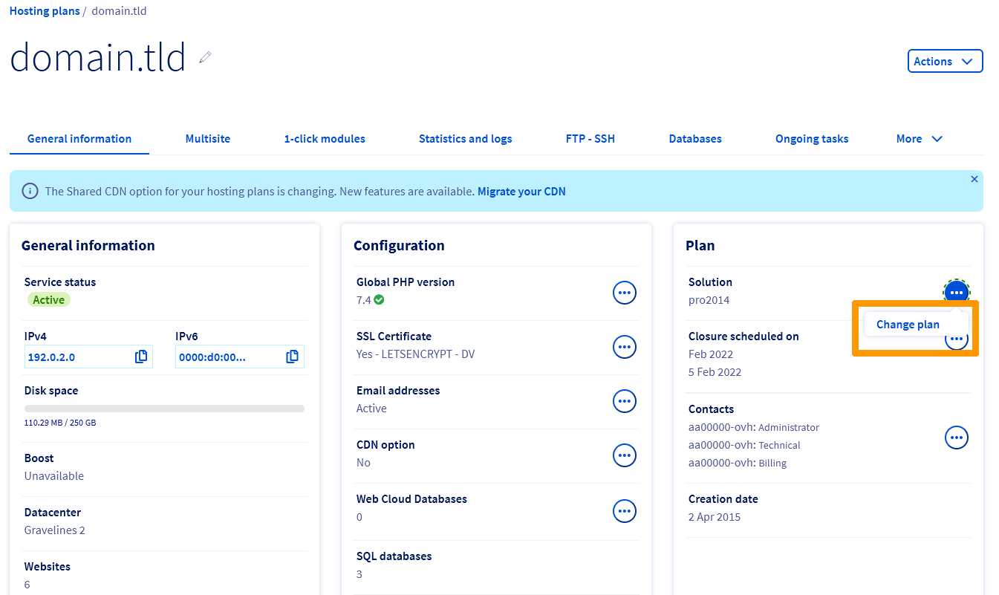
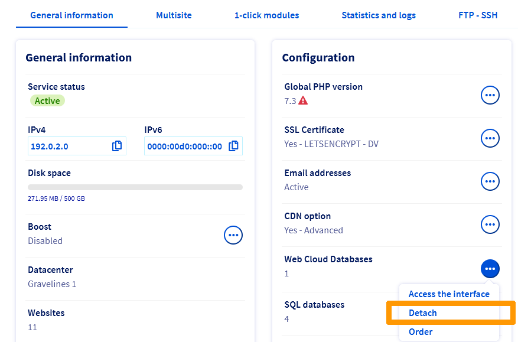
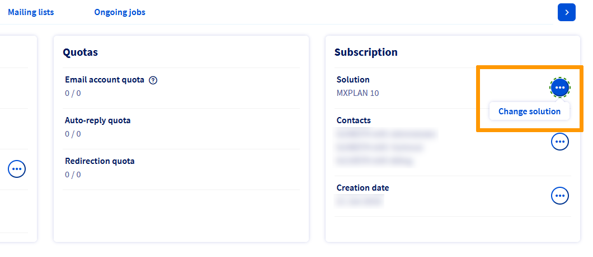
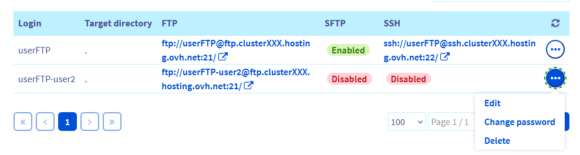
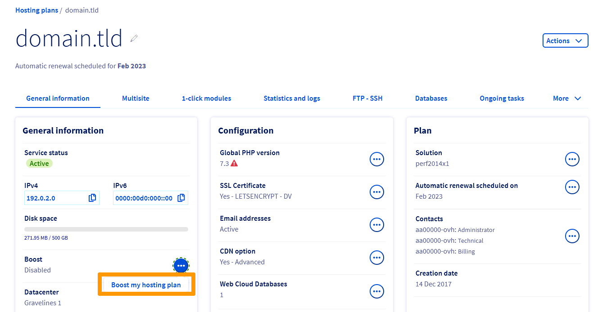

> [!primary]
> Diese Übersetzung wurde durch unseren Partner SYSTRAN automatisch erstellt. In manchen Fällen können ungenaue Formulierungen verwendet worden sein, z.B. bei der Beschriftung von Schaltflächen oder technischen Details. Bitte ziehen Sie im Zweifelsfall die englische oder französische Fassung der Anleitung zu Rate. Möchten Sie mithelfen, diese Übersetzung zu verbessern? Dann nutzen Sie dazu bitte den Button "Beitragen" auf dieser Seite.
>

## Ziel 

Mit Ihrem [OVHcloud Kundencenter](https://www.ovh.com/auth/?action=gotomanager&from=https://www.ovh.de/&ovhSubsidiary=de) können Sie die Kapazitäten Ihrer [Webhosting-Angebote](https://www.ovhcloud.com/de/web-hosting/) erweitern. So können Sie:

- ein leistungsfähigeres Hosting;
- mehr FTP-Speicherplatz;
- zusätzliche Datenbanken; 
- zusätzliche E-Mail-Adressen;
- zusätzliche Funktionen wie [Mailinglisten](/pages/web_cloud/email_and_collaborative_solutions/mx_plan/feature_mailing_list) (ab [dem Pro Angebot](https://www.ovhcloud.com/de/web-hosting/professional-offer/)) oder [Web Cloud Databases](https://www.ovhcloud.com/de/web-cloud/databases/){.external} (in [den Performance Angeboten](https://www.ovhcloud.com/fr/web-hosting/performance-offer/).

**Diese Anleitung erklärt, wie Sie Ihr OVHcloud Hosting ohne Dienstunterbrechung skalieren können.**

## Voraussetzungen

- Sie verfügen über ein [Webhosting Angebot](https://www.ovhcloud.com/de/web-hosting/)
- Sie sind in Ihrem [OVHcloud Kundencenter](https://www.ovh.com/auth/?action=gotomanager&from=https://www.ovh.de/&ovhSubsidiary=de) eingeloggt
- Sie sind mindestens „[Administrator](/pages/account_and_service_management/account_information/managing_contacts)“ der Dienste, für die Sie das Abonnement ändern möchten.

## In der praktischen Anwendung

> [!warning]
>
> **Bevor** Änderungen an Ihrem aktuellen Abonnement vorgenommen werden, überprüfen Sie, ob eine dieser Fragen zutrifft:
>
> - [Wie kann ich mein kostenloses 100M Hosting auf ein Webhosting Angebot umstellen?](#100m)
> - [Wie erhalte ich eine temporäre Leistungssteigerung bei meinem Performance Hosting Angebot?](#boost)
> - [Verschwende ich die verbleibende Zeit meines aktuellen Webhosting-Angebots, wenn ich das Angebot wechsle?](#billing)
> - [Kann ich mein aktuelles Angebot auf ein niedrigeres Angebot umstellen?](#checks)
>

### Webhosting-Angebot ändern 

Um Ihr Abonnement zu ändern, gehen Sie in Ihr [OVHcloud Kundencenter](https://www.ovh.com/auth/?action=gotomanager&from=https://www.ovh.de/&ovhSubsidiary=de) und klicken Sie auf den Bereich `Web Cloud`{.action}. Klicken Sie auf `Hosting-Pakete`{.action} und wählen Sie das betreffende Hosting aus.

Klicken Sie im Rahmen `Abo` auf den Button `...`{.action} rechts neben `Angebot` und dann auf `Angebot wechseln`{.action}.

{.thumbnail}

Wählen Sie anschließend Ihr neues Abonnement und dessen Laufzeit aus. Bestätigen Sie die entsprechenden Verträge und klicken Sie auf `Senden`{.action}.

### Überprüfen Sie, ob Ihr Webhosting mit einem Angebot der unteren Angebotsreihe kompatibel ist 

> [!warning]
>
> Die Änderung Ihres Abonnements für ein Angebot der unteren Angebotsreihe ist nur möglich, wenn es sich um das nächstniedrigere Angebot **handelt**.
> So können Sie beispielsweise nicht in einem Schritt von einer *Performance 2*-Formel zu einer *Pro*-Formel wechseln.
> Sie müssen Ihr Webhosting **zunächst** *Performance 2* auf das Angebot *Performance 1* **und dann** auf das Angebot *Pro* umstellen.

**Vor dem Wechsel zu einer niedrigeren Angebotsreihe** überprüfen Sie bitte die folgenden 6 Punkte:

#### 1 - Start SQL-Datenbanken

Stellen Sie sicher, dass das neue Angebot genügend [Datenbanken](https://www.ovhcloud.com/de/web-hosting/options/start-sql/) enthält. Prüfen Sie auch, ob die Größen ausreichen.

Löschen Sie andernfalls nicht verwendete Datenbanken, und reduzieren Sie ggf. die Datenmenge in diesen Datenbanken. Diese Menge darf die maximale Datenbankgröße des neuen Angebots nicht überschreiten. Wenn Sie weitere Unterstützung bei den durchzuführenden Aktionen benötigen, wenden Sie sich bitte an die [OVHcloud Partner](https://partner.ovhcloud.com/de/directory/).

Nach der Löschung der Daten Ihrer Datenbanken müssen Sie das verwendete Quota neu berechnen. Loggen Sie sich hierzu in Ihr [OVHcloud Kundencenter](https://www.ovh.com/auth/?action=gotomanager&from=https://www.ovh.de/&ovhSubsidiary=de) ein und gehen Sie in den Bereich `Web Cloud`{.action}. Klicken Sie in der linken Spalte auf `Hosting-Pakete`{.action} und wählen Sie das betreffende Webhosting aus. Gehen Sie auf der angezeigten Seite in den Tab `Datenbanken`{.action} und klicken Sie dann auf den Button `...`{.action} rechts neben der betreffenden Datenbank und dann auf `Das Quota neu berechnen`{.action}.

{.thumbnail}

> [!primary]
>
> Die Neuberechnung des Quotas Ihrer Datenbank kann bis zu **15 Minuten** dauern. Falls das neu berechnete Quota nicht automatisch angezeigt wird, laden Sie die Seite über Ihren Webbrowser neu.
>

#### 2 - Web Cloud Databases

Wenn Sie das Angebot [Web Cloud Databases](/pages/web_cloud/web_cloud_databases/starting_with_clouddb) nutzen, das mit Ihrem Webhosting [Performance](https://www.ovhcloud.com/de/web-hosting/performance-offer/) inklusive ist, und Ihr Webhosting auf ein Angebot [Pro](https://www.ovhcloud.com/de/web-hosting/professional-offer/) upgraden möchten, müssen Sie zunächst das Angebot Web Cloud Databases von Ihrem Webhosting trennen.  
Loggen Sie sich hierzu in Ihr [OVHcloud Kundencenter](https://www.ovh.com/auth/?action=gotomanager&from=https://www.ovh.de/&ovhSubsidiary=de) ein und gehen Sie in den Bereich `Web Cloud`{.action}. Klicken Sie in der linken Spalte auf `Hosting-Pakete`{.action} und wählen Sie das betreffende Webhosting aus. Bleiben Sie auf der angezeigten Seite im Tab `Allgemeine Informationen`{.action}. Klicken Sie in der mittleren Spalte `Konfiguration` auf den Button `...`{.action} rechts neben `Web Cloud Databases`{.action} und dann auf `Abtrennen`{.action}.

{.thumbnail}

Mit dieser Aktion können Sie ein Angebot für Web Cloud Databases unabhängig von Ihrem *Performance* Abonnement bestellen. Die Daten Ihres Servers bleiben dabei erhalten.

Wenn Sie diese Daten nicht behalten möchten, können Sie auch Ihr Angebot Web Cloud Databases löschen, bevor Sie zum Angebot *Pro* wechseln: 

1. Sichern Sie Ihre Daten gemäß den Anweisungen in dieser [Anleitung](/pages/web_cloud/web_cloud_databases/save-export-on-database-server). 
2. Löschen Sie Ihren Web Cloud Databases Server über Ihr [OVHcloud Kundencenter](https://www.ovh.com/auth/?action=gotomanager&from=https://www.ovh.de/&ovhSubsidiary=de). Loggen Sie sich hierzu in Ihr [OVHcloud Kundencenter](https://www.ovh.com/auth/?action=gotomanager&from=https://www.ovh.de/&ovhSubsidiary=de) ein, klicken Sie oben rechts auf Ihren Namen und dann auf das Icon `Produkte und Diensleistungen`{.action}. Klicken Sie dann auf den Button `...`{.action} rechts in der Zeile des betreffenden Web Cloud Databases/SQL Private Angebots und dann auf `Mein SQL Private Hosting löschen`{.action}.

#### 3 - FTP-Speicherplatz

Stellen Sie sicher, dass das neue Angebot ausreichend [FTP-Speicherplatz](/pages/web_cloud/web_hosting/ftp_connection) für den Import der Dateien Ihres aktuellen Hostings bietet.

Um das Quota des auf Ihrem Webhosting verwendeten FTP-Speicherplatzes zu überprüfen, loggen Sie sich in Ihrem [OVHcloud Kundencenter](https://www.ovh.com/auth/?action=gotomanager&from=https://www.ovh.de/&ovhSubsidiary=de) ein und gehen Sie in den Bereich `Web Cloud`{.action}. Klicken Sie in der linken Spalte auf `Hosting-Pakete`{.action} und wählen Sie das betreffende Webhosting aus. Auf der angezeigten Seite `Allgemeine Informationen`{.action} finden Sie das Quota unter `Speicherplatz`.

{.thumbnail}

#### 4 - E-Mail-Adressen

Stellen Sie sicher, dass Ihr neues Angebot eine ausreichende Anzahl verfügbarer E-Mail-Adressen enthält. Wenn dies nicht der Fall ist, löschen Sie die nicht verwendeten E-Mail-Adressen, nachdem Sie [Backup](/pages/web_cloud/email_and_collaborative_solutions/migrating/manual_email_migration) deren Inhalt erstellt haben.

Wenn Sie die gleiche Anzahl an E-Mail-Postfächern und **behalten möchten, bevor Sie Ihr Webhosting auf ein niedrigeres Angebot umstellen**, können Sie auch ein neues E-Mail-Angebot bestellen **MX Plan**. Loggen Sie sich hierzu in Ihr [OVHcloud Kundencenter](https://www.ovh.com/auth/?action=gotomanager&from=https://www.ovh.de/&ovhSubsidiary=de) ein und gehen Sie in den Bereich `Web Cloud`{.action}. Klicken Sie in der linken Spalte auf `E-Mails`{.action} und wählen Sie das betreffende E-Mail-Angebot aus. Klicken Sie auf der angezeigten Seite in der Randleiste `Abonnement`{.action} und rechts neben `Angebot`{.action} auf den Button `...`{.action} und dann auf `Angebot wechseln`{.action}.

{.thumbnail}

>[!primary]
>
> Wenn der Button `...`{.action} auf Ihrem E-Mail-Angebot nicht verfügbar ist, können Sie das E-Mail-Angebot von Ihrem Webhosting trennen. Bleiben Sie hierzu in Ihrem [OVHcloud Kundencenter](https://www.ovh.com/auth/?action=gotomanager&from=https://www.ovh.de/&ovhSubsidiary=de) im Bereich `Web Cloud`{.action}. Klicken Sie in der linken Spalte auf `Hosting-Pakete`{.action} und wählen Sie das betreffende Webhosting aus. Klicken Sie auf der angezeigten Seite `Allgemeine Informationen`{.action} und in der Randleiste `Konfiguration`{.action} auf den Button `...`{.action} rechts neben `E-Mail-Adressen`{.action} und dann auf `Meine E-Mail-Option abtrennen`{.action}.
>

#### 5 - Mailinglisten

Die Funktion [Mailinglisten](/pages/web_cloud/email_and_collaborative_solutions/mx_plan/feature_mailing_list) ist optional für die Hostings von [Basic](https://www.ovhcloud.com/de/web-hosting/personal-offer/) verfügbar.

Wenn Sie Ihr Webhosting auf ein [Basic](https://www.ovhcloud.com/de/web-hosting/personal-offer/) Angebot  umstellen möchten, müssen Sie zunächst die Mailinglisten löschen oder ein E-Mail-Angebot mit dieser Funktion (**MX Plan 100** oder **MX Plan Full**) über Ihr [OVHcloud Kundencenter](https://www.ovh.com/auth/?action=gotomanager&from=https://www.ovh.de/&ovhSubsidiary=de).

Loggen Sie sich hierzu in Ihr [OVHcloud Kundencenter](https://www.ovh.com/auth/?action=gotomanager&from=https://www.ovh.de/&ovhSubsidiary=de) ein und gehen Sie in den Bereich `Web Cloud`{.action}. Klicken Sie in der linken Spalte auf `E-Mails`{.action} und wählen Sie das betreffende E-Mail-Angebot aus. Klicken Sie auf der angezeigten Seite in der Randleiste `Abonnement`{.action} und rechts neben `Angebot`{.action} auf den Button `...`{.action} und dann auf `Angebot wechseln`{.action}.

>[!primary]
>
> Wenn der Button `...`{.action} auf Ihrem E-Mail-Angebot nicht verfügbar ist, können Sie das E-Mail-Angebot von Ihrem Webhosting trennen. Bleiben Sie hierzu in Ihrem [OVHcloud Kundencenter](https://www.ovh.com/auth/?action=gotomanager&from=https://www.ovh.de/&ovhSubsidiary=de) im Bereich `Web Cloud`{.action}. Klicken Sie in der linken Spalte auf `Hosting-Pakete`{.action} und wählen Sie das betreffende Webhosting aus. Klicken Sie auf der angezeigten Seite `Allgemeine Informationen`{.action} und in der Randleiste `Konfiguration`{.action} auf den Button `...`{.action} rechts neben `E-Mail-Adressen`{.action} und dann auf `Meine E-Mail-Option abtrennen`{.action}.
>

#### 6 - FTP-Benutzer

Stellen Sie sicher, dass das neue Angebot genügend FTP-Benutzer bietet.

Die Anzahl der FTP-Benutzer wird in Ihrem OVHcloud Kundencenter angezeigt. Gehen Sie nach dem Login in den Bereich `Web Cloud`{.action}. Klicken Sie in der linken Spalte auf `Hosting-Pakete`{.action} und wählen Sie das betreffende Webhosting aus. Klicken Sie auf der angezeigten Seite auf den Tab `FTP-SSH`{.action}.

Unten auf der angezeigten Seite werden in einer Tabelle alle für Ihr Webhosting erstellten FTP-Benutzer aufgelistet.

Um FTP-Benutzer zu löschen, klicken Sie auf den Button `...`{.action} rechts neben dem FTP-Benutzer, den Sie löschen möchten, und dann auf `Löschen`{.action}.

{.thumbnail} 

#### Finalisierung

Nachdem Sie diese 6 Punkte überprüft haben, können Sie Ihren [Angebotswechsel](#modify) durchführen.

### Sonderfälle

#### Sie verfügen über ein kostenloses 100M Hosting 

Bei einem Wechsel von einem [100M Gratis-Hosting](/pages/web_cloud/web_hosting/activate_start10m) Angebot wird Ihnen nur das [Basic Angebot](https://www.ovhcloud.com/de/web-hosting/personal-offer/) angeboten. Nach einem Wechsel zum Basic Angebot können Sie Ihr Basic Angebot auf alle unsere [Webhosting-Angebote](https://www.ovhcloud.com/de/web-hosting/) upgraden.

Folgen Sie [diesen Anweisungen](#modify), um Ihr Angebot zu wechseln.

#### Boosten Sie vorübergehend Ihr Performance Hosting 

Mit der bei unseren *Performance** Angeboten verfügbaren [Boost-Option](https://www.ovhcloud.com/de/web-hosting/options/boost/) können Sie die CPU- und RAM-Ressourcen Ihres Webhostings vorübergehend erhöhen, um einen punktuellen Anstieg des Traffics zu bewältigen. Wenn dieser Anstieg noch länger dauert, können Sie auch [auf das Performance Hosting Angebot der obersten Ebene umstellen](#modify), um dauerhaft über diese Ressourcen zu verfügen.

> [!warning]
>
> Wenn Sie die Boost-Option aktivieren, bleibt sie aktiv und wird Ihnen in Rechnung gestellt **bis Sie sie deaktivieren**.

Wenn die Option **Boost** Ihren Anforderungen entspricht, finden Sie unten Anweisungen zum **Aktivieren** oder **Deaktivieren** dieser Option auf Ihrem Hosting.

> [!tabs]
> **Boost-Option aktivieren**
>>
>> Um die Boost-Option zu aktivieren, loggen Sie sich in Ihrem [OVHcloud Kundencenter](https://www.ovh.com/auth/?action=gotomanager&from=https://www.ovh.de/&ovhSubsidiary=de) ein und gehen Sie in den Bereich `Web Cloud`{.action}. Klicken Sie in der linken Spalte auf `Hosting-Pakete`{.action} und wählen Sie das betreffende Webhosting aus. Klicken Sie auf der angezeigten Seite in der Box `Allgemeine Informationen` auf den Button `...`{.action} rechts von `Boost` und dann auf `Mein Angebot boosten`{.action}.  
>>{.thumbnail} 
>>
> **Boost deaktivieren**
>>
>> Um die Boost-Option zu deaktivieren, loggen Sie sich in Ihrem [OVHcloud Kundencenter](https://www.ovh.com/auth/?action=gotomanager&from=https://www.ovh.de/&ovhSubsidiary=de) ein und gehen Sie in den Bereich `Web Cloud`{.action}. Klicken Sie in der linken Spalte auf `Hosting-Pakete`{.action} und wählen Sie das betreffende Webhosting aus. Gehen Sie auf der angezeigten Seite in den Tab `Mehr` und klicken Sie dann auf `Mein Angebot boosten`{.action}. 
>> Die Tabelle zur Verwendung der Boost-Option wird angezeigt. Klicken Sie auf `Boost deaktivieren`{.action}.  
>>{.thumbnail} 

#### Abrechnung bei Angebotswechsel 

Wenn Sie Ihr ursprüngliches Angebot auf ein höheres Angebot umstellen, wird bis zum nächsten Verlängerungsdatum dieses ursprünglichen Abonnements eine anteilige Berechnung* durchgeführt.
Diese Berechnung entspricht der Preisdifferenz zwischen Ihrem ursprünglichen und Ihrem neuen Angebot.

> **Beispiel:** 
>
> Sie haben am 1. Januar 2022 ein [Basic](https://www.ovhcloud.com/de/web-hosting/personal-offer/) Abo bestellt.
>
> Am 31. Oktober 2022 wechseln Sie von diesem Angebot **Basic** zu einem Abonnement auf dem Angebot [Pro](https://www.ovhcloud.com/de/web-hosting/professional-offer/). 
>
> Daher wird der Betrag für die verbleibende Laufzeit des Abonnements **Basic** (2 Monate, vom 1. November 2022 bis zum 1. Januar 2023) automatisch von den Kosten für das neue Abonnement **Pro** bis zum 1. Januar 2023 abgezogen. Sie zahlen nur die Differenz.
> Ab dem 1. Januar 2023 wird Ihnen das **Pro** Abo dann zum geltenden Preis berechnet.

Folgen Sie [diesen Anweisungen](#modify), um Ihr Angebot zu wechseln.

## Weitere Informationen 

[Statistiken und Logs einer auf einem Shared Hosting Angebot gehosteten Website einsehen](/pages/web_cloud/web_hosting/logs_and_statistics)

[Optimieren der Performance Ihrer Website](/pages/web_cloud/web_hosting/optimise_your_website_performance)

Kontaktieren Sie für spezialisierte Dienstleistungen (SEO, Web-Entwicklung etc.) die [OVHcloud Partner](https://partner.ovhcloud.com/de/directory/).

Wenn Sie Hilfe bei der Nutzung und Konfiguration Ihrer OVHcloud Lösungen benötigen, beachten Sie unsere [Support-Angebote](https://www.ovhcloud.com/de/support-levels/).

Für den Austausch mit unserer User Community gehen Sie auf <https://community.ovh.com/en/>.
