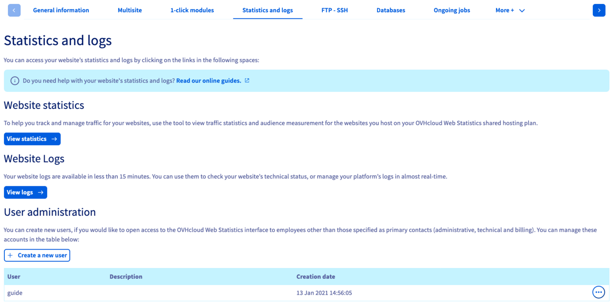
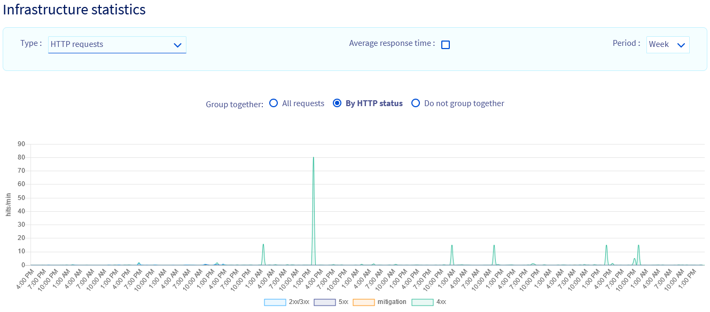

> [!primary]
> Esta traducción ha sido generada de forma automática por nuestro partner SYSTRAN. En algunos casos puede contener términos imprecisos, como en las etiquetas de los botones o los detalles técnicos. En caso de duda, le recomendamos que consulte la versión inglesa o francesa de la guía. Si quiere ayudarnos a mejorar esta traducción, por favor, utilice el botón «Contribuir» de esta página.
> 

## Objetivo

El acceso a los logs y las estadísticas de su sitio web está incluido en su plan de hosting, al que podrá acceder desde el área de cliente de OVHcloud.

**Esta guía explica cómo consultar las estadísticas y logs de un sitio web.**

## Requisitos

- Tener contratado un plan [de hosting](https://www.ovhcloud.com/es-es/web-hosting/){.external} compatible.
- Haber iniciado sesión en el [área de cliente de OVHcloud](https://www.ovh.com/auth/?action=gotomanager&from=https://www.ovh.es/&ovhSubsidiary=es){.external}.

## Procedimiento

Acceda al [área de cliente de OVHcloud](https://www.ovh.com/auth/?action=gotomanager&from=https://www.ovh.es/&ovhSubsidiary=es){.external}. Haga clic en `Web Cloud`{.action} y seleccione `Alojamientos`{.action}.

En el menú de la izquierda, seleccione el alojamiento correspondiente y abra la pestaña `Estadísticas y logs`{.action}.

Se abrirá una pantalla que consta de 4 secciones:

- **Estadísticas de visitas** : presenta numerosas estadísticas relativas a su alojamiento
- **Logs del sitio web**: muestra los logs en bruto del alojamiento
- **Estadísticas de la infraestructura**: presenta estadísticas gráficas (peticiones HTTP y SQL, comandos FTP, etc.)
- **Administración de los usuarios**: muestra los usuarios autorizados a acceder a las estadísticas

{.thumbnail}

### Administración de usuarios

La creación de un usuario permitirá a una persona acceder a las estadísticas de su alojamiento sin tener acceso al área de cliente de OVHcloud. 

Haga clic en el botón `Crear un nuevo usuario`{.action} en la sección `Administración de usuarios` y siga las instrucciones que se indican a continuación.  

{.thumbnail}

Para acceder a las estadísticas de su sitio web con un usuario que haya creado, debe introducir la siguiente dirección sustituyendo `000` por el número del cluster de su alojamiento y `mydomain.ovh` por el nombre de dominio de su sitio web (sin los « www »):

```bash
https://logs.cluster000.hosting.ovh.net/mydomain.ovh/
```

Desde la sección `Estadísticas y logs`{.action}, haga clic en `Ver las estadísticas`{.action}.<br>
En la pestaña de su navegador que muestra la ventana de estadísticas, consulte el enlace que se utilizará para conectarse con uno de los usuarios creados.

{.thumbnail}

> [!warning] 
>
> Si ha activado los logs separados en una [entrada multisitio](/pages/web_cloud/web_hosting/multisites_configure_multisite#2-anadir-un-dominio-o-subdominio), los usuarios creados aquí no pueden acceder a las estadísticas de esta entrada multisitio.
>

### Estadísticas de visitas

Para ayudarle a realizar un mejor seguimiento y control del tráfico de sus sitios web, dispone de una herramienta de estadísticas de afluencia y de medición de audiencia de sus sitios web alojados en su hosting, **OVHcloud Web Statistics**.

{.thumbnail}

El panel de control de OVHcloud Web Statistics presenta 7 secciones:

- Dashboard: visualización del tráfico en los sitios web del alojamiento.
- Browsers: clasificación de los navegadores de internet más utilizados para visualizar sus sitios web.
- Geolocalization :  proporción de visitantes en función de su localización.
- Peticiones: clasificación de las páginas más consultadas en sus sitios web.
- Robots: visualización de los robots que pasan por sus sitios web.
- Status : estadísticas de fallos y éxitos encontrados en función de los códigos HTTP devueltos.
- FAQ: sección dedicada a las preguntas más frecuentes.

El campo `Period selection` situado en la parte superior derecha permite seleccionar un período de tiempo específico.

### Logs

Puede visualizar los logs brutos de su sitio web con un retraso de aproximadamente 5 minutos.

{.thumbnail}

Hay diferentes tipos de logs a su disposición:

- Logs Web: aquí encontrará los distintos logs de consulta de su sitio web, así como las diferentes acciones realizadas a partir de su sitio web. Esto permite, por ejemplo, identificar intentos de acción maliciosa.
- Logs FTP: las diferentes conexiones FTP se guardarán y conservarán en estos logs.
- Logs error: los diferentes errores generados por su sitio web.
- Logs CGI: las diferentes llamadas a los scripts cgi.bin realizadas.
- Logs out : las estadísticas de su alojamiento sobre las diferentes llamadas externas realizadas.
- Logs SSH: estos logs indican las distintas conexiones realizadas con el protocolo SSH.
- Logs CRON: el resultado de la ejecución de las tareas planificadas ([tareas automatizadas (CRON) en el alojamiento](/pages/web_cloud/web_hosting/cron_tasks)).

### Actividades del alojamiento

Acceda a la sección Actividad de la infraestructura de su alojamiento para visualizar el consumo de los recursos puestos a su disposición.

En la pestaña `Información general`{.action}, haga clic en el icono con forma de tres puntos.

{.thumbnail}

Desde el menú desplegable situado en la parte superior izquierda podrá ver distintos tipos de gráficos:

- Conexiones salientes: peticiones enviadas desde su sitio web hacia un sitio externo.
- Uso de la CPU: nivel de consumo del procesador en la instancia de alojamiento.
- Superación del límite de recursos: indica los momentos en que el alojamiento supera el límite de recursos.
- Peticiones SQL: cantidad de peticiones a las bases de datos de su alojamiento.
- Tiempo de respuesta SQL: tiempo de respuesta de las peticiones enviadas a las bases de datos de su alojamiento.

## Más información

Para servicios especializados (posicionamiento, desarrollo, etc.), contacte con [partners de OVHcloud](https://partner.ovhcloud.com/es-es/directory/).

Si quiere disfrutar de ayuda para utilizar y configurar sus soluciones de OVHcloud, puede consultar nuestras distintas soluciones [pestañas de soporte](https://www.ovhcloud.com/es-es/support-levels/).

Interactúe con nuestra comunidad de usuarios en <https://community.ovh.com/en/>.