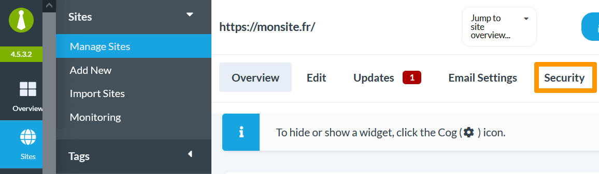
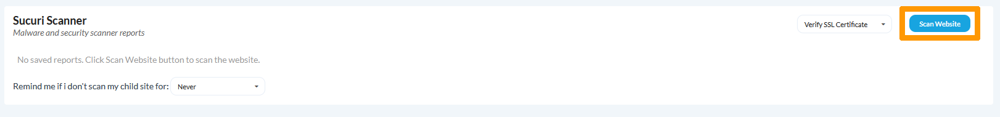
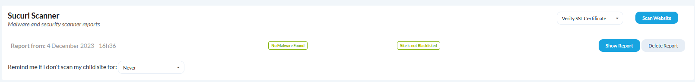

## Objectif

Maintenir la sécurité de vos sites web est crucial pour le développement de votre marque. Une sécurité optimale sur vos sites web permet de protéger les données de votre entreprise, mais aussi celles de vos clients, préservant ainsi la confiance et l'image de votre société. Grâce aux extensions du plugin WordPress MainWP, vous pouvez contrôler la sécurité de vos sites web depuis un seul et même endroit.

**Ce guide vous explique comment améliorer la sécurité de vos sites web depuis le dashboard MainWP**

## Prérequis

- Disposer d'une offre d'hébergement [Web Cloud](https://www.ovhcloud.com/fr/web-hosting/cloud-web-offer/).
- Être connecté à votre dashboard MainWP.

## En pratique

### Installer l'extension Sucuri

> [!primary]
> Si vous n'avez jamais installé d'extension MainWP, découvrez dans [ce guide](/pages/web_cloud/web_hosting/mainwp_general/) comment installer une extension.
>

Pour retrouver toutes les extensions liées à la sécurité, rendez-vous sur la rubrique [sécurité](https://mainwp.com/mainwp-extensions/extension-category/security/) de MainWP. Vous pouvez également chercher une extension en cliquant sur `Extensions`{.action} depuis le menu principal de MainWP, puis sur `Install Extensions`{.action}. Cliquez sur l'onglet `Security`{.action} pour afficher la liste des extensions liées à la sécurité. Dans cet exemple, nous choisissons l'extension gratuite Sucuri, mais vous êtes libre de choisir l'extension de votre choix. Une fois l'extension sélectionnée, cliquez sur `Install Selected Extensions`{.action}.
Dans le menu principal de MainWP, cliquez sur `Extensions`{.action} puis sur `Manage Extensions`{.action}. L'extension Sucuri précédemment installée apparaît. 

{.thumbnail}

Si ce n'est pas déjà fait, cliquez sur `Enable`{.action} puis sur `License`{.action} pour pouvoir utiliser l'extension.

### Effectuer un scan de sécurité

Dans le menu principal de MainWP, cliquez sur `Sites`{.action} puis sélectionnez le site enfant de votre choix. En haut de l'écran, cliquez sur l'onglet `Security`{.action}.

{.thumbnail}

Pour effectuer un scan de sécurité sur votre site web, cliquez sur `Scan Website`{.action}.

{.thumbnail}

Une fois le scan de sécurité effectué, une nouvelle ligne s'affiche correspondant au rapport du scan de sécurité.

{.thumbnail}

Cliquez sur `Show Report`{.action} pour visualiser le rapport de sécurité.

{.thumbnail}

Le rapport du scan de sécurité fournit de nombreuses informations importantes concernant la sécurité de votre site web, comme :
- Présence de virus et de logiciels malveillants
- Détection d'anomalies
- Liens dangereux
- Tentative de Spam
- Etc.

Pensez à effectuer régulièrement des scans de sécurité. Avec Sucuri, il est possible d'activer un rappel. En bas de la liste de vos rapports de sécurité, cliquez sur la liste déroulante à droite de `Remind me if I don't scan my child site for`{.action}. Par exemple, si vous choisissez `1 week`{.action}, Sucuri vous rappellera chaque semaine d'effectuer un scan de sécurité.

## Aller plus loin

[Administrer plusieurs sites web WordPress avec le plugin MainWP](/pages/web_cloud/web_hosting/mainwp_general/)

[Gérer les clients de ses sites web avec MainWP](/pages/web_cloud/web_hosting/mainwp-client-management/)

[Sauvegarder ses sites web avec MainWP](/pages/web_cloud/web_hosting/mainwp-backup/)

