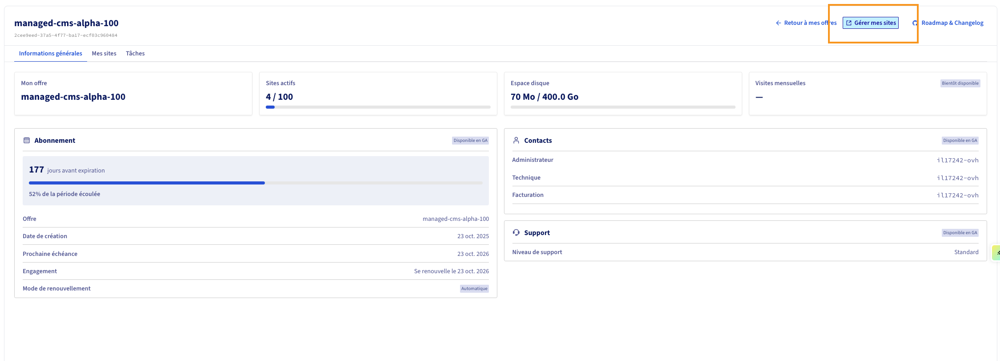

## Objectif

**MainWP** est un tableau de bord open-source auto-hébergé, intégré à votre offre **Managed Hosting for WordPress**. Il vous permet de gérer l'ensemble de vos sites WordPress depuis une interface centralisée, sans passer par l'administration de chaque site individuellement.

> [!primary]
> MainWP est un outil tiers, indépendant d'OVHcloud. OVHcloud héberge et met à disposition l'accès à l'interface MainWP, mais n'assure pas le support fonctionnel de l'outil. Pour toute question avancée sur les fonctionnalités MainWP, consultez la [documentation officielle MainWP](https://docs.mainwp.com/).

**Découvrez comment gérer vos sites WordPress grâce à MainWP.**

## Prérequis

- Disposer d'une offre **Managed Hosting for WordPress** active avec au moins un site web créé.

<!-- CP-NAV-START:web-wordpress-hosting -->
---

### Accès à l'espace client OVHcloud

- **Lien direct :** [Hébergement WordPress](/links/control-panel/web-wordpress-hosting)
- **Pour accéder à vos services :** `Web Cloud`{.action} > `Managed hosting for WordPress`{.action}

---
<!-- CP-NAV-END:web-wordpress-hosting -->

## En pratique

### 1. Accéder à l'interface MainWP

- **Sélectionner votre ressource** : identifiez la ressource à gérer dans la liste affichée.

{.thumbnail}

- **Accéder aux informations de la ressource** : cliquez sur `Gérer`{.action} sous la ressource concernée. La page **Informations générales** s'affiche avec les détails de votre offre (abonnement, quotas, contacts).

{.thumbnail}

- **Lancer MainWP** : cliquez sur `Gérer mes sites`{.action} en haut à droite. L'interface MainWP s'ouvre dans un nouvel onglet.

> [!primary]
> Accédez à MainWP via le lien direct présent dans l'espace client. Aucune installation supplémentaire n'est nécessaire : MainWP est préinstallé sur votre ressource Managed Hosting for WordPress.

### 2. Comprendre l'interface MainWP

L'interface MainWP est organisée autour de 2 concepts principaux :

- **Tableau de bord (Dashboard)** : vue centrale listant tous vos sites connectés avec leur état.
- **Sites enfants (Child Sites)** : chacun de vos sites WordPress gérés via MainWP.

<!-- DRAFT: To screenshot — capturer le tableau de bord MainWP avec la liste des sites connectés, les indicateurs d'état (mises à jour disponibles, statut de connexion) et le menu latéral -->

Le tableau de bord regroupe 3 zones principales :

- **Liste des sites** : affiche tous vos sites WordPress avec leur statut (en ligne/hors ligne, mises à jour disponibles).
- **Indicateurs d'état** : nombre de mises à jour en attente (WordPress core, extensions, thèmes).
- **Menu latéral** : navigation vers les sections Sites, Mises à jour, Extensions, Sécurité, etc.

### 3. Gérer vos sites WordPress — actions individuelles

#### 3.1 Accéder à l'administration d'un site

<!-- DRAFT: To screenshot — capturer la liste des sites dans MainWP avec le bouton "WP Admin" ou équivalent permettant d'accéder à l'administration d'un site spécifique -->

- **Localiser le site** : dans la liste des sites du tableau de bord MainWP, trouvez le site que vous souhaitez administrer.
- **Ouvrir l'administration** : cliquez sur `WP Admin`{.action} en face du site pour accéder directement à son tableau de bord WordPress.

#### 3.2 Mettre à jour un site individuellement

<!-- DRAFT: To screenshot — capturer la vue de détail d'un site dans MainWP avec les mises à jour disponibles listées (WordPress core, plugins, thèmes) et le bouton de mise à jour -->

- **Ouvrir le détail du site** : cliquez sur le nom du site dans la liste.
- **Consulter les mises à jour disponibles** : l'écran de détail affiche les mises à jour en attente (WordPress core, extensions/plugins, thèmes).
- **Mettre à jour** : cliquez sur `Mettre à jour`{.action} en face de chaque élément, ou `Tout mettre à jour`{.action} pour appliquer toutes les mises à jour en une fois.

> [!warning]
> Effectuez un backup ou un snapshot de votre site avant toute mise à jour majeure. Certaines mises à jour d'extensions peuvent provoquer des incompatibilités. Consultez le guide « [Sauvegarder ses sites web WordPress avec MainWP](/pages/web_cloud/web_hosting/mainwp-backup) » pour créer un point de restauration.

### 4. Actions groupées (bulk actions)

Les actions groupées appliquent une opération à plusieurs sites WordPress simultanément, sans avoir à la répéter pour chacun.

<!-- DRAFT: To screenshot — capturer l'interface de sélection multiple dans MainWP (cases à cocher devant chaque site) et le menu déroulant des actions groupées disponibles -->

#### 4.1 Sélectionner plusieurs sites

- **Afficher la liste des sites** : depuis le tableau de bord MainWP, accédez à la section `Sites`{.action}.
- **Sélectionner les sites cibles** : cochez les cases en face de chaque site à inclure dans l'action groupée. Utilisez `Tout sélectionner`{.action} pour inclure l'ensemble de vos sites.

#### 4.2 Mettre à jour plusieurs sites en masse

<!-- DRAFT: To screenshot — capturer l'écran de mise à jour groupée avec la sélection de sites et le bouton "Appliquer les mises à jour" ou équivalent -->

- **Sélectionner les sites** : cochez les sites à mettre à jour (voir §4.1).
- **Lancer la mise à jour groupée** : cliquez sur `Mises à jour`{.action} dans le menu d'actions groupées.
- **Choisir les composants à mettre à jour** : sélectionnez les éléments concernés (WordPress core, extensions, thèmes).
- **Appliquer** : cliquez sur `Mettre à jour`{.action}. MainWP applique les mises à jour séquentiellement sur chaque site sélectionné.

> [!primary]
> Les mises à jour sont appliquées dans l'ordre de la liste, ce qui peut prendre quelques minutes selon le nombre de sites.

#### 4.3 Installer ou activer une extension sur plusieurs sites

<!-- DRAFT: To screenshot — capturer la section "Extensions" ou "Plugins" de MainWP avec l'option d'installation/activation groupée et le sélecteur de sites -->

- **Accéder à la gestion des extensions** : dans le menu MainWP, cliquez sur `Extensions`{.action} (ou **Plugins**).
- **Sélectionner l'extension** : trouvez l'extension à installer ou activer dans la liste.
- **Choisir les sites cibles** : sélectionnez les sites sur lesquels appliquer l'action.
- **Appliquer** : cliquez sur `Installer`{.action} ou `Activer`{.action} selon le cas.

#### 4.4 Autres actions groupées disponibles

- **Désactiver une extension** sur tous les sites sélectionnés.
- **Supprimer une extension** des sites sélectionnés.
- **Installer un thème** sur plusieurs sites simultanément.
- **Activer un thème** sur les sites sélectionnés.
- **Publier du contenu** (article ou page) sur plusieurs sites.

> [!primary]
> Certaines actions avancées (rapports clients, monitoring de sécurité avancé, sauvegardes automatisées) nécessitent des **extensions MainWP** (premium). Consultez la [liste des extensions MainWP](https://docs.mainwp.com/).

### 5. Comment surveiller l'état de vos sites ?

<!-- DRAFT: To screenshot — capturer le tableau de bord MainWP avec les indicateurs de statut : sites en ligne/hors ligne, nombre de mises à jour en attente par catégorie, alertes de sécurité éventuelles -->

MainWP affiche l'état de santé de vos sites en temps réel :

- **Site en ligne (vert)** : le site répond correctement.
- **Site hors ligne (rouge)** : le site est inaccessible, ou la connexion MainWP est perdue.
- **Mises à jour disponibles** : nombre de mises à jour en attente (core / plugins / thèmes).
- **Vulnérabilités détectées** : extension ou thème présentant une faille de sécurité connue.

> [!warning]
> Si un site apparaît « hors ligne » dans MainWP, le site n'est pas forcément inaccessible pour vos visiteurs. Cela peut indiquer un problème de connexion entre MainWP et le site enfant (extension Child Site désactivée, changement de mot de passe, etc.).

## Limites et périmètre de support

- **Hébergement de MainWP** : géré par OVHcloud, inclus dans votre offre.
- **Fonctionnement de MainWP** : responsabilité de l'éditeur MainWP.
- **Mises à jour de MainWP** : gérées automatiquement par OVHcloud.
- **Support fonctionnel avancé** : à adresser à la [communauté MainWP](https://docs.mainwp.com/).

## Aller plus loin

[Documentation officielle MainWP](https://docs.mainwp.com/) — guides, extensions et FAQ.

[Premiers pas avec le Managed Hosting for WordPress](/pages/web_cloud/managed_hosting/01-managed-wordpress-getting-started) — accès, informations et gestion des sites WordPress.

[Sauvegarder ses sites web WordPress avec MainWP](/pages/web_cloud/web_hosting/mainwp-backup)

Pour des prestations spécialisées (référencement, développement, etc.), contactez les [partenaires OVHcloud](/links/partner).

Échangez avec notre [communauté d'utilisateurs](/links/community).