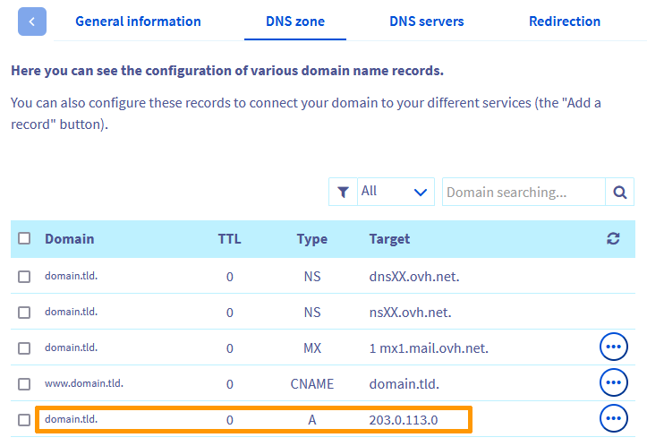

> [!primary]
> Diese Übersetzung wurde durch unseren Partner SYSTRAN automatisch erstellt. In manchen Fällen können ungenaue Formulierungen verwendet worden sein, z.B. bei der Beschriftung von Schaltflächen oder technischen Details. Bitte ziehen Sie im Zweifelsfall die englische oder französische Fassung der Anleitung zu Rate. Möchten Sie mithelfen, diese Übersetzung zu verbessern? Dann nutzen Sie dazu bitte den Button "Beitragen" auf dieser Seite.
>

## Ziel 

Möglicherweise wird in Ihrem Webbrowser die Fehlerseite **Seite nicht installiert** angezeigt, insbesondere bei der ersten Installation Ihrer Website.

{.thumbnail}

**Diese Anleitung erklärt, wie Sie die Ursachen dieses Fehlers ermitteln und beheben.**

> [!warning]
> OVHcloud stellt Ihnen Dienstleistungen zur Verfügung, für deren Konfiguration und Verwaltung Sie die alleinige Verantwortung tragen. Es liegt somit bei Ihnen, sicherzustellen, dass diese ordnungsgemäß funktionieren.
> 
> Diese Anleitung soll Sie bei allgemeinen Aufgaben bestmöglich unterstützen. Dennoch empfehlen wir Ihnen, falls Sie Hilfe brauchen, einen [spezialisierten Dienstleister](/links/partner) zu kontaktieren oder Ihre Fragen an die [OVHcloud Community](/links/community) zu richten. Leider können wir Ihnen für administrative Aufgaben keine weitergehende technische Unterstützung anbieten. Weitere Informationen finden Sie am [Ende dieser Anleitung](#go-further).
>

## Voraussetzungen

- Sie haben ein [OVHcloud Webhosting](/links/web/hosting) in Ihrem Kunden-Account.
- Sie haben Zugriff auf Ihr [OVHcloud Kundencenter](/links/manager).
- Sie verfügen über die erforderlichen Berechtigungen zum Verwalten der [DNS-Zone](/pages/web_cloud/domains/dns_zone_edit) des Domainnamens.

## In der praktischen Anwendung

Die Seite **Seite nicht installiert** wird aus zwei Gründen angezeigt:

- 1: [Ihr Domainname oder Ihre Subdomain ist auf Ihrem Webhosting nicht korrekt deklariert](#check-multisites).

- 2: [Ihr Domainname zeigt nicht auf die IP-Adresse Ihres Webhostings](#check-dns-domain).

Mit den folgenden Schritten können Sie in beiden Fällen den Fehler `Seite nicht installiert` beheben.

### Schritt 1 - Überprüfen Sie die Deklaration Ihrer Domain oder Subdomain auf Ihrem Webhosting 

Gehen Sie in Ihrem [OVHcloud Kundencenter](/links/manager) oben auf der Seite in den Bereich `Web Cloud`{.action} und klicken Sie dann auf den Tab `Hosting-Pakete`{.action} in der linken Spalte.

Wählen Sie das betreffende Webhosting aus der Liste aus und klicken Sie dann auf den Tab `Multisite`{.action}.

|Szenario|Auszuführende Aktion|
|---|---|
|Der Domainname bzw. die Subdomain Ihrer Website wird in der Tabelle „Multisite“ angezeigt.|Wenn Sie die Domain bzw. Subdomain im Bereich `Multisite`{.action} Ihres Webhostings hinzugefügt haben, warten Sie etwa **20 Minuten** und leeren Sie den Cache Ihres Browsers. Wenn weiterhin die Meldung „Seite nicht installiert“ angezeigt wird, fahren Sie mit [Schritt 2](#check-dns-domain) fort.|
|Der Domainname oder die Subdomain Ihrer Website wird nicht in der Tabelle „Multisite“ angezeigt.|Fügen Sie Ihren Domainnamen/Ihre Subdomain im Bereich `Multisite`{.action} hinzu, indem Sie den entsprechenden Abschnitt der Anleitung „[Mehrere Websites auf einem Webhosting einrichten - Eine Domain oder Subdomain hinzufügen](/pages/web_cloud/web_hosting/multisites_configure_multisite)“ folgen.|
|Der Domainname oder die Subdomain wurde ohne Aktion Ihrerseits aus der Tabelle „Multisite“ entfernt.|Ihre Domain oder die dazugehörige DNS-Zone wird möglicherweise von einem anderen Kunden-Account aus verwaltet. Fügen Sie Ihren Domainnamen/Ihre Subdomain im Bereich `Multisite`{.action} hinzu, indem Sie den entsprechenden Abschnitt der Anleitung „[Mehrere Websites auf einem Webhosting einrichten - Eine externe Domain hinzufügen](/pages/web_cloud/web_hosting/multisites_configure_multisite)“ folgen.|

### Schritt 2 - Überprüfen Sie den IP-Eintrag in der aktiven DNS-Zone Ihrer Domain 

In diesem Schritt überprüfen Sie, dass Ihre Domain oder Subdomain über die aktive DNS-Zone auf die IP-Adresse Ihres Webhostings verweist.

> [!primary]
>
> Weitere Informationen zum Begriff DNS finden Sie auf den folgenden Seiten:
> 
> - [OVHcloud DNS-Zone bearbeiten](/pages/web_cloud/domains/dns_zone_edit);
> - [OVHcloud DNS-Zone erstellen](/pages/web_cloud/domains/dns_zone_create);
> - [DNS-Server einer OVHcloud Domain bearbeiten](/pages/web_cloud/domains/dns_server_edit).
>

#### 2\.1 IP-Adresse Ihres OVHcloud Webhostings identifizieren

Um die IP-Adresse Ihres Webhostings zu finden, loggen Sie sich in Ihrem [OVHcloud Kundencenter](/links/manager) ein und gehen Sie dann oben auf der Seite in den Bereich `Web Cloud`{.action}. Klicken Sie in der linken Spalte auf `Hosting-Pakete`{.action} und wählen Sie das betreffende Webhosting aus der Liste aus.

Die `IPv4` Adresse finden Sie in der Box `Allgemeine Informationen`{.action}.

{.thumbnail}

Die Ihrem Webhosting zugeordnete IP-Adresse finden Sie auch in unserer Anleitung „[Liste der IP-Adressen, die den OVHcloud Webhostings zugewiesen sind](/pages/web_cloud/web_hosting/clusters_and_shared_hosting_IP)“.

#### 2\.2 Die in der aktiven DNS-Zone Ihrer Domain angegebene IP-Adresse überprüfen

Überprüfen Sie nun, ob die IP-Adresse Ihres Webhostings in der aktiven DNS-Zone Ihrer Domain angezeigt wird.

> [!primary]
>
> Vor dem Fortsetzen des Vorgangs kann es bei einer Änderung der aktiven **DNS Zone** einer Domain zu einer Propagationsverzögerung von **4 bis 24 Stunden** kommen, um die Informationen im DNS-Netzwerk zu aktualisieren.
>
> Wenn Sie die mit Ihrer Domain verbundenen **DNS-Server** ändern, kann die Bearbeitungszeit bis zu **48 Stunden** betragen.
>

Loggen Sie sich hierzu in Ihr [OVHcloud Kundencenter](/links/manager) ein und gehen Sie oben auf der Seite in den Bereich `Web Cloud`{.action}. Gehen Sie in den Bereich `Domainnamen`{.action}, wählen Sie Ihren Domainnamen aus und gehen Sie dann in den Tab `DNS-Zone`{.action}.

Eine Tabelle mit verschiedenen DNS-Einträgen wird angezeigt.

|Mögliche Szenarien|Auszuführende Aktion|
|---|---|
|In der aktiven DNS-Zone zeigt Ihr Domainname/Ihre Subdomain auf die IP-Adresse Ihres Webhostings mit einem A-Eintrag (für eine IPv4) oder AAAA-Eintrag (für eine IPv6).  {.thumbnail}|Dies weist darauf hin, dass die Konfiguration Ihres Domainnamens korrekt ist.   Warten Sie, bis die DNS Propagation abgeschlossen ist.   (Denken Sie auch daran, Ihre Geräte (PC, Smartphone, Box usw.) neu zu starten und leeren Sie den Cache Ihres Browsers). Die alte Konfiguration Ihrer Domain kann im Cache gespeichert werden, was die Anzeige Ihres Updates verzögern kann.|
|Die aktive DNS-Zone enthält keine A- oder AAAA-Einträge, die Ihre Domain/Subdomain mit der IP-Adresse Ihres Webhostings verbinden. Oder der vorhandene Eintrag verweist auf eine andere IP-Adresse.|Fügen Sie den neuen A- oder AAAA-Eintrag hinzu, oder korrigieren Sie den vorhandenen Eintrag, indem Sie [diese Anleitung](/pages/web_cloud/domains/dns_zone_edit) befolgen.|
|Ihre Domain wird nicht im Bereich `Domainnamen`{.action} Ihres OVHcloud Kundencenters angezeigt.  Oder der Tab `DNS-Zone`{.action} Ihres Domainnamens erscheint wie folgt:  {.thumbnail}|Das bedeutet, dass Ihr Domainname nicht über Ihr OVHcloud Kundencenter verwaltet wird.  Finden Sie über unser [WHOIS-Tool](/links/web/domains-whois) den Registrar heraus sowie die zugehörigen DNS-Server.   Suchen Sie die betreffende DNS-Zone und ändern Sie sie entsprechend. Folgen Sie hierzu dem entsprechenden Abschnitt in der Anleitung „[Mehrere Websites auf einem Webhosting einrichten - Eine externe Domain hinzufügen](/pages/web_cloud/web_hosting/multisites_configure_multisite)“.|
|Diese Warnung erscheint in der Registerkarte `DNS Zone`{.action}:  {.thumbnail}|Sie müssen die DNS-Server Ihrer Domain entsprechend anpassen, indem Sie unsere Anleitung „[DNS Server einer OVHcloud Domain bearbeiten](/pages/web_cloud/domains/dns_server_edit)“ befolgen.|

## Weitere Informationen 

[Liste der IP-Adressen von Clustern und Webhostings](/pages/web_cloud/web_hosting/clusters_and_shared_hosting_IP)

[Mehrere Websites auf einem Webhosting einrichten](/pages/web_cloud/web_hosting/multisites_configure_multisite)

[DNS-Server einer OVHcloud Domain bearbeiten](/pages/web_cloud/domains/dns_server_edit)

[Bearbeiten einer OVHcloud DNS-Zone](/pages/web_cloud/domains/dns_zone_edit)

[OVHcloud DNS-Zone erstellen](/pages/web_cloud/domains/dns_zone_create)

Kontaktieren Sie für spezialisierte Dienstleistungen (SEO, Web-Entwicklung etc.) die [OVHcloud Partner](/links/partner).

Wenn Sie Hilfe bei der Nutzung und Konfiguration Ihrer OVHcloud Lösungen benötigen, beachten Sie unsere [Support-Angebote](/links/support).

Treten Sie unserer [User Community](/links/community) bei.