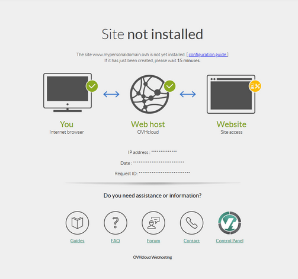
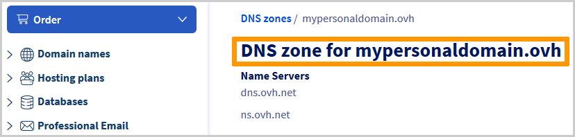

## Objective

You may see the error page **Website not installed** displayed on your web browser, particularly when your website is first installed.

{.thumbnail}

**Find out how to identify and resolve the "Website not installed" error page**

> [!warning]
>
> OVHcloud provides services that you are responsible for configuring, managing and managing. It is therefore up to you to ensure that it works properly.
>
> We have provided you with this guide in order to help you with common tasks. Nevertheless, we recommend contacting a [specialist provider](https://partner.ovhcloud.com/en-sg/directory/) and/or the service’s publisher if you encounter any difficulties. We will not be able to assist you. You can find more information in the "[Go further](#go-further)" section of this guide.

## Requirements

- You must have a [web hosting plan](https://www.ovhcloud.com/en-sg/web-hosting/)
- access to your [OVHcloud Control Panel](https://ca.ovh.com/auth/?action=gotomanager&from=https://www.ovh.com/sg/&ovhSubsidiary=sg)
- You must also be responsible for managing the [DNS Zone](/pages/web_cloud/domains/dns_zone_edit) your domain name is linked to.

## Instructions

The **Website not installed** page appears for two reasons:

- 1: [Your domain name or subdomain is not declared correctly on your web hosting plan](#check-multisites).

- 2: [Your domain name does not point to the IP address of your web hosting plan.](#check-dns-domain)

The following steps will allow you to correct the “Website not installed” error in both cases.

### Step 1 - Verify the declaration of your domain name or subdomain on your web hosting plan 

In your [OVHcloud Control Panel](https://ca.ovh.com/auth/?action=gotomanager&from=https://www.ovh.com/sg/&ovhSubsidiary=sg), go to the `Web Cloud`{.action} section at the top of the page, then click on the `Hosting plans`{.action} tab in the left-hand column.

Select the Web Hosting plan concerned from the list, then click on the `Multisite`{.action} tab.

|Scenario|Action to Take|
|---|---|
|The domain name or subdomain linked to your website will appear in the “multisite” table.|If you have just added the domain name/subdomain to the `Multisite`{.action} section of your web hosting plan, please wait around **twenty minutes**, then refresh your web browser cache. If the message “Website not installed” still appears, proceed to [step 2](#check-dns-domain).|
|The domain name or subdomain linked to your website does not appear in the “multisite” table.|Add your domain name/subdomain in the `Multisite`{.action} section by following the dedicated section in the guide “[Hosting multiple websites on your website - adding a domain or subdomain](/pages/web_cloud/web_hosting/multisites_configure_multisite)”.|
|The domain or subdomain has been removed from the "multisite" table without any action on your part.|Your domain or DNS zone may be managed from another account. Add your domain/subdomain in the `Multisite`{.action} section by following the dedicated section in the guide “[Hosting multiple websites on your Web Hosting plan - adding an external domain name](/pages/web_cloud/web_hosting/multisites_configure_multisite)”.|

### Step 2 - Check the IP pointing in your domain name’s active DNS zone 

This step involves checking that your domain or subdomain points to your Web Hosting plan’s IP address from its active DNS zone.

> [!primary]
>
> To find out more about DNS, visit the following pages:
> 
> - [Editing an OVHcloud DNS zone](/pages/web_cloud/domains/dns_zone_edit);
> - [Creating an OVHcloud DNS zone](/pages/web_cloud/domains/dns_zone_create);
> - [Modify an OVHcloud domain name’s DNS servers](/pages/web_cloud/domains/dns_server_general_information).
>

#### 2\.1 Identify the IP address of your OVHcloud web hosting plan

To find the IP address of your web hosting plan, log in to your [OVHcloud Control Panel](https://ca.ovh.com/auth/?action=gotomanager&from=https://www.ovh.com/sg/&ovhSubsidiary=sg), then go to the `Web Cloud`{.action} section at the top of the page. Click on the `Hosting plans`{.action} tab in the left-hand column, then select the Web Hosting plan concerned from the list.

You will find the address `IPv4` in the box `General information`{.action}.

{.thumbnail}

You can also find the IP address associated with your Web Hosting plan in our guide “[List of IP addresses associated with OVHcloud Web Hosting plans](/pages/web_cloud/web_hosting/clusters_and_shared_hosting_IP)”.

#### 2\.2 Verify the IP address recorded in your domain name’s active DNS zone

You will now need to check that your Web Hosting plan’s IP address appears in your domain name’s active DNS zone.

> [!primary]
>
> Before you continue, whenever a change occurs in a domain name’s active **DNS zone**, you may need to wait between **4 and 24 hours** to update the information on the DNS network.
>
> If you modify the **DNS servers** associated with your domain name directly, this period can be up to **48 hours** maximum.
>

To do this, log in to your [OVHcloud Control Panel](https://ca.ovh.com/auth/?action=gotomanager&from=https://www.ovh.com/sg/&ovhSubsidiary=sg), then go to the `Web Cloud`{.action} section at the top of the page. Go to the `Domain names`{.action} section, select your domain name, then go to the `DNS zone`{.action} tab.

A table with different DNS records will appear.

|Possible Scenarios|Action to Take|
|---|---|
|In the active DNS zone, your domain/subdomain name points to the IP address of your Web Hosting plan with an A record (for an IPv4) or an AAAA record (for an IPv6).  {.thumbnail}|This indicates that your domain name is correctly configured.   Wait for the DNS propagation to propagate if the change is recent.   Also remember to restart your devices (PC, smartphone, box, etc.) and clear your browser cache. Your domain name’s previous configuration can be cached, which can slow down the display of your update.|
|The active DNS zone does not have A or AAAA records that link your domain/subdomain to your Web Hosting plan's IP address. Or the existing record points to a different IP address.|Add the new A or AAAA record or correct the existing record by following [this guide](/pages/web_cloud/domains/dns_zone_edit).|
|Your domain does not appear in the `Domain names`{.action} section of your OVHcloud Control Panel.  Or the `DNS Zone`{.action} tab of your domain name appears as follows:  {.thumbnail}|This means that your domain name is not managed from your OVHcloud Control Panel.  Determine its ‘registrar’ via our [WHOIS](https://www.ovhcloud.com/fr-ca/domains/whois/) tool and the DNS servers associated with it.   Find and modify the DNS zone concerned accordingly by following the dedicated section of the guide “[Hosting multiple websites on your web hosting plan - adding an external domain name](/pages/web_cloud/web_hosting/multisites_configure_multisite)”.|
|This warning appears in the `DNS Zone`{.action} tab:  {.thumbnail}|You will need to modify your domain name’s DNS servers accordingly by following our guide on [Modifying DNS servers for an OVHcloud domain name](/pages/web_cloud/domains/dns_server_general_information).

## Go further 

[List of IP addresses for clusters and web hosting](/pages/web_cloud/web_hosting/clusters_and_shared_hosting_IP)

[Hosting multiple websites on your web hosting plan](/pages/web_cloud/web_hosting/multisites_configure_multisite)

[Modify the DNS servers of an OVHcloud domain name](/pages/web_cloud/domains/dns_server_general_information)

[Edit an OVHcloud DNS zone](/pages/web_cloud/domains/dns_zone_edit)

[Create an OVHcloud DNS zone](/pages/web_cloud/domains/dns_zone_create)

For specialised services (SEO, development, etc.), contact [OVHcloud partners](https://partner.ovhcloud.com/en-sg/directory/).

If you would like assistance using and configuring your OVHcloud solutions, please refer to our [support offers](https://www.ovhcloud.com/en-sg/support-levels/).

Join our community of users on <https://community.ovh.com/en/>. 