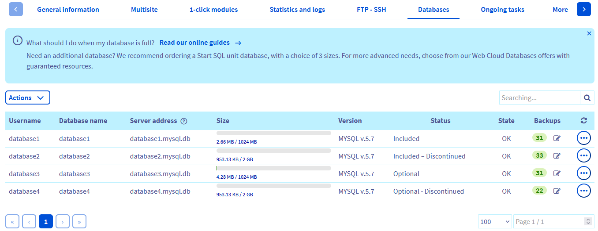
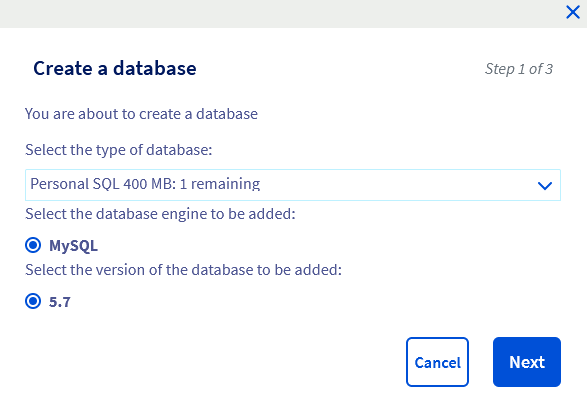

## Objective

A database is used to store dynamic elements (connection data, user data, display data, data required for your website to work properly, etc.). These databases are used in the majority of modern Content Management Systems (CMS), such as *WordPress*, *Joomla!*, *Drupal* or *PrestaShop*.

**Find out how to create a database on your OVHcloud web hosting plan.**

## Requirements

- A [OVHcloud web hosting plan](https://www.ovhcloud.com/en-ca/web-hosting/) that includes at least one database.
- An available database of those included in your web hosting plan
- Access to the [OVHcloud Control Panel](https://ca.ovh.com/auth/?action=gotomanager&from=https://www.ovh.com/ca/en/&ovhSubsidiary=ca) with the [necessary permissions](/pages/account_and_service_management/account_information/managing_contacts) to manage your web hosting plan

## Instructions

### Step 1 - Access the web hosting database management tab

Log in to your [OVHcloud Control Panel](https://ca.ovh.com/auth/?action=gotomanager&from=https://www.ovh.com/ca/en/&ovhSubsidiary=ca) and go to the `Web Cloud`{.action} section. Click `Hosting plans`{.action} in the left-hand column, select the hosting plan on which you want to create a database, then click on the `Databases`{.action} tab.

The table in this section contains all of the databases created with your web hosting plan.

{.thumbnail}

### Step 2 - Create the database

There are two ways to create a new database:

- **If you have not yet created a database**: Click the `Create a database`{.action} button.

- **If you have already created a database**: Click the `Actions`{.action} button, then `Create a database`{.action}.

In the window that opens, select the following information:

{.thumbnail}

|Information|Description|  
|---|---|
|**Select the type of database**|Choose the size of the database. This size refers to the space available to your database for storing data.|
|**Select the database engine to be added**|Choose the engine you want the database to use. The databases included in your [OVHcloud web hosting plan](https://www.ovhcloud.com/en-ca/web-hosting/) are only available with the MySQL engine.|
|**Select the version of the database to be added**|Choose the version used by the database engine. Make sure your website is compatible with the version you have chosen.|

Click on `Next`{.action}.

A new window will appear:

{.thumbnail}

|Information|Description|
|---|---|
|**Username**|Enter a user name that will be associated with your database (6 characters maximum in addition to the user prefix already entered).|
|**Password**|Enter a password for this user using the *criteria* listed below.|
|**Confirmation**|Enter the password for this user again.|

> [!primary]
>
> For security reasons, respect the requirements when you create your password.
>
> We also recommend the following policies:
>
> - Set a different password for each of your services.
> - Create a password that contains no personal information (surname, first name, date of birth, etc.).
> - Renew your password regularly.
> - Do not kepp written records of your password or sending it to other people (including via email).
> - Do not save your password in your web browser, even if your browser offers to do so.
>

> [!warning]
>
> Remember that if you change a database password, all applications that access the database must be updated accordingly.
>

Fill in the required information and click `Next`{.action}.

{.thumbnail}

Verify that all information displayed in the summary is correct. If this is the case, click `Confirm`{.action} to launch the creation of your database.

> [!primary]
>
> When you click `Confirm`{.action}, it may take up to **15 minutes** to create the database. Reload your [OVHcloud Control Panel](https://ca.ovh.com/auth/?action=gotomanager&from=https://www.ovh.com/ca/en/&ovhSubsidiary=ca) webpage if the database does not automatically appear in the table listing your databases.
>

Repeat this process as needed in order to create several databases (the total number of databases is limited by your web hosting plan).

### Step 3 - Manage your database 

> [!warning]
>
> This guide does not replace the support of a professional, such as a web developer. We recommend contacting the a [specialist provider](https://partner.ovhcloud.com/en-ca/directory/) or your solution’s software publisher if you encounter any difficulties. OVHcloud cannot provide you with technical support in this regard. You can find more information in the [Go further](#go-further) section of this guide.
>

You can now use your database. To do this, you will need your login details:

- The *username* and *password* you have set
- The *name of the database* you have entered
- The *server address*

This information is essential for your website to connect to the database.

If you need to retrieve this connection information, log in to your [OVHcloud Control Panel](https://ca.ovh.com/auth/?action=gotomanager&from=https://www.ovh.com/ca/en/&ovhSubsidiary=ca) and go to the `Web Cloud`{.action} section. Click `Hosting plans`{.action} in the left-hand column, select the hosting plan on which you want to retrieve the information for connecting to your database, then click on the `Databases`{.action} tab.

You will find the information required to connect to your database in the table that appears. This excludes passwords for security reasons.
+-
> [!warning]
>
> If you do not have the password for your database connection, please read our guide on [Changing your database password](/pages/web_cloud/web_hosting/sql_change_password).
>

Depending on the software used, this connection may need to be configured manually, or via an interface generated by the website’s configuration interface (backend). Since this procedure concerns your website’s configuration, and not your OVHcloud hosting plan, we recommend that you consult the resources available online, or contact a [specialist provider](https://partner.ovhcloud.com/en-ca/directory/).

#### Accessing the phpMyAdmin interface

OVHcloud provides an online database management tool, phpMyAdmin. To find the access link for this application, log in to your [OVHcloud Control Panel](https://ca.ovh.com/auth/?action=gotomanager&from=https://www.ovh.com/ca/en/&ovhSubsidiary=ca) and go to the `Web Cloud`{.action} section. Click `Hosting plans`{.action} in the left-hand column, choose the hosting plan concerned, then click on the `Databases`{.action} tab.

In the table on this page, click on the `...`{.action} button to the right of the database concerned, then click on `Go to phpMyAdmin`{.action} in the dropdown menu.

{.thumbnail}

Enter the information for accessing your database, then click `Log in`{.action}.

If you need any further information, please refer to [step 3](#step3) of this guide to find the information required to connect to your database.

#### Using database backups

For each web hosting database, snapshots are created automatically every day (up to a maximum of 32). This means you can quickly restore an earlier version of a database from the OVHcloud Control Panel.

To check which snapshots are available, and when they were created, log in to your [OVHcloud Control Panel](https://ca.ovh.com/auth/?action=gotomanager&from=https://www.ovh.com/ca/en/&ovhSubsidiary=ca), then go to the `Web Cloud`{.action} section. Click `Hosting plans`{.action} in the left-hand column, choose the hosting plan concerned, then click on the `Databases`{.action} tab. In the table that appears, click the symbol next to the green circle. You can also download each backup of a database from here. You can find more information on this in our guide on "[Backing up your web hosting plan database](/pages/web_cloud/web_hosting/sql_database_export)".

#### Understanding common issues

**Too many connections**

Web hosting databases are limited to 30 concurrent connections (system variable *max_connections*). SQL requests must therefore be optimised to avoid this type of error. If problems persist nonetheless, alternative measures should be considered. For example, you can migrate your database to a [Web Cloud Databases](https://www.ovhcloud.com/en-ca/web-cloud/databases/) database, or even [upgrade your web hosting plan](https://www.ovhcloud.com/en-ca/web-hosting/uc-best-web-hosting/).

**Connection / "not found" errors**

This usually occurs when the actual database name is not used in the database connection file on the database's website.

It is best practice to always use the actual database name for scripts and configuration files instead of IP addresses or *localhost*.

**Quota exceeded for databases**

If a web hosting database exceeds the recommended storage space, it will automatically switch to "Read Only" / "Select Only". The administrator will receive a notification by email.

Once the database has been optimised (purged), recalculate its quota in the OVHcloud Control Panel to unblock it again. You can find more information on this in our guide: [What should I do if my database storage quota is exceeded?](/pages/web_cloud/web_hosting/sql_overquota_database)

## Go further 

[Changing the password for a web hosting plan database](/pages/web_cloud/web_hosting/sql_change_password)

[Retrieving the backup of a Web Hosting plan’s database](/pages/web_cloud/web_hosting/sql_database_export)

[Importing a backup into a Web Hosting plan database](/pages/web_cloud/web_hosting/sql_importing_mysql_database)

[Optimising your website’s performance](/pages/web_cloud/web_hosting/optimise_your_website_performance)

For specialised services (SEO, development, etc.), contact [OVHcloud partners](https://partner.ovhcloud.com/en-ca/directory/).

If you would like assistance using and configuring your OVHcloud solutions, please refer to our [support offers](https://www.ovhcloud.com/en-ca/support-levels/).

Join our community of users on <https://community.ovh.com/en/>.