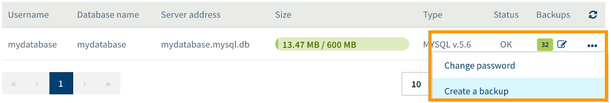
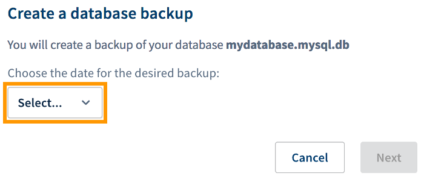
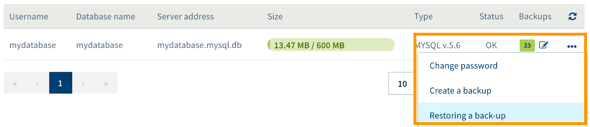
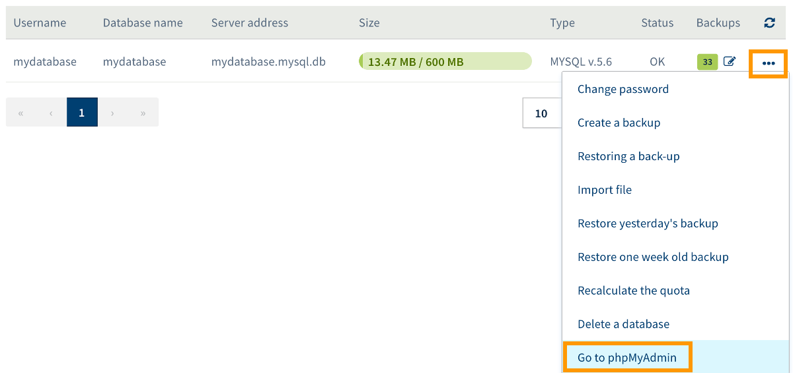

> [!primary]
> Tłumaczenie zostało wygenerowane automatycznie przez system naszego partnera SYSTRAN. W niektórych przypadkach mogą wystąpić nieprecyzyjne sformułowania, na przykład w tłumaczeniu nazw przycisków lub szczegółów technicznych. W przypadku jakichkolwiek wątpliwości zalecamy zapoznanie się z angielską/francuską wersją przewodnika. Jeśli chcesz przyczynić się do ulepszenia tłumaczenia, kliknij przycisk “Zgłóś propozycję modyfikacji” na tej stronie.
>

## Wprowadzenie 

Bazy danych są używane przez większość stron WWW i serwerów **C**ontent **M**anagement **S**ystem (**CMS**), takich jak *WordPress*, *Joomla!*, *PrestaShop* lub *Drupal*. Są one zazwyczaj wykorzystywane do przechowywania elementów dynamicznych, takich jak komentarze, hasła/użytkownicy, stan zapasów, jeśli posiadasz sklep internetowy lub artykuły. Mogą zaistnieć sytuacje, w których będziesz potrzebował wykonać kopię zapasową bazy danych w celu późniejszego odzyskania jej zawartości.

**Dowiedz się, jak pobrać kopię zapasową bazy danych Twojego hostingu WWW OVHcloud.**

## Wymagania początkowe

- Posiadanie [hostingu OVHcloud](https://www.ovhcloud.com/pl/web-hosting/){.external}
- Posiadanie bazy danych utworzonej w ramach pakietu [hostingowego WWW OVHcloud](https://www.ovhcloud.com/pl/web-hosting/){.external}
- W zależności od metody tworzenia kopii zapasowej, jakiej użyjesz, posiadanie dostępu do interfejsu zarządzania usługą hostingu WWW w [Panelu klienta](https://www.ovh.com/auth/?action=gotomanager&from=https://www.ovh.pl/&ovhSubsidiary=pl){.external} lub posiadanie informacji umożliwiających zalogowanie do bazy danych

## W praktyce

Przed rozpoczęciem określ metodę, której będziesz używać do pobierania kopii zapasowej bazy danych. Masz kilka możliwości:

- **Użycie narzędzia OVHcloud do tworzenia kopii zapasowych** : rozwiązanie to umożliwia pobranie kopii zapasowych baz danych z poziomu [Panelu klienta OVHcloud](https://www.ovh.com/auth/?action=gotomanager&from=https://www.ovh.pl/&ovhSubsidiary=pl){.external}. Metoda ta nie wymaga specjalnych umiejętności technicznych.

- **Wykonanie kopii zapasowej w interfejsie phpMyAdmin** : przed operacją należy zalogować się do interfejsu *phpMyAdmin*. Wymaga to pełnej kontroli nad interfejsem *phpMyAdmin*.

- **Użycie skryptu do tworzenia kopii zapasowych** : przed wykonaniem kopii zapasowej należy utworzyć skrypt zarejestrowany na Twoim hostingu OVHcloud. Potrzebna jest szczególna wiedza na ten temat.

- **Wykonanie kopii zapasowej przy użyciu komendy SSH** : metoda ta wymaga zalogowania się do przestrzeni dyskowej FTP przez protokół SSH, a następnie zastosowania odpowiednich komend pozwalających połączyć się z przestrzenią dyskową FTP. W przypadku tego dostępu konieczne są bardziej zaawansowane umiejętności techniczne oraz posiadanie [hostingu OVHcloud](https://www.ovhcloud.com/pl/web-hosting/){.external}.

> [!success]
>
> Jeśli tworzysz kopię zapasową bazy danych, ponieważ jest ona zapełniona/pełna, zapoznaj się z tutorialem "[Co zrobić, gdy baza danych jest zapełniona?](/pages/web_cloud/web_hosting/sql_overquota_database)".
>

Niektóre z powyższych metod nie są powiązane z interfejsem OVHcloud. W przypadku tych ostatnich wykonaj operację, bazując na własnej wiedzy. Poniżej zamieszczamy kilka podstawowych informacji, nie mogą one jednak zastąpić wsparcia ze strony webmastera, jeśli użytkownik ma trudności z samodzielnym wykonaniem tych informacji. 

Przejdź do metody tworzenia kopii zapasowej, która Cię interesuje opisanej w dalszej części dokumentacji.

> [!warning]
>
> OVHcloud udostępnia różnorodne usługi, jednak to Ty odpowiadasz za ich konfigurację i zarządzanie nimi. Ponosisz więc odpowiedzialność za ich prawidłowe funkcjonowanie.
>
> Oddajemy w Twoje ręce niniejszy przewodnik, którego celem jest pomoc w jak najbardziej optymalnym wykonywaniu bieżących zadań. Jeśli jednak napotkasz trudności, zalecamy skontaktowanie się z [wyspecjalizowanym dostawcą](https://partner.ovhcloud.com/pl/directory/). Niestety firma OVH nie jest w stanie udzielić Ci wsparcia w tym zakresie. Więcej informacji znajduje się w sekcji ["Sprawdź również"](#go-further) niniejszego przewodnika.
>

### Pobierz kopię zapasową, korzystając z narzędzia OVHcloud

Aby uzyskać dostęp do narzędzia do tworzenia kopii zapasowych OVHcloud, zaloguj się do [Panelu klienta OVHcloud](https://www.ovh.com/auth/?action=gotomanager&from=https://www.ovh.pl/&ovhSubsidiary=pl){.external} i przejdź do sekcji `Web Cloud`{.action}. W lewej kolumnie kliknij `Hosting`{.action}, następnie wybierz odpowiednią nazwę hostingu. Teraz przejdź do zakładki `Bazy danych`{.action}.

Tabela, która się wyświetla zawiera listę wszystkich baz danych utworzonych w ramach Twojego pakietu hostingowego. Teraz możesz wybrać jedną z dwóch dostępnych metod tworzenia nowej kopii zapasowej lub odzyskania kopii już istniejącej.

### Krok 1: utwórz nową kopię zapasową bazy danych

W zakładce `Bazy danych`{.action} kliknij przycisk `...`{.action} po prawej stronie bazy danych, którą chcesz skopiować, a następnie kliknij `Utwórz kopię zapasową`{.action}.

{.thumbnail}

W oknie, które się pojawi wybierz datę utworzenia kopii zapasowej, następnie kliknij przycisk `Dalej`{.action}. Upewnij się, że informacje w podsumowaniu są poprawne, następnie kliknij `Zatwierdź`{.action}, aby rozpocząć operację.

Odczekaj chwilę, aż kopia zapasowa zostanie utworzona. Kiedy kopia będzie już dostępna, będziesz mógł ją pobrać.

{.thumbnail}

### Etap 2: przywracanie kopii bazy danych

W zakładce `Bazy danych`{.action} kliknij przycisk`...`{.action} po prawej stronie bazy danych, którą chcesz skopiować, a następnie kliknij `Przywróć kopię zapasową`{.action}.

{.thumbnail}

Tabela, która się wyświetla zawiera wszystkie dostępne kopie zapasowe bazy danych. Możesz wyświetlić dokładną datę utworzenia kopii zapasowych, a także datę, kiedy zostaną one usunięte z narzędzia OVHcloud.

Aby pobrać kopię zapasową, kliknij przycisk `...`{.action} po prawej stronie kopii, którą chcesz pobrać, a następnie kliknij `Pobierz kopię zapasową`{.action}. Pojawi się okno z prośbą, abyś zapisał ją na Twoim komputerze. Zaakceptuj, po czym odczekaj, aż kopia zapasowa zostanie pobrana.

{.thumbnail}

### Pobierz kopię zapasową, używając interfejsu phpMyAdmin

Aby przeprowadzić operację, zaloguj się do *phpMyAdmin*. Aby uzyskać link dostępowy do phpMyAdmin, zaloguj się do [Panelu klienta OVHcloud](https://www.ovh.com/auth/?action=gotomanager&from=https://www.ovh.pl/&ovhSubsidiary=pl){.external} i przejdź do sekcji `Web Cloud`{.action}. W lewej kolumnie kliknij `Hosting`{.action}, następnie wybierz odpowiednią nazwę hostingu. Teraz przejdź do zakładki `Bazy danych`{.action}.

Tabela, która się wyświetla zawiera listę wszystkich baz danych utworzonych w ramach Twojego pakietu hostingowego. Kliknij przycisk`...`{.action} po prawej stronie odpowiedniej bazy danych, a następnie `Dostęp do phpMyAdmin`{.action}.

{.thumbnail}

Po zalogowaniu się do *phpMyAdmin* wprowadź informacje dotyczące bazy danych, następnie zaloguj się. Po zalogowaniu przejdź do zakładki `Eksportuj`{.action}, gdzie dostępne są dwie metody eksportu:

- **Szybka metoda**: możesz określić format eksportu kopii zapasowej. Najpopularniejszym formatem jest SQL, ale dostępne są również inne - zgodnie z Twoimi potrzebami;

- **Metoda niestandardowa** : możesz określić szczegółowe parametry eksportu kopii zapasowej.

> [!warning]
>
> Interfejs *phpMyAdmin* nie został utworzony przez OVHcloud, należy więc wykonać operację, bazując na własnej wiedzy. W przypadku trudności zalecamy skorzystanie z pomocy [wyspecjalizowanego usługodawcy](https://partner.ovhcloud.com/pl/directory/) i/lub skontaktowanie się ze stroną lub wydawcą interfejsu. Niestety firma OVHcloud nie jest w stanie udzielić wsparcia w tym zakresie.
>

### Pobierz kopię zapasową, używając skryptu

Operacja składa się z kilku etapów. Upewnij się, czy posiadasz informacje potrzebne do zalogowania się do bazy danych, której kopię zapasową chcesz utworzyć: nazwa użytkownika, hasło, nazwa bazy danych oraz adres serwera.

> [!warning]
>
> Rozwiązanie to wymaga umiejętności programowania. Poniżej zamieszczamy kilka informacji dotyczących sposobu postępowania. Jednak w przypadku trudności zalecamy skorzystanie z pomocy [wyspecjalizowanego usługodawcy](https://partner.ovhcloud.com/pl/directory/). Niestety firma OVHcloud nie jest w stanie udzielić wsparcia w tym zakresie.
>

### Etap 1: utwórz skrypt kopii zapasowej

Pierwszy krok to utworzenie skryptu, dzięki któremu będziesz mógł utworzyć kopię zapasową bazy danych. Poniżej przykład skryptu, który może być pomocny w przeprowadzanej przez Ciebie operacji. Jeśli jednak napotkasz trudności, przykład ten nie może zastąpić wsparcia, które może zapewnić webmaster.

```php
<?
system("mysqldump --host=server_address --user=user_name --password=user_password name_of_database > backup_file_name.sql");
?>
```

Pamiętaj, aby zastąpić informacje ogólne występujące w skrypcie informacjami dotyczącymi odpowiedniej bazy danych. Pomocne będą poniższe wskazówki. Po utworzeniu skryptu zalecamy nadać mu nazwę "kopia.php".

|Informacje|Do zastąpienia przez|
|---|---| 
|server_address|Adres serwera odpowiedniej bazy danych.|
|user_name|Nazwa użytkownika z dostępem do bazy danych.|
|user_password|Hasło dla uprzednio podanej nazwy użytkownika.|
|name_of_database|Nazwa odpowiedniej bazy danych.|
|backup_file_name|Nazwa pliku kopii zapasowej po jego utworzeniu.|

### Etap 2: pobierz skrypt na przestrzeń dyskową FTP

Po poprawnym utworzeniu skryptu kopii zapasowej pobierz go na przestrzeń dyskową FTP Twojego hostingu. W tym celu zapoznaj się z informacjami zawartymi w opisie etapu 2 dokumentacji "[Logowanie do przestrzeni dyskowej](/pages/web_cloud/web_hosting/hosting_how_to_get_my_website_online)".

Aby wykonać kolejne kroki, pobierz skrypt do folderu zawierającego witrynę sieci Web, która używa bazy danych. **Należy zwrócić szczególną uwagę na nazwę pliku skryptu kopii zapasowej.** Nie nadpisuj istniejącego wcześniej na przestrzeni dyskowej FTP pliku noszącego tę samą nazwę, gdy pobierasz skrypt. Jeśli pojawi się tego typu komunikat ostrzegawczy, zmień nazwę nowo utworzonego skryptu, a następnie spróbuj ponownie go pobrać.

#### Etap 3: wywoływanie skryptu

Kiedy skrypt zostanie pobrany na przestrzeń dyskową FTP, wywołaj skrypt i zainicjuj kod znajdujący się w skrypcie.

Aby to zrobić, przejdź do przeglądarki internetowej pod pełny adres URL skryptu (na przykład: mypersonaldomain.ovh/kopia_zapasowa.php, jeśli nazwałeś skrypt "kopia_zapasowa.php"). Jeśli informacje wprowadzone do skryptu są poprawne, kopia zapasowa zostanie wykonana. Odczekaj chwilę, aż to nastąpi. Jeśli tak się nie stanie, sprawdź informacje zawarte w skrypcie, po czym spróbuj ponownie.

### Etap 4: pobieranie kopii zapasowej z przestrzeni FTP

Po utworzeniu kopii zapasowej, zapisz ją w folderze, do którego zapisany został skrypt kopii zapasowej. Nazwa kopii zapasowej bazy danych musi brzmieć, jak nazwa wprowadzona wcześniej do skryptu. Teraz pobierz kopię zapasową na Twoje urządzenie.

Zalecamy, abyś przed wykonaniem operacji usunął z katalogu, w którym się znajdują, plik kopii zapasowej oraz skrypt.

> [!primary]
>
> Używając skryptu kopii zapasowej w naszym systemie planowanych zadań (zadania "CRON"), możesz zautomatyzować tworzenie kopii zapasowych i wybrać częstotliwość ich tworzenia. Dowiedz się więcej o planowaniu zadań z dokumentacji: "[Wdrożenie planowanego zadania (CRON) na hostingu](/pages/web_cloud/web_hosting/cron_tasks)".
>

### Pobieranie kopii zapasowej przy użyciu komendy SSH

Aby przeprowadzić operację, wpisz odpowiednie komendy w terminalu, aby połączyć się z przestrzenią FTP.

> [!warning]
>
> Aby korzystać z tego typu dostępu, konieczna jest zaawansowana wiedza techniczna. Poniżej zamieszczamy kilka informacji dotyczących sposobu postępowania, jednak w przypadku trudności zalecamy skorzystanie z pomocy [wyspecjalizowanego usługodawcy](https://partner.ovhcloud.com/pl/directory/). Niestety firma OVHcloud nie jest w stanie udzielić wsparcia w tym zakresie.
>

Po zalogowaniu się do przestrzeni dyskowej FTP za pomocą SSH, wprowadź komendę pozwalającą na utworzenie kopii zapasowej bazy danych. Poniżej przykład komendy, która może być pomocna w przeprowadzanej przez Ciebie operacji. Pamiętaj, że kopia zapasowa zostanie zapisana w aktywnym katalogu w momencie, gdy wyślesz komendę do terminala.

```sh
mysqldump --host=server_address --user=user_name --password=user_password name_of_database > backup_file_name.sql
```

Zastąp informacje ogólne dotyczące tego polecenia informacjami dotyczącymi odpowiedniej bazy danych. Teraz pobierz kopię zapasową na Twój komputer.


|Informacje|Do zastąpienia przez|
|---|---| 
|server_address|Adres serwera odpowiedniej bazy danych.|
|user_name|Nazwa użytkownika z dostępem do bazy danych.|
|user_password|Hasło dla uprzednio podanej nazwy użytkownika.|
|name_of_database|Nazwa odpowiedniej bazy danych.|
|backup_file_name|Nazwa pliku kopii zapasowej po jego utworzeniu.|

## Sprawdź również <a name="go-further"></a>

[Tutorial - Co zrobić, gdy baza danych jest zapełniona?](/pages/web_cloud/web_hosting/sql_overquota_database)

W przypadku wyspecjalizowanych usług (pozycjonowanie, rozwój, etc.) skontaktuj się z [partnerami OVHcloud](https://partner.ovhcloud.com/pl/directory/).

Jeśli chcesz otrzymywać wsparcie w zakresie konfiguracji i użytkowania Twoich rozwiązań OVHcloud, zapoznaj się z naszymi [ofertami pomocy](https://www.ovhcloud.com/pl/support-levels/).

Dołącz do społeczności naszych użytkowników na stronie <https://community.ovh.com/en/>. 
