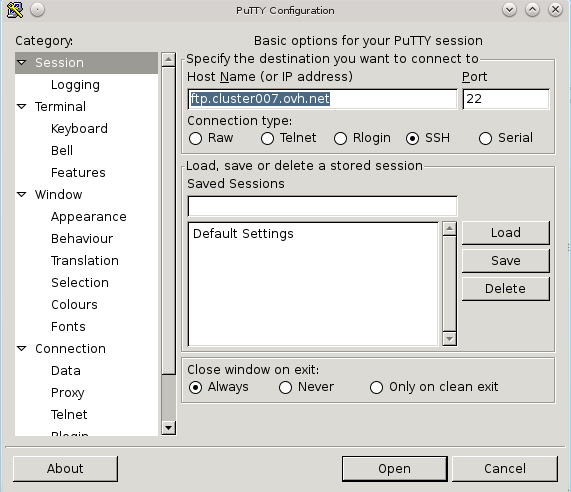

**Last updated 5th May 2020**

## Introduction
There are many programs available on Windows which are based on SSH. 
One of the most popular and easy to use is "PuTTy".
Download it from the [official website](http://www.putty.org/).

You will also need your FTP credentials

- FTP server.
- FTP login.
- FTP password.

You can find this information in your control panel. Go to the FTP section or follow
[this guide](/pages/web_cloud/web_hosting/ftp_connection).

## Run PuTTy

- After you have installed PuTTy, launch it.
- In the Host Name (or IP address) field enter your FTP server.
- In the Port field enter 22, if it has not already been returned. 
- Check SSH.
- Click Open.

{.thumbnail}

## Log on
A command prompt will appear

- In the command prompt, enter your FTP login, then press "Enter". 
- Enter your FTP password and press "Enter". 

NOTE: For security reasons, you will not be able to see your password as you type it.
If the password or login are incorrect, start again. 

- If all is well, you will see the message "Welcome to Ovh"

## Using SSH.
To use SSH you should now refer to [this guide](https://www.ovh.co.uk/fr/g1962.mutualise_le_ssh_sur_les_hebergements_mutualises).

