> [!primary]
> Tłumaczenie zostało wygenerowane automatycznie przez system naszego partnera SYSTRAN. W niektórych przypadkach mogą wystąpić nieprecyzyjne sformułowania, na przykład w tłumaczeniu nazw przycisków lub szczegółów technicznych. W przypadku jakichkolwiek wątpliwości zalecamy zapoznanie się z angielską/francuską wersją przewodnika. Jeśli chcesz przyczynić się do ulepszenia tłumaczenia, kliknij przycisk "Zgłóś propozycję modyfikacji" na tej stronie.
>
  
## Wprowadzenie

Dowiedz się, jak utworzyć sklep internetowy z rozszerzeniem open source **WooCommerce** przy użyciu Content Management System (CMS) **WordPress**. 

> [!warning]
>
> OVHcloud oddaje do Twojej dyspozycji usługi, których konfiguracja, zarządzanie i odpowiedzialność spoczywa na Ciebie. W związku z tym należy zapewnić ich prawidłowe funkcjonowanie.
> 
> Oddajemy do Twojej dyspozycji niniejszy tutorial, którego celem jest pomoc w jak najlepszym wykonywaniu bieżących zadań. W przypadku trudności zalecamy skorzystanie z pomocy [wyspecjalizowanego usługodawcy](https://partner.ovhcloud.com/pl/directory/), [edytora CMS WordPress](https://wordpress.com/support/){.external} lub [edytora WooCommerce](https://woocommerce.com/){.external}. Niestety firma OVH nie będzie mogła udzielić wsparcia w tym zakresie. Więcej informacji znajduje się w sekcji ["Sprawdź również"](#go-further) niniejszego tutoriala.
>

## Wymagania początkowe

- Posiadanie oferty [hostingu](https://www.ovhcloud.com/pl/web-hosting/), która zawiera przynajmniej jedną bazę danych.
- Posiadanie [domeny](https://www.ovhcloud.com/pl/domains/)
- [Instalacja WordPress](/pages/web_cloud/web_hosting/cms_install_1_click_modules) na Twoim hostingu

Jeśli jeszcze tego nie zrobiłeś, zalecamy aktywację HTTPS Twojej strony WWW, zanim przejdziesz do tego tutoriala, postępując zgodnie z instrukcjami zawartymi w przewodniku "[Przejdź na swoją stronę WWW poprzez HTTPS za pomocą certyfikatu SSL](/pages/web_cloud/web_hosting/ssl-activate-https-website)".  

## W praktyce
  
**WooCommerce** to rozszerzenie **WordPress**. Instaluje się jak każde inne rozszerzenie.

### Instalacja

Zaloguj się do Twojego interfejsu administracyjnego, wpisując `/wp-admin` lub `/wp-login` na pasku wyszukiwania po adresie URL Twojej domeny (przekierowanie odbywa się automatycznie):

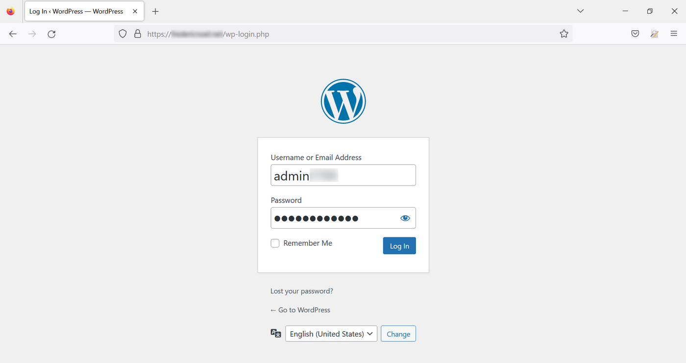{.thumbnail}

W menu po lewej stronie przejdź do `Wtyczki`{.action}, następnie kliknij `Dodaj nową`{.action}:

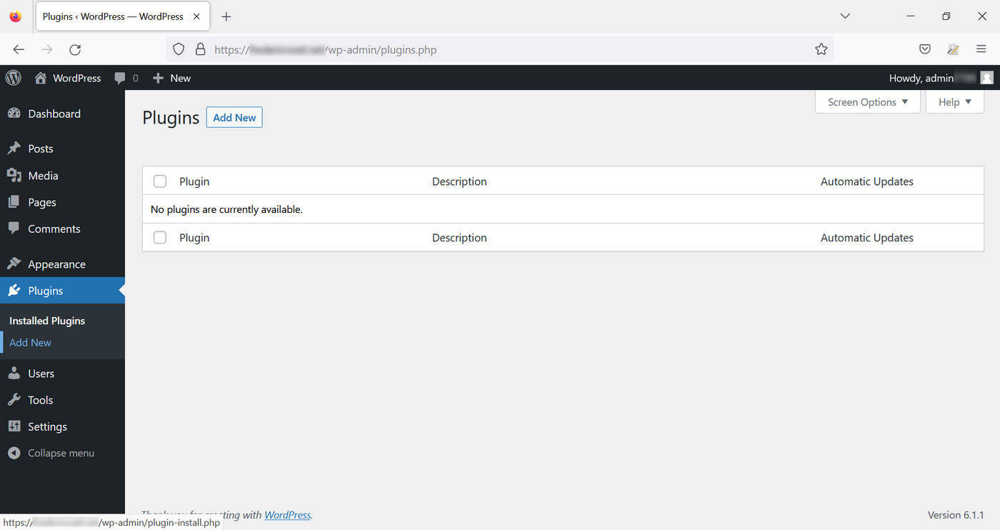{.thumbnail}

Na nowej stronie `Dodaj wtyczki`{.action}, wprowadź "woocommerce" na pasku wyszukiwania w prawym górnym rogu, następnie kliknij `Zainstaluj`{.action} w ramce rozszerzenia **WooCommerce**:

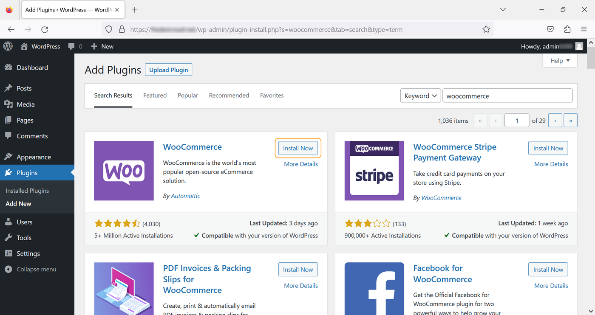{.thumbnail}

Kliknij na `Włącz`{.action}:

{.thumbnail}

### Konfiguracja 

#### Metoda 1 - korzystanie z asystenta konfiguracji

Jeśli jeszcze nie skonfigurowałeś Twojego rozszerzenia **WooCommerce**, asystent konfiguracji pomoże Ci podać informacje dotyczące Twojej strony WWW. Wpisz formularz i kliknij na `Kontynuuj`{.action}:

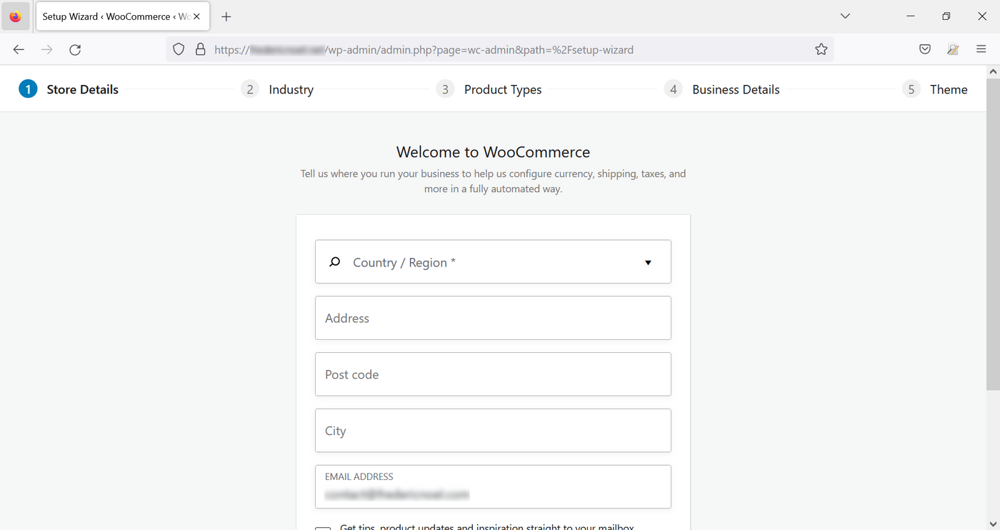{.thumbnail}

Wybierz domenę lub domeny:

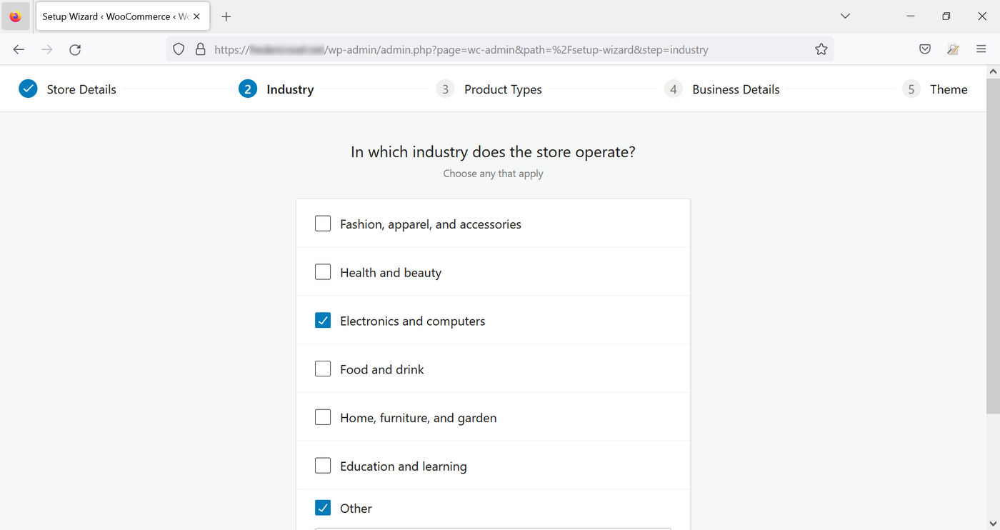{.thumbnail}

Wybierz rodzaj produktów, które chcesz sprzedać na swojej stronie www (niektóre opcje są płatne):

{.thumbnail}

Następnie podaj rodzaj działalności:

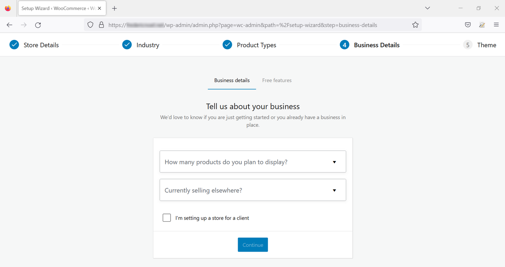{.thumbnail}

Dodaj opcje dodatkowe (i darmowe):

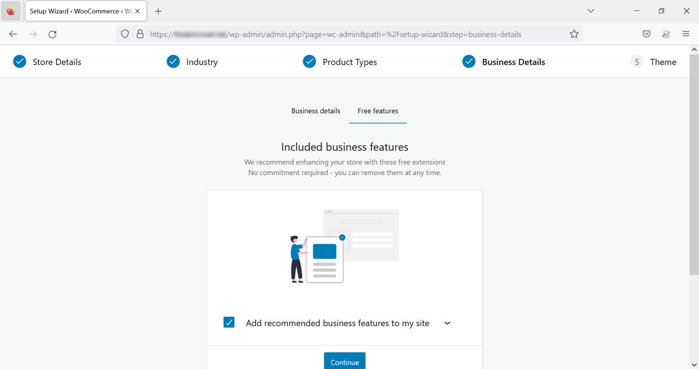{.thumbnail}

Na koniec wybierz temat spośród zaproponowanych:

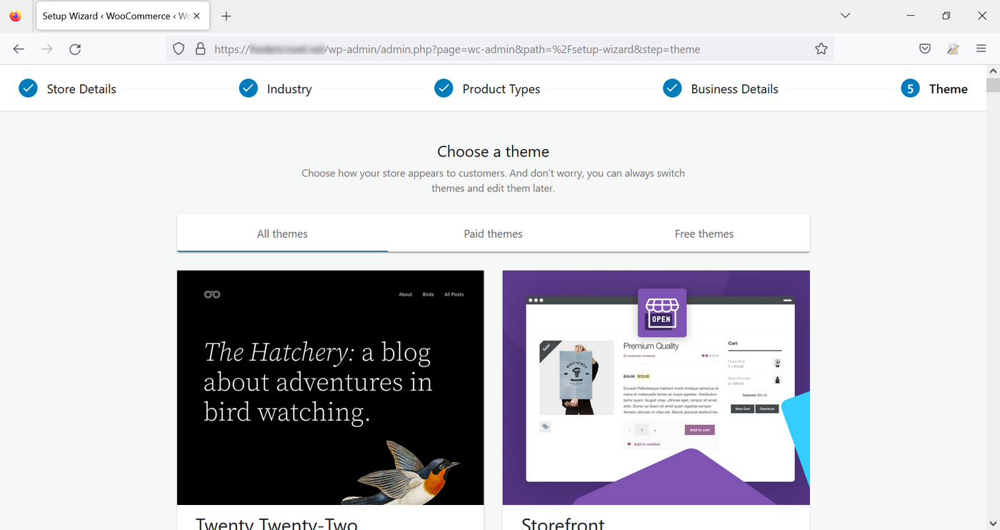{.thumbnail}

**WooCommerce** zachęca Cię do utworzenia konta, aby korzystać z rozszerzenia **Jetpack**, automatycznie instalowanego rozszerzenia poza rozszerzeniem **WooCommerce**. To konto jest opcjonalne. Będziesz miał dostęp do ograniczonych funkcji **Jetpack** bez konieczności logowania.

Twój sklep internetowy jest teraz skonfigurowany z parametrami ogólnymi.

#### Metoda nr 2 - konfiguracja ręczna

Kliknij na `Wtyczki`{.action}, aby wyświetlić zainstalowane rozszerzenia, a następnie na `Zainstalowane wtyczki`. Wyświetli się lista rozszerzeń. Kliknij na `Ustawienia`{.action} w module **WooCommerce** :

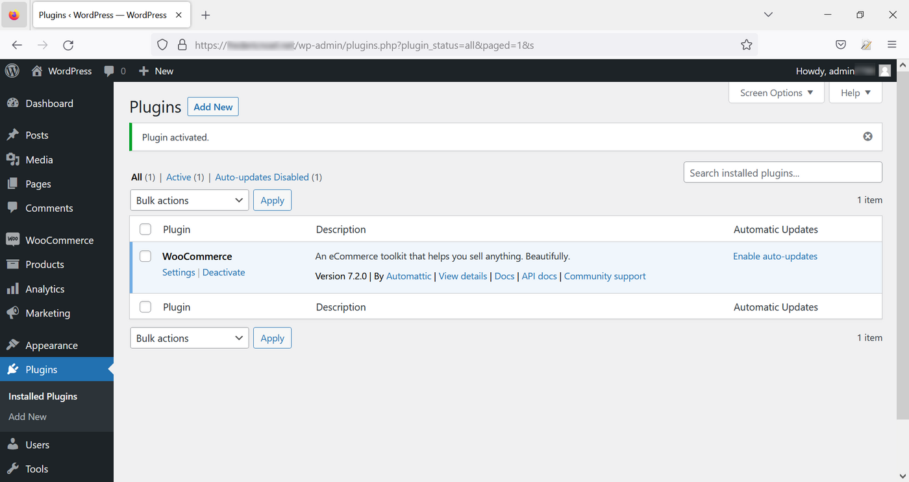{.thumbnail}

Możesz również uzyskać dostęp do tych ustawień, klikając bezpośrednio na `WooCommerce`{.action}, a następnie na `Ustawienia`{.action}:

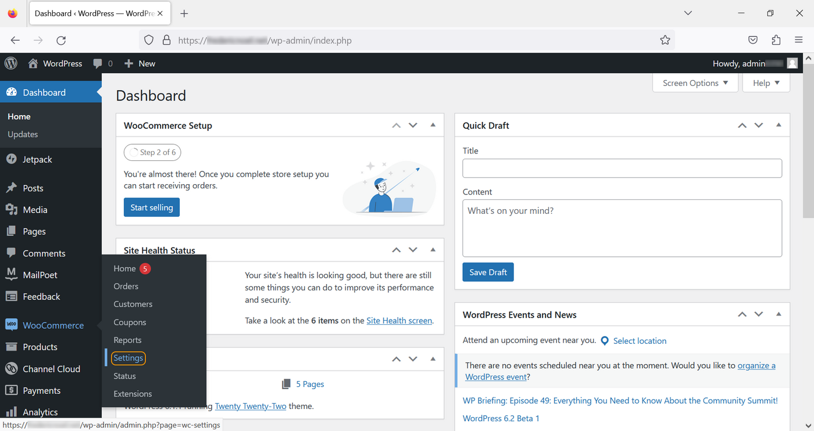{.thumbnail}

### Regulacje

Strona ustawień zawiera kilka zakładek:

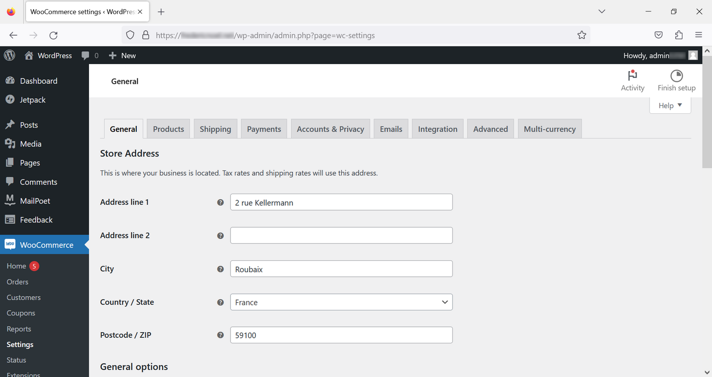{.thumbnail}

#### Ogólne

W zakładce tej możesz zdefiniować następujące elementy:

- adres firmy
- obszary sprzedaży i dostawy
- domyślna lokalizacja klienta (opcjonalnie)
- włączanie/wyłączanie podatków
- kupony
- dane pieniężne (waluta lokalizacji, wyświetlanie).

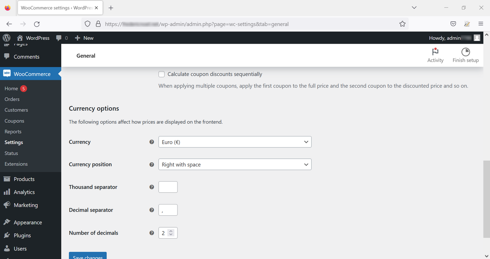{.thumbnail}

#### Produkty

Zarządzanie produktami odbywa się poprzez zestaw podpozycji:

- **Ogólne**: służy do definiowania elementów, takich jak strona domyślna (sklep, informacja prawna, koszyk itp.), jednostki miary, możliwość lub nie umieszczania komentarzy na temat produktów lub notatek.
- **Wykaz**: służy do konfiguracji zarządzania Twoimi zasobami i do konfigurowania zachowania strony www (zasoby zapisane w momencie, gdy obiekt znajduje się w koszyku, progi ostrzegawcze, możliwość ukrycia produktów, które nie są już w magazynie).
- **Produkty do pobrania**: dotyczy przypadków udostępniania dokumentów do pobrania przez użytkowników.
- **Zatwierdzone katalogi pobierania**: wskazuje katalog lub katalogi na serwerze, w którym pliki zostaną przesłane.
- **Zaawansowane**: służy do dokładniejszej konfiguracji atrybutów produktów.

#### Wysyłka

Jeśli włączyłeś domyślne rozszerzenia proponowane za darmo podczas instalacji, korzystasz z rozszerzenia [WooCommerce Shipping](https://woocommerce.com/woocommerce-shipping/){.external}. W przeciwnym razie możesz przystąpić do jego instalacji w menu `Wtyczki`{.action}.

- **Strefy wysyłki**: pozwala na zdefiniowanie i skonfigurowanie obszarów wysyłki.
- **Opcje dostawy**: służy do konfiguracji aplikacji we wszystkich kwestiach związanych z kosztami wysyłki.
- **Klasy wysyłki**: mogą być stosowane do grupowania podobnych produktów według rodzaju przesyłki.

#### Płatności

Zakładka ta służy do włączania/wyłączania sposobów płatności dostępnych na Twojej stronie WWW. Skonfiguruj sposób lub środki płatności w Panelu klienta i przejdź do [oficjalnej dokumentacji](https://woocommerce.com/document/payments/).

#### Konta i poufność

W tej sekcji znajdują się wszystkie funkcje związane z zarządzaniem kontami i danymi osobowymi.

#### E-maili

Umożliwia konfigurowanie *e-maili typu* wysyłanych przez aplikację (rejestracja, zamówienia, anulowanie zamówienia, itp.).

#### Integracja

W tej podsekcji możesz wprowadzić klucz licencyjny dla [MaxMind](https://www.maxmind.com/){.external}, płatnej usługi geolokalizacji, aby geolokalizować swoje usługi.

#### Zaawansowane

- **Instalacja stron**: przydatne do modyfikowania stron, na które zostaną przekierowani użytkownicy podczas składania zamówienia.
- **API REST**: dział konfiguracji i konfiguracji dostępu do WooCommerce za pośrednictwem API REST.
- **Webhook**: zarządzaj funkcjami przywracania HTTP.
- **Dawne API**: reaktywacja starego API WooCommerce (domyślnie wyłączona).
- **WooCommerce.com**: włączyć lub wyłączyć opcję śledzenia działalności strony przez WooCommerce, mieć sugestie dotyczące dedykowanych rozszerzeń (większość jest płatna).
- **Funkcje**: strona z dodatkowymi funkcjami testowymi na WooCommerce lub ostatnio dodanymi.
  
## Sprawdź również 

Kilka przydatnych linków:

- [oficjalna strona WordPressa](https://wordpress.org){.external}.
- Rozszerzenie [Jetpack](https://jetpack.com/){.external}
- The [WooCommerce](https://woocommerce.com/){.external}
- Sklep [Rozszerzenia WooCommerce](https://woocommerce.com/products/){.external}

W przypadku wyspecjalizowanych usług (pozycjonowanie, rozwój, etc.) skontaktuj się z [partnerami OVHcloud](https://partner.ovhcloud.com/pl/directory/).

Jeśli chcesz otrzymywać wsparcie w zakresie konfiguracji i użytkowania Twoich rozwiązań OVHcloud, zapoznaj się z naszymi [ofertami pomocy](https://www.ovhcloud.com/pl/support-levels/).

Dołącz do społeczności naszych użytkowników na stronie <https://community.ovh.com/en/>. 