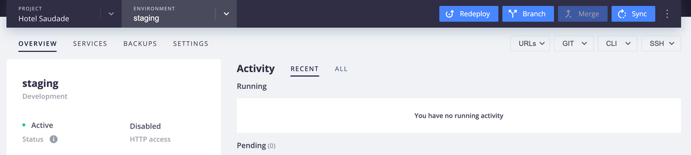

## Force a redeploy

There are times where you might want to trigger a redeployment of your application. 

You can redeploy each environment in the management console by clicking the "Redeploy" button on the top right corner.



Redeploys are also available using the following Web PaaS CLI command:

```sh
webpaas redeploy
```

Please note that the redeploy will happen after any scheduled builds in either "Running" or "Pending" state. 

## Clear the build cache

In rare circumstances the build cache, used to speed up the build process, may become corrupted.  That may happen if, for example, code is being downloaded from a 3rd party language service like Packagist or NPM while that service is experiencing issues.  To flush the build cache entirely run the following command:

```sh
webpaas project:clear-build-cache
```

That will wipe the build cache for the current project entirely.  Naturally the next build for each environment will likely be longer as the cache rebuilds.

## HTTP responses 502 Bad Gateway or 503 Service Unavailable

These errors indicate your application (or application runner, like PHP-FPM) is crashing or unavailable.  Typical causes include:

* Your `.platform.app.yaml` configuration has an error and the process is not starting or requests are not able to be forwarded to it correctly.  Check your `web.commands.start` entry or that your `passthru` configuration is correct.
* The amount of traffic coming to your site exceeds the processing power of your application.
* Certain code path(s) in your application are too slow and timing out.
* A PHP process is crashing because of a segmentation fault (see below).
* A PHP process is killed by the kernel out-of-memory killer (see below).

## Large file upload failing (10MB limit)

When trying to upload a large JSON file to your API you might see a 400 response code (`Malformed request`).

Web PaaS enforces a 10MB limit on sending files with the `application/json` Content-Type header. If you want to send large files through, you will have to send them with `multipart/form-data` instead:

```bash
$ curl -XPOST 'https://example.com/graphql' --header 'Content-Type: multipart/form-data' -F file=large_file.json
```

## Claimed domains

The error 

```text
This domain is already claimed by another project. If this is incorrect or you are trying to add a subdomain, please open a ticket with support.
``` 

is related to Web PaaS's subdomain highjacking prevention assumptions, and likely occurred during an attempt to assign subdomains across multiple projects. Consult the documentation linked above for instructions for how to modify your DNS records to bypass some those assumptions regarding project domain ownership. 

## Error provisioning the new certificate

One reason [Let's Encrypt certificates](/pages/web_cloud/web_paas_powered_by_platform_sh/configuration/configuration-routes/https#lets-encrypt) may fail to provision on your environments has to do with the 64 character limit Let's Encrypt places on URLs. If the names of your branches are too long, the Web PaaS generated environment URL will go over this limit, and the certificate will be rejected.

See [Let's Encrypt limits and branch names](/pages/web_cloud/web_paas_powered_by_platform_sh/configuration/configuration-routes/https#lets-encrypt-limits-and-branch-names) for a more detailed breakdown of this issue.  

## Total disk usage exceeds project maximum

One of the billable parameters in your project's settings is Storage.  This global storage pool is allocated among the various services and application containers in your project via the `disk` parameter.  The sum of all `disk` parameters in your project's YAML config files must be less than or equal to the global project storage number.

```text
Error: Resources exceeding plan limit; disk: 8192.00MB > 5120.00MB; try removing a service, or add more storage to your plan
```

This means that you have allocated, for example, `disk: 4096` in a MySQL service in `services.yaml` and also `disk: 4096` in the `.platform.app.yaml` for your application, while only having the minimum default of 5GB storage for your project as a whole.  The solution is either to lower the `disk` parameters to within the limits of 5GB of storage, or raise the global storage parameter on your project's settings to at least 10GB.  

Because storage is a billable component of your project, only the project's owner can make this change.

### Check your application's disk space

Run `webpaas ssh` within your project folder to login to the container's shell.  Then use the `df` command to check the available writable space for your application.

```bash
df -h -x tmpfs -x squashfs | grep -v /run/shared
```

This command will show the writable mounts on the system, similar to:

```text
Filesystem                                                       Size  Used Avail Use% Mounted on
/dev/mapper/platform-syd7waxqy4n5q--master--7rqtwti----app       2.0G   37M  1.9G   2% /mnt
/dev/mapper/platform-tmp--syd7waxqy4n5q--master--7rqtwti----app  3.9G   42M  3.8G   2% /tmp
```

The first line shows the storage device that is shared by all of your [persistent disk mounts](/pages/web_cloud/web_paas_powered_by_platform_sh/configuration/configuration-app/storage#mounts).  All defined mounts use a common storage pool.  In this example, the application container has allocated 2 GB of the total disk space. Of those 2GB, 2% (37 MB) is used by all defined mounts.

The second line is the operating system `temporary directory`, which is always the same size.
  While you can write to the `/tmp` directory files there are not guaranteed to persist and may be deleted on deploy.

### Increase the disk space available

The sum of all disk keys defined in your project's `.platform.app.yaml` and `.platform/services.yaml` files must be equal or less than the available storage in your plan.

1\. Buy extra storage for your project


  Each project comes with 5GB of Disk Storage available to each environment. To increase the disk space available for your project, click on "Edit Plan" to increase your storage in bulks of 5GB.  

2\. Increase your application and services disk space


  Once you have enough storage available, you can increase the disk space allocated for your application and services using `disk` keys in your `.platform.app.yaml` and `.platform/services.yaml`.

  Check the following resources for more details:

   - [Application's disk space](/pages/web_cloud/web_paas_powered_by_platform_sh/configuration/configuration-app/storage#disk)
   - [Services' disk space](/pages/web_cloud/web_paas_powered_by_platform_sh/configuration/configuration-services#disk)

## No space left on device

During the build hook, you may run into the following error depending on the size of your application:

```text
W: [Errno 28] No space left on device: ...
```

The cause of this issue has to do with the amount of disk provided to the build container before it is deployed. Application images are restricted to 4 GB during build, no matter how much writable disk has been set aside for the deployed application.

Some build tools (yarn/npm) store cache for different versions of their modules. This can cause the build cache to grow over time beyond the maximum of 4GB. Try [clearing the build cache](/pages/web_cloud/web_paas_powered_by_platform_sh/development/development-troubleshoot#clear-the-build-cache) and redeploying. In most cases, this will resolve the issue.

If for some reason your application requires more than 4 GB during build, you can open a support ticket to have this limit increased.  The most disk space available during build still caps off at 8 GB in these cases.

## MySQL lock wait timeout

If you receive MySQL error messages like this:

```text
SQLSTATE[HY000]: General error: 1205 Lock wait timeout exceeded;
```

This means a process running in your application acquired a lock from MySQL for a long period of time.  That is typically caused by one of the following:

* There are multiple places acquiring locks in different order. For example, code path 1 first locks record A and then locks record B.  Code path 2, in contrast, first locks record B and then locks record A.
* There is a long running background process executed by your application that holds the lock until it ends.

If you're using [MariaDB 10+](/pages/web_cloud/web_paas_powered_by_platform_sh/configuration/configuration-services/mysql), you can use the SQL query `SHOW FULL PROCESSLIST \G` to list DB queries waiting for locks.  Find output like the following, and start debugging.

```text
< skipped >
Command: Query
Time: ...
State: Waiting for table metadata lock
Info: SELECT ...
< skipped >
```

To find active background processes, run `ps aufx` on your application container.

Also, please make sure that locks are acquired in a pre-defined order and released as soon as possible.


## MySQL: definer/invoker of view lack rights to use them

There is a single MySQL user, so you can not use "DEFINER" Access Control mechanism for Stored Programs and Views.

When creating a `VIEW`, you may need to explicitly set the `SECURITY` parameter to `INVOKER`:

```text
CREATE OR REPLACE SQL SECURITY INVOKER
VIEW `view_name` AS
SELECT
```

## MySQL server has gone away

### Disk space issues

Errors such as "PDO Exception 'MySQL server has gone away'" are usually simply the result of exhausting your existing diskspace. Be sure you have sufficient space allocated to the service in [.platform/services.yaml](/pages/web_cloud/web_paas_powered_by_platform_sh/configuration/configuration-services).

The current disk usage can be checked using the CLI command `webpaas db:size`. Because of issues with the way InnoDB reports its size, this can out by up to 20%. As table space can grow rapidly, *it is usually advisable to make your database mount size twice the size reported by the `db:size` command*.


### Worker timeout

Another possible cause of "MySQL server has gone away" errors is a server timeout.  MySQL has a built-in timeout for idle connections, which defaults to 10 minutes.  Most typical web connections end long before that is ever approached, but it's possible that a long-running worker may idle and not need the database for longer than the timeout.  In that case the same "server has gone away" message may appear.

If that's the case, the best way to handle it is to wrap your connection logic in code that detects a "server has gone away" exception and tries to re-establish the connection.

Alternatively, if your worker is idle for too long it can self-terminate.  Web PaaS will automatically restart the worker process, and the new process can establish its own new database connection.

### Packet size limitations

Another cause of the "MySQL server has gone away" errors can be the size of the database packets. If that is the case, the logs may show warnings like  "Error while sending QUERY packet" before the error. One way to resolve the issue is to use the `max_allowed_packet` parameter described [above](/pages/web_cloud/web_paas_powered_by_platform_sh/configuration/configuration-services/mysql#adjusting-mariadb-configuration).

## ERROR: permission denied to create database

The provided user does not have permission to create databases.   
The database is created for you and can be found in the `path` field of the `$PLATFORM_RELATIONSHIPS` environment variable.

## "Read-only file system" error

Everything will be read-only, except the writable [mounts](/pages/web_cloud/web_paas_powered_by_platform_sh/configuration/configuration-app/storage) you declare.  Writable mounts are there for your data: for file uploads, logs and temporary files. Not for your code.  In order to change code on Web PaaS you have to go through Git.

This is what gives you all of the benefits of having repeatable deployments, consistent backups, traceability, and the magically fast creation of new staging/dev environments.

In Web PaaS, you cannot just "hack production".  It is a constraint, but it is a good constraint.

During the build phase of your application, the main filesystem is writable.  So you can do whatever you want (e.g. compile code or generate anything you need).  But during and after the deploy phase, the main filesystem will be read-only.

## Failed to connect to the Git repository

If you have been granted access to a Web PaaS project, but are unable to clone the repository via the management console or with the CLI command `webpaas get <projectID>`, this is likely due to the fact that 1) the project has an external repository integration configured to GitHub, GitLab, or Bitbucket, and 2) you have not been granted access to that integrated repository. 

It will be necessary to update your access settings on the integrated repository before you can clone and commit to the project. 

## RootNotFoundException from the CLI

If you check out a project via Git directly and not using the `webpaas get` command, you may end up with the CLI unable to determine what project it's in.  If you run a CLI command from within the project directory you've checked out but get an error like this:

```text
[RootNotFoundException] Project root not found. This can only be run from inside a project directory.
```

Then the CLI hasn't been able to determine the project to use.  To fix that, run:

```bash
webpaas project:set-remote <project_id>
```

where `<project_id>` is the random-character ID of the project.  That can be found by running `webpaas projects` from the command line to list all accessible projects.  Alternatively, it can be found in the management console after the `webpaas get` command shown or in the URL of the management console or project domain.

## "File not found" in Drupal

If you see a bare "File not found" error when accessing your Drupal site with a browser, this means that you've pushed your code as a vanilla project but no *index.php* has been found.

Make sure your repository contains an *index.php* file in the [web location root](/pages/web_cloud/web_paas_powered_by_platform_sh/configuration/configuration-app#locations), or that your [Drush](/pages/web_cloud/web_paas_powered_by_platform_sh/frameworks/frameworks-drupal7/drush) make files are properly named.


## PHP-specific error messages

### server reached max_children

You may see a line like the following in the `/var/log/app.log` file:

```text
WARNING: [pool web] server reached max_children setting (2), consider raising it
```

That indicates that the server is receiving more concurrent requests than it has PHP processes allocated, which means some requests will have to wait until another finishes.  In this example there are 2 PHP processes that can run concurrently.

Web PaaS sets the number of workers based on the available memory of your container and the estimated average memory size of each process.  There are two ways to increase the number of workers:

* Adjust the [worker sizing hints](/pages/web_cloud/web_paas_powered_by_platform_sh/languages/php/languages-php/fpm) for your project.
* Upgrade your subscription on Web PaaS to get more computing resources. To do so, log into your [account](https://eu.console.webpaas.ovhcloud.com/) and edit the project.


### Execution timeout

If your PHP application is not able to handle the amount of traffic or it is slow, you should see log lines from `/var/log/app.log` like any of the below:

```text
WARNING: [pool web] child 120, script '/app/public/index.php' (request: "GET /index.php") execution timed out (358.009855 sec), terminating
```

That means your PHP process is running longer than allowed.  You can adjust the `max_execution_time` value in `php.ini`, but there is still a 5 minute hard cap on any web request that cannot be adjusted.

The most common cause of a timeout is either an infinite loop (which is a bug that you should fix) or the work itself requires a long time to complete. For the latter case, you should consider putting the task into a background job.

The following command will identify the 20 slowest requests in the last hour, which can provide an indication of what code paths to investigate.

```bash
grep $(date +%Y-%m-%dT%H --date='-1 hours') /var/log/php.access.log | sort -k 4 -r -n | head -20
```


Otherwise, you may check if the following options are applicable:

* Find the most visited pages and see if they can be cached and/or put behind a CDN.  You may refer to [how caching works](/pages/web_cloud/web_paas_powered_by_platform_sh/configuration/configuration-routes/cache).
* Upgrade your subscription on Web PaaS to get more computing resources. To do so, log into your [account](https://eu.console.webpaas.ovhcloud.com/) and edit the project subscription.

### PHP process crashed

If your PHP process crashed with a segmentation fault, you should see log lines in `/var/log/app.log` like below:

```text
WARNING: [pool web] child 112 exited on signal 11 (SIGSEGV) after 7.405936 seconds from start
```

This is complicated, either a PHP extension is hitting a segmentation fault or your PHP application code is crashing. You should review recent changes in your application and try to find the cause of it, probably with the help of XDebug.

### PHP process is killed

If your PHP process is killed by the kernel, you should see log lines in `/var/log/app.log` like this:

```text
WARNING: [pool web] child 429 exited on signal 9 (SIGKILL) after 50.938617 seconds from start
```

That means the memory usage of your container exceeds the limit allowed on your plan so the kernel kills the offending process. You should try the following:

* Check if the memory usage of your application is expected and try to optimize it.
* Use [sizing hints](/pages/web_cloud/web_paas_powered_by_platform_sh/languages/php/languages-php/fpm) to reduce the amount of PHP workers which reduces the memory footprint.
* Upgrade your subscription on Web PaaS to get more computing resources. To do so, log into your [account](https://eu.console.webpaas.ovhcloud.com/) and edit the project.

## Stuck build or deployment

If you see a build or deployment running longer than expected, that may be one of the following cases:

1\. The build is blocked by a process in your build hook.

2\. The deployment is blocked by a long running process in your deploy hook.

3\. The deployment is blocked by a long running cron job in the environment.

4\. The deployment is blocked by a long running cron job in the parent environment.


To determine if your environment is being stuck in the build or the deployment, you can look at the build log available in the management console.  If you see a line similar to the following:

```text
Re-deploying environment w6ikvtghgyuty-drupal8-b3dsina.
```

It means the build has completed successfully and the system is trying to deploy.  If that line never appears then it means the build is stuck.


When a _deployment_ is blocked, you should try the following:

1\. Use [SSH](/pages/web_cloud/web_paas_powered_by_platform_sh/development/development-ssh) to connect to your environment. Find any long-running cron jobs or deploy hooks on the environment by running `ps afx`. Once you have identified the long running process on the environment, kill it with `kill <PID>`. PID stands for the process id shown by `ps afx`.

2\. If you're performing "Sync" or "Activate" on an environment and the process is stuck, use [SSH](/pages/web_cloud/web_paas_powered_by_platform_sh/development/development-ssh) to connect to the parent environment and identify any long running cron jobs with `ps afx`. Kill the job(s) if you see any.


## Slow or failing build or deployment

Builds that take long time or fail is a common problem. Most of the time it's related to an application issue and they can be hard to troubleshoot without guidance.

Here are a few tips that can help you solve the issues you are experiencing.

### Check for errors in the logs

Invisible errors during the build and deploy phase can cause increased wait times, failed builds and other problems. Investigating each log and fixing errors is essential.

Related documentation: [Accessing logs](/pages/web_cloud/web_paas_powered_by_platform_sh/development/development-logs#accessing-logs)

### Build and deploy hooks

Hooks are frequently the cause of long build time. If they run into problem they can cause the build to fail or hang indefinitely.

The build hook can be tested in your local environment.  Because the deployed environment on Web PaaS is read-only the build hooks cannot be rerun there.

Deploy hooks can be tested either locally or by logging into the application over SSH and running them there.  They should execute safely but be aware that depending on what your scripts are doing they may have an adverse impact on the running application (e.g., flushing all caches).

Furthermore, you can test your hooks with these Linux commands to help figure out any problems:

```text
time $cmd # Print execution time
strace -T $cmd # Print a system call report
```

Related documentation: [Build and deploy hooks](/pages/web_cloud/web_paas_powered_by_platform_sh/configuration/configuration-app/build#hooks)

### Cron jobs

Containers cannot be shutdown while long-running tasks are active.  That means long-running cron jobs will block a container from being shut down to make way for a new deploy.

For that reason, make sure your custom cron jobs execution times are low and that they are running properly.  Be aware that cron jobs may invoke other services in unexpected ways, which can increase execution time.

**note**
Drupal's `drush core-cron` run installed module's cron task. Those can be, for example; evicting invalid cache, updating database records, regenerating assets. Be sure to frequently benchmark the `drush core-cron` command in all your environments, as it is a common source of performance issues.

Related documentation: [Cron and scheduled tasks](/pages/web_cloud/web_paas_powered_by_platform_sh/configuration/configuration-app/cron#cron-jobs)


